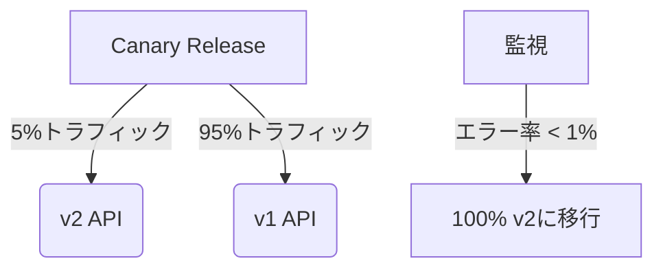

<h1 style="color: #27ae60;"># カテゴリ一覧取得 API の実装</h1> <!-- 深めの緑 -->

提供された資料を参考に、商品一覧取得 API と同様の方法でカテゴリ一覧取得 API を実装します。

## 1. カテゴリ取得エンドポイントの作成

まず、`backend/src/endpoints/`ディレクトリに`categoryGet.ts`ファイルを作成します。

```typescript
// backend/src/endpoints/categoryGet.ts
import { Context } from "hono";

type Bindings = {
  DB: D1Database;
};

export const categoryGetHandler = async (
  c: Context<{ Bindings: Bindings }>
) => {
  try {
    // カテゴリ一覧を取得（名前順にソート）
    const { results } = await c.env.DB.prepare(
      "SELECT id, name FROM categories ORDER BY name ASC"
    ).all();

    console.log("Categories fetched:", results);
    return c.json(results);
  } catch (error) {
    console.error("Error fetching categories:", error);
    return c.json({ error: "カテゴリ一覧の取得中にエラーが発生しました" }, 500);
  }
};
```

## 2. ルートにカテゴリ API を追加

`routes/index.ts`にカテゴリ関連のルートを追加します。

```typescript
// backend/src/routes/index.ts (抜粋)
import { categoryGetHandler } from "endpoints/categoryGet";
// ... 他のimportはそのまま ...

// =====================
// API Routes
// =====================
// Product API
app
  .post("/api/products", productPostHandler)
  .get("/api/products", productGetHandler)
  .get("/api/products/:id", productGetByIdHandler);

// Category API
app.get("/api/categories", categoryGetHandler);

// Cart API
// ... 残りは変更なし ...
```

## 3. フロントエンドからの呼び出し例

フロントエンド（React/Next.js）からこの API を呼び出す例:

```typescript
async function fetchCategories() {
  try {
    const response = await fetch("/api/categories");
    if (!response.ok) {
      throw new Error("Failed to fetch categories");
    }
    const data = await response.json();
    return data;
  } catch (error) {
    console.error("Error:", error);
    return [];
  }
}

// 使用例
const categories = await fetchCategories();
```

## 4. 拡張オプション

必要に応じて以下のような拡張が可能です:

### カテゴリごとの商品件数を取得

```typescript
// カテゴリごとの商品件数を含める場合
export const categoryGetWithCountHandler = async (
  c: Context<{ Bindings: Bindings }>
) => {
  try {
    const { results } = await c.env.DB.prepare(
      `SELECT c.id, c.name, COUNT(p.id) as product_count
       FROM categories c
       LEFT JOIN products p ON c.id = p.category_id
       GROUP BY c.id, c.name
       ORDER BY c.name ASC`
    ).all();

    return c.json(results);
  } catch (error) {
    console.error("Error fetching categories with count:", error);
    return c.json({ error: "カテゴリ一覧の取得中にエラーが発生しました" }, 500);
  }
};
```

### 階層化カテゴリに対応する場合

スキーマに`parent_id`を追加して階層構造を実現:

```sql
-- categoriesテーブルの変更
ALTER TABLE categories ADD COLUMN parent_id INTEGER REFERENCES categories(id);
```

```typescript
// 階層化カテゴリ取得
export const hierarchicalCategoryGetHandler = async (
  c: Context<{ Bindings: Bindings }>
) => {
  try {
    const { results } = await c.env.DB.prepare(
      `WITH RECURSIVE category_tree AS (
         SELECT id, name, parent_id, name as path
         FROM categories
         WHERE parent_id IS NULL
         
         UNION ALL
         
         SELECT c.id, c.name, c.parent_id, 
                ct.path || ' > ' || c.name as path
         FROM categories c
         JOIN category_tree ct ON c.parent_id = ct.id
       )
       SELECT * FROM category_tree ORDER BY path ASC`
    ).all();

    return c.json(results);
  } catch (error) {
    console.error("Error fetching hierarchical categories:", error);
    return c.json({ error: "カテゴリ一覧の取得中にエラーが発生しました" }, 500);
  }
};
```

この実装により、フロントエンドから`/api/categories`に GET リクエストを送信することで、カテゴリ一覧を取得できるようになります。

はい、本番運用開始後でも問題なく拡張可能です。ただし、適切な**バージョニング戦略**と**段階的なロールアウト**が必要です。以下に具体的な方法を解説します：

---

### ✅ **本番環境での安全な拡張手順**

#### 1. **データベーススキーマ変更（後方互換性維持）**

```sql
-- 既存テーブルを壊さないALTER TABLE構文を使用
BEGIN TRANSACTION;

-- 商品件数カウント用のインデックス追加（パフォーマンス対策）
CREATE INDEX IF NOT EXISTS idx_products_category_count ON products(category_id) WHERE category_id IS NOT NULL;

-- 階層化対応（NULL許容で追加）
ALTER TABLE categories ADD COLUMN IF NOT EXISTS parent_id INTEGER REFERENCES categories(id);

COMMIT;
```

#### 2. **API バージョニングで安全に拡張**

```typescript
// routes/index.ts
const v1 = new Hono();
v1.get("/categories", categoryGetHandler); // 既存API

const v2 = new Hono();
v2.get("/categories", categoryGetWithCountHandler); // 拡張API

app.route("/api/v1", v1);
app.route("/api/v2", v2);
```

#### 3. **段階的なリリース戦略**



---

### 🔧 **各拡張の実装ポイント**

#### カテゴリごとの商品件数取得

```typescript
// ロールバック可能な形で実装
export const categoryGetHandler = async (c: Context) => {
  const isExtended = c.req.query("extended") === "true";

  if (isExtended) {
    return categoryGetWithCountHandler(c); // 拡張機能
  }
  // 既存処理...
};
```

#### 階層化カテゴリ対応

```typescript
// メンテナンスモード中に実行するデータ移行スクリプト例
const migrateHierarchicalCategories = async (db: D1Database) => {
  await db.batch([
    db.prepare("ALTER TABLE categories ADD COLUMN parent_id INTEGER"),
    db.prepare(
      "CREATE INDEX IF NOT EXISTS idx_categories_parent ON categories(parent_id)"
    ),
  ]);

  // 既存データを階層構造に変換...
};
```

---

### 🛡 **本番環境での必須対策**

1. **ダウンタイム回避**

   - Cloudflare D1 の[Zero-Downtime Migrations](https://developers.cloudflare.com/d1/platform/migrations/)を活用

   ```bash
   wrangler d1 migrations apply <DB_NAME> --preview
   ```

2. **パフォーマンス影響評価**

   ```sql
   -- 拡張前に実行計画を確認
   EXPLAIN QUERY PLAN
   SELECT c.id, c.name, COUNT(p.id)
   FROM categories c LEFT JOIN products p ON c.id = p.category_id
   GROUP BY c.id;
   ```

3. **ロールバック手順の事前定義**
   ```sql
   -- 緊急時のロールバックSQL
   BEGIN;
   DROP INDEX IF EXISTS idx_products_category_count;
   ALTER TABLE categories DROP COLUMN IF EXISTS parent_id;
   COMMIT;
   ```

---

### 📈 **段階的拡張のベストプラクティス**

1. **Feature Flag による制御**

   ```typescript
   // 環境変数で機能切り替え
   if (process.env.ENABLE_CATEGORY_HIERARCHY === "true") {
     app.get("/api/categories", hierarchicalCategoryHandler);
   }
   ```

2. **A/B テスト実施**

   ```javascript
   // フロントエンドでユーザーグループ分け
   const useV2API = userId % 10 < 2; // 20%のユーザーに新APIを公開
   ```

3. **監視体制の強化**
   - D1 の Query Analytics で拡張後の負荷を監視
   - Cloudflare Logs でエラー率をリアルタイム追跡

---

### ✨ **実際の拡張シナリオ例**

**第 1 段階（即時実施可能）**

```sql
-- 商品件数取得用のマテリアライズドビュー作成
CREATE TABLE category_product_counts (
  category_id INTEGER PRIMARY KEY,
  count INTEGER NOT NULL,
  updated_at DATETIME DEFAULT CURRENT_TIMESTAMP
);
```

**第 2 段階（次回メンテナンス時）**

```sql
-- バッチジョブで毎日更新
INSERT INTO category_product_counts
SELECT category_id, COUNT(*)
FROM products
GROUP BY category_id
ON CONFLICT(category_id) DO UPDATE SET
  count = EXCLUDED.count,
  updated_at = CURRENT_TIMESTAMP;
```

**第 3 段階（大規模更新）**

```typescript
// トリガーによるリアルタイム更新
app.post("/api/products", async (c) => {
  await productPostHandler(c);
  await updateCategoryCounts(c.env.DB); // カテゴリ件数を非同期更新
});
```

---

このアプローチにより、**本番環境を壊すことなく**、必要な拡張を安全に実装できます。特に Cloudflare D1 の特性を活かした非同期更新パターンが重要です。
