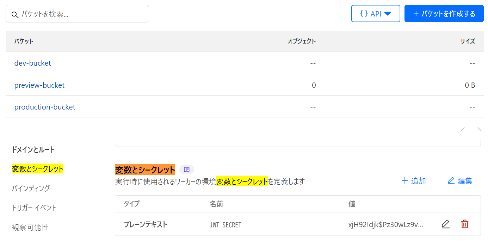

# ✅ バックエンドの環境変数 ＋ Cloudflare インフラ設定を包括的に管理するファイルです。

これは、**Cloudflare Workers プロジェクトの開発・本番・プレビュー環境を統一的に管理する設定ファイル**です。特に Cloudflare D1（DB）、R2（ストレージ）、JWT 認証などを使った **ショッピングサイトのバックエンド設定** に特化しています。

- バケットとシークレットを先に設定しておきます。
  
  `backend/wrangler.jsonc` の設定情報です

```jsonc
{
  "$schema": "node_modules/wrangler/config-schema.json",
  "name": "backend",
  "main": "src/worker.ts",
  "compatibility_date": "2025-04-18",

  // ====================
  // ✅ Cloudflare D1 データベース設定（開発用）
  // ====================
  "d1_databases": [
    {
      "binding": "DB",
      "database_name": "shopping-db",
      "database_id": "d53ad56f-f646-44dc-8dbf-3d2d15d76973",
      "preview_database_id": "d53ad56f-f646-44dc-8dbf-3d2d15d76973"
    }
  ],

  // ====================
  // ✅ Cloudflare R2 バケット設定（開発用）
  // ====================
  "r2_buckets": [
    {
      "binding": "R2_BUCKET",
      "bucket_name": "dev-bucket",
      "preview_bucket_name": "preview-bucket"
    }
  ],

  // ====================
  // ✅ 環境変数（開発用）
  // ====================
  "vars": {
    "JWT_SECRET": "local_dev_secret_do_not_use_in_prod",
    "JWT_ISSUER": "kaikyou-shop-dev",
    "JWT_AUDIENCE": "kaikyou-shop-users-dev",
    "ENVIRONMENT": "development",
    "R2_PUBLIC_DOMAIN": "localhost:8787/assets"
  },

  // ====================
  // ✅ 環境別設定
  // ====================
  "env": {
    "production": {
      "vars": {
        "JWT_SECRET": "{{ JWT_SECRET_PRODUCTION }}",
        "JWT_ISSUER": "kaikyou-shop",
        "JWT_AUDIENCE": "kaikyou-shop-users",
        "ENVIRONMENT": "production",
        "R2_PUBLIC_DOMAIN": "assets.example.com"
      },
      "r2_buckets": [
        {
          "binding": "R2_BUCKET",
          "bucket_name": "production-bucket"
        }
      ],
      "d1_databases": [
        {
          "binding": "DB",
          "database_name": "shopping-db",
          "database_id": "d53ad56f-f646-44dc-8dbf-3d2d15d76973"
        }
      ]
    },
    "preview": {
      "vars": {
        "JWT_SECRET": "local_preview_secret_do_not_use_in_prod",
        "JWT_ISSUER": "kaikyou-shop-preview",
        "JWT_AUDIENCE": "kaikyou-shop-users-preview",
        "ENVIRONMENT": "preview",
        "R2_PUBLIC_DOMAIN": "localhost:8787/assets"
      },
      "r2_buckets": [
        {
          "binding": "R2_BUCKET",
          "bucket_name": "preview-bucket"
        }
      ],
      "d1_databases": [
        {
          "binding": "DB",
          "database_name": "shopping-db",
          "database_id": "d53ad56f-f646-44dc-8dbf-3d2d15d76973"
        }
      ]
    }
  }
}
```

---

### ✅ 各設定明細

| 区分          | 内容                                                                     |
| ------------- | ------------------------------------------------------------------------ |
| 🔧 ビルド設定 | `main`, `name`, `compatibility_date` など                                |
| 🌐 D1 設定    | SQLite ベースのデータベース接続情報                                      |
| 📦 R2 設定    | S3 互換のオブジェクトストレージ設定                                      |
| 🔐 環境変数   | JWT 認証などに使う機密情報や動作環境（開発・本番・プレビュー）の切り替え |
| 🌎 環境別設定 | `env.production`, `env.preview` による本番用／プレビュー用上書き設定     |

---

はい、`wrangler publish` と `npx wrangler publish --env production` の違いは、**どの環境設定を使って Cloudflare Workers にデプロイするか**です。

---

### ✅ `wrangler publish`

- **使用される環境**：デフォルト環境（通常は `env` セクションの外にある設定）
- **用途**：開発やローカル環境に近い状態でのデプロイに使う
- **使われる設定例**（あなたの `wrangler.json` でいうと）：

  - `name`: `"backend"`
  - `vars`: `"JWT_SECRET": "local_dev_secret_do_not_use_in_prod"` など
  - `r2_buckets`: `"dev-bucket"`
  - `d1_databases`: `"preview_database_id": ...` を含む開発用 D1

---

### ✅ `npx wrangler publish --env production`

- **使用される環境**：`"env": { "production": { ... } }` に定義された設定
- **用途**：**本番環境**へのデプロイに使う
- **使われる設定例**：

  - `JWT_SECRET`: `"{{ JWT_SECRET_PRODUCTION }}"`（環境変数または Secret から解決される必要あり）
  - `R2_BUCKET`: `"production-bucket"`
  - `D1_DATABASE`: `database_id` のみ（`preview_database_id` なし）

---

### 📝 まとめ（比較表）

| コマンド                                | 使用される環境     | 主な用途       | 使用される設定   |
| --------------------------------------- | ------------------ | -------------- | ---------------- |
| `wrangler publish`                      | デフォルト（開発） | 開発・テスト用 | 直下の設定       |
| `npx wrangler publish --env production` | `production` 環境  | 本番公開       | `env.production` |

---

### 🚨 注意点

- `--env production` を使うときは、`.env.production` や Secret に本番用変数（例：JWT_SECRET）を **事前に設定しておく必要** があります。
- `wrangler.toml` を使っている場合でもこの仕組みは同じです。

---

PS D:\next-projects\kaikyou-shop\backend> npx wrangler secrets list --env production

X [ERROR] Unknown arguments: secrets, list

wrangler

COMMANDS
wrangler docs [search..] 📚 Open Wrangler's command documentation in your browser

wrangler init [name] 📥 Initialize a basic Worker
wrangler dev [script] 👂 Start a local server for developing your Worker
wrangler deploy [script] 🆙 Deploy a Worker to Cloudflare
wrangler deployments 🚢 List and view the current and past deployments for your Worker  
 wrangler rollback [version-id] 🔙 Rollback a deployment for a Worker
wrangler versions 🫧 List, view, upload and deploy Versions of your Worker to Cloudflar
e
wrangler triggers 🎯 Updates the triggers of your current deployment [experimental]  
 wrangler delete [script] 🗑 Delete a Worker from Cloudflare
wrangler tail [worker] 🦚 Start a log tailing session for a Worker
wrangler secret 🤫 Generate a secret that can be referenced in a Worker
wrangler types [path] 📝 Generate types from your Worker configuration

wrangler kv 🗂️ Manage Workers KV Namespaces
wrangler queues 🇶 Manage Workers Queues
wrangler r2 📦 Manage R2 buckets & objects
wrangler d1 🗄 Manage Workers D1 databases
wrangler vectorize 🧮 Manage Vectorize indexes
wrangler hyperdrive 🚀 Manage Hyperdrive databases
wrangler cert 🪪 Manage client mTLS certificates and CA certificate chains used for  
secured connections [open-beta]
wrangler pages ⚡️ Configure Cloudflare Pages
wrangler mtls-certificate 🪪 Manage certificates used for mTLS connections
wrangler pubsub 📮 Manage Pub/Sub brokers [private beta]
wrangler dispatch-namespace 🏗️ Manage dispatch namespaces
wrangler ai 🤖 Manage AI models
wrangler workflows 🔁 Manage Workflows
wrangler pipelines 🚰 Manage Cloudflare Pipelines [open-beta]
wrangler login 🔓 Login to Cloudflare
wrangler logout 🚪 Logout from Cloudflare
wrangler whoami 🕵️ Retrieve your user information
wrangler secrets-store 🔐 Manage the Secrets Store [alpha]

GLOBAL FLAGS
-c, --config Path to Wrangler configuration file [string]
--cwd Run as if Wrangler was started in the specified directory instead of the current working directory [string]
-e, --env Environment to use for operations, and for selecting .env and .dev.vars files [string]
-h, --help Show help [boolean]
-v, --version Show version number [boolean]

Please report any issues to https://github.com/cloudflare/workers-sdk/issues/new/choose
🪵 Logs were written to "C:\Users\kaikyou\AppData\Roaming\xdg.config\.wrangler\logs\wrangler-2025-05-044_19-25-09_077.log"
PS D:\next-projects\kaikyou-shop\backend>
