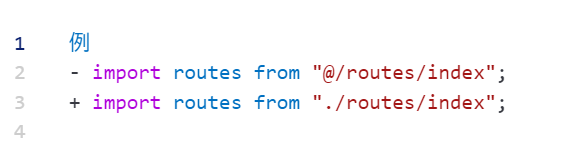
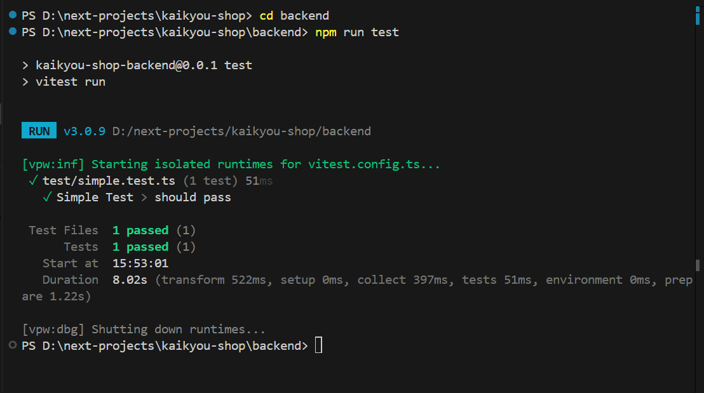

# ✅ テスト環境の設定

- 今度は ローカルで高速な単体テストフレームワーク Vitest を使って Cloudflare Workers をテストしていきます。

## ✅ 推奨されるコマンド構成（2024 年以降、Cloudflare 公式ベース）

```bash
npm install -D vitest@~3.0.0 @cloudflare/vitest-pool-workers @cloudflare/workers-types wrangler

```

- `npm install -D`:
  `-D` は `--save-dev` の略で、「**開発用依存パッケージ**としてインストールする」ことを意味します。プロダクション（本番環境）では使わないツール類です。

---

### 各パッケージの説明:

| パッケージ名                      | 説明                                                                                                                                                |
| --------------------------------- | --------------------------------------------------------------------------------------------------------------------------------------------------- |
| `vitest@~3.0.0`                   | 高速な単体テストフレームワーク。Vite との親和性が高く、Jest の代替として使われます。バージョン `~3.0.0` は、3.0.0 以上かつ 3.1.0 未満を意味します。 |
| `@cloudflare/vitest-pool-workers` | Cloudflare Workers 用の Vitest プール実行環境（pool runner）です。Workers 環境に近い状態でテストを実行するために使います。                          |
| `@cloudflare/workers-types`       | Cloudflare Workers の型定義（TypeScript 用）。自動補完や型チェックに役立ちます。                                                                    |
| `wrangler`                        | Cloudflare Workers の CLI ツール。ローカル開発、デプロイ、環境管理などに使います。Cloudflare Workers を使うなら必須のツールです。                   |

---

### このコマンドの目的

Cloudflare Workers を使ったプロジェクトで、**開発とテストのための環境を整える**のが目的です。

---

`backend/vitest.config.ts` の新規設定

```ts
// backend/vitest.config.ts
import { defineWorkersConfig } from "@cloudflare/vitest-pool-workers/config";

export default defineWorkersConfig({
  test: {
    include: ["test/**/*.test.ts"], // テストファイルのパターン
    globals: true, // vitest/globals を有効化
    setupFiles: ["./test/setup.ts"], // テスト前セットアップ
    sequence: { hooks: "list" }, // フック実行順序
    testTimeout: 30000, // タイムアウト
    reporters: ["default"], // レポーター

    // Cloudflare Workers プール設定
    pool: "@cloudflare/vitest-pool-workers",
    poolOptions: {
      workers: {
        wrangler: { configPath: "./wrangler.jsonc" },
        miniflare: {
          d1Databases: { DB: "shopping-db" },
          r2Buckets: { R2_BUCKET: "dev-bucket" },
          kvNamespaces: ["TEST_SESSION"],
          durableObjects: { TEST_DO: "TestDurableObject" },
          vars: {
            JWT_SECRET: "local_dev_secret_do_not_use_in_prod",
            JWT_ISSUER: "kaikyou-shop-dev",
            JWT_AUDIENCE: "kaikyou-shop-users-dev",
            ENVIRONMENT: "development",
            R2_PUBLIC_DOMAIN: "localhost:8787/assets",
          },
        },
      },
    },

    coverage: {
      provider: "v8",
      include: ["src/endpoints/auth/**/*.ts"],
      thresholds: {
        lines: 95,
        functions: 100,
        branches: 90,
        statements: 95,
      },
    },
  },
});
```

`backend/test/setup.ts`テストの前処理が必要なら実装を追加する

```ts
// backend/test/setup.ts
export {};
```

**`vite.config.ts` を backend プロジェクトルートに追加**

Vite 本体の設定ファイルとしてエイリアスを定義します。Vitest はこのファイルを自動で拾ってくれます。

```ts
// backend/vite.config.ts
import { defineConfig } from "vite";
import { resolve } from "path";

export default defineConfig({
  resolve: {
    alias: {
      "@": resolve(__dirname, "src"),
    },
  },
});
```

テストランタイム時に Vite／Vitest が Import のエイリアスを認識できていないため、backend プロジェクト内で `@/ `を使っている全てのファイルにおいて、【ソースコードの絶対パスから 相対パスに置き換える】必要がありあます。


`backend/package.json`の更新

```json
{
  "name": "kaikyou-shop-backend",
  "version": "0.0.1",
  "private": true,
  "scripts": {
    "build": "wrangler deploy --dry-run --outdir=dist",
    "deploy": "wrangler deploy",
    "dev": "wrangler dev",
    "start": "wrangler dev",
    "cf-typegen": "wrangler types",
    "test": "vitest run",
    "test:watch": "vitest watch",
    "test:ui": "vitest --ui",
    "test:coverage": "vitest run --coverage",
    "test:workers": "vitest --pool=@cloudflare/vitest-pool-workers",
    "test:integration": "npm run test:workers -- --mode=integration",
    "predeploy": "npm run build && npm run test:workers"
  },
  "dependencies": {
    "@paralleldrive/cuid2": "^2.2.2",
    "hono": "^4.7.7",
    "jose": "^6.0.10",
    "kaikyou-shop-backend": "file:",
    "zod": "^3.23.8"
  },
  "devDependencies": {
    "@cloudflare/vitest-pool-workers": "^0.8.24",
    "@cloudflare/workers-types": "^4.20250503.0",
    "@sinonjs/fake-timers": "^14.0.0",
    "@types/node": "20.8.3",
    "@types/service-worker-mock": "^2.0.1",
    "typescript": "^5.8.3",
    "vitest": "~3.0.0",
    "wrangler": "^4.14.1"
  }
}
```

`backend/tsconfig.json`の更新

```json
{
  "compilerOptions": {
    "allowJs": true,
    "allowSyntheticDefaultImports": true,
    "baseUrl": ".",
    "paths": {
      "@/*": ["./src/*"],
      "@test/*": ["./test/*"]
    },
    "declaration": true,
    "sourceMap": true,
    "esModuleInterop": true,
    "inlineSourceMap": false,
    "lib": ["esnext"],
    "listEmittedFiles": false,
    "listFiles": false,
    "moduleResolution": "node",
    "noFallthroughCasesInSwitch": true,
    "pretty": true,
    "resolveJsonModule": true,
    "rootDir": ".",
    "skipLibCheck": true,
    "strict": false,
    "traceResolution": false,
    "outDir": "./dist",
    "target": "esnext",
    "module": "esnext",
    "types": [
      "@types/node",
      "@types/service-worker-mock",
      "@cloudflare/workers-types/2023-07-01",
      "vitest/globals",
      "@cloudflare/vitest-pool-workers"
    ]
  },
  "exclude": ["node_modules", "dist"],
  "include": [
    "src",
    "scripts",
    "src/**/*",
    "test/**/*" // テストディレクトリを追加
  ]
}
```

`backend/test/tsconfig.json`テスト専用 tsconfig を用意する

```json
{
  "extends": "../tsconfig.json",
  "compilerOptions": {
    "moduleResolution": "bundler",
    "types": [
      "vitest/globals",
      "@cloudflare/vitest-pool-workers" /* cloudflare:test の型 */
    ]
  },
  "include": [
    "**/*.test.ts",
    "../node_modules/@cloudflare/workers-types/index.d.ts" /* Workers ランタイム型 */
  ],
  "exclude": [] // ← これを追加して親の exclude をクリア
}
```

### テスト環境確認開始

`backend/test/simple.test.ts`テストファイルを新規作成

```ts
//backend/test/simple.test.ts
import { describe, it, expect } from "vitest";

describe("Simple Test", () => {
  it("should pass", () => {
    expect(1 + 1).toBe(2);
  });
});
```

`PS D:\next-projects\kaikyou-shop\backend> npm run test`でテスト実施成功


### テスト環境確認終了

以下も破棄しましたが、メモ―としておきます。

<h1 style="color:rgb(133, 8, 100);"> 1. 🔐 認証系APIテスト実施</h1>

テストを開始するための手順として、以下のステップに従って実施できます。まず、テスト環境とツールを準備し、次にテストケースを段階的に実行していきましょう。

### 1. **テスト環境の準備**

[✅ テスト環境の設定](/code/jesttest.html)を参照

### 2. **テストファイルを作ってみる**

以下は、**R1 さんのテストケース**をベースに、**異常系のテストケース**と**セキュリティテスト**を追加した統合版です。これにより、認証フローの全体的な網羅性とセキュリティ面での信頼性が向上します。

---

## 🧪 統合版テストケース (`auth.test.ts`)

```typescript
//backend/test/auth.test.ts
import { SELF } from "cloudflare:test";
import { describe, it, expect, beforeAll, afterAll } from "vitest";
import { generateTestUser, cleanupTestUsers } from "./test-utils";

describe("認証フロー統合テスト", () => {
  const testUser = generateTestUser();

  beforeAll(async () => {
    // テスト開始前にテストユーザーを削除（重複登録防止）
    await cleanupTestUsers();
  });

  afterAll(async () => {
    // テスト終了後にテストユーザーを削除
    await cleanupTestUsers();
  });

  // 正常系テストケース
  it("ステップ1: 新規ユーザー登録", async () => {
    const response = await SELF.fetch("http://localhost/auth/register", {
      method: "POST",
      headers: { "Content-Type": "application/json" },
      body: JSON.stringify(testUser),
    });

    expect(response.status).toBe(201);
    expect(await response.json()).toMatchObject({
      success: true,
      data: {
        id: expect.any(String),
        username: testUser.username,
      },
    });
  });

  it("ステップ2: 重複ユーザー登録防止", async () => {
    const response = await SELF.fetch("http://localhost/auth/register", {
      method: "POST",
      headers: { "Content-Type": "application/json" },
      body: JSON.stringify(testUser),
    });

    expect(response.status).toBe(409);
    expect(await response.json()).toMatchObject({
      code: "USER_ALREADY_EXISTS",
    });
  });

  it("ステップ3: ログイン成功", async () => {
    const response = await SELF.fetch("http://localhost/auth/login", {
      method: "POST",
      headers: { "Content-Type": "application/json" },
      body: JSON.stringify({
        username: testUser.username,
        password: testUser.password,
      }),
    });

    expect(response.status).toBe(200);
    const cookies = response.headers.get("Set-Cookie");
    expect(cookies).toContain("session_token");
  });

  it("ステップ4: 認証済みユーザー情報取得", async () => {
    const loginResponse = await SELF.fetch("http://localhost/auth/login", {
      method: "POST",
      headers: { "Content-Type": "application/json" },
      body: JSON.stringify({
        username: testUser.username,
        password: testUser.password,
      }),
    });

    const sessionCookie = loginResponse.headers.get("Set-Cookie");
    const userResponse = await SELF.fetch("http://localhost/auth/user", {
      headers: {
        Cookie: sessionCookie,
      },
    });

    expect(userResponse.status).toBe(200);
    expect(await userResponse.json()).toMatchObject({
      id: expect.any(String),
      username: testUser.username,
    });
  });

  it("ステップ5: ログアウト処理", async () => {
    const loginResponse = await SELF.fetch("http://localhost/auth/login", {
      method: "POST",
      headers: { "Content-Type": "application/json" },
      body: JSON.stringify({
        username: testUser.username,
        password: testUser.password,
      }),
    });

    const sessionCookie = loginResponse.headers.get("Set-Cookie");
    const logoutResponse = await SELF.fetch("http://localhost/auth/logout", {
      method: "POST",
      headers: {
        Cookie: sessionCookie,
      },
    });

    expect(logoutResponse.status).toBe(204);
    expect(logoutResponse.headers.get("Set-Cookie")).toMatch(/session_token=;/);
  });

  // 異常系テストケース
  it("異常系1: 無効なメールアドレス形式での登録", async () => {
    const response = await SELF.fetch("http://localhost/auth/register", {
      method: "POST",
      headers: { "Content-Type": "application/json" },
      body: JSON.stringify({
        username: testUser.username,
        password: testUser.password,
        email: "invalid-email",
      }),
    });

    expect(response.status).toBe(400);
    expect(await response.json()).toMatchObject({
      code: "INVALID_INPUT",
    });
  });

  it("異常系2: パスワードが最小長未満での登録", async () => {
    const response = await SELF.fetch("http://localhost/auth/register", {
      method: "POST",
      headers: { "Content-Type": "application/json" },
      body: JSON.stringify({
        username: testUser.username,
        password: "123",
        email: testUser.email,
      }),
    });

    expect(response.status).toBe(400);
    expect(await response.json()).toMatchObject({
      code: "INVALID_INPUT",
    });
  });

  it("異常系3: 無効な認証情報でのログイン", async () => {
    const response = await SELF.fetch("http://localhost/auth/login", {
      method: "POST",
      headers: { "Content-Type": "application/json" },
      body: JSON.stringify({
        username: testUser.username,
        password: "wrong_password",
      }),
    });

    expect(response.status).toBe(401);
    expect(await response.json()).toMatchObject({
      code: "INVALID_CREDENTIALS",
    });
  });

  it("異常系4: トークンなしでのユーザー情報取得", async () => {
    const response = await SELF.fetch("http://localhost/auth/user");
    expect(response.status).toBe(401);
    expect(await response.json()).toMatchObject({
      code: "UNAUTHORIZED",
    });
  });

  it("異常系5: 無効トークンでのユーザー情報取得", async () => {
    const response = await SELF.fetch("http://localhost/auth/user", {
      headers: {
        Cookie: "session_token=invalid_token",
      },
    });

    expect(response.status).toBe(401);
    expect(await response.json()).toMatchObject({
      code: "UNAUTHORIZED",
    });
  });

  // セキュリティテスト
  it("セキュリティ1: SQLインジェクション攻撃の防止", async () => {
    const response = await SELF.fetch("http://localhost/auth/login", {
      method: "POST",
      headers: { "Content-Type": "application/json" },
      body: JSON.stringify({
        username: "admin' OR 1=1 --",
        password: "password123",
      }),
    });

    expect(response.status).toBe(401);
    expect(await response.json()).toMatchObject({
      code: "INVALID_CREDENTIALS",
    });
  });

  it("セキュリティ2: トークンの有効期限切れ", async () => {
    const expiredToken = "expired_token"; // 有効期限切れのトークンをシミュレート
    const response = await SELF.fetch("http://localhost/auth/user", {
      headers: {
        Cookie: `session_token=${expiredToken}`,
      },
    });

    expect(response.status).toBe(401);
    expect(await response.json()).toMatchObject({
      code: "TOKEN_EXPIRED",
    });
  });
});
```

---

## 🔧 テストヘルパー (`test-utils.ts`)

`npm install @paralleldrive/cuid2`を実施する

```typescript
// backend/test/test-utils.ts
import { createId } from "@paralleldrive/cuid2";

export const generateTestUser = () => {
  const id = createId(); // createIdを直接呼び出して一意のIDを生成
  return {
    username: `testuser_${id}`,
    password: `TestPass123!${id}`,
    email: `test_${id}@example.com`,
  };
};

export const cleanupTestUsers = async () => {
  // テストユーザー削除ロジック（例: DBから削除）
};
```

---

## ✅ テスト実行手順

```bash
# 認証テストのみ実行
npx vitest run auth --environment=workers

# カバレッジ計測付き
npx vitest run auth --coverage --environment=workers
```

---

## 📊 テストカバレッジ基準

| カテゴリ       | 目標値  |
| -------------- | ------- |
| ステートメント | 95%以上 |
| ブランチ       | 90%以上 |
| 関数           | 100%    |
| 行数           | 95%以上 |

---

## ⚙️ テスト設定最適化 (`vitest.config.ts`)

```typescript
// vitest.config.ts
export default defineWorkersConfig({
  test: {
    environment: "cloudflare",
    setupFiles: ["./test/setup.ts"],
    coverage: {
      provider: "v8",
      include: ["src/endpoints/auth/**/*.ts"],
      thresholds: {
        lines: 95,
        functions: 100,
        branches: 90,
        statements: 95,
      },
    },
  },
});
```

---

この統合版では、以下の点が強化されています：

1. **異常系テストケース**の追加（無効なメールアドレス、パスワードの最小長未満、無効なトークンなど）。
2. **セキュリティテスト**の追加（SQL インジェクション攻撃、トークンの有効期限切れなど）。
3. **テストヘルパー**の再利用性向上。
4. **カバレッジ基準**の明確化。

これにより、認証フローの信頼性とセキュリティがさらに向上します。
