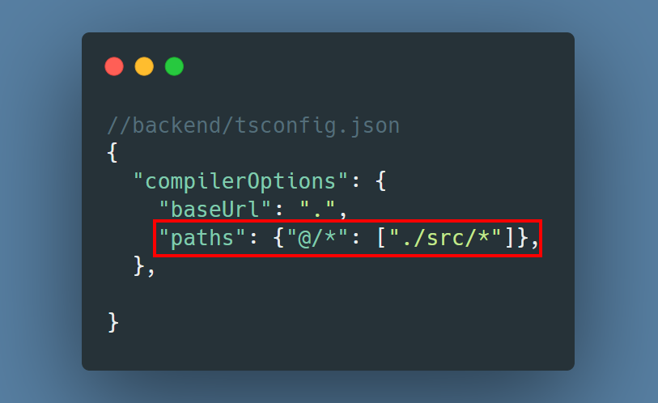
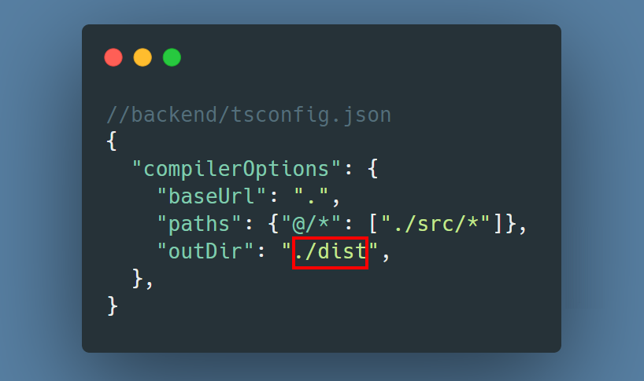
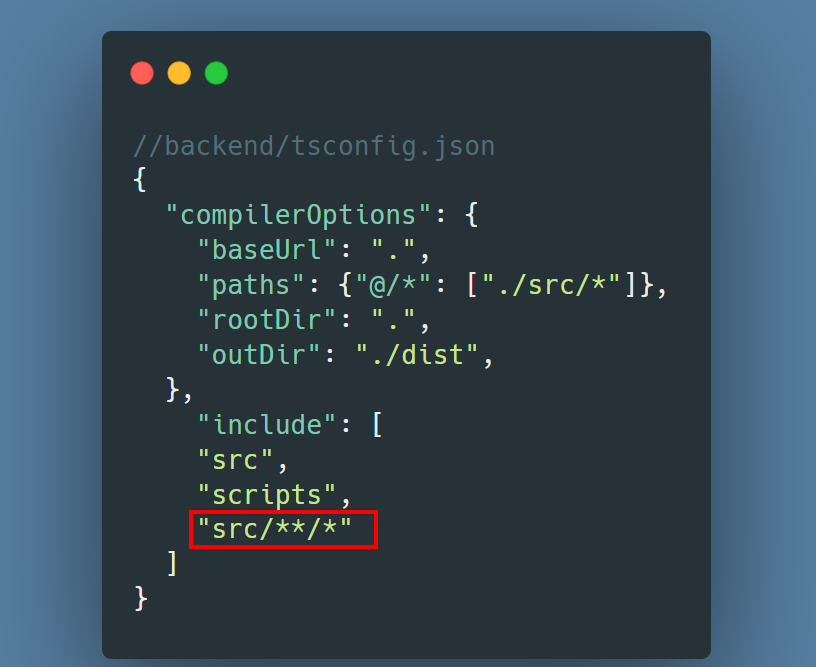

# ✅ バックエンドのルート設定

- `backend/tsconfig.json` に相対パス (../../) の多用を防げるために、src/ ディレクトリをルートとして扱う
  

### 2.曖昧な書き方を直す

- `"outDir": ""`は非推薦
  

### 3.コンパイル対象ディレクトリの追加

src 配下のすべてのファイル（.ts, .json, .md, .js など）を型チェックやコンパイルの対象に入れるように追加する

