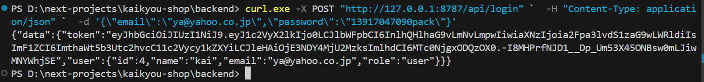
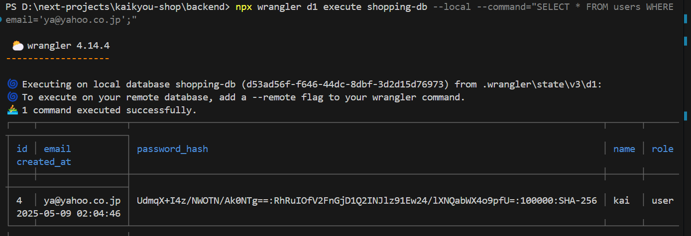
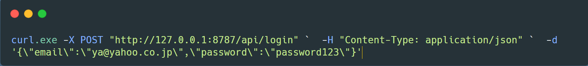

# loginHandler

以下は、`loginHandler` の実装、動作の流れ、レスポンス例、テスト方法についての詳細な説明です。

---

### **`loginHandler` の実装**

```ts
// backend/src/endpoints/auth/login.ts
import { Context } from "hono";
import {
  Bindings,
  ErrorResponse,
  LoginResponseData,
  SuccessResponse,
} from "../../types/types";
import { generateAuthToken, verifyPassword } from "../../lib/auth";
import { z } from "zod";

const loginSchema = z.object({
  email: z.string().email(),
  password: z.string().min(1),
});

export const loginHandler = async (
  c: Context<{ Bindings: Bindings }>
): Promise<Response> => {
  try {
    const rawJson = await c.req.json();
    const validationResult = loginSchema.safeParse(rawJson);

    if (!validationResult.success) {
      return c.json(
        {
          error: {
            code: "VALIDATION_ERROR",
            message: "メールアドレスとパスワードを正しく入力してください",
          },
        } satisfies ErrorResponse,
        400
      );
    }

    const { email, password } = validationResult.data;

    // ユーザー取得
    const user = await c.env.DB.prepare(
      "SELECT id, email, password_hash, name, role FROM users WHERE email = ?"
    )
      .bind(email)
      .first<{
        id: number;
        email: string;
        password_hash: string;
        name: string;
        role: string;
      }>();

    if (!user) {
      return c.json(
        {
          error: {
            code: "INVALID_CREDENTIALS",
            message: "メールアドレスまたはパスワードが正しくありません",
          },
        } satisfies ErrorResponse,
        401
      );
    }

    // パスワード検証
    const isValid = await verifyPassword(password, user.password_hash);
    if (!isValid) {
      return c.json(
        {
          error: {
            code: "INVALID_CREDENTIALS",
            message: "メールアドレスまたはパスワードが正しくありません",
          },
        } satisfies ErrorResponse,
        401
      );
    }

    // トークン生成（JWTのみ）
    const token = await generateAuthToken(c.env, user.id, user.email);

    // レスポンスでJWTとユーザー情報を返す
    return c.json(
      {
        data: {
          token, // JWT
          user: {
            id: user.id,
            name: user.name,
            email: user.email,
            role: user.role,
          },
        },
      } satisfies SuccessResponse<LoginResponseData>,
      200
    );
  } catch (error) {
    console.error("Login error:", error);
    return c.json(
      {
        error: {
          code: "INTERNAL_ERROR",
          message: "ログイン処理に失敗しました",
        },
      } satisfies ErrorResponse,
      500
    );
  }
};
```

#### 1. **リクエストのバリデーション**

- `zod` を使用して、リクエストボディの `email` と `password` をバリデーションします。
- バリデーションエラーが発生した場合、`400 Bad Request` を返します。

#### 2. **ユーザーの取得**

- データベースから `email` に一致するユーザーを取得します。
- ユーザーが存在しない場合、`401 Unauthorized` を返します。

#### 3. **パスワードの検証**

- `verifyPassword` 関数を使用して、入力されたパスワードとデータベースに保存されているハッシュを比較します。
- パスワードが一致しない場合、`401 Unauthorized` を返します。

#### 4. **JWT トークンの生成**

- `generateAuthToken` 関数を使用して、JWT トークンを生成します。
- トークンにはユーザー ID とメールアドレスが含まれます。

#### 5. **レスポンスの返却**

- 生成された JWT トークンとユーザー情報を JSON 形式で返します。

---

### **動作の流れ**

1. **リクエスト**:

   - クライアントが `/api/login` に `POST` リクエストを送信します。
   - リクエストボディには `email` と `password` が含まれます。

2. **バリデーション**:

   - `zod` を使用して、`email` と `password` の形式を検証します。
   - バリデーションエラーが発生した場合、エラーレスポンスを返します。

3. **ユーザーの取得**:

   - データベースから `email` に一致するユーザーを取得します。
   - ユーザーが存在しない場合、エラーレスポンスを返します。

4. **パスワードの検証**:

   - 入力されたパスワードとデータベースのハッシュを比較します。
   - パスワードが一致しない場合、エラーレスポンスを返します。

5. **JWT トークンの生成**:

   - ユーザー ID とメールアドレスを含む JWT トークンを生成します。

6. **レスポンスの返却**:
   - JWT トークンとユーザー情報を JSON 形式で返します。

---

### **レスポンス例**

#### 成功時

```json
{
  "data": {
    "token": "eyJhbGciOiJIUzI1NiIsInR5cCI6IkpXVCJ9...", // JWTトークン
    "user": {
      "id": 1,
      "name": "Test User",
      "email": "test@example.com",
      "role": "user"
    }
  }
}
```

#### エラー時

- **バリデーションエラー**:

  ```json
  {
    "error": {
      "code": "VALIDATION_ERROR",
      "message": "メールアドレスとパスワードを正しく入力してください"
    }
  }
  ```

- **ユーザーが見つからない場合**:

  ```json
  {
    "error": {
      "code": "INVALID_CREDENTIALS",
      "message": "メールアドレスまたはパスワードが正しくありません"
    }
  }
  ```

- **パスワードが一致しない場合**:

  ```json
  {
    "error": {
      "code": "INVALID_CREDENTIALS",
      "message": "メールアドレスまたはパスワードが正しくありません"
    }
  }
  ```

- **内部エラー**:
  ```json
  {
    "error": {
      "code": "INTERNAL_ERROR",
      "message": "ログイン処理に失敗しました"
    }
  }
  ```

---

### **テスト方法**

1. **リクエストの準備**:

   - `POST` リクエストを `/api/login` に送信します。
   - リクエストボディに `email` と `password` を含めます。

2. **リクエスト例**:

   ```bash
   curl -X POST http://localhost:8787/api/login \
     -H "Content-Type: application/json" \
     -d '{"email": "ya@yahoo.co.jp", "password": "password123"}'
   ```

   windows の場合

   ```bash
   curl.exe -X POST "http://127.0.0.1:8787/api/login" `  -H "Content-Type: application/json" `  -d '{\"email\":\"ya@yahoo.co.jp\",\"password\":\"password123\"}'
   ```

   

3. **レスポンスの確認**:

   - 成功時は JWT トークンとユーザー情報が返されます。
   - エラー時は適切なエラーメッセージが返されます。

4. **エラーパターンのテスト**:
   - 無効な `email` や `password` を送信して、エラーレスポンスが正しく返されるか確認します。
   - データベースエラーをシミュレートして、内部エラーのレスポンスを確認します。

---

### **補足**

- **JWT トークンの利用**:
  ログイン成功時に返される JWT トークンは、認証が必要なエンドポイント（例: `/api/users/me`）で使用できます。`Authorization: Bearer <token>` ヘッダーにトークンを設定してリクエストを送信します。

- **セキュリティ**:
  - パスワードはハッシュ化されてデータベースに保存されます。
  - JWT トークンは有効期限（例: 2 時間）が設定されており、期限切れ後は再ログインが必要です。

---

これで、`loginHandler` の実装、動作の流れ、レスポンス例、テスト方法についての説明が完了しました。

### **データベースの確認**

```bash
npx wrangler d1 execute shopping-db --local --command="SELECT * FROM users WHERE email='ya@yahoo.co.jp';"
```



### **重要な開発時のデバック**

<h1 style="color:rgb(174, 39, 160);"># 重要な開発時のデバック</h1>

下記コマンド実行しながら、loginHandler ファイルのリクエストの流れを詳細に追跡できます。

`loginHandler`にデバッグログを追加して、リクエストの流れを詳細に追跡できるようにする方法をご紹介します。以下のようにコードを修正してください：

```typescript
export const loginHandler = async (
  c: Context<{ Bindings: Bindings }>
): Promise<Response> => {
  try {
    console.log("=== リクエスト受信開始 ===");
    console.log("リクエストヘッダー:", c.req.raw.headers);

    const rawJson = await c.req.json();
    console.log("生のリクエストボディ:", JSON.stringify(rawJson, null, 2));

    const validationResult = loginSchema.safeParse(rawJson);
    console.log("バリデーション結果:", validationResult);

    if (!validationResult.success) {
      console.log("バリデーションエラー:", validationResult.error);
      return c.json(/* 既存のエラーレスポンス */);
    }

    const { email, password } = validationResult.data;
    console.log(`認証試行: ${email}`);

    // ユーザー取得
    const user = await c.env.DB.prepare(
      "SELECT id, email, password_hash, name, role FROM users WHERE email = ?"
    )
      .bind(email)
      .first<{
        id: number;
        email: string;
        password_hash: string;
        name: string;
        role: string;
      }>();

    console.log(
      "DB検索結果:",
      user ? "ユーザー見つかりました" : "ユーザー見つかりません"
    );

    if (!user) {
      return c.json(/* 既存のエラーレスポンス */);
    }

    // パスワード検証
    console.log("パスワード検証開始");
    console.log("保存済みハッシュ:", user.password_hash);
    console.log("入力パスワード:", password);

    const isValid = await verifyPassword(password, user.password_hash);
    console.log("パスワード検証結果:", isValid);

    if (!isValid) {
      return c.json(/* 既存のエラーレスポンス */);
    }

    // トークン生成
    console.log("トークン生成開始");
    const token = await generateAuthToken(c.env, user.id, user.email);
    console.log("生成されたトークン:", token);

    console.log("=== ログイン成功 ===");
    return c.json(/* 既存の成功レスポンス */);
  } catch (error) {
    console.error("!!! エラー発生 !!!");
    console.error("エラーオブジェクト:", error);
    if (error instanceof Error) {
      console.error("スタックトレース:", error.stack);
    }
    return c.json(/* 既存のエラーレスポンス */);
  }
};
```

### ログの確認方法

1. **開発サーバーのコンソール**で直接確認:

   ```bash
   npm run dev
   ```

2. **構造化ログ**が必要な場合は、以下のようなロガーを導入:
   ```typescript
   const logger = {
     info: (message: string, data?: any) => {
       console.log(
         JSON.stringify(
           {
             timestamp: new Date().toISOString(),
             level: "INFO",
             message,
             data,
           },
           null,
           2
         )
       );
     },
     error: (message: string, error: any) => {
       console.error(
         JSON.stringify(
           {
             timestamp: new Date().toISOString(),
             level: "ERROR",
             message,
             error:
               error instanceof Error
                 ? {
                     name: error.name,
                     message: error.message,
                     stack: error.stack,
                   }
                 : error,
           },
           null,
           2
         )
       );
     },
   };
   ```

### 重要なログポイント

| ログポイント     | 確認内容              |
| ---------------- | --------------------- |
| リクエスト受信時 | ヘッダー/ボディの形式 |
| バリデーション後 | 入力値の正当性        |
| DB 検索後        | ユーザー存在確認      |
| パスワード検証   | ハッシュ比較結果      |
| トークン生成     | JWT の生成状態        |

### ログ出力例（成功時）

```
=== リクエスト受信開始 ===
リクエストヘッダー: Headers { ... }
生のリクエストボディ: {
  "email": "ya@yahoo.co.jp",
  "password": "13917047090pack"
}
バリデーション結果: { success: true, data: ... }
認証試行: ya@yahoo.co.jp
DB検索結果: ユーザー見つかりました
パスワード検証開始
保存済みハッシュ: $2b$10$...
入力パスワード: 13917047090pack
パスワード検証結果: true
トークン生成開始
生成されたトークン: eyJhbGci...
=== ログイン成功 ===
```

このようにログを仕込むことで、API の動作状況を詳細に追跡できます。特にエラーが発生した場合、`console.error`で出力されるスタックトレースが問題解決の重要な手がかりになります。
