# iFlow CLI

### iFlow CLI とは？

**iFlow CLI** は、アリババの **心流（iFlow）研究チーム** によって **2025 年 9 月 23 日** に正式発表された、先進的な AI エージェントです。

プログラミングや各種言語のコーディング支援はもちろん、日常のエンタメ・生活知識から、専門的な学術論文の解析まで幅広く対応します。

ユーザーを素早く「**フロー状態（心流）**」へと導き、知識が自在に流れるような没入体験を実現します。

つまり、**あなたの関心分野で“最強の自分”を最速で育成できるツール**です。

### 本当？嘘では？

**2025 年 10 月 5 日時点の最新情報によると、**
世界の先端 AI モデルを対象とした比較評価において、
**GAIA、SWE-bench、Terminal-Bench、そして BrowseComp-ZH** の 4 つのベンチマークで、
**中国の iFlow CLI が米国の Claude Code を上回る総合性能を示した**と報告されています。

特に注目すべき点は、
このテストに使用されたモデルが中国の大規模モデル群――
**Qwen3-Coder、Kimi-K2-0905、DeepSeek-v3、GLM-4.5**――の組み合わせであることです。

---

### 早速謎解きに行きましょう

## 一、事前環境の準備

### 1️⃣ Node.js 20 以上（必須）

#### ✅ インストール確認（全プラットフォーム共通）

```bash
node -v  # 出力が v20.x 以上であること
npm -v   # 出力が 10.x 以上であること
```

---

### ▸ Windows の場合：

- 公式サイトから Node.js LTS をダウンロードしてインストール
- または **WSL2（推奨）** を使用

```cmd
wsl --install -d Ubuntu-20.04  # Linuxサブシステムを自動インストール
```

---

## 二、インストール手順

### ▎Windows システム（管理者権限が必要）

#### ① 国内ミラーによる高速化設定

```bash
npm config set registry https://registry.npmmirror.com
```

#### ② CLI のグローバルインストール

```bash
npm install -g @iflow-ai/iflow-cli
```

#### ③ 設定ウィザードを起動

```bash
iflow
```

---

### ▎macOS / Linux システム

#### 一括インストール（自動スクリプト）

```bash
bash -c "$(curl -fsSL http://cloud.iflow.cn/iflow-cli/install.sh)"
```

#### プロンプトに従ってモデルを選択（推奨：**Qwen3-Coder**）

---

## 三、主要設定項目

初回起動時、自動的に設定ウィザードが開始されます。

### ✅ API キーの登録

1. 「心流（iFlow）オープンプラットフォーム」にアクセスし、アカウントを登録
   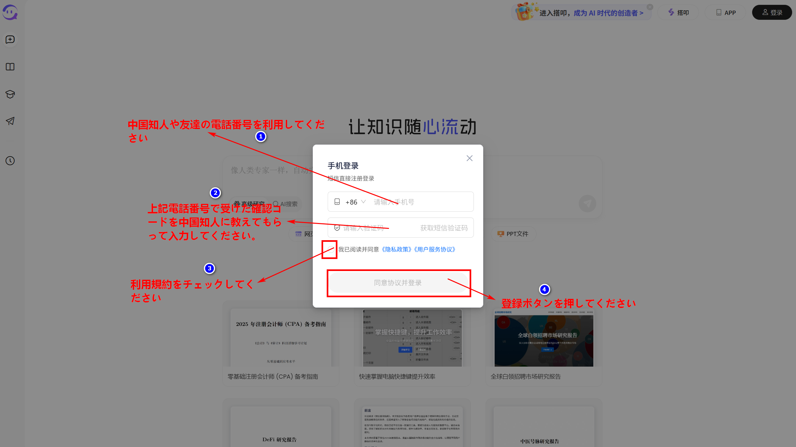
2. 【個人センター】内で **API Key** を生成してコピー
   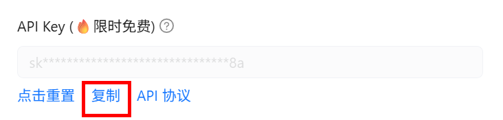
3. ターミナルの指示に従い、貼り付けて Enter キーで送信
   　（入力内容は表示されません）

- **ここまでできましたら、iFlow の環境構築が完了となります。**

### ✅ iFlow の 起動

- 任意のフォルダーの配下に入ってもかまいません。
- 今度は windows で任意のプロジェクトに入って置きます。
  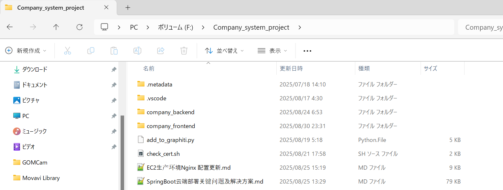
- Windwos PowerShell を開きます。
  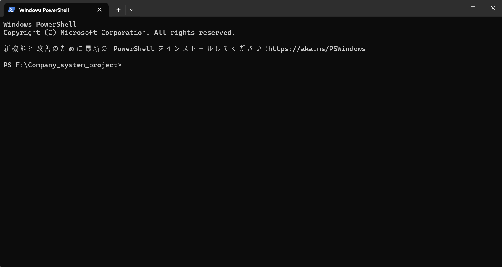
- 「iflow」と入力して そして Enter キーを押して起動させます。
  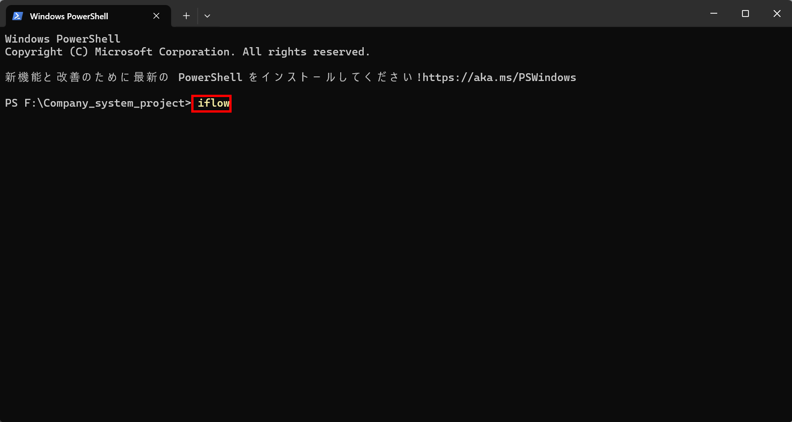
- 起動画面
  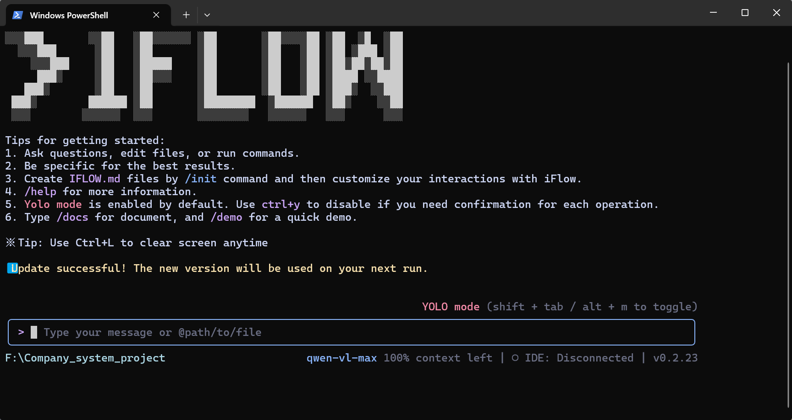
- 「/」と入力すると、一覧のメニューができます。
  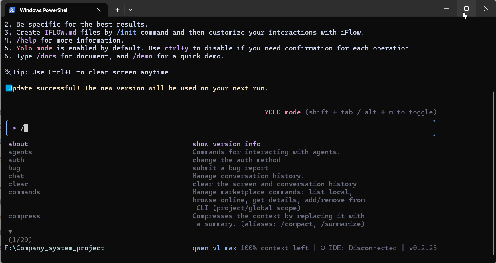
- 今度は AI モデルを使ってみたいので、「/model」と入力します。
  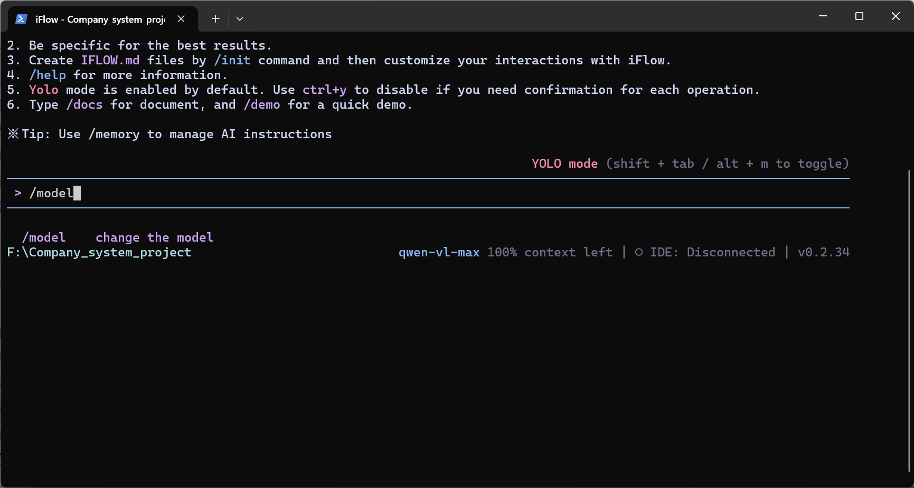
- Enter キーを押すと、中国の最強 AI モデルの 一覧が出てきます。
  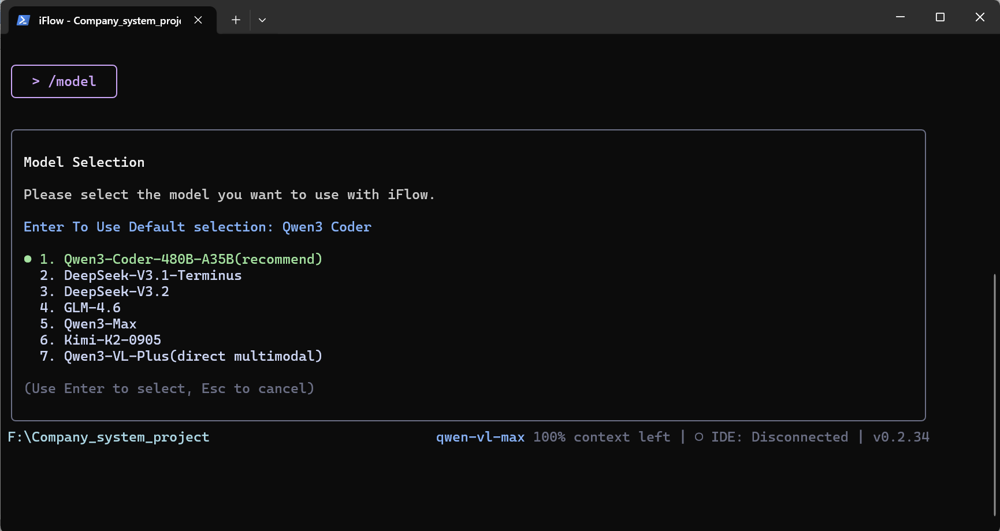
- 任意で GLM-4.6 を選択してみます。
  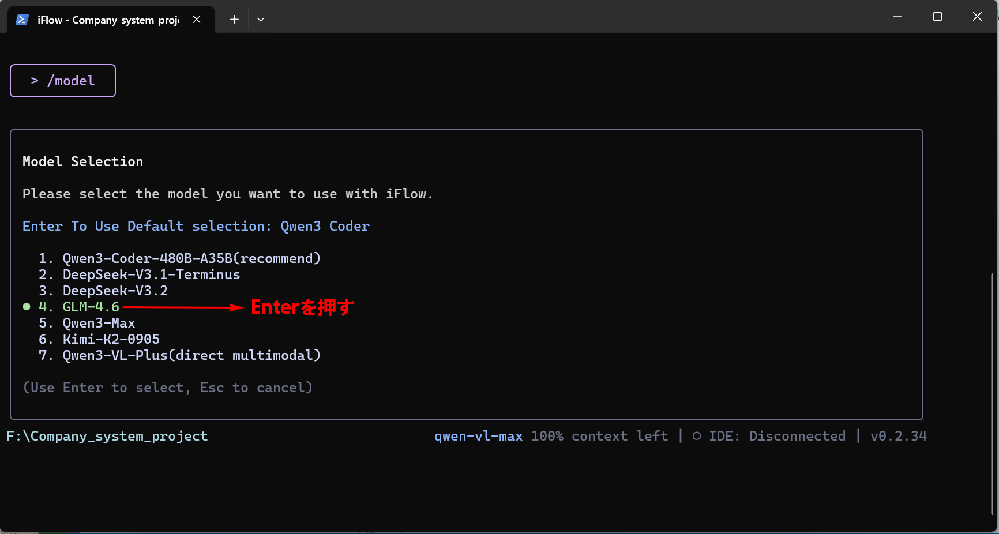

### ✅ モデル選択について

```
│ モデル選択                                                                                              │
│                                                                                                          │
│ 使用するモデルを選択してください。                                                                       │
│                                                                                                          │
│ Enterキーでデフォルト選択「Qwen3 Coder」を使用                                                          │
│                                                                                                          │
│ ● 1. Qwen3-Coder-480B-A35B（推奨）                                                                       │
│   2. DeepSeek-V3.1-Terminus                                                                                     │
│   3. DeepSeek-V3.2                                                                                             │
│   4. GLM-4.6                                                                                            │
│   5. Qwen3-Max                                                                            │
│   6. Kimi-K2-0905                                                                            │
│   7. Qwen3-VL-Plus(direct multimodal)                                                               │
│                                                                                                          │
│ （上下キーで選択、Enterで決定、Escでキャンセル）                                                        │
```

上下キーでモデルを選択し、必要に応じて Enter で確定します。
推奨モデルは **「Qwen3-Coder-480B-A35B」** です。

---

### ✅ 適当に以下の質問を設けてみます。

- 貴方はどのモデルですか？
- 貴方はいつまでの知識を把握していますか？
- 貴方は非常に弱いモデルと聞いていますね
- 貴方は Chat GPT、Grok、Claude Code、DeepSeek、Qwen3、Kimi に比べて弱いそうです。
- 今のプロジェクトは company_frontend と company_backend が含めていますが、具体的に分析してもらえますか？

### ✅ 質問して回答を求めていきましょう。

#### (貴方はどのモデルですか？)

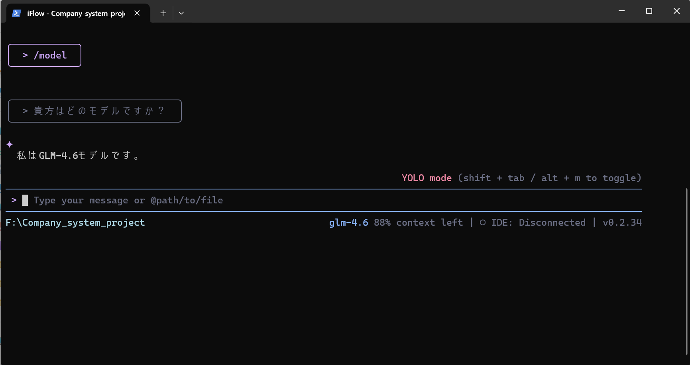

#### (貴方はいつまでの知識を把握していますか？)

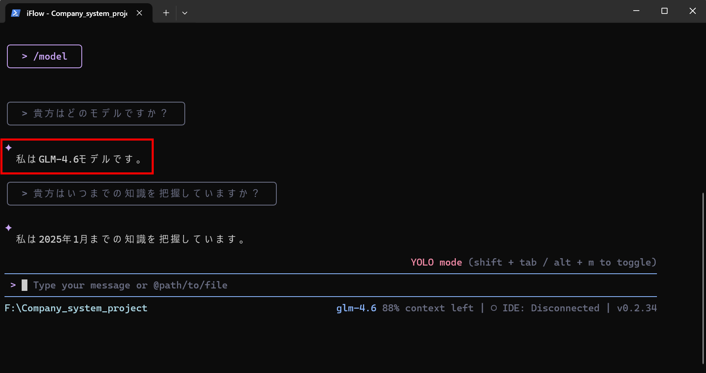

#### (貴方は非常に弱いモデルと聞いていますね)

貴方は非常に弱いモデルと聞いていますね

#### (貴方は Chat GPT、Grok、Claude Code、DeepSeek、Qwen3、Kimi に比べて弱いそうです。)

今のプロジェクトは company_frontend と company_backend が含めていますが、具体的に分析してもらえますか？

#### (今のプロジェクトは company_frontend と company_backend が含めていますが、具体的に分析してもらえますか？)

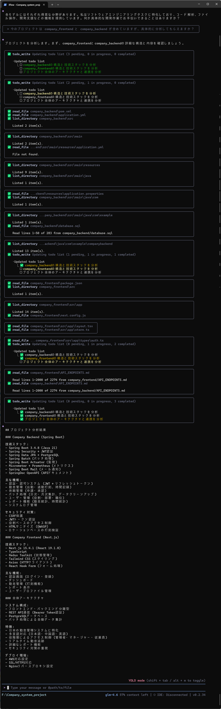
