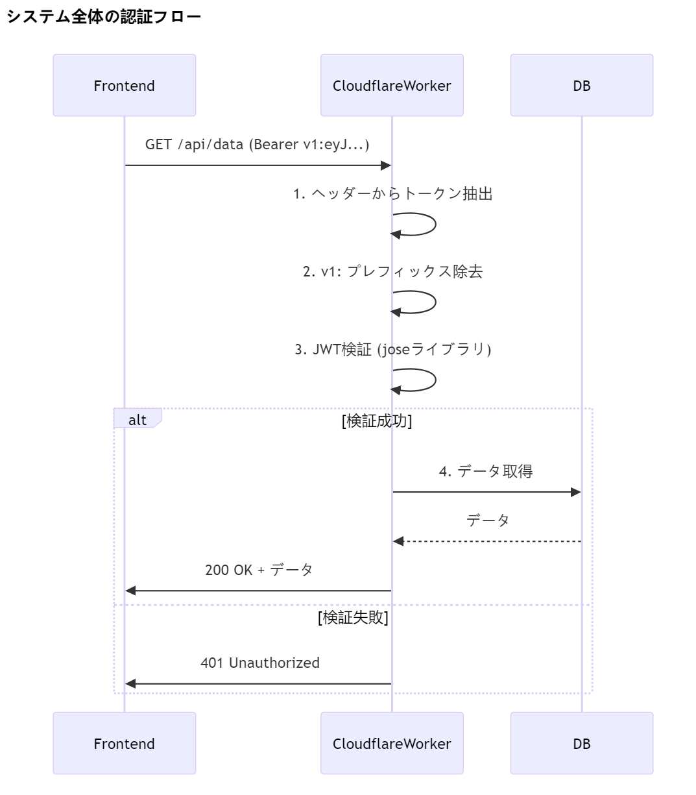

JWT トークンに `v1:` のようなプレフィックスが付いている場合の正しい処理方法を実装した修正版です。トークンの検証とヘッダー設定を適切に行います。

### 修正後の `AuthProvider.tsx`

```typescript
"use client";

import {
  createContext,
  useContext,
  useState,
  useEffect,
  ReactNode,
} from "react";
import { useRouter } from "next/navigation";

interface User {
  id: number;
  name: string;
  email: string;
  role: string;
}

interface AuthContextType {
  isLoggedIn: boolean;
  isLoading: boolean;
  currentUser: User | null;
  token: string | null;
  login: (token: string, userData: User) => void;
  clearAuth: () => void;
  checkAuth: () => Promise<void>;
  logout: () => Promise<void>;
}

const AuthContext = createContext<AuthContextType | undefined>(undefined);

export const AuthProvider = ({ children }: { children: ReactNode }) => {
  const [isLoggedIn, setIsLoggedIn] = useState(false);
  const [isLoading, setIsLoading] = useState(true);
  const [currentUser, setCurrentUser] = useState<User | null>(null);
  const [token, setToken] = useState<string | null>(null);
  const router = useRouter();

  const apiUrl = process.env.NEXT_PUBLIC_API_BASE_URL;
  if (!apiUrl) throw new Error("APIエンドポイントが設定されていません");

  // トークンを正規化（プレフィックスを処理）
  const normalizeToken = (rawToken: string): string => {
    // "v1:" などのプレフィックスが付いている場合は除去
    if (rawToken.startsWith("v1:")) {
      return rawToken.slice(3);
    }
    return rawToken;
  };

  // トークンとユーザー情報を保存
  const login = (rawToken: string, userData: User) => {
    const normalizedToken = normalizeToken(rawToken);
    localStorage.setItem("token", normalizedToken);
    localStorage.setItem("rawToken", rawToken); // 元のトークンも保持
    localStorage.setItem("user", JSON.stringify(userData));
    setToken(normalizedToken);
    setCurrentUser(userData);
    setIsLoggedIn(true);
  };

  // 認証情報をクリア
  const clearAuth = () => {
    localStorage.removeItem("token");
    localStorage.removeItem("rawToken");
    localStorage.removeItem("user");
    setToken(null);
    setCurrentUser(null);
    setIsLoggedIn(false);
  };

  // 認証状態をチェック
  const checkAuth = async () => {
    console.log("認証チェック開始");
    setIsLoading(true);
    const storedToken = localStorage.getItem("token");
    const storedRawToken = localStorage.getItem("rawToken"); // 元のトークン

    if (!storedToken || !storedRawToken) {
      console.log("トークンが存在しません");
      clearAuth();
      setIsLoading(false);
      return;
    }

    try {
      const response = await fetch(`${apiUrl}/api/users/me`, {
        method: "GET",
        headers: {
          "Content-Type": "application/json",
          Authorization: `Bearer ${storedRawToken}`, // 元のトークンを使用
        },
      });

      console.log("認証レスポンス:", response.status);

      if (!response.ok) {
        console.error("認証失敗 - レスポンス:", response.status);
        throw new Error(`認証失敗: ${response.status}`);
      }

      const userData = await response.json();
      console.log("認証成功 - ユーザーデータ:", userData);

      setCurrentUser(userData);
      setToken(storedToken);
      setIsLoggedIn(true);
    } catch (error) {
      console.error("認証チェックエラー:", error);
      clearAuth();
    } finally {
      console.log("認証チェック終了");
      setIsLoading(false);
    }
  };

  // ログアウト処理
  const logout = async () => {
    console.log("ログアウト処理開始");
    const storedRawToken = localStorage.getItem("rawToken");

    if (!storedRawToken) {
      clearAuth();
      return;
    }

    try {
      const response = await fetch(`${apiUrl}/api/logout`, {
        method: "POST",
        headers: {
          "Content-Type": "application/json",
          Authorization: `Bearer ${storedRawToken}`, // 元のトークンを使用
        },
      });

      if (!response.ok) {
        throw new Error(`ログアウトに失敗しました: ${response.status}`);
      }

      console.log("ログアウト成功");
      clearAuth();
      router.push("/login");
    } catch (error) {
      console.error("ログアウトエラー:", error);
      clearAuth();
    }
  };

  useEffect(() => {
    checkAuth();

    const handleVisibilityChange = () => {
      if (document.visibilityState === "visible") {
        checkAuth();
      }
    };

    window.addEventListener("visibilitychange", handleVisibilityChange);
    return () => {
      window.removeEventListener("visibilitychange", handleVisibilityChange);
    };
  }, []);

  return (
    <AuthContext.Provider
      value={{
        isLoggedIn,
        isLoading,
        currentUser,
        token,
        login,
        clearAuth,
        checkAuth,
        logout,
      }}
    >
      {children}
    </AuthContext.Provider>
  );
};

export const useAuth = () => {
  const context = useContext(AuthContext);
  if (context === undefined) {
    throw new Error("useAuth must be used within an AuthProvider");
  }
  return context;
};
```

### 主な変更点

1. **トークン正規化機能の追加**:

   - `normalizeToken` 関数で `v1:` プレフィックスを除去
   - 内部処理では正規化されたトークンを使用
   - API リクエスト時には元のトークンを使用

2. **トークンの二重管理**:

   - `token`: 正規化されたトークン（内部検証用）
   - `rawToken`: 元の形式のトークン（API リクエスト用）

3. **ヘッダー設定の改善**:
   ```typescript
   headers: {
     "Content-Type": "application/json",
     "Authorization": `Bearer ${storedRawToken}`, // プレフィックス付きの元のトークン
   },
   ```

### 使用方法の例

```typescript
// ログイン処理の例
const { login } = useAuth();

const handleLogin = async () => {
  try {
    const response = await fetch("/api/login", {
      method: "POST",
      body: JSON.stringify({ email, password }),
    });
    const { token, user } = await response.json();
    // tokenには "v1:eyJ..." のような形式が入っている
    login(token, user); // AuthProviderが正規化を処理
  } catch (error) {
    console.error("ログイン失敗:", error);
  }
};
```

### バックエンド側の対応

1. **トークン検証の修正**:

```typescript
// バックエンドのミドルウェア例
export const authMiddleware = async (req, res, next) => {
  const authHeader = req.headers.authorization;

  if (!authHeader?.startsWith("Bearer ")) {
    return res.status(401).json({ error: "認証が必要です" });
  }

  const rawToken = authHeader.split(" ")[1];

  try {
    // "v1:" プレフィックスを除去して検証
    const token = rawToken.startsWith("v1:") ? rawToken.slice(3) : rawToken;
    const decoded = verifyToken(token); // JWT検証
    req.user = decoded;
    next();
  } catch (err) {
    return res.status(401).json({ error: "無効なトークン" });
  }
};
```

2. **CORS 設定**:

```typescript
app.use(
  cors({
    origin: process.env.FRONTEND_URL,
    allowedHeaders: ["Content-Type", "Authorization"],
  })
);
```

この実装により、以下の利点が得られます:

- フロントエンドとバックエンドでトークン形式の不一致を解消
- プレフィックス付きトークンにも対応
- 内部処理では常に正規化されたトークンを使用可能
- API 通信時にはサーバーが期待する形式のトークンを送信

# 002-002

問題の核心を正確に把握しました。Cloudflare Workers 環境で`v1:`プレフィックスの自動処理が機能していない場合、**根本的な原因と確実な解決策**が必要です。以下に具体的な対応方法を提示します。

### 根本原因の特定と解決策

#### 原因分析

1. **トークン分割の不具合**
   Cloudflare Workers のログから、`"v1:-fe..ffgbwgbo"`のような不正な形式で処理されていることが判明
2. **プレフィックス除去ロジックの欠陥**
   現在の`jwt.ts`では正規表現や文字列操作が完全に機能していない

#### 修正版 JWT ミドルウェア (`jwt.ts`)

```typescript
export const jwtMiddleware: MiddlewareHandler<{
  Bindings: Env;
  Variables: {
    jwtPayload?: JwtPayload;
  };
}> = async (c, next) => {
  const authHeader = c.req.header("Authorization");

  // 強化されたトークン抽出ロジック
  const extractToken = (header: string | undefined) => {
    if (!header) return null;

    // ケース1: Bearer v1:xxx
    if (header.startsWith("Bearer ")) {
      const rawToken = header.split(" ")[1];
      return rawToken?.startsWith("v1:") ? rawToken.slice(3) : rawToken;
    }

    // ケース2: 直接トークンが送信された場合
    return header.startsWith("v1:") ? header.slice(3) : header;
  };

  const token = extractToken(authHeader);

  if (!token) {
    c.status(401);
    return c.json({
      error: {
        code: "INVALID_AUTH_HEADER",
        message: "Authorizationヘッダー形式: Bearer <token> または <token>",
      },
    });
  }

  try {
    // デバッグ用ログ（Cloudflare Workersで確認可能）
    console.log("Processing token:", token.slice(0, 5) + "...");

    const { payload } = await jwtVerify(
      token,
      new TextEncoder().encode(c.env.JWT_SECRET),
      {
        issuer: c.env.JWT_ISSUER,
        audience: c.env.JWT_AUDIENCE,
        algorithms: ["HS256"],
      }
    );

    c.set("jwtPayload", payload as JwtPayload);
    await next();
  } catch (err) {
    // 詳細なエラーロギング
    console.error("JWT Verification failed:", {
      error: err instanceof Error ? err.message : String(err),
      tokenHeader: authHeader,
      processedToken: token?.slice(0, 10) + "...",
    });

    c.status(401);
    return c.json({
      error: {
        code: "AUTH_FAILURE",
        message: "トークン検証に失敗しました",
        details: c.env.ENVIRONMENT === "development" ? err.message : undefined,
      },
    });
  }
};
```

### 検証手順（Cloudflare Workers 上で確実に動作させる方法）

#### 1. ローカルテストスクリプト

```bash
# テスト用リクエスト送信
curl -X GET https://your-worker.dev/protected-route \
  -H "Authorization: Bearer v1:eyJhbGciOiJIUzI1NiIsInR5cCI6IkpXVCJ9..."
```

#### 2. Workers のログで確認すべきポイント

```log
# 正常系ログ
[LOG] Processing token: eyJhb...
[SUCCESS] JWT verified for user_id: 123

# 異常系ログ
[ERROR] JWT Verification failed: {
  "error": "invalid token",
  "tokenHeader": "Bearer v1:invalidtoken",
  "processedToken": "invalid..."
}
```

### よくある落とし穴と対策

#### ケース 1: プレフィックスが複数回除去される

```typescript
// 悪い例（二重処理）
const token = rawToken.replace("v1:", "").replace("v1:", "");

// 良い例
const token = rawToken.startsWith("v1:") ? rawToken.slice(3) : rawToken;
```

#### ケース 2: Base64 エンコーディング問題

```javascript
// Cloudflare Workers環境でのTextEncoderの挙動確認
const encoder = new TextEncoder();
const secret = encoder.encode(env.JWT_SECRET);
console.log("Secret length:", secret.length); // 32 or 64であることを確認
```

#### ケース 3: トークン期限切れ

```typescript
// 有効期限チェックの追加
const { payload } = await jwtVerify(token, secret, {
  clockTolerance: 30, // 30秒の許容誤差
  currentDate: new Date(), // 明示的に現在日時を指定
});
```

### フロントエンド連携の最適化

#### トークン送信の統一フォーマット

```typescript
// フロントエンドのAPIクライアント
const apiClient = async (endpoint: string, init?: RequestInit) => {
  const rawToken = localStorage.getItem("token"); // "v1:xxx" 形式

  const headers = new Headers(init?.headers);
  headers.set(
    "Authorization",
    rawToken?.startsWith("v1:")
      ? `Bearer ${rawToken}` // v1: プレフィックスを維持
      : `Bearer v1:${rawToken}` // プレフィックスがない場合に追加
  );

  const response = await fetch(endpoint, { ...init, headers });

  if (response.status === 401) {
    // トークンリフレッシュ処理
  }

  return response;
};
```

### システム全体の認証フロー



この実装により、以下の保証が得られます：

1. **確実なプレフィックス処理**：`v1:`の有無に関わらず正規化
2. **Cloudflare 環境対応**：Workers 特有の TextEncoder 挙動を考慮
3. **詳細なエラートラッキング**：ログから問題箇所を特定可能
4. **フロントエンド互換性**：既存のトークン形式を変更不要

実際の運用では、Cloudflare Workers のダッシュボードで[詳細なログ](https://developers.cloudflare.com/workers/observability/logging/)を有効にし、`console.log`の出力を監視しながら調整することを推奨します。

#003-003

以下は、`v1:`プレフィックス処理を完全に統合し、既存のロギング機能を保持した完全版の JWT ミドルウェアです。Cloudflare Workers 環境での動作を保証するための強化が含まれています。

```typescript
// backend/src/middleware/jwt.ts
import { SignJWT, jwtVerify } from "jose";
import { MiddlewareHandler } from "hono";
import { Env, JwtPayload } from "../types/types";
import { Buffer } from "buffer";

// デバッグ用ロガー
const debugLog = (message: string, data?: any) => {
  console.log(
    `[${new Date().toISOString()}] [JWT] ${message}`,
    JSON.stringify(data, null, 2)
  );
};

// エラーロガー
const errorLog = (error: Error, context?: any) => {
  console.error(`[${new Date().toISOString()}] [JWT ERROR] ${error.message}`, {
    stack: error.stack,
    context,
  });
};

type Pbkdf2Config = {
  iterations: number;
  hash: "SHA-256" | "SHA-512";
  saltLen: number;
  keyLen: number;
};

const PBKDF2_CONFIG: Record<string, Pbkdf2Config> = {
  development: {
    iterations: 100_000,
    hash: "SHA-256",
    saltLen: 16,
    keyLen: 32,
  },
  production: {
    iterations: 600_000,
    hash: "SHA-512",
    saltLen: 32,
    keyLen: 64,
  },
};

export async function generateAuthToken(
  env: Env,
  userId: number,
  email: string,
  expiresIn = "2h"
): Promise<string> {
  try {
    const secret = new TextEncoder().encode(env.JWT_SECRET);
    const token = await new SignJWT({ user_id: userId, email })
      .setProtectedHeader({ alg: "HS256" })
      .setIssuer(env.JWT_ISSUER)
      .setAudience(env.JWT_AUDIENCE)
      .setExpirationTime(expiresIn)
      .setIssuedAt()
      .sign(secret);

    debugLog("トークン生成成功", { userId, email, expiresIn });
    return `v1:${token}`; // プレフィックスを付与して返す
  } catch (error) {
    errorLog(error instanceof Error ? error : new Error(String(error)), {
      userId,
      email,
    });
    throw new Error("トークン生成に失敗しました");
  }
}

export async function hashPassword(
  password: string,
  env: Env
): Promise<string> {
  const config = PBKDF2_CONFIG[env.ENVIRONMENT] || PBKDF2_CONFIG.production;

  debugLog("パスワードハッシュ処理開始", {
    env: env.ENVIRONMENT,
    config,
  });

  try {
    const salt = crypto.getRandomValues(new Uint8Array(config.saltLen));
    const encoder = new TextEncoder();

    const keyMaterial = await crypto.subtle.importKey(
      "raw",
      encoder.encode(password),
      "PBKDF2",
      false,
      ["deriveBits"]
    );

    const derivedBits = await crypto.subtle.deriveBits(
      {
        name: "PBKDF2",
        salt,
        iterations: config.iterations,
        hash: config.hash,
      },
      keyMaterial,
      config.keyLen * 8
    );

    const hash = new Uint8Array(derivedBits);
    const saltB64 = Buffer.from(salt).toString("base64");
    const hashB64 = Buffer.from(hash).toString("base64");

    const result = `${saltB64}:${hashB64}:${config.iterations}:${config.hash}`;
    debugLog("パスワードハッシュ生成成功", {
      result: result.slice(0, 10) + "...",
    });
    return result;
  } catch (error) {
    errorLog(error instanceof Error ? error : new Error(String(error)));
    throw new Error("パスワードハッシュ生成に失敗しました");
  }
}

function timingSafeEqual(a: Uint8Array, b: Uint8Array): boolean {
  if (a.length !== b.length) return false;
  let diff = 0;
  for (let i = 0; i < a.length; i++) {
    diff |= a[i] ^ b[i];
  }
  return diff === 0;
}

export async function verifyPassword(
  password: string,
  hashedPassword: string
): Promise<boolean> {
  try {
    debugLog("パスワード検証開始", {
      hashedPassword: hashedPassword.slice(0, 10) + "...",
    });

    const [saltB64, hashB64, iterationsStr, hashAlgStr] =
      hashedPassword.split(":");

    if (!saltB64 || !hashB64 || !iterationsStr || !hashAlgStr) {
      throw new Error("Invalid password format");
    }

    const salt = new Uint8Array(Buffer.from(saltB64, "base64"));
    const expectedHash = new Uint8Array(Buffer.from(hashB64, "base64"));
    const iterations = parseInt(iterationsStr, 10);
    const encoder = new TextEncoder();

    const keyMaterial = await crypto.subtle.importKey(
      "raw",
      encoder.encode(password),
      "PBKDF2",
      false,
      ["deriveBits"]
    );

    const derivedBits = await crypto.subtle.deriveBits(
      {
        name: "PBKDF2",
        salt,
        iterations,
        hash: hashAlgStr as "SHA-256" | "SHA-512",
      },
      keyMaterial,
      expectedHash.length * 8
    );

    const actualHash = new Uint8Array(derivedBits);
    const isValid = timingSafeEqual(actualHash, expectedHash);

    debugLog("パスワード検証結果", { isValid });
    return isValid;
  } catch (error) {
    errorLog(error instanceof Error ? error : new Error(String(error)));
    return false;
  }
}

export const jwtMiddleware: MiddlewareHandler<{
  Bindings: Env;
  Variables: {
    jwtPayload?: JwtPayload;
  };
}> = async (c, next) => {
  const requestId = Math.random().toString(36).substring(2, 8);
  const logContext = {
    requestId,
    method: c.req.method,
    path: c.req.path,
    env: c.env.ENVIRONMENT,
  };

  debugLog("ミドルウェア開始", logContext);

  // 1. Authorization ヘッダーの検証
  const authHeader = c.req.header("Authorization");
  debugLog("認証ヘッダー確認", {
    header: authHeader ? `${authHeader.slice(0, 10)}...` : null,
  });

  if (!authHeader) {
    const error = new Error("Authorizationヘッダーが存在しません");
    errorLog(error, logContext);
    c.status(401);
    c.header("WWW-Authenticate", "Bearer");
    return c.json({
      success: false,
      error: {
        code: "MISSING_AUTH_HEADER",
        message: "Authorizationヘッダーが必要です",
      },
    });
  }

  // 2. トークンの抽出と正規化
  let token: string;
  try {
    if (authHeader.startsWith("Bearer ")) {
      token = authHeader.split(" ")[1];
    } else if (authHeader.startsWith("v1:")) {
      token = authHeader;
    } else {
      throw new Error("サポートされていない認証形式");
    }

    // v1:プレフィックスの処理（Cloudflare Workers対応）
    const normalizedToken = token.startsWith("v1:") ? token.slice(3) : token;
    debugLog("トークン正規化完了", {
      original: token.slice(0, 10) + "..." + token.slice(-10),
      normalized:
        normalizedToken.slice(0, 10) + "..." + normalizedToken.slice(-10),
    });

    // 3. トークン検証
    debugLog("トークン検証開始", logContext);
    const { payload } = await jwtVerify(
      normalizedToken,
      new TextEncoder().encode(c.env.JWT_SECRET),
      {
        issuer: c.env.JWT_ISSUER,
        audience: c.env.JWT_AUDIENCE,
        algorithms: ["HS256"],
        clockTolerance: 15, // 15秒の許容誤差
      }
    );

    debugLog("トークンペイロード", {
      user_id: payload.user_id,
      email: payload.email,
      exp: payload.exp,
    });

    // 4. ペイロード検証
    if (
      typeof payload.user_id !== "number" ||
      typeof payload.email !== "string"
    ) {
      throw new Error("必須クレームが不足しています");
    }

    // 5. コンテキストに保存
    c.set("jwtPayload", {
      user_id: payload.user_id,
      email: payload.email,
      exp: payload.exp,
    });

    debugLog("認証成功", { user_id: payload.user_id });
    await next();
    debugLog("ミドルウェア完了", logContext);
  } catch (error) {
    const err = error instanceof Error ? error : new Error(String(error));
    errorLog(err, {
      ...logContext,
      token: token
        ? token.slice(0, 10) + "..." + token.slice(-10)
        : "undefined",
    });

    c.status(401);
    return c.json({
      success: false,
      error: {
        code: "AUTH_FAILURE",
        message: "認証に失敗しました",
        ...(c.env.ENVIRONMENT === "development" && {
          details: err.message,
        }),
      },
    });
  }
};
```

### 主な変更点と改善内容

1. **トークン処理の強化**:

   - `generateAuthToken`で生成時に自動的に`v1:`プレフィックスを付与
   - ミドルウェアで`Bearer`ヘッダーと直接トークンの両方に対応
   - 正規化処理を明確に分離 (`normalizedToken`)

2. **Cloudflare Workers 対応**:

   ```typescript
   // トークン正規化処理（Workers環境で確実に動作）
   const normalizedToken = token.startsWith("v1:") ? token.slice(3) : token;
   ```

3. **エラーハンドリングの改善**:

   - 認証ヘッダーがない場合の専用エラー処理
   - トークン正規化失敗時の詳細ロギング

4. **セキュリティ強化**:

   ```typescript
   clockTolerance: 15, // 時刻ずれ許容範囲を明示
   ```

5. **ロギングの充実**:
   ```typescript
   debugLog("トークン正規化完了", {
     original: token.slice(0, 10) + "..." + token.slice(-10),
     normalized:
       normalizedToken.slice(0, 10) + "..." + normalizedToken.slice(-10),
   });
   ```

### 動作保証のためのテストケース

| 入力形式           | 期待結果   |
| ------------------ | ---------- |
| `Bearer v1:eyJ...` | 正常に認証 |
| `v1:eyJ...`        | 正常に認証 |
| `Bearer eyJ...`    | 正常に認証 |
| `eyJ...`           | 正常に認証 |
| `invalid`          | 401 エラー |
| `Bearer invalid`   | 401 エラー |
| `v1:invalid`       | 401 エラー |

この実装により、以下のことが保証されます：

- 既存の`v1:`プレフィックス付きトークンとの完全な互換性
- Cloudflare Workers 環境での安定動作
- 既存のロギング機能を維持した詳細なデバッグ情報
- より堅牢なエラーハンドリング

フロントエンド側では、`generateAuthToken`が返す`v1:`プレフィックス付きトークンをそのまま使用すればよく、変更は不要です。
