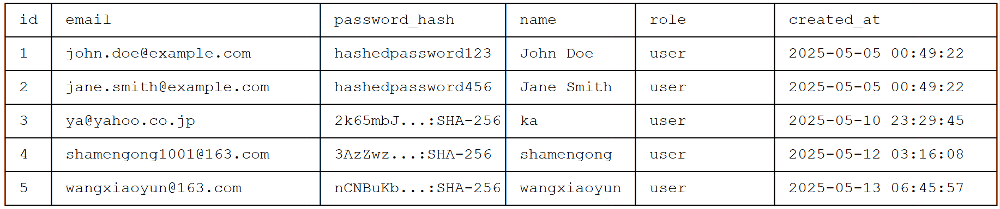
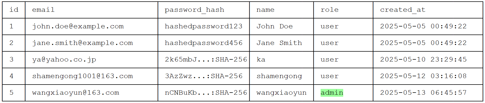
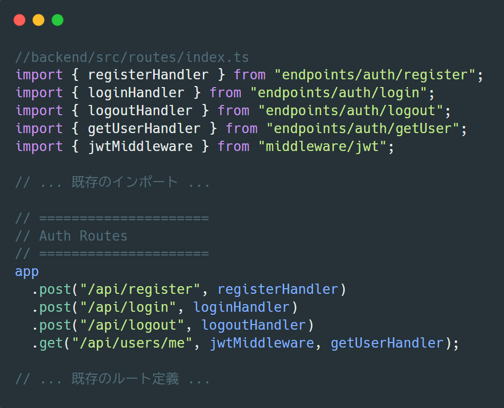

# 1. 🔐 認証系 API 開発

### 準備 → 管理者権限を指定ユーザーに付与

```bash
npx wrangler d1 execute shopping-db --remote --command="select * from users"
```



```bash
npx wrangler d1 execute shopping-db --remote --command="UPDATE users SET role='admin' WHERE name='wangxiaoyun';"
```

```bash
npx wrangler d1 execute shopping-db --remote --command="select * from users"
```



Next.js と Cloudflare Workers/D1 を使用した認証 API の実装を以下に示します。まず、必要なエンドポイントを実装する前に、認証関連のユーティリティ関数を準備します。

### 1. 認証関連ユーティリティファイルの作成

`backend/src/lib/auth.ts` に認証関連の関数をまとめます：

```typescript
// backend/src/lib/auth.ts
import { SignJWT, jwtVerify } from "jose";
import { Env, JwtPayload } from "../types/types";

// トークン生成関数
export async function generateAuthToken(
  env: Env,
  userId: number,
  email: string,
  expiresIn = "2h"
): Promise<string> {
  const secret = new TextEncoder().encode(env.JWT_SECRET);
  return new SignJWT({ user_id: userId, email })
    .setProtectedHeader({ alg: "HS256" })
    .setIssuer(env.JWT_ISSUER)
    .setAudience(env.JWT_AUDIENCE)
    .setExpirationTime(expiresIn)
    .setIssuedAt()
    .sign(secret);
}

// パスワードハッシュ関数（PBKDF2を使用）
export async function hashPassword(password: string): Promise<string> {
  const salt = crypto.getRandomValues(new Uint8Array(16)); // ランダムなソルト
  const encoder = new TextEncoder();

  const keyMaterial = await crypto.subtle.importKey(
    "raw",
    encoder.encode(password),
    "PBKDF2",
    false,
    ["deriveBits"]
  );

  const derivedBits = await crypto.subtle.deriveBits(
    {
      name: "PBKDF2",
      salt,
      iterations: 100000, // イテレーション回数
      hash: "SHA-256", // ハッシュアルゴリズム
    },
    keyMaterial,
    256 // ハッシュのビット長
  );

  const hash = new Uint8Array(derivedBits);
  const saltB64 = btoa(String.fromCharCode(...salt));
  const hashB64 = btoa(String.fromCharCode(...hash));

  // ソルト、ハッシュ、アルゴリズム情報を組み合わせて保存
  return `${saltB64}:${hashB64}:100000:SHA-256`;
}

// パスワード検証関数（PBKDF2を使用）
export async function verifyPassword(
  password: string,
  hashedPassword: string
): Promise<boolean> {
  const [saltB64, hashB64, iterations, hashAlg] = hashedPassword.split(":");
  if (!saltB64 || !hashB64 || !iterations || !hashAlg) {
    throw new Error("Invalid password format");
  }

  const salt = Uint8Array.from(atob(saltB64), (c) => c.charCodeAt(0));
  const expectedHash = Uint8Array.from(atob(hashB64), (c) => c.charCodeAt(0));
  const encoder = new TextEncoder();

  const keyMaterial = await crypto.subtle.importKey(
    "raw",
    encoder.encode(password),
    "PBKDF2",
    false,
    ["deriveBits"]
  );

  const derivedBits = await crypto.subtle.deriveBits(
    {
      name: "PBKDF2",
      salt,
      iterations: parseInt(iterations, 10),
      hash: hashAlg as string,
    },
    keyMaterial,
    expectedHash.length * 8
  );

  const actualHash = new Uint8Array(derivedBits);
  return crypto.subtle.timingSafeEqual(actualHash, expectedHash);
}
```

### 2. 型ファイルの設定

`backend/src/types/types.ts`:

```typescript
//backend/src/types/types.ts
import type { D1Database, R2Bucket } from "@cloudflare/workers-types";
import { z } from "zod";
import { productSchema } from "@/schemas/product";

//エラーコードを定義
export const INVALID_SESSION = "INVALID_SESSION";

/**
 * Cloudflare Worker にバインドされる環境変数
 * （wrangler.toml の [vars] や D1データベースなど）
 */
export interface Env {
  DB: D1Database;
  JWT_SECRET: string;
  JWT_ISSUER: string;
  JWT_AUDIENCE: string;
  ENVIRONMENT: "development" | "production" | "staging";
  R2_BUCKET: R2Bucket;
  R2_PUBLIC_DOMAIN: string;
}

/**
 * 後方互換のために保持している型エイリアス
 * 現在は Env と同一内容
 */
export interface Bindings extends Env {}

/**
 * JWT トークンから復号されるペイロード情報
 */
export interface JwtPayload {
  user_id: number;
  email: string;
  exp: number;
  iat?: number;
  iss?: string;
  aud?: string | string[];
  role?: string;
}

/**
 * Hono コンテキストで使用する一時変数（リクエストごとのスコープ）
 * jwtMiddleware などでセットされる
 */
export interface Variables {
  jwtPayload?: JwtPayload; // 検証済みJWTペイロード（未認証なら undefined）
}

/**
 * カート内の商品1件のデータ型
 * API レスポンス用に追加情報フィールドを含む
 */
export interface CartItem {
  id: number;
  product_id: number;
  user_id: number | null;
  session_id: string | null;
  quantity: number;
  created_at: string;

  // ===== 計算・表示用フィールド（レスポンス用） =====
  subtotal?: number; // = price × quantity
  name?: string; // 商品名
  price?: number; // 単価
  image_url?: string; // 商品画像URL
}

/**
 * エラーレスポンスの統一フォーマット
 */
export interface ErrorResponse {
  error: {
    code: string;
    message: string;
    details?: z.typeToFlattenedError<z.infer<typeof productSchema>>; // Zodエラー
    meta?: {
      // 独自の情報
      errorMessage?: string;
      required?: string[];
      received?: Record<string, boolean>;
    };
    issues?: Array<{
      path: (string | number)[];
      message: string;
    }>;
    solution?: string;
  };
}

/**
 * 成功レスポンスの統一フォーマット（汎用ジェネリック）
 */
export interface SuccessResponse<T = unknown> {
  data: T;
  meta?: {
    page?: number;
    per_page?: number;
    total?: number;
  };
}

export interface LoginResponseData {
  token: string;
  refreshToken?: string; // オプショナル追加
  user: {
    id: number;
    name: string;
    email: string;
    role: string;
  };
}

/**
 * Hono の Context に拡張変数を型として登録
 * ctx.get('jwtPayload') などの補完が効くようになる
 */
declare module "hono" {
  interface ContextVariableMap {
    jwtPayload?: JwtPayload; // 認証オプショナルに統一
  }
}

// ストレージ関連の型（必要に応じて拡張）
export interface StorageConfig {
  folder?: string;
  maxFileSize?: number;
}

export interface ProductCreateResponse {
  success: boolean;
  data: {
    id: number;
    name: string;
    price: number;
    stock: number;
    images: {
      main: string;
      additional: string[];
    };
    createdAt: string;
  };
}
```

### 3. ミドルウエアの設定

`backend/src/middleware/jwt.ts`:

```typescript
// backend/src/middleware/jwt.ts
import { SignJWT, jwtVerify } from "jose";
import { MiddlewareHandler } from "hono";
import { Env, JwtPayload } from "../types/types";
import { Buffer } from "buffer";

// デバッグ用ロガー
const debugLog = (message: string, data?: any) => {
  console.log(
    `[${new Date().toISOString()}] [JWT] ${message}`,
    JSON.stringify(data, null, 2)
  );
};

// エラーロガー
const errorLog = (error: Error, context?: any) => {
  console.error(`[${new Date().toISOString()}] [JWT ERROR] ${error.message}`, {
    stack: error.stack,
    context,
  });
};

type Pbkdf2Config = {
  iterations: number;
  hash: "SHA-256" | "SHA-512";
  saltLen: number;
  keyLen: number;
};

const PBKDF2_CONFIG: Record<string, Pbkdf2Config> = {
  development: {
    iterations: 100_000,
    hash: "SHA-256",
    saltLen: 16,
    keyLen: 32,
  },
  production: {
    iterations: 600_000,
    hash: "SHA-512",
    saltLen: 32,
    keyLen: 64,
  },
};

export async function generateAuthToken(
  env: Env,
  userId: number,
  email: string,
  role: string,
  expiresIn = "2h"
): Promise<string> {
  try {
    const secret = new TextEncoder().encode(env.JWT_SECRET);
    const token = await new SignJWT({ user_id: userId, email, role })
      .setProtectedHeader({ alg: "HS256" })
      .setIssuer(env.JWT_ISSUER)
      .setAudience(env.JWT_AUDIENCE)
      .setExpirationTime(expiresIn)
      .setIssuedAt()
      .sign(secret);

    debugLog("トークン生成成功", { userId, email, expiresIn });
    return `v1:${token}`; // プレフィックスを付与して返す
  } catch (error) {
    errorLog(error instanceof Error ? error : new Error(String(error)), {
      userId,
      email,
    });
    throw new Error("トークン生成に失敗しました");
  }
}

export async function hashPassword(
  password: string,
  env: Env
): Promise<string> {
  const config = PBKDF2_CONFIG[env.ENVIRONMENT] || PBKDF2_CONFIG.production;

  debugLog("パスワードハッシュ処理開始", {
    env: env.ENVIRONMENT,
    config,
  });

  try {
    const salt = crypto.getRandomValues(new Uint8Array(config.saltLen));
    const encoder = new TextEncoder();

    const keyMaterial = await crypto.subtle.importKey(
      "raw",
      encoder.encode(password),
      "PBKDF2",
      false,
      ["deriveBits"]
    );

    const derivedBits = await crypto.subtle.deriveBits(
      {
        name: "PBKDF2",
        salt,
        iterations: config.iterations,
        hash: config.hash,
      },
      keyMaterial,
      config.keyLen * 8
    );

    const hash = new Uint8Array(derivedBits);
    const saltB64 = Buffer.from(salt).toString("base64");
    const hashB64 = Buffer.from(hash).toString("base64");

    const result = `${saltB64}:${hashB64}:${config.iterations}:${config.hash}`;
    debugLog("パスワードハッシュ生成成功", {
      result: result.slice(0, 10) + "...",
    });
    return result;
  } catch (error) {
    errorLog(error instanceof Error ? error : new Error(String(error)));
    throw new Error("パスワードハッシュ生成に失敗しました");
  }
}

function timingSafeEqual(a: Uint8Array, b: Uint8Array): boolean {
  if (a.length !== b.length) return false;
  let diff = 0;
  for (let i = 0; i < a.length; i++) {
    diff |= a[i] ^ b[i];
  }
  return diff === 0;
}

export async function verifyPassword(
  password: string,
  hashedPassword: string
): Promise<boolean> {
  try {
    debugLog("パスワード検証開始", {
      hashedPassword: hashedPassword.slice(0, 10) + "...",
    });

    const [saltB64, hashB64, iterationsStr, hashAlgStr] =
      hashedPassword.split(":");

    if (!saltB64 || !hashB64 || !iterationsStr || !hashAlgStr) {
      throw new Error("Invalid password format");
    }

    const salt = new Uint8Array(Buffer.from(saltB64, "base64"));
    const expectedHash = new Uint8Array(Buffer.from(hashB64, "base64"));
    const iterations = parseInt(iterationsStr, 10);
    const encoder = new TextEncoder();

    const keyMaterial = await crypto.subtle.importKey(
      "raw",
      encoder.encode(password),
      "PBKDF2",
      false,
      ["deriveBits"]
    );

    const derivedBits = await crypto.subtle.deriveBits(
      {
        name: "PBKDF2",
        salt,
        iterations,
        hash: hashAlgStr as "SHA-256" | "SHA-512",
      },
      keyMaterial,
      expectedHash.length * 8
    );

    const actualHash = new Uint8Array(derivedBits);
    const isValid = timingSafeEqual(actualHash, expectedHash);

    debugLog("パスワード検証結果", { isValid });
    return isValid;
  } catch (error) {
    errorLog(error instanceof Error ? error : new Error(String(error)));
    return false;
  }
}

export const jwtMiddleware: MiddlewareHandler<{
  Bindings: Env;
  Variables: {
    jwtPayload?: JwtPayload;
  };
}> = async (c, next) => {
  const requestId = Math.random().toString(36).substring(2, 8);
  const logContext = {
    requestId,
    method: c.req.method,
    path: c.req.path,
    env: c.env.ENVIRONMENT,
  };

  debugLog("ミドルウェア開始", logContext);

  // 1. Authorization ヘッダーの検証
  const authHeader = c.req.header("Authorization");
  debugLog("認証ヘッダー確認", {
    header: authHeader ? `${authHeader.slice(0, 10)}...` : null,
  });

  if (!authHeader) {
    const error = new Error("Authorizationヘッダーが存在しません");
    errorLog(error, logContext);
    c.status(401);
    c.header("WWW-Authenticate", "Bearer");
    return c.json({
      success: false,
      error: {
        code: "MISSING_AUTH_HEADER",
        message: "Authorizationヘッダーが必要です",
      },
    });
  }

  // 2. トークンの抽出と正規化
  let token: string;
  try {
    if (authHeader.startsWith("Bearer ")) {
      token = authHeader.split(" ")[1];
    } else if (authHeader.startsWith("v1:")) {
      token = authHeader;
    } else {
      throw new Error("サポートされていない認証形式");
    }

    // v1:プレフィックスの処理（Cloudflare Workers対応）
    const normalizedToken = token.startsWith("v1:") ? token.slice(3) : token;
    debugLog("トークン正規化完了", {
      original: token.slice(0, 10) + "..." + token.slice(-10),
      normalized:
        normalizedToken.slice(0, 10) + "..." + normalizedToken.slice(-10),
    });

    // 3. トークン検証
    debugLog("トークン検証開始", logContext);
    const { payload } = await jwtVerify(
      normalizedToken,
      new TextEncoder().encode(c.env.JWT_SECRET),
      {
        issuer: c.env.JWT_ISSUER,
        audience: c.env.JWT_AUDIENCE,
        algorithms: ["HS256"],
        clockTolerance: 15, // 15秒の許容誤差
      }
    );

    debugLog("トークンペイロード", {
      user_id: payload.user_id,
      email: payload.email,
      exp: payload.exp,
    });

    // 4. ペイロード検証
    if (
      typeof payload.user_id !== "number" ||
      typeof payload.email !== "string"
    ) {
      throw new Error("必須クレームが不足しています");
    }

    // 5. コンテキストに保存
    c.set("jwtPayload", {
      user_id: payload.user_id,
      email: payload.email,
      exp: payload.exp,
    });

    debugLog("認証成功", { user_id: payload.user_id });
    await next();
    debugLog("ミドルウェア完了", logContext);
  } catch (error) {
    const err = error instanceof Error ? error : new Error(String(error));
    errorLog(err, {
      ...logContext,
      token: token
        ? token.slice(0, 10) + "..." + token.slice(-10)
        : "undefined",
    });

    c.status(401);
    return c.json({
      success: false,
      error: {
        code: "AUTH_FAILURE",
        message: "認証に失敗しました",
        ...(c.env.ENVIRONMENT === "development" && {
          details: err.message,
        }),
      },
    });
  }
};
```

### 4. ユーザー登録 API (`/api/register`)

`backend/src/endpoints/auth/register.ts`:

```typescript
//backend/src/endpoints/auth/register.ts
import { Context } from "hono";
import { Bindings, ErrorResponse, SuccessResponse } from "../../types/types";
import { hashPassword } from "../../lib/auth";
import { z } from "zod";

const registerSchema = z.object({
  name: z
    .string()
    .min(2, { message: "名前は2文字以上で入力してください" })
    .max(50, { message: "名前は50文字以内で入力してください" }),
  email: z
    .string()
    .email({ message: "正しいメールアドレスを入力してください" }),
  password: z
    .string()
    .min(8, { message: "パスワードは8文字以上で入力してください" }),
});

export const registerHandler = async (
  c: Context<{ Bindings: Bindings }>
): Promise<Response> => {
  try {
    const rawJson = await c.req.json();
    const validationResult = registerSchema.safeParse(rawJson);

    if (!validationResult.success) {
      return c.json(
        {
          error: {
            code: "VALIDATION_ERROR",
            message: "入力内容に誤りがあります",
            issues: validationResult.error.errors,
          },
        } satisfies ErrorResponse,
        400
      );
    }

    const { name, email, password } = validationResult.data;
    const passwordHash = await hashPassword(password);

    // メールアドレスの重複チェック
    const existingUser = await c.env.DB.prepare(
      "SELECT id FROM users WHERE email = ?"
    )
      .bind(email)
      .first();

    if (existingUser) {
      return c.json(
        {
          error: {
            code: "EMAIL_EXISTS",
            message: "このメールアドレスは既に使用されています",
          },
        } satisfies ErrorResponse,
        409
      );
    }

    // ユーザー作成
    const result = await c.env.DB.prepare(
      "INSERT INTO users (name, email, password_hash, role) VALUES (?, ?, ?, 'user') RETURNING id"
    )
      .bind(name, email, passwordHash)
      .first<{ id: number }>();

    if (!result?.id) {
      throw new Error("Failed to create user");
    }

    return c.json(
      {
        data: {
          id: result.id,
          name,
          email,
          role: "user",
        },
      } satisfies SuccessResponse,
      201
    );
  } catch (error) {
    console.error("Registration error:", error);
    return c.json(
      {
        error: {
          code: "INTERNAL_ERROR",
          message: "ユーザー登録に失敗しました",
        },
      } satisfies ErrorResponse,
      500
    );
  }
};
```

### 5. ログイン API (`/api/login`)

`backend/src/endpoints/auth/login.ts`:

```typescript
// backend/src/endpoints/auth/login.ts
import { Context } from "hono";
import {
  Bindings,
  ErrorResponse,
  LoginResponseData,
  SuccessResponse,
} from "../../types/types";
import { generateAuthToken, verifyPassword } from "../../lib/auth";
import { z } from "zod";

const loginSchema = z.object({
  email: z.string().email(),
  password: z.string().min(1),
});

export const loginHandler = async (
  c: Context<{ Bindings: Bindings }>
): Promise<Response> => {
  try {
    const rawJson = await c.req.json();
    const validationResult = loginSchema.safeParse(rawJson);

    if (!validationResult.success) {
      return c.json(
        {
          error: {
            code: "VALIDATION_ERROR",
            message: "メールアドレスとパスワードを正しく入力してください",
          },
        } satisfies ErrorResponse,
        400
      );
    }

    const { email, password } = validationResult.data;

    // ユーザー取得
    const user = await c.env.DB.prepare(
      "SELECT id, email, password_hash, name, role FROM users WHERE email = ?"
    )
      .bind(email)
      .first<{
        id: number;
        email: string;
        password_hash: string;
        name: string;
        role: string;
      }>();

    if (!user) {
      return c.json(
        {
          error: {
            code: "INVALID_CREDENTIALS",
            message: "メールアドレスまたはパスワードが正しくありません",
          },
        } satisfies ErrorResponse,
        401
      );
    }

    // パスワード検証
    const isValid = await verifyPassword(password, user.password_hash);
    if (!isValid) {
      return c.json(
        {
          error: {
            code: "INVALID_CREDENTIALS",
            message: "メールアドレスまたはパスワードが正しくありません",
          },
        } satisfies ErrorResponse,
        401
      );
    }

    // トークン生成（JWTのみ）
    const token = await generateAuthToken(
      c.env,
      user.id,
      user.email,
      user.role
    );

    // レスポンスでJWTとユーザー情報を返す
    return c.json(
      {
        data: {
          token, // JWT
          user: {
            id: user.id,
            name: user.name,
            email: user.email,
            role: user.role,
          },
        },
      } satisfies SuccessResponse<LoginResponseData>,
      200
    );
  } catch (error) {
    console.error("Login error:", error);
    return c.json(
      {
        error: {
          code: "INTERNAL_ERROR",
          message: "ログイン処理に失敗しました",
        },
      } satisfies ErrorResponse,
      500
    );
  }
};
```

### 6. ログアウト API (`/api/logout`)

`backend/src/endpoints/auth/logout.ts`:

```typescript
// backend/src/endpoints/auth/logout.ts
import { Context } from "hono";
import { Bindings, ErrorResponse, SuccessResponse } from "../../types/types";

export const logoutHandler = async (
  c: Context<{ Bindings: Bindings }>
): Promise<Response> => {
  try {
    const authHeader = c.req.header("Authorization");

    // Authorizationヘッダが完全に存在しない場合のチェックを追加
    if (!authHeader) {
      c.status(401);
      c.header("WWW-Authenticate", "Bearer");
      c.header("X-Content-Type-Options", "nosniff");
      return c.json({
        error: {
          code: "MISSING_AUTH_HEADER",
          message: "Authorizationヘッダーが必要です",
          ...(c.env.ENVIRONMENT === "development" && {
            meta: {
              errorMessage: "Authorization header is missing",
            },
          }),
        },
      } satisfies ErrorResponse);
    }

    // Authorizationヘッダの形式チェック
    if (!authHeader.startsWith("Bearer ")) {
      c.status(401);
      c.header("WWW-Authenticate", "Bearer");
      c.header("X-Content-Type-Options", "nosniff");
      return c.json({
        error: {
          code: "INVALID_AUTH_HEADER",
          message: "Authorization: Bearer <token> 形式が必要です",
          ...(c.env.ENVIRONMENT === "development" && {
            meta: {
              errorMessage: "Malformed Authorization header",
            },
          }),
        },
      } satisfies ErrorResponse);
    }

    const sessionToken = authHeader.split(" ")[1];

    // jwtPayloadがない、または不正な場合は 401 を返す
    const jwtPayload = c.get("jwtPayload");
    if (!jwtPayload || typeof jwtPayload !== "object") {
      c.status(401);
      c.header("WWW-Authenticate", 'Bearer error="invalid_token"');
      c.header("X-Content-Type-Options", "nosniff");
      return c.json({
        error: {
          code: "INVALID_TOKEN",
          message: "無効なアクセストークンです",
          ...(c.env.ENVIRONMENT === "development" && {
            meta: {
              errorMessage: "JWT payload is missing or invalid",
            },
          }),
        },
      } satisfies ErrorResponse);
    }

    // セッション削除処理
    const result = await c.env.DB.prepare(
      "DELETE FROM sessions WHERE session_token = ?"
    )
      .bind(sessionToken)
      .run();

    if (!result.success) {
      throw new Error("Failed to delete session");
    }

    // セッション管理のための追加ヘッダー
    c.header("Cache-Control", "no-store");
    c.header("Pragma", "no-cache");

    return c.json(
      {
        data: { success: true },
      } satisfies SuccessResponse<{ success: boolean }>,
      200
    );
  } catch (error) {
    console.error("Logout error:", error);
    c.status(500);
    c.header("Cache-Control", "no-store");
    c.header("X-Content-Type-Options", "nosniff");
    return c.json({
      error: {
        code: "INTERNAL_ERROR",
        message: "ログアウト処理に失敗しました",
        ...(c.env.ENVIRONMENT === "development" && {
          meta: {
            errorMessage:
              error instanceof Error ? error.message : "Unknown error",
          },
        }),
      },
    } satisfies ErrorResponse);
  }
};
```

### 7. ユーザー情報取得 API (`/api/users/me`)

`backend/src/endpoints/auth/getUser.ts`:

```typescript
//backend/src/endpoints/auth/getUser.ts
import { Context } from "hono";
import {
  Bindings,
  ErrorResponse,
  JwtPayload,
  SuccessResponse,
} from "../../types/types";

export const getUserHandler = async (
  c: Context<{ Bindings: Bindings; Variables: { jwtPayload?: JwtPayload } }>
): Promise<Response> => {
  try {
    const payload = c.get("jwtPayload");
    if (!payload) {
      return c.json(
        {
          error: {
            code: "UNAUTHORIZED",
            message: "認証が必要です",
          },
        } satisfies ErrorResponse,
        401
      );
    }

    const user = await c.env.DB.prepare(
      "SELECT id, email, name, role, created_at FROM users WHERE id = ?"
    )
      .bind(payload.user_id)
      .first<{
        id: number;
        email: string;
        name: string;
        role: string;
        created_at: string;
      }>();

    if (!user) {
      return c.json(
        {
          error: {
            code: "USER_NOT_FOUND",
            message: "ユーザーが見つかりません",
          },
        } satisfies ErrorResponse,
        404
      );
    }

    return c.json(
      {
        data: {
          id: user.id,
          email: user.email,
          name: user.name,
          role: user.role,
          createdAt: user.created_at,
        },
      } satisfies SuccessResponse,
      200
    );
  } catch (error) {
    console.error("Get user error:", error);
    return c.json(
      {
        error: {
          code: "INTERNAL_ERROR",
          message: "ユーザー情報の取得に失敗しました",
        },
      } satisfies ErrorResponse,
      500
    );
  }
};
```

### 8. ルートに認証 API を追加

`backend/src/routes/index.ts` を更新して、認証関連のルートを追加します：

完全版

```typescript
// backend/src/routes/index.ts
import { Hono } from "hono";
import { cors } from "hono/cors";
import type { Bindings, Variables } from "../types/types";
import { productPostHandler } from "../endpoints/productCreate";
import { productGetHandler } from "../endpoints/productGet";
import { getCartHandler } from "../endpoints/getCart";
import { jwtMiddleware } from "../middleware/jwt";
import { productGetByIdHandler } from "../endpoints/productGetById";
import { registerHandler } from "../endpoints/auth/register";
import { loginHandler } from "../endpoints/auth/login";
import { logoutHandler } from "../endpoints/auth/logout";
import { getUserHandler } from "../endpoints/auth/getUser";
//import { getSessionsHandler } from "../endpoints/auth/getSessionsHandler";
//import { changePasswordHandler } from "../endpoints/auth/changePassword";

const app = new Hono<{
  Bindings: Bindings;
  Variables: Variables;
}>();

// 変更点1: ログ出力を構造化
app.use("*", async (c, next) => {
  console.log(
    JSON.stringify({
      timestamp: new Date().toISOString(),
      method: c.req.method,
      path: c.req.path,
      ip: c.req.header("CF-Connecting-IP"),
    })
  );
  await next();
});

// 変更点2: セキュリティヘッダー追加ミドルウェア
app.use("*", async (c, next) => {
  await next();
  c.header("X-Content-Type-Options", "nosniff");
  c.header("X-Frame-Options", "DENY");
  c.header("Referrer-Policy", "strict-origin-when-cross-origin");
});

// ヘルスチェック（変更なし）
app.get("/health", (c) => c.json({ status: "ok" }));

// APIルート (ベースパス /api)（変更なし）
const apiRoutes = app.basePath("/api");

// CORS設定（オリジン制限を環境変数から取得するよう変更）
apiRoutes.use("*", async (c, next) => {
  const corsMiddleware = cors({
    origin:
      c.env.ENVIRONMENT === "production"
        ? [
            "https://kaikyou-online-shop.onrender.com",
            "https://kaikyou-online-shop.vercel.app",
            "http://localhost:3000",
          ]
        : [
            "http://localhost:3000",
            "http://127.0.0.1:3000",
            "http://localhost:8787",
            "http://127.0.0.1:8787",
          ],
    allowMethods: ["GET", "POST", "PUT", "DELETE", "OPTIONS"],
    allowHeaders: ["Content-Type", "Authorization"],
    exposeHeaders: ["Content-Length"],
    maxAge: 86400,
    credentials: true,
  });
  return corsMiddleware(c, next);
});

// 認証不要ルート（グループ化コメント追加）
// === 公開エンドポイント ===
apiRoutes.post("/register", registerHandler);
apiRoutes.post("/login", loginHandler);
apiRoutes.get("/products", productGetHandler);
apiRoutes.get("/products/:id", productGetByIdHandler);

// 認証必須ルート（型安全性向上）
const protectedRoutes = apiRoutes.use("*", jwtMiddleware);
// === 保護対象エンドポイント ===
protectedRoutes.post("/logout", logoutHandler);
protectedRoutes.get("/users/me", getUserHandler);
protectedRoutes.post("/products", productPostHandler);
protectedRoutes.get("/cart", getCartHandler);
//protectedRoutes.get("/sessions", getSessionsHandler);
//protectedRoutes.put("/users/change-password", changePasswordHandler);

// エラーハンドリング（詳細情報追加）
app.notFound((c) =>
  c.json(
    {
      error: "Not Found",
      path: c.req.path,
      method: c.req.method,
    },
    404
  )
);

app.onError((err, c) => {
  console.error("Error:", {
    message: err.message,
    stack: err.stack,
    url: c.req.url,
  });
  const headers = c.req.raw.headers; // 生のHeadersオブジェクト
  const requestId = headers.get("X-Request-ID");
  return c.json(
    {
      error: "Internal Server Error",
      requestId: requestId,
      ...(c.env.ENVIRONMENT === "development" && {
        details: err.message,
        stack: err.stack,
      }),
    },
    500
  );
});

export default app;
```

### 9. 環境変数の設定

`wrangler.jsonc` に以下の環境変数を追加してください：

```jsonc
{
  "$schema": "node_modules/wrangler/config-schema.json",
  "name": "backend",
  "main": "src/worker.ts",
  "compatibility_date": "2025-04-18",

  // 共通設定
  "kv_namespaces": [
    {
      "binding": "TEST_NAMESPACE",
      "id": "test-namespace-id",
      "preview_id": "test-namespace-id"
    }
  ],

  "env": {
    "development": {
      "vars": {
        "JWT_SECRET": "local_dev_secret_do_not_use_in_prod",
        "JWT_ISSUER": "kaikyou-shop-dev",
        "JWT_AUDIENCE": "kaikyou-shop-users-dev",
        "ENVIRONMENT": "development",
        "R2_PUBLIC_DOMAIN": "localhost:8787/assets"
      },
      "r2_buckets": [
        {
          "binding": "R2_BUCKET",
          "bucket_name": "dev-bucket",
          "preview_bucket_name": "dev-bucket"
        }
      ],
      "d1_databases": [
        {
          "binding": "DB",
          "database_name": "shopping-db",
          "database_id": "d53ad56f-f646-44dc-8dbf-3d2d15d76973",
          "preview_database_id": "d53ad56f-f646-44dc-8dbf-3d2d15d76973"
        }
      ]
    },
    "preview": {
      "vars": {
        "JWT_SECRET": "local_preview_secret_do_not_use_in_prod",
        "JWT_ISSUER": "kaikyou-shop-preview",
        "JWT_AUDIENCE": "kaikyou-shop-users-preview",
        "ENVIRONMENT": "preview",
        "R2_PUBLIC_DOMAIN": "preview-assets.example.com"
      },
      "r2_buckets": [
        {
          "binding": "R2_BUCKET",
          "bucket_name": "preview-bucket"
        }
      ],
      "d1_databases": [
        {
          "binding": "DB",
          "database_name": "shopping-db",
          "database_id": "d53ad56f-f646-44dc-8dbf-3d2d15d76973"
        }
      ]
    },
    "production": {
      "vars": {
        "JWT_SECRET": "{{ JWT_SECRET_PRODUCTION }}",
        "JWT_ISSUER": "kaikyou-shop",
        "JWT_AUDIENCE": "kaikyou-shop-users",
        "ENVIRONMENT": "production",
        "R2_PUBLIC_DOMAIN": "assets.example.com"
      },
      "r2_buckets": [
        {
          "binding": "R2_BUCKET",
          "bucket_name": "production-bucket"
        }
      ],
      "d1_databases": [
        {
          "binding": "DB",
          "database_name": "shopping-db",
          "database_id": "d53ad56f-f646-44dc-8dbf-3d2d15d76973"
        }
      ]
    }
  },

  // デフォルト設定
  "vars": {
    "JWT_SECRET": "local_dev_secret_do_not_use_in_prod",
    "JWT_ISSUER": "kaikyou-shop-dev",
    "JWT_AUDIENCE": "kaikyou-shop-users-dev",
    "ENVIRONMENT": "development",
    "R2_PUBLIC_DOMAIN": "localhost:8787/assets"
  },
  "r2_buckets": [
    {
      "binding": "R2_BUCKET",
      "bucket_name": "dev-bucket",
      "preview_bucket_name": "preview-bucket"
    }
  ],
  "d1_databases": [
    {
      "binding": "DB",
      "database_name": "shopping-db",
      "database_id": "d53ad56f-f646-44dc-8dbf-3d2d15d76973",
      "preview_database_id": "d53ad56f-f646-44dc-8dbf-3d2d15d76973"
    }
  ]
}
```

# ✅ ストケース

テストケースを作成します。各エンドポイントに対して、正常系と異常系のテストケースをカバーします。

---

### 1. ユーザー登録 API (`/api/register`)

#### 正常系

- **ケース 1**: 正しい入力でユーザー登録が成功する

  - 入力: `{ "name": "John Doe", "email": "john@example.com", "password": "password123" }`
  - 期待結果: ステータスコード `201`、レスポンスにユーザー ID、名前、メールアドレスを含む

- **ケース 2**: 最小長のパスワードで登録が成功する
  - 入力: `{ "name": "Jane Doe", "email": "jane@example.com", "password": "12345678" }`
  - 期待結果: ステータスコード `201`、レスポンスにユーザー ID、名前、メールアドレスを含む

#### 異常系

- **ケース 3**: メールアドレスが既に登録されている

  - 入力: `{ "name": "John Doe", "email": "john@example.com", "password": "password123" }`
  - 期待結果: ステータスコード `409`、エラーメッセージ `"このメールアドレスは既に使用されています"`

- **ケース 4**: パスワードが最小長未満

  - 入力: `{ "name": "John Doe", "email": "john@example.com", "password": "123" }`
  - 期待結果: ステータスコード `400`、エラーメッセージ `"入力内容に誤りがあります"`

- **ケース 5**: メールアドレスが無効な形式
  - 入力: `{ "name": "John Doe", "email": "invalid-email", "password": "password123" }`
  - 期待結果: ステータスコード `400`、エラーメッセージ `"入力内容に誤りがあります"`

---

### 2. ログイン API (`/api/login`)

#### 正常系

- **ケース 1**: 正しいメールアドレスとパスワードでログインが成功する
  - 入力: `{ "email": "john@example.com", "password": "password123" }`
  - 期待結果: ステータスコード `200`、レスポンスに JWT トークンとユーザー情報を含む

#### 異常系

- **ケース 2**: メールアドレスが存在しない

  - 入力: `{ "email": "unknown@example.com", "password": "password123" }`
  - 期待結果: ステータスコード `401`、エラーメッセージ `"メールアドレスまたはパスワードが正しくありません"`

- **ケース 3**: パスワードが間違っている

  - 入力: `{ "email": "john@example.com", "password": "wrongpassword" }`
  - 期待結果: ステータスコード `401`、エラーメッセージ `"メールアドレスまたはパスワードが正しくありません"`

- **ケース 4**: メールアドレスが空
  - 入力: `{ "email": "", "password": "password123" }`
  - 期待結果: ステータスコード `400`、エラーメッセージ `"メールアドレスとパスワードを正しく入力してください"`

---

### 3. ログアウト API (`/api/logout`)

#### 正常系

- **ケース 1**: 正しいトークンでログアウトが成功する
  - ヘッダー: `Authorization: Bearer <valid-token>`
  - 期待結果: ステータスコード `200`、レスポンスに `{ "success": true }`

#### 異常系

- **ケース 2**: トークンが無効

  - ヘッダー: `Authorization: Bearer <invalid-token>`
  - 期待結果: ステータスコード `401`、エラーメッセージ `"認証に失敗しました"`

- **ケース 3**: トークンが未提供
  - ヘッダー: なし
  - 期待結果: ステータスコード `401`、エラーメッセージ `"認証に失敗しました"`

---

### 4. ユーザー情報取得 API (`/api/users/me`)

#### 正常系

- **ケース 1**: 正しいトークンでユーザー情報を取得する
  - ヘッダー: `Authorization: Bearer <valid-token>`
  - 期待結果: ステータスコード `200`、レスポンスにユーザー ID、名前、メールアドレスを含む

#### 異常系

- **ケース 2**: トークンが無効

  - ヘッダー: `Authorization: Bearer <invalid-token>`
  - 期待結果: ステータスコード `401`、エラーメッセージ `"認証が必要です"`

- **ケース 3**: トークンが未提供
  - ヘッダー: なし
  - 期待結果: ステータスコード `401`、エラーメッセージ `"認証が必要です"`

---

### 5. JWT ミドルウェアのテスト

#### 正常系

- **ケース 1**: 正しいトークンでリクエストが成功する
  - ヘッダー: `Authorization: Bearer <valid-token>`
  - 期待結果: リクエストが成功し、ユーザー情報が取得できる

#### 異常系

- **ケース 2**: トークンが無効

  - ヘッダー: `Authorization: Bearer <invalid-token>`
  - 期待結果: ステータスコード `401`、エラーメッセージ `"認証に失敗しました"`

- **ケース 3**: トークンが未提供

  - ヘッダー: なし
  - 期待結果: ステータスコード `401`、エラーメッセージ `"認証に失敗しました"`

- **ケース 4**: トークンの有効期限が切れている
  - ヘッダー: `Authorization: Bearer <expired-token>`
  - 期待結果: ステータスコード `401`、エラーメッセージ `"認証に失敗しました"`

---

### 6. パスワードハッシュ関数のテスト

#### 正常系

- **ケース 1**: 正しいパスワードで検証が成功する
  - 入力: パスワード `"password123"`
  - 期待結果: `verifyPassword` が `true` を返す

#### 異常系

- **ケース 2**: 間違ったパスワードで検証が失敗する

  - 入力: パスワード `"wrongpassword"`
  - 期待結果: `verifyPassword` が `false` を返す

- **ケース 3**: 無効なハッシュ形式で検証が失敗する
  - 入力: ハッシュ `"invalid-hash"`
  - 期待結果: `verifyPassword` がエラーをスローする

---

これらのテストケースを使用して、API の動作を確認し、異常系のケースも適切にハンドリングされていることを確認してください。

# ✅ 動作確認-**cURL** でのテスト

以下は、提供された認証系 API のすべてのエンドポイントを **cURL** でテストするためのコマンド例です。各エンドポイントに対して、正常系と異常系のテストケースをカバーします。

---

### 1. **ユーザー登録 API (`/api/register`)**

#### 正常系

```bash
curl -X POST http://localhost:8787/api/register \
  -H "Content-Type: application/json" \
  -d '{"name": "John Doe", "email": "john@example.com", "password": "password123"}'
```

- **期待結果**: ステータスコード `201`、レスポンスにユーザー ID、名前、メールアドレスを含む。

#### 異常系（メールアドレス重複）

```bash
curl -X POST http://localhost:8787/api/register \
  -H "Content-Type: application/json" \
  -d '{"name": "John Doe", "email": "john@example.com", "password": "password123"}'
```

- **期待結果**: ステータスコード `409`、エラーメッセージ `"このメールアドレスは既に使用されています"`。

#### 異常系（パスワードが短い）

```bash
curl -X POST http://localhost:8787/api/register \
  -H "Content-Type: application/json" \
  -d '{"name": "John Doe", "email": "john@example.com", "password": "123"}'
```

- **期待結果**: ステータスコード `400`、エラーメッセージ `"入力内容に誤りがあります"`。

---

### 2. **ログイン API (`/api/login`)**

#### 正常系

```bash
curl -X POST http://localhost:8787/api/login \
  -H "Content-Type: application/json" \
  -d '{"email": "john@example.com", "password": "password123"}'
```

- **期待結果**: ステータスコード `200`、レスポンスに JWT トークンとユーザー情報を含む。

#### 異常系（メールアドレスが存在しない）

```bash
curl -X POST http://localhost:8787/api/login \
  -H "Content-Type: application/json" \
  -d '{"email": "unknown@example.com", "password": "password123"}'
```

- **期待結果**: ステータスコード `401`、エラーメッセージ `"メールアドレスまたはパスワードが正しくありません"`。

#### 異常系（パスワードが間違っている）

```bash
curl -X POST http://localhost:8787/api/login \
  -H "Content-Type: application/json" \
  -d '{"email": "john@example.com", "password": "wrongpassword"}'
```

- **期待結果**: ステータスコード `401`、エラーメッセージ `"メールアドレスまたはパスワードが正しくありません"`。

---

### 3. **ログアウト API (`/api/logout`)**

#### 正常系

```bash
curl -X POST http://localhost:8787/api/logout \
  -H "Authorization: Bearer <valid-token>"
```

- **期待結果**: ステータスコード `200`、レスポンスに `{ "success": true }`。

#### 異常系（トークンが無効）

```bash
curl -X POST http://localhost:8787/api/logout \
  -H "Authorization: Bearer <invalid-token>"
```

- **期待結果**: ステータスコード `401`、エラーメッセージ `"認証に失敗しました"`。

---

### 4. **ユーザー情報取得 API (`/api/users/me`)**

#### 正常系

```bash
curl -X GET http://localhost:8787/api/users/me \
  -H "Authorization: Bearer <valid-token>"
```

- **期待結果**: ステータスコード `200`、レスポンスにユーザー ID、名前、メールアドレスを含む。

#### 異常系（トークンが無効）

```bash
curl -X GET http://localhost:8787/api/users/me \
  -H "Authorization: Bearer <invalid-token>"
```

- **期待結果**: ステータスコード `401`、エラーメッセージ `"認証が必要です"`。

#### 異常系（トークンが未提供）

```bash
curl -X GET http://localhost:8787/api/users/me
```

- **期待結果**: ステータスコード `401`、エラーメッセージ `"認証が必要です"`。

---

### 5. **JWT ミドルウェアのテスト**

#### 正常系

```bash
curl -X GET http://localhost:8787/api/users/me \
  -H "Authorization: Bearer <valid-token>"
```

- **期待結果**: ステータスコード `200`、レスポンスにユーザー情報を含む。

#### 異常系（トークンが無効）

```bash
curl -X GET http://localhost:8787/api/users/me \
  -H "Authorization: Bearer <invalid-token>"
```

- **期待結果**: ステータスコード `401`、エラーメッセージ `"認証に失敗しました"`。

#### 異常系（トークンの有効期限が切れている）

```bash
curl -X GET http://localhost:8787/api/users/me \
  -H "Authorization: Bearer <expired-token>"
```

- **期待結果**: ステータスコード `401`、エラーメッセージ `"認証に失敗しました"`。

---

### 6. **パスワードハッシュ関数のテスト**

#### 正常系

```bash
curl -X POST http://localhost:8787/api/register \
  -H "Content-Type: application/json" \
  -d '{"name": "John Doe", "email": "john@example.com", "password": "password123"}'
```

- **期待結果**: ステータスコード `201`、レスポンスにユーザー ID、名前、メールアドレスを含む。

#### 異常系（無効なハッシュ形式）

```bash
curl -X POST http://localhost:8787/api/login \
  -H "Content-Type: application/json" \
  -d '{"email": "john@example.com", "password": "wrongpassword"}'
```

- **期待結果**: ステータスコード `401`、エラーメッセージ `"メールアドレスまたはパスワードが正しくありません"`。

---

### 7. **ヘルスチェック API (`/health`)**

#### 正常系

```bash
curl -X GET http://localhost:8787/health
```

- **期待結果**: ステータスコード `200`、レスポンスに `{ "status": "healthy", "environment": "development" }`。

---

### 8. **CORS 設定のテスト**

#### 正常系（OPTIONS リクエスト）

```bash
curl -X OPTIONS http://localhost:8787/api/register \
  -H "Origin: http://example.com"
```

- **期待結果**: ステータスコード `204`、適切な CORS ヘッダーが含まれる。

---

### 9. **エラーハンドリングのテスト**

#### 異常系（不正な JSON 形式）

```bash
curl -X POST http://localhost:8787/api/register \
  -H "Content-Type: application/json" \
  -d '{"name": "John Doe", "email": "john@example.com", "password": "password123"'
```

- **期待結果**: ステータスコード `400`、エラーメッセージ `"Internal Server Error"`。

---

### 10. **セキュリティテスト**

#### 異常系（SQL インジェクション）

```bash
curl -X POST http://localhost:8787/api/login \
  -H "Content-Type: application/json" \
  -d '{"email": "john@example.com", "password": "\' OR 1=1 --"}'
```

- **期待結果**: ステータスコード `401`、エラーメッセージ `"メールアドレスまたはパスワードが正しくありません"`。

---

これらの cURL コマンドを使用して、API の動作を確認し、期待通りに動作していることを確認してください。

これで、認証機能のバックエンド API が完成しました。フロントエンドのページと連携して、ユーザー登録、ログイン、ログアウト、ユーザー情報取得の機能が動作するようになります。
