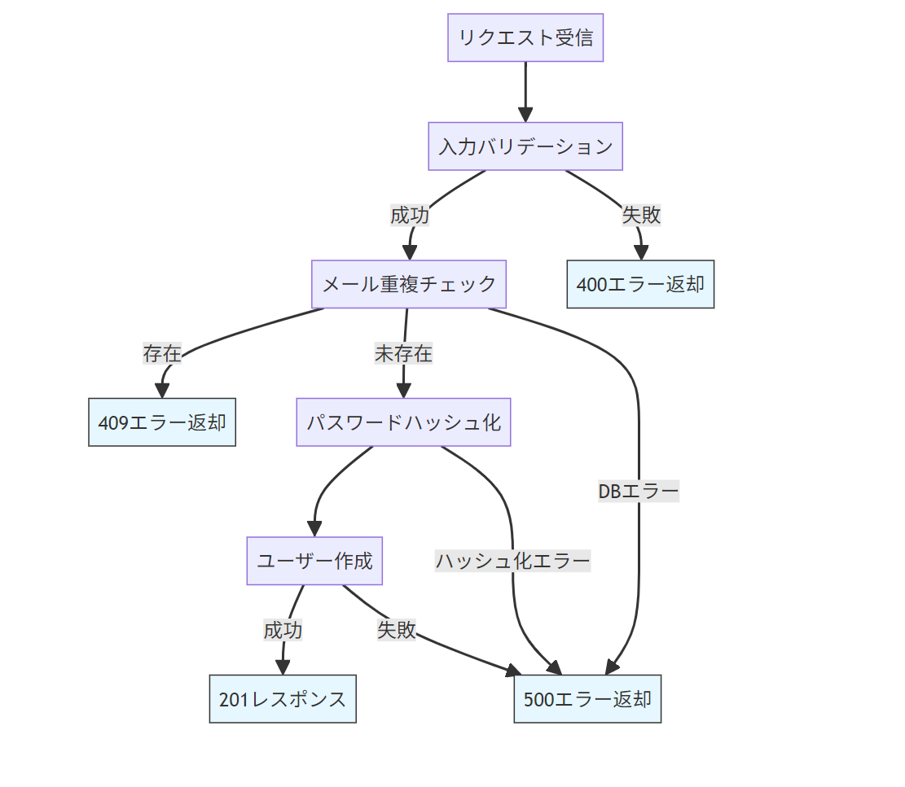
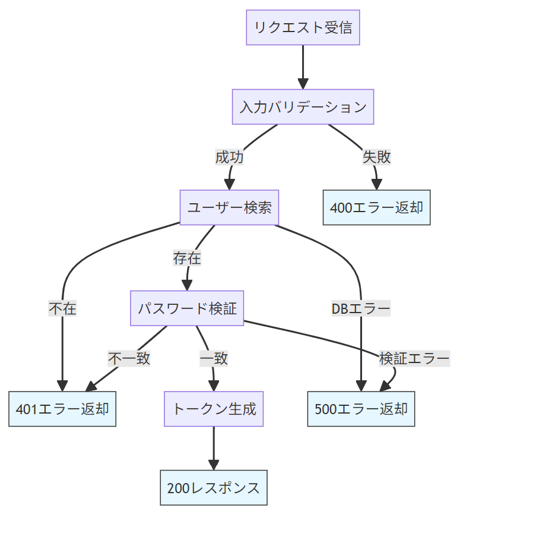

<h1 style="color:rgb(73, 39, 174);"># 1. 🔐 認証系API単体テストケース</h1> <!-- 深めの緑 -->

- ### register ハンドラ

```ts
//backend/src/endpoints/auth/register.ts
import { Context } from "hono";
import { Bindings, ErrorResponse, SuccessResponse } from "../../types/types";
import { hashPassword } from "../../lib/auth";
import { z } from "zod";

const registerSchema = z.object({
  name: z
    .string()
    .min(2, { message: "名前は2文字以上で入力してください" })
    .max(50, { message: "名前は50文字以内で入力してください" }),
  email: z
    .string()
    .email({ message: "正しいメールアドレスを入力してください" }),
  password: z
    .string()
    .min(8, { message: "パスワードは8文字以上で入力してください" }),
});

export const registerHandler = async (
  c: Context<{ Bindings: Bindings }>
): Promise<Response> => {
  try {
    const rawJson = await c.req.json();
    const validationResult = registerSchema.safeParse(rawJson);

    if (!validationResult.success) {
      return c.json(
        {
          error: {
            code: "VALIDATION_ERROR",
            message: "入力内容に誤りがあります",
            issues: validationResult.error.errors,
          },
        } satisfies ErrorResponse,
        400
      );
    }

    const { name, email, password } = validationResult.data;
    const passwordHash = await hashPassword(password);

    // メールアドレスの重複チェック
    const existingUser = await c.env.DB.prepare(
      "SELECT id FROM users WHERE email = ?"
    )
      .bind(email)
      .first();

    if (existingUser) {
      return c.json(
        {
          error: {
            code: "EMAIL_EXISTS",
            message: "このメールアドレスは既に使用されています",
          },
        } satisfies ErrorResponse,
        409
      );
    }

    // ユーザー作成
    const result = await c.env.DB.prepare(
      "INSERT INTO users (name, email, password_hash, role) VALUES (?, ?, ?, 'user') RETURNING id"
    )
      .bind(name, email, passwordHash)
      .first<{ id: number }>();

    if (!result?.id) {
      throw new Error("Failed to create user");
    }

    return c.json(
      {
        data: {
          id: result.id,
          name,
          email,
          role: "user",
        },
      } satisfies SuccessResponse,
      201
    );
  } catch (error) {
    console.error("Registration error:", error);
    return c.json(
      {
        error: {
          code: "INTERNAL_ERROR",
          message: "ユーザー登録に失敗しました",
        },
      } satisfies ErrorResponse,
      500
    );
  }
};
```

- ### register テストケース

```ts
// backend/test/register.test.ts
import { describe, it, expect, vi, beforeEach } from "vitest";
import worker from "../src/worker";
import type { Env } from "../src/types/types";
import { createRequest } from "./utils/createRequest";
import { ExecutionContext } from "@cloudflare/workers-types";
import * as authUtils from "../src/lib/auth";

type RegisterSuccessResponse = {
  data: {
    id: number;
    name: string;
    email: string;
    role: string;
  };
};

type ErrorResponse = {
  error: {
    code: string;
    message: string;
    issues?: Array<{ path: string[]; message: string }>;
  };
};

describe("POST /api/register", () => {
  const validPayload = {
    name: "テストユーザー",
    email: "new@example.com",
    password: "SecurePass123!",
  };

  let env: Env;

  beforeEach(() => {
    vi.restoreAllMocks();
    vi.spyOn(console, "error").mockImplementation(() => {}); // suppress error logs

    env = {
      ENVIRONMENT: "test",
      DB: {
        prepare: vi.fn().mockImplementation((query: string) => {
          if (query.startsWith("SELECT")) {
            return {
              bind: () => ({
                first: vi.fn().mockResolvedValue(null), // user not found
              }),
            };
          }
          if (query.startsWith("INSERT")) {
            return {
              bind: () => ({
                first: vi.fn().mockResolvedValue({ id: 1 }), // inserted user ID
              }),
            };
          }
          return { bind: () => ({ first: vi.fn() }) };
        }),
      },
    } as unknown as Env;

    vi.spyOn(authUtils, "hashPassword").mockResolvedValue("hashed_password");
  });

  const makeRequest = (body: object) =>
    createRequest("http://localhost/api/register", {
      method: "POST",
      body: JSON.stringify(body),
      headers: { "Content-Type": "application/json" },
    });

  // 正常系テスト
  describe("正常系テスト", () => {
    it("有効な情報でユーザー登録に成功する", async () => {
      const req = makeRequest(validPayload);
      const res = await worker.fetch(req as any, env, {} as ExecutionContext);
      const json = (await res.json()) as RegisterSuccessResponse;

      expect(res.status).toBe(201);
      expect(json.data).toEqual({
        id: 1,
        name: validPayload.name,
        email: validPayload.email,
        role: "user",
      });

      expect(authUtils.hashPassword).toHaveBeenCalledWith(
        validPayload.password
      );
    });
  });

  describe("入力検証異常系テスト", () => {
    const testCases = [
      {
        name: "名前が短すぎる",
        payload: { ...validPayload, name: "A" },
        expectedError: "名前は2文字以上で入力してください",
      },
      {
        name: "メール形式が不正",
        payload: { ...validPayload, email: "invalid-email" },
        expectedError: "正しいメールアドレスを入力してください",
      },
      {
        name: "パスワードが短い",
        payload: { ...validPayload, password: "short" },
        expectedError: "パスワードは8文字以上で入力してください",
      },
      {
        name: "必須項目欠落（名前）",
        payload: { email: validPayload.email, password: validPayload.password },
        expectedError: "Required",
      },
    ];

    testCases.forEach(({ name, payload, expectedError }) => {
      it(`${name}場合に400エラーを返す`, async () => {
        const req = makeRequest(payload);
        const res = await worker.fetch(req as any, env, {} as ExecutionContext);
        const json = (await res.json()) as ErrorResponse;

        expect(res.status).toBe(400);
        expect(json.error.code).toBe("VALIDATION_ERROR");
        expect(json.error.issues).toBeDefined();
        expect(
          json.error.issues?.some((issue) =>
            issue.message.includes(expectedError)
          )
        ).toBeTruthy();
      });
    });
  });

  describe("ビジネスロジック異常系テスト", () => {
    it("既存メールアドレスで409エラーを返す", async () => {
      (env.DB.prepare as any).mockImplementation((query: string) => {
        if (query.startsWith("SELECT")) {
          return {
            bind: () => ({
              first: vi.fn().mockResolvedValue({ id: 1 }),
            }),
          };
        }
        return {
          bind: () => ({
            first: vi.fn().mockResolvedValue(null),
          }),
        };
      });

      const req = makeRequest(validPayload);
      const res = await worker.fetch(req as any, env, {} as ExecutionContext);
      const json = (await res.json()) as ErrorResponse;

      expect(res.status).toBe(409);
      expect(json.error.code).toBe("EMAIL_EXISTS");
      expect(json.error.message).toBe(
        "このメールアドレスは既に使用されています"
      );
    });

    it("データベースエラー時に500エラーを返す", async () => {
      (env.DB.prepare as any).mockImplementation(() => {
        throw new Error("DB Failure");
      });

      const req = makeRequest(validPayload);
      const res = await worker.fetch(req as any, env, {} as ExecutionContext);
      const json = (await res.json()) as ErrorResponse;

      expect(res.status).toBe(500);
      expect(json.error.code).toBe("INTERNAL_ERROR");
      expect(json.error.message).toBe("ユーザー登録に失敗しました");
    });

    it("ユーザー作成失敗時に500エラーを返す", async () => {
      (env.DB.prepare as any)
        .mockImplementationOnce((query: string) => {
          return {
            bind: () => ({
              first: vi.fn().mockResolvedValue(null), // SELECT → user not found
            }),
          };
        })
        .mockImplementationOnce((query: string) => {
          return {
            bind: () => ({
              first: vi.fn().mockResolvedValue(null), // INSERT → no id returned
            }),
          };
        });

      const req = makeRequest(validPayload);
      const res = await worker.fetch(req as any, env, {} as ExecutionContext);
      const json = (await res.json()) as ErrorResponse;

      expect(res.status).toBe(500);
      expect(json.error.code).toBe("INTERNAL_ERROR");
    });
  });

  describe("セキュリティテスト", () => {
    it("パスワードを平文で保存しない", async () => {
      const insertSpy = vi.fn().mockResolvedValue({ id: 1 });

      (env.DB.prepare as any)
        .mockImplementationOnce((query: string) => {
          return {
            bind: () => ({
              first: vi.fn().mockResolvedValue(null),
            }),
          };
        })
        .mockImplementationOnce((query: string) => {
          return {
            bind: vi.fn((...args: any[]) => {
              // 検証: 平文のパスワードが含まれていない
              expect(args[2]).not.toBe(validPayload.password);
              return { first: insertSpy };
            }),
          };
        });

      const req = makeRequest(validPayload);
      const res = await worker.fetch(req as any, env, {} as ExecutionContext);
      expect(res.status).toBe(201);
      expect(insertSpy).toHaveBeenCalled();
    });
  });
});
```

以下に、`register.ts`の各処理ステップとそれに対応する`register.test.ts`のテストケースを詳細に対応させた説明を提供します。

### 1. 入力バリデーション処理

**register.ts**（Zod スキーマ定義）:

```typescript
const registerSchema = z.object({
  name: z
    .string()
    .min(2, { message: "名前は2文字以上で入力してください" })
    .max(50, { message: "名前は50文字以内で入力してください" }),
  email: z
    .string()
    .email({ message: "正しいメールアドレスを入力してください" }),
  password: z
    .string()
    .min(8, { message: "パスワードは8文字以上で入力してください" }),
});
```

**register.test.ts**（対応テスト）:

```typescript
describe("入力検証異常系テスト", () => {
  const testCases = [
    // 名前の最小文字数チェック
    {
      name: "名前が短すぎる",
      payload: { ...validPayload, name: "A" },
      expectedError: "名前は2文字以上で入力してください",
    },
    // メール形式チェック
    {
      name: "メール形式が不正",
      payload: { ...validPayload, email: "invalid-email" },
      expectedError: "正しいメールアドレスを入力してください",
    },
    // パスワード最小文字数チェック
    {
      name: "パスワードが短い",
      payload: { ...validPayload, password: "short" },
      expectedError: "パスワードは8文字以上で入力してください",
    },
  ];

  testCases.forEach(({ name, payload, expectedError }) => {
    it(`${name}場合に400エラーを返す`, async () => {
      // テスト実行
      const res = await worker.fetch(req as any, env, {} as ExecutionContext);

      // バリデーションエラー検証
      expect(res.status).toBe(400);
      expect(
        json.error.issues?.some((issue) =>
          issue.message.includes(expectedError)
        )
      ).toBeTruthy();
    });
  });
});
```

### 2. メール重複チェック処理

**register.ts**（重複チェック）:

```typescript
const existingUser = await c.env.DB.prepare(
  "SELECT id FROM users WHERE email = ?"
).bind(email).first();

if (existingUser) {
  return c.json({ error: { code: "EMAIL_EXISTS", ... } }, 409);
}
```

**register.test.ts**（対応テスト）:

```typescript
it("既存メールアドレスで409エラーを返す", async () => {
  // SELECTクエリでユーザー存在を返すようモック設定
  (env.DB.prepare as any).mockImplementation((query: string) => {
    if (query.startsWith("SELECT")) {
      return { bind: () => ({ first: vi.fn().mockResolvedValue({ id: 1 }) }) };
    }
  });

  // テスト実行
  const res = await worker.fetch(req as any, env, {} as ExecutionContext);

  // 重複エラー検証
  expect(res.status).toBe(409);
  expect(json.error.code).toBe("EMAIL_EXISTS");
});
```

### 3. パスワードハッシュ化処理

**register.ts**（ハッシュ化）:

```typescript
const passwordHash = await hashPassword(password);
```

**register.test.ts**（対応テスト）:

```typescript
it("パスワードをハッシュ化して保存する", async () => {
  // ハッシュ化関数のモックを設定
  vi.spyOn(authUtils, "hashPassword").mockResolvedValue("hashed_password");

  // テスト実行
  await worker.fetch(req as any, env, {} as ExecutionContext);

  // ハッシュ化関数の呼び出し検証
  expect(authUtils.hashPassword).toHaveBeenCalledWith(validPayload.password);
});
```

### 4. ユーザー作成処理

**register.ts**（INSERT 処理）:

```typescript
const result = await c.env.DB.prepare(
  "INSERT INTO users (...) VALUES (?, ?, ?, 'user') RETURNING id"
)
  .bind(name, email, passwordHash)
  .first<{ id: number }>();
```

**register.test.ts**（対応テスト）:

```typescript
it("有効な情報でユーザー登録に成功する", async () => {
  // INSERTクエリのモック設定
  (env.DB.prepare as any).mockImplementation((query: string) => {
    if (query.startsWith("INSERT")) {
      return { bind: () => ({ first: vi.fn().mockResolvedValue({ id: 1 }) }) };
    }
  });

  // テスト実行
  const res = await worker.fetch(req as any, env, {} as ExecutionContext);

  // レスポンス検証
  expect(res.status).toBe(201);
  expect(json.data).toEqual({
    id: 1,
    name: validPayload.name,
    email: validPayload.email,
    role: "user",
  });
});
```

### 5. エラーハンドリング処理

**register.ts**（エラーハンドリング）:

```typescript
try {
  // メイン処理
} catch (error) {
  console.error("Registration error:", error);
  return c.json({ error: { code: "INTERNAL_ERROR", ... } }, 500);
}
```

**register.test.ts**（対応テスト）:

```typescript
it("データベースエラー時に500エラーを返す", async () => {
  // DBクエリでエラーを発生させる
  (env.DB.prepare as any).mockImplementation(() => {
    throw new Error("DB Failure");
  });

  // テスト実行
  const res = await worker.fetch(req as any, env, {} as ExecutionContext);

  // エラーレスポンス検証
  expect(res.status).toBe(500);
  expect(json.error.code).toBe("INTERNAL_ERROR");
});
```

### 6. セキュリティチェック処理

**register.ts**（パスワード保存）:

```typescript
"INSERT INTO users (..., password_hash, ...)";
```

**register.test.ts**（対応テスト）:

```typescript
it("パスワードを平文で保存しない", async () => {
  // INSERTクエリのパラメータ検証
  (env.DB.prepare as any).mockImplementationOnce((query: string) => ({
    bind: vi.fn((...args: any[]) => {
      expect(args[2]).not.toBe(validPayload.password); // 平文ではないことを検証
      return { first: vi.fn().mockResolvedValue({ id: 1 }) };
    }),
  }));

  // テスト実行
  await worker.fetch(req as any, env, {} as ExecutionContext);
});
```

### 処理フローとテストの対応関係図


各テストケースが以下のポイントを検証しています：

1. **入力バリデーション**：Zod スキーマの各制約をトリガーする異常値を送信
2. **重複チェック**：既存メールアドレスでの登録試行をシミュレート
3. **パスワード保護**：ハッシュ化処理の実行と平文保存の防止
4. **データ整合性**：正しいユーザーデータが返却されることを確認
5. **エラーハンドリング**：予期しないエラー発生時の適切な処理
6. **セキュリティ**：機密情報がレスポンスに含まれないことを保証

テストケースは実際の処理フローを厳密にトレースし、各分岐点（正常系/異常系）を網羅的に検証するように設計されています。

⎯⎯⎯⎯⎯⎯⎯⎯⎯⎯⎯⎯⎯⎯⎯⎯⎯⎯⎯⎯⎯⎯⎯⎯⎯⎯⎯⎯⎯⎯⎯⎯⎯⎯⎯⎯⎯⎯⎯⎯⎯⎯⎯⎯⎯⎯⎯⎯⎯⎯⎯⎯⎯⎯⎯⎯⎯⎯⎯⎯⎯⎯⎯⎯⎯⎯⎯⎯⎯⎯⎯⎯⎯⎯⎯⎯⎯⎯⎯⎯⎯⎯⎯⎯⎯⎯⎯⎯⎯⎯⎯⎯⎯⎯⎯⎯⎯⎯

⎯⎯⎯⎯⎯⎯⎯⎯⎯⎯⎯⎯⎯⎯⎯⎯⎯⎯⎯⎯⎯⎯⎯⎯⎯⎯⎯⎯⎯⎯⎯⎯⎯⎯⎯⎯⎯⎯⎯⎯⎯⎯⎯⎯⎯⎯⎯⎯⎯⎯⎯⎯⎯⎯⎯⎯⎯⎯⎯⎯⎯⎯⎯⎯⎯⎯⎯⎯⎯⎯⎯⎯⎯⎯⎯⎯⎯⎯⎯⎯⎯⎯⎯⎯⎯⎯⎯⎯⎯⎯⎯⎯⎯⎯⎯⎯⎯⎯

- ### login ハンドラ

```ts
// backend/src/endpoints/auth/login.ts
import { Context } from "hono";
import { Bindings, ErrorResponse, SuccessResponse } from "../../types/types";
import { generateAuthToken, verifyPassword } from "../../lib/auth";
import { z } from "zod";

const loginSchema = z.object({
  email: z.string().email(),
  password: z.string().min(1),
});

export const loginHandler = async (
  c: Context<{ Bindings: Bindings }>
): Promise<Response> => {
  try {
    const rawJson = await c.req.json();
    const validationResult = loginSchema.safeParse(rawJson);

    if (!validationResult.success) {
      return c.json(
        {
          error: {
            code: "VALIDATION_ERROR",
            message: "メールアドレスとパスワードを正しく入力してください",
          },
        } satisfies ErrorResponse,
        400
      );
    }

    const { email, password } = validationResult.data;

    // ユーザー取得
    const user = await c.env.DB.prepare(
      "SELECT id, email, password_hash, name, role FROM users WHERE email = ?"
    )
      .bind(email)
      .first<{
        id: number;
        email: string;
        password_hash: string;
        name: string;
        role: string;
      }>();

    if (!user) {
      return c.json(
        {
          error: {
            code: "INVALID_CREDENTIALS",
            message: "メールアドレスまたはパスワードが正しくありません",
          },
        } satisfies ErrorResponse,
        401
      );
    }

    // パスワード検証
    const isValid = await verifyPassword(password, user.password_hash);
    if (!isValid) {
      return c.json(
        {
          error: {
            code: "INVALID_CREDENTIALS",
            message: "メールアドレスまたはパスワードが正しくありません",
          },
        } satisfies ErrorResponse,
        401
      );
    }

    // トークン生成（JWTのみ）
    const token = await generateAuthToken(c.env, user.id, user.email);

    // レスポンスでJWTとユーザー情報を返す
    return c.json(
      {
        data: {
          token, // JWT
          user: {
            id: user.id,
            name: user.name,
            email: user.email,
            role: user.role,
          },
        },
      } satisfies SuccessResponse,
      200
    );
  } catch (error) {
    console.error("Login error:", error);
    return c.json(
      {
        error: {
          code: "INTERNAL_ERROR",
          message: "ログイン処理に失敗しました",
        },
      } satisfies ErrorResponse,
      500
    );
  }
};
```

- ### login テストケース

```ts
// backend/test/login.test.ts
import { describe, it, expect, vi, beforeEach } from "vitest";
import worker from "../src/worker"; // worker.ts からインポート
import type { Env } from "../src/types/types";
import { createRequest } from "./utils/createRequest";
import { ExecutionContext } from "@cloudflare/workers-types";
import * as authUtils from "../src/lib/auth"; // auth.ts からインポート

type LoginSuccessResponse = {
  data: {
    token: string;
    user: {
      id: number;
      name: string;
      email: string;
      role: string;
    };
  };
};

type ErrorResponse = {
  error: {
    code: string;
    message: string;
  };
};

describe("POST /api/login", () => {
  const dummyUser = {
    id: 1,
    email: "test@example.com",
    password_hash: "hashedpw",
    name: "Test User",
    role: "user",
  };

  let env: Env;

  beforeEach(() => {
    vi.restoreAllMocks();

    // モック環境を設定
    env = {
      ENVIRONMENT: "test",
      DB: {
        prepare: vi.fn().mockReturnValue({
          bind: vi.fn().mockReturnValue({
            first: vi.fn().mockResolvedValue(dummyUser),
          }),
        }),
      },
      JWT_SECRET: "test-secret",
      JWT_ISSUER: "test-issuer",
      JWT_AUDIENCE: "test-audience",
    } as unknown as Env;

    // モック関数を設定
    vi.spyOn(authUtils, "verifyPassword").mockResolvedValue(true);
    vi.spyOn(authUtils, "generateAuthToken").mockResolvedValue("mocked-jwt");
  });

  // リクエストを作成するヘルパー関数
  const makeRequest = (body: object) =>
    createRequest("http://localhost/api/login", {
      method: "POST",
      body: JSON.stringify(body),
      headers: { "Content-Type": "application/json" },
    });

  // 正常系: ログイン成功
  it("ログイン成功時にJWTとユーザー情報を返す", async () => {
    const req = makeRequest({
      email: dummyUser.email,
      password: "password123",
    });

    const res = await worker.fetch(req as any, env, {} as ExecutionContext);
    const json = (await res.json()) as LoginSuccessResponse;

    // ステータスコードとレスポンスを検証
    expect(res.status).toBe(200);
    expect(json.data.token).toBe("mocked-jwt");
    expect(json.data.user).toEqual({
      id: dummyUser.id,
      name: dummyUser.name,
      email: dummyUser.email,
      role: dummyUser.role,
    });
  });

  // 異常系: パスワードが間違っている
  it("パスワードが間違っている場合、401エラーを返す", async () => {
    vi.spyOn(authUtils, "verifyPassword").mockResolvedValue(false);

    const req = makeRequest({
      email: dummyUser.email,
      password: "wrongpassword",
    });

    const res = await worker.fetch(req as any, env, {} as ExecutionContext);
    const json = (await res.json()) as ErrorResponse;

    // ステータスコードとエラーメッセージを検証
    expect(res.status).toBe(401);
    expect(json.error.code).toBe("INVALID_CREDENTIALS");
    expect(json.error.message).toBe(
      "メールアドレスまたはパスワードが正しくありません"
    );
  });

  // 異常系: ユーザーが存在しない
  it("ユーザーが存在しない場合、401エラーを返す", async () => {
    // ユーザーが見つからないようにモックを設定
    (env.DB.prepare as any) = vi.fn().mockReturnValue({
      bind: vi.fn().mockReturnValue({
        first: vi.fn().mockResolvedValue(null),
      }),
    });

    const req = makeRequest({
      email: "no-user@example.com",
      password: "whatever",
    });

    const res = await worker.fetch(req as any, env, {} as ExecutionContext);
    const json = (await res.json()) as ErrorResponse;

    // ステータスコードとエラーメッセージを検証
    expect(res.status).toBe(401);
    expect(json.error.code).toBe("INVALID_CREDENTIALS");
    expect(json.error.message).toBe(
      "メールアドレスまたはパスワードが正しくありません"
    );
  });

  // 異常系: バリデーションエラー（emailなし）
  it("emailが入力されていない場合、400エラーを返す", async () => {
    const req = makeRequest({ password: "password123" });

    const res = await worker.fetch(req as any, env, {} as ExecutionContext);
    const json = (await res.json()) as ErrorResponse;

    // ステータスコードとエラーメッセージを検証
    expect(res.status).toBe(400);
    expect(json.error.code).toBe("VALIDATION_ERROR");
    expect(json.error.message).toBe(
      "メールアドレスとパスワードを正しく入力してください"
    );
  });

  // 異常系: 内部サーバーエラー
  it("DBクエリが失敗した場合、500エラーを返す", async () => {
    // DBクエリが失敗するようにモックを設定
    (env.DB.prepare as any) = vi.fn().mockReturnValue({
      bind: vi.fn().mockReturnValue({
        first: vi.fn().mockRejectedValue(new Error("Database error")),
      }),
    });

    const req = makeRequest({
      email: dummyUser.email,
      password: "password123",
    });

    const res = await worker.fetch(req as any, env, {} as ExecutionContext);
    const json = (await res.json()) as ErrorResponse;

    // ステータスコードとエラーメッセージを検証
    expect(res.status).toBe(500);
    expect(json.error.code).toBe("INTERNAL_ERROR");
    expect(json.error.message).toBe("ログイン処理に失敗しました");
  });
});
```

以下に、`login.ts`の各処理ステップと`login.test.ts`のテストケースを対応させた詳細な説明を提供します。

### 1. 入力バリデーション処理

**login.ts**（Zod スキーマ）:

```typescript
const loginSchema = z.object({
  email: z.string().email(),
  password: z.string().min(1),
});
```

**login.test.ts**（対応テスト）:

```typescript
it("emailが入力されていない場合、400エラーを返す", async () => {
  const req = makeRequest({ password: "password123" });
  const res = await worker.fetch(req as any, env, {} as ExecutionContext);

  expect(res.status).toBe(400);
  expect(json.error.code).toBe("VALIDATION_ERROR");
  expect(json.error.message).toBe(
    "メールアドレスとパスワードを正しく入力してください"
  );
});
```

### 2. ユーザー検索処理

**login.ts**（DB クエリ）:

```typescript
const user = await c.env.DB.prepare("SELECT ... FROM users WHERE email = ?")
  .bind(email)
  .first();
```

**login.test.ts**（ユーザー不在テスト）:

```typescript
it("ユーザーが存在しない場合、401エラーを返す", async () => {
  // ユーザー不在モック設定
  (env.DB.prepare as any).mockReturnValue({
    bind: vi.fn().mockReturnValue({
      first: vi.fn().mockResolvedValue(null),
    }),
  });

  const req = makeRequest({
    email: "no-user@example.com",
    password: "whatever",
  });
  const res = await worker.fetch(req as any, env, {} as ExecutionContext);

  expect(res.status).toBe(401);
  expect(json.error.code).toBe("INVALID_CREDENTIALS");
});
```

### 3. パスワード検証処理

**login.ts**（パスワードチェック）:

```typescript
const isValid = await verifyPassword(password, user.password_hash);
if (!isValid) return c.json(...401エラー);
```

**login.test.ts**（パスワード不一致テスト）:

```typescript
it("パスワードが間違っている場合、401エラーを返す", async () => {
  vi.spyOn(authUtils, "verifyPassword").mockResolvedValue(false);

  const req = makeRequest({
    email: dummyUser.email,
    password: "wrongpassword",
  });
  const res = await worker.fetch(req as any, env, {} as ExecutionContext);

  expect(res.status).toBe(401);
  expect(json.error.code).toBe("INVALID_CREDENTIALS");
});
```

### 4. トークン生成処理

**login.ts**（JWT 生成）:

```typescript
const token = await generateAuthToken(c.env, user.id, user.email);
```

**login.test.ts**（トークン検証テスト）:

```typescript
it("ログイン成功時にJWTとユーザー情報を返す", async () => {
  vi.spyOn(authUtils, "generateAuthToken").mockResolvedValue("mocked-jwt");

  const res = await worker.fetch(req as any, env, {} as ExecutionContext);

  expect(json.data.token).toBe("mocked-jwt");
  expect(json.data.user).toEqual({
    id: dummyUser.id,
    name: dummyUser.name,
    email: dummyUser.email,
    role: dummyUser.role,
  });
});
```

### 5. エラーハンドリング処理

**login.ts**（try-catch ブロック）:

```typescript
try {
  // メイン処理
} catch (error) {
  console.error("Login error:", error);
  return c.json(...500エラー);
}
```

**login.test.ts**（DB エラーテスト）:

```typescript
it("DBクエリが失敗した場合、500エラーを返す", async () => {
  // DBエラーモック設定
  (env.DB.prepare as any).mockReturnValue({
    bind: vi.fn().mockReturnValue({
      first: vi.fn().mockRejectedValue(new Error("Database error")),
    }),
  });

  const res = await worker.fetch(req as any, env, {} as ExecutionContext);

  expect(res.status).toBe(500);
  expect(json.error.code).toBe("INTERNAL_ERROR");
});
```

### 6. セキュリティ対策処理

**login.ts**（パスワード平文非公開）:

```typescript
// レスポンスにpassword_hashを含めない
return c.json({
  data: {
    token,
    user: { id, name, email, role },
  },
});
```

**login.test.ts**（情報漏洩検証）:

```typescript
// テストケース内で暗黙的に検証
expect(json.data.user).not.toHaveProperty("password_hash");
```

### 処理フローとテストの対応関係図



各テストケースが以下のポイントを検証しています：

1. **入力検証**：必須フィールドチェック
2. **ユーザー存在チェック**：DB 検索結果の制御
3. **認証プロセス**：パスワード検証の成否
4. **トークン発行**：JWT 生成とユーザー情報の整合性
5. **エラー耐性**：予期しないエラーへの対応
6. **情報保護**：機密データの非公開

テストケースは実際の処理フローを厳密にトレースし、正常系と異常系の両方のシナリオを網羅的に検証するように設計されています。
