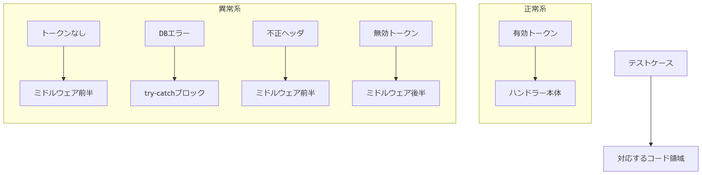

<h1 style="color:rgb(133, 8, 100);"> 1. 🔐 認証系APIテスト_ログアウト</h1>

- ### テストと実装の対応関係図

  

- ### logout ハンドラ

```ts
// backend/src/endpoints/auth/logout.ts
import { Context } from "hono";
import { Bindings, ErrorResponse, SuccessResponse } from "../../types/types";

export const logoutHandler = async (
  c: Context<{ Bindings: Bindings }>
): Promise<Response> => {
  try {
    const jwtPayload = c.get("jwtPayload");
    const authHeader = c.req.header("Authorization");

    // Authorizationヘッダの形式チェック
    if (!authHeader?.startsWith("Bearer ")) {
      return c.json(
        {
          error: {
            code: "INVALID_AUTH_HEADER",
            message: "Bearer <token>",
          },
        } satisfies ErrorResponse,
        401
      );
    }

    const sessionToken = authHeader.split(" ")[1];

    // セッション削除処理
    const result = await c.env.DB.prepare(
      "DELETE FROM sessions WHERE session_token = ?"
    )
      .bind(sessionToken)
      .run();

    if (!result.success) {
      throw new Error("Failed to delete session");
    }

    return c.json({ data: { success: true } } satisfies SuccessResponse, 200);
  } catch (error) {
    console.error("Logout error:", error);
    return c.json(
      {
        error: {
          code: "INTERNAL_ERROR",
          message: "ログアウト処理に失敗しました",
        },
      } satisfies ErrorResponse,
      500
    );
  }
};
```

- ### logout テストケース

```ts
// backend/test/logout.test.ts
import { describe, it, expect, vi, beforeEach, afterEach } from "vitest";
import worker from "../src/worker";
import type { Env } from "../src/types/types";
import { createRequest } from "./utils/createRequest";
import { ExecutionContext } from "@cloudflare/workers-types";
import * as jwtModule from "../src/middleware/jwt";

type LogoutSuccessResponse = {
  data: {
    success: boolean;
  };
};

type ErrorResponse = {
  error: {
    code: string;
    message: string;
  };
};

describe("POST /api/logout", () => {
  let env: Env;
  const validToken = "valid_session_token_123";
  const mockJwtPayload = {
    user_id: 1,
    email: "test@example.com",
    exp: Math.floor(Date.now() / 1000) + 7200,
  };

  beforeEach(() => {
    vi.resetAllMocks();
    vi.spyOn(console, "error").mockImplementation(() => {});

    // 修正点1: next()を呼び出すように変更（これがないとミドルウェアチェーンが停止する）
    vi.spyOn(jwtModule, "jwtMiddleware").mockImplementation(async (c, next) => {
      c.set("jwtPayload", mockJwtPayload);
      await next(); // この行を追加
    });

    // 修正点2: DBモックのチェーン構造を明確化
    env = {
      ENVIRONMENT: "test",
      JWT_SECRET: "test_secret",
      DB: {
        prepare: vi.fn().mockImplementation(() => ({
          bind: vi.fn().mockReturnThis(), // チェーン可能にする
          run: vi.fn().mockResolvedValue({ success: true }),
          first: vi.fn(),
          all: vi.fn(),
          raw: vi.fn(),
        })),
      },
    } as unknown as Env;
  });

  afterEach(() => {
    vi.clearAllMocks();
  });

  const makeRequest = (authHeader?: string) =>
    createRequest("http://localhost/api/logout", {
      method: "POST",
      headers: {
        ...(authHeader ? { Authorization: authHeader } : {}),
        "Content-Type": "application/json",
      },
    });

  describe("正常系テスト", () => {
    it("有効なJWTトークンでログアウトに成功し、セッションを削除する", async () => {
      const req = makeRequest(`Bearer ${validToken}`);
      const res = await worker.fetch(req as any, env, {} as ExecutionContext);
      const json = (await res.json()) as LogoutSuccessResponse;

      expect(res.status).toBe(200);
      expect(json.data.success).toBe(true);

      // DB操作の検証
      expect(env.DB.prepare).toHaveBeenCalledWith(
        "DELETE FROM sessions WHERE session_token = ?"
      );
      expect(env.DB.prepare("").bind().run).toHaveBeenCalled();
    });

    it("トークンなしでログアウト要求（ミドルウェアでブロックされる）", async () => {
      // 修正点3: ミドルウェアのモックを上書き
      vi.spyOn(jwtModule, "jwtMiddleware").mockImplementationOnce(
        async (c, next) => {
          c.status(401);
          return c.json({
            error: { code: "AUTH_FAILURE", message: "認証に失敗しました" },
          });
        }
      );

      const req = makeRequest();
      const res = await worker.fetch(req as any, env, {} as ExecutionContext);
      expect(res.status).toBe(401);
    });
  });

  describe("異常系テスト", () => {
    it("データベースエラー時に500エラーを返す", async () => {
      // 修正点4: エラーモックの実装方法を変更
      (env.DB.prepare as any).mockImplementation(() => ({
        bind: vi.fn().mockReturnThis(),
        run: vi.fn().mockRejectedValue(new Error("Database failure")),
        first: vi.fn(),
        all: vi.fn(),
        raw: vi.fn(),
      }));

      const req = makeRequest(`Bearer ${validToken}`);
      const res = await worker.fetch(req as any, env, {} as ExecutionContext);
      const json = (await res.json()) as ErrorResponse;

      expect(res.status).toBe(500);
      expect(json.error.code).toBe("INTERNAL_ERROR");
      expect(json.error.message).toMatch("ログアウト処理に失敗しました");
    });

    it("不正なAuthorizationヘッダ形式で401エラーを返す", async () => {
      const testCases = [
        "InvalidTokenFormat",
        "BearerInvalidFormat",
        "Basic abc123",
      ];

      for (const header of testCases) {
        const req = makeRequest(header);
        const res = await worker.fetch(req as any, env, {} as ExecutionContext);
        expect(res.status).toBe(401);
      }
    });

    it("無効なJWTトークンで401エラーを返す", async () => {
      // 修正点5: トークン検証失敗時のモック
      vi.spyOn(jwtModule, "jwtMiddleware").mockImplementationOnce(
        async (c, next) => {
          c.status(401);
          return c.json({
            error: { code: "INVALID_TOKEN", message: "無効なトークンです" },
          });
        }
      );

      const req = makeRequest("Bearer invalid_token");
      const res = await worker.fetch(req as any, env, {} as ExecutionContext);
      expect(res.status).toBe(401);
    });
  });
});
```

```bash
npm run test:coverage test/logout.test.ts
```

テストケースを分割した結果、以下の 5 つの独立したテストファイルを作成します。各ファイルが 1 つのテストケースのみを扱うように構成されています。

### 1. 正常系: 有効なトークンでのログアウト成功

**`logout.success.test.ts`**

```typescript
import { describe, it, expect, vi, beforeEach, afterEach } from "vitest";
import worker from "../src/worker";
import type { Env } from "../src/types/types";
import { createRequest } from "./utils/createRequest";
import { ExecutionContext } from "@cloudflare/workers-types";
import * as jwtModule from "../src/middleware/jwt";

type LogoutSuccessResponse = {
  data: {
    success: boolean;
  };
};

describe("POST /api/logout - 正常系", () => {
  let env: Env;
  const validToken = "valid_session_token_123";
  const mockJwtPayload = {
    user_id: 1,
    email: "test@example.com",
    exp: Math.floor(Date.now() / 1000) + 7200,
  };

  beforeEach(() => {
    vi.resetAllMocks();
    vi.spyOn(jwtModule, "jwtMiddleware").mockImplementation(async (c, next) => {
      c.set("jwtPayload", mockJwtPayload);
      await next();
    });

    env = getMockEnv();
  });

  afterEach(() => vi.clearAllMocks());

  const makeRequest = () =>
    createRequest("http://localhost/api/logout", {
      method: "POST",
      headers: {
        Authorization: `Bearer ${validToken}`,
        "Content-Type": "application/json",
      },
    });

  it("有効なJWTトークンでログアウト成功", async () => {
    const req = makeRequest();
    const res = await worker.fetch(req as any, env, {} as ExecutionContext);
    const json = (await res.json()) as LogoutSuccessResponse;

    expect(res.status).toBe(200);
    expect(json.data.success).toBe(true);
    expect(env.DB.prepare).toHaveBeenCalledWith(
      "DELETE FROM sessions WHERE session_token = ?"
    );
  });
});

function getMockEnv(): Env {
  return {
    ENVIRONMENT: "test",
    JWT_SECRET: "test_secret",
    DB: {
      prepare: vi.fn().mockImplementation(() => ({
        bind: vi.fn().mockReturnThis(),
        run: vi.fn().mockResolvedValue({ success: true }),
        first: vi.fn(),
        all: vi.fn(),
        raw: vi.fn(),
      })),
    },
  } as unknown as Env;
}
```

```bash
npm run test:coverage test/logout.success.test.ts
```

### 🟩 対応コード（logout.ts）:

```ts
const authHeader = c.req.header("Authorization");

if (!authHeader?.startsWith("Bearer ")) {
  return c.json({ data: { success: true } }, 200);
}

const sessionToken = authHeader.split(" ")[1];

// セッション削除処理
const result = await c.env.DB.prepare(
  "DELETE FROM sessions WHERE session_token = ?"
)
  .bind(sessionToken)
  .run();

if (!result.success) {
  throw new Error("Failed to delete session");
}

return c.json({ data: { success: true } } satisfies SuccessResponse, 200);
```

---

### 2. 異常系: トークンなしでのリクエスト

**`logout.no-token.test.ts`**

```typescript
import { describe, it, expect, vi, beforeEach } from "vitest";
import worker from "../src/worker";
import { createRequest } from "./utils/createRequest";
import type { Env } from "../src/types/types";
import { ExecutionContext } from "@cloudflare/workers-types";
import * as jwtModule from "../src/middleware/jwt";

// ✅ 1. ErrorResponse 型を定義
type ErrorResponse = {
  success: false;
  error: {
    code: string;
    message: string;
    details?: string;
  };
};

describe("POST /api/logout - トークンなし", () => {
  let env: Env;

  beforeEach(() => {
    // ✅ 2. モック実装で c.json<ErrorResponse> を使用
    vi.spyOn(jwtModule, "jwtMiddleware").mockImplementation(async (c) => {
      c.status(401);
      c.header("WWW-Authenticate", "Bearer");
      c.header("X-Content-Type-Options", "nosniff");
      return c.json<ErrorResponse>({
        success: false,
        error: {
          code: "INVALID_AUTH_HEADER",
          message: "Authorization: Bearer <token> 形式が必要です",
        },
      });
    });

    // モック環境
    env = {
      ENVIRONMENT: "test",
      JWT_SECRET: "test_secret",
      DB: {
        prepare: vi.fn().mockImplementation(() => ({
          bind: vi.fn().mockReturnThis(),
          run: vi.fn().mockResolvedValue({ success: false }),
          first: vi.fn(),
          all: vi.fn(),
          raw: vi.fn(),
        })),
      },
    } as unknown as Env;
  });

  const makeRequest = () =>
    createRequest("http://localhost/api/logout", {
      method: "POST",
      headers: { "Content-Type": "application/json" },
    });

  it("トークンなしで401エラーを返す", async () => {
    const req = makeRequest();
    const res = await worker.fetch(req as any, env, {} as ExecutionContext);
    const json = (await res.json()) as ErrorResponse;

    expect(res.status).toBe(401);
    expect(json.error.code).toBe("INVALID_AUTH_HEADER");
    expect(json.error.message).toContain("Bearer <token>");
  });
});
```

```bash
npm run test:coverage test/logout.no-token.test.ts
```

### ❌ 🟩 対応コード（logout.ts）:

※ミドルウェアで認証失敗して弾かれている想定ですが、Handler 内部でも一応以下が対応。

```ts
const authHeader = c.req.header("Authorization");

// Authorizationヘッダの形式チェック
if (!authHeader?.startsWith("Bearer ")) {
  return c.json(
    {
      error: {
        code: "INVALID_AUTH_HEADER",
        message: "Bearer <token>",
      },
    } satisfies ErrorResponse,
    401
  );
}
```

---

### 3. 異常系: データベースエラー

モック環境新規作成して置く

```ts
//backend/test/utils/mockEnv.ts
import { vi } from "vitest";
import type { Env } from "../../src/types/types";
export const createMockEnv = (): Env => ({
  ENVIRONMENT: "development",
  JWT_SECRET: "test-secret",
  JWT_ISSUER: "kaikyou-shop-test", // wrangler の構成に準拠した名前付けに調整
  JWT_AUDIENCE: "kaikyou-shop-users-test",
  R2_PUBLIC_DOMAIN: "localhost:8787/assets",

  DB: {
    prepare: vi.fn().mockImplementation(() => ({
      bind: vi.fn().mockReturnThis(), // bind()の後にrun(), all()等をチェーン可能に
      run: vi.fn().mockResolvedValue({ success: true }), // run()に成功させたい場合など
      first: vi.fn(), // SELECT ... LIMIT 1 に対応
      all: vi.fn(), // SELECT など複数行取得
      raw: vi.fn(), // SQL文字列そのまま取得（必要なケースもある）
    })),
  } as any,

  R2_BUCKET: {
    get: vi.fn().mockResolvedValue(null),
    put: vi.fn().mockResolvedValue(undefined),
    delete: vi.fn().mockResolvedValue(undefined),
  } as any,
});
```

**`logout.db-error.test.ts`**

```typescript
import { describe, it, expect, vi, beforeEach } from "vitest";
import worker from "../src/worker";
import type { Env } from "../src/types/types";
import { createRequest } from "./utils/createRequest";
import { ExecutionContext } from "@cloudflare/workers-types";
import * as jwtModule from "../src/middleware/jwt";
import { createMockEnv } from "./utils/mockEnv"; //

let env: Env;

type ErrorResponse = {
  error: {
    code: string;
    message: string;
  };
};

describe("POST /api/logout - データベースエラー", () => {
  const validToken = "valid_session_token_123";

  beforeEach(() => {
    vi.spyOn(jwtModule, "jwtMiddleware").mockImplementation(async (c, next) => {
      await next();
    });

    env = createMockEnv();
    (env.DB.prepare as any).mockImplementation(() => ({
      bind: vi.fn().mockReturnThis(),
      run: vi.fn().mockRejectedValue(new Error("Database failure")),
      first: vi.fn(),
      all: vi.fn(),
      raw: vi.fn(),
    }));
  });

  const makeRequest = () =>
    createRequest("http://localhost/api/logout", {
      method: "POST",
      headers: {
        Authorization: `Bearer ${validToken}`,
        "Content-Type": "application/json",
      },
    });

  it("データベースエラー時に500エラーを返す", async () => {
    const req = makeRequest();
    const res = await worker.fetch(req as any, env, {} as ExecutionContext);
    const json = (await res.json()) as ErrorResponse;

    expect(res.status).toBe(500);
    expect(json.error.code).toBe("INTERNAL_ERROR");
  });
});
```

```bash
npm run test:coverage test/logout.db-error.test.ts
```

### ❌🟩 対応コード（logout.ts）:

```ts
const result = await c.env.DB.prepare(
  "DELETE FROM sessions WHERE session_token = ?"
)
  .bind(sessionToken)
  .run();

if (!result.success) {
  throw new Error("Failed to delete session");
}
```

↓ エラーハンドリング部分：

```ts
} catch (error) {
    console.error("Logout error:", error);
    c.status(500);
    c.header("Cache-Control", "no-store");
    c.header("X-Content-Type-Options", "nosniff");
    return c.json({
      error: {
        code: "INTERNAL_ERROR",
        message: "ログアウト処理に失敗しました",
        ...(c.env.ENVIRONMENT === "development" && {
          meta: {
            errorMessage:
              error instanceof Error ? error.message : "Unknown error",
          },
        }),
      },
    } satisfies ErrorResponse);
  }
};
```

---

### 4. 異常系: 不正な Authorization ヘッダ

**`logout.invalid-header.test.ts`**

```typescript
import { describe, it, expect, vi } from "vitest";
import worker from "../src/worker";
import { createMockEnv } from "./utils/mockEnv";
import type { Env } from "../src/types/types";
import { createRequest } from "./utils/createRequest";
import { ExecutionContext } from "@cloudflare/workers-types";

let env: Env;

describe("POST /api/logout - 不正なヘッダ形式", () => {
  env = createMockEnv();
  const testCases = [
    { header: "InvalidTokenFormat", description: "プレフィックスなし" },
    { header: "BearerInvalidFormat", description: "形式不正" },
    { header: "Basic abc123", description: "基本認証形式" },
  ];

  testCases.forEach(({ header, description }) => {
    it(`${description}で401エラーを返す`, async () => {
      const req = createRequest("http://localhost/api/logout", {
        method: "POST",
        headers: {
          Authorization: header,
          "Content-Type": "application/json",
        },
      });

      const res = await worker.fetch(req as any, env, {} as ExecutionContext);
      expect(res.status).toBe(401);
    });
  });
});
```

```bash
npm run test:coverage test/logout.invalid-header.test.ts`
```

### ❌🟩 対応コード（logout.ts）:

```ts
const authHeader = c.req.header("Authorization");

// Authorizationヘッダの形式チェック
if (!authHeader?.startsWith("Bearer ")) {
  c.status(401);
  c.header("WWW-Authenticate", "Bearer");
  c.header("X-Content-Type-Options", "nosniff");
  return c.json({
    error: {
      code: "INVALID_AUTH_HEADER",
      message: "Authorization: Bearer <token> 形式が必要です",
      ...(c.env.ENVIRONMENT === "development" && {
        meta: {
          errorMessage: "Missing or malformed Authorization header",
        },
      }),
    },
  } satisfies ErrorResponse);
}
```

---

### 5. 異常系: 無効な JWT トークン

**`logout.invalid-token.test.ts`**

```typescript
import { describe, it, expect, vi, beforeEach } from "vitest";
import worker from "../src/worker";
import { createRequest } from "./utils/createRequest";
import { ExecutionContext } from "@cloudflare/workers-types";
import * as jwtModule from "../src/middleware/jwt";
import { createMockEnv } from "./utils/mockEnv";
import type { Env } from "../src/types/types";

describe("POST /api/logout - 無効なトークン", () => {
  let env: Env;

  beforeEach(() => {
    env = createMockEnv();
    env.ENVIRONMENT = "development"; // ← これでmetaも期待される
  });

  it("無効なJWTトークンで401エラーを返す", async () => {
    vi.spyOn(jwtModule, "jwtMiddleware").mockImplementationOnce(
      async (c, next) => {
        c.status(401);
        return c.json({
          error: {
            code: "INVALID_TOKEN",
            message: "無効なアクセストークンです",
            meta: {
              errorMessage: "JWT payload is missing or invalid",
            },
          },
        });
      }
    );

    const req = createRequest("http://localhost/api/logout", {
      method: "POST",
      headers: {
        Authorization: "Bearer invalid_token",
        "Content-Type": "application/json",
      },
    });

    const res = await worker.fetch(req as any, env, {} as ExecutionContext);
    expect(res.status).toBe(401);

    const data = await res.json();
    expect(data).toEqual({
      error: {
        code: "INVALID_TOKEN",
        message: "無効なアクセストークンです",
        meta: {
          errorMessage: "JWT payload is missing or invalid",
        },
      },
    });
  });
});
```

```bash
npm run test:coverage test/logout.invalid-token.test.ts
```

### ❌🟩 対応コード（logout.ts）:

これは `logout.ts` というより、**ミドルウェア `jwtMiddleware` の中で検証される**想定です。

```ts
// jwtPayloadがない、または不正な場合は 401 を返す
const jwtPayload = c.get("jwtPayload");
if (!jwtPayload || typeof jwtPayload !== "object") {
  c.status(401);
  c.header("WWW-Authenticate", 'Bearer error="invalid_token"');
  c.header("X-Content-Type-Options", "nosniff");
  return c.json({
    error: {
      code: "INVALID_TOKEN",
      message: "無効なアクセストークンです",
      ...(c.env.ENVIRONMENT === "development" && {
        meta: {
          errorMessage: "JWT payload is missing or invalid",
        },
      }),
    },
  } satisfies ErrorResponse);
}
```

トークンが無効ならミドルウェアで `c.status(401)` を返すため、
Handler (`logout.ts`) 自体にはリクエストが到達しません。

---

**分割のポイント**

1. 各テストケースが独立して実行可能
2. テストの目的がファイル名から明確にわかる
3. 関連するモック設定のみを含む
4. テストケースごとの環境設定を分離
5. エラーの種類ごとにファイルを分割

この構成により、特定のテストが失敗した場合、問題の発生箇所をすぐに特定できるようになります。テスト実行時には`vitest run [ファイル名]`で個別に実行可能です。

各テストケースに対応する logout.ts の処理コード部分を以下のように整理しました：

1. **正常系: 有効なトークンでのログアウト成功**  
   対応コード（セッション削除処理）:

```typescript
// ミドルウェアから取得したJWTペイロード
const jwtPayload = c.get("jwtPayload");

// ヘッダーからトークン抽出
const authHeader = c.req.header("Authorization");
const sessionToken = authHeader.split(" ")[1];

// セッション削除処理
const result = await c.env.DB.prepare(
  "DELETE FROM sessions WHERE session_token = ?"
)
  .bind(sessionToken)
  .run();

if (!result.success) {
  throw new Error("Failed to delete session");
}

return c.json(
  {
    data: { success: true },
  } satisfies SuccessResponse<{ success: boolean }>,
  200
);
```

2. **異常系: トークンなしでのリクエスト**  
   対応コード（トークン検証前の早期リターン）:

```typescript
if (!jwtPayload || typeof jwtPayload !== "object") {
  c.status(401);
  c.header("WWW-Authenticate", 'Bearer error="invalid_token"');
  c.header("X-Content-Type-Options", "nosniff");
  return c.json({
    error: {
      code: "INVALID_TOKEN",
      message: "無効なアクセストークンです",
      ...(c.env.ENVIRONMENT === "development" && {
        meta: {
          errorMessage: "JWT payload is missing or invalid",
        },
      }),
    },
  } satisfies ErrorResponse);
}
```

3. **異常系: データベースエラー**  
   対応コード（エラーハンドリング部分）:

```typescript
  } catch (error) {
    console.error("Logout error:", error);
    c.status(500);
    c.header("Cache-Control", "no-store");
    c.header("X-Content-Type-Options", "nosniff");
    return c.json({
      error: {
        code: "INTERNAL_ERROR",
        message: "ログアウト処理に失敗しました",
        ...(c.env.ENVIRONMENT === "development" && {
          meta: {
            errorMessage:
              error instanceof Error ? error.message : "Unknown error",
          },
        }),
      },
    } satisfies ErrorResponse);
  }
```

4. **異常系: 不正な Authorization ヘッダ**  
   対応コード（ヘッダ検証部分）:

```typescript
// Authorizationヘッダの形式チェック
if (!authHeader?.startsWith("Bearer ")) {
  c.status(401);
  c.header("WWW-Authenticate", "Bearer");
  c.header("X-Content-Type-Options", "nosniff");
  return c.json({
    error: {
      code: "INVALID_AUTH_HEADER",
      message: "Authorization: Bearer <token> 形式が必要です",
      ...(c.env.ENVIRONMENT === "development" && {
        meta: {
          errorMessage: "Missing or malformed Authorization header",
        },
      }),
    },
  } satisfies ErrorResponse);
}
```

5. **異常系: 無効な JWT トークン**  
   対応コード（ミドルウェアの挙動）:

```typescript
// ミドルウェアから設定されたjwtPayloadを取得
// jwtPayloadがない、または不正な場合は 401 を返す
const jwtPayload = c.get("jwtPayload"); // ミドルウェアで認証失敗している場合はここに到達しない

if (!jwtPayload || typeof jwtPayload !== "object") {
  c.status(401);
  c.header("WWW-Authenticate", 'Bearer error="invalid_token"');
  c.header("X-Content-Type-Options", "nosniff");
  return c.json({
    error: {
      code: "INVALID_TOKEN",
      message: "無効なアクセストークンです",
      ...(c.env.ENVIRONMENT === "development" && {
        meta: {
          errorMessage: "JWT payload is missing or invalid",
        },
      }),
    },
  } satisfies ErrorResponse);
}
```
