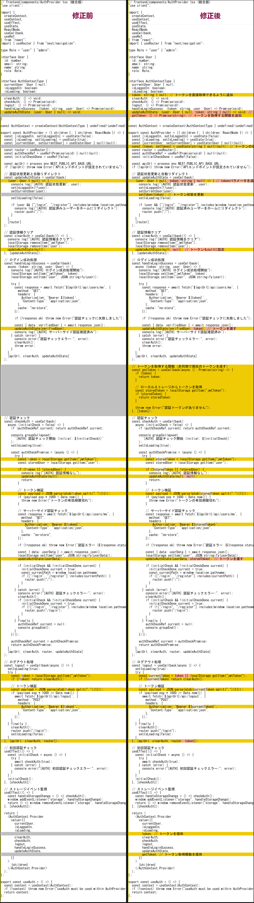

# 状態管理 AuthProvider コンポーネント 7.0 　トークン管理を追加

いままで関連ページのトークン取得方法: localStorage から直接トークンを取得していますが、サーバーサイドレンダリング時には localStorage が存在しない可能性があります。
より安全な方法を考えて useAuth フック内でトークンを管理するように変更しました。

## 修正前後比較図



### 修正版 AuthProvider (frontend/components/AuthProvider.tsx)

```tsx
"use client";

import {
  createContext,
  useContext,
  useEffect,
  useState,
  ReactNode,
  useCallback,
  useRef,
} from "react";
import { useRouter } from "next/navigation";

type Role = "user" | "admin";

interface User {
  id: number;
  email: string;
  name: string;
  role: Role;
}

interface AuthContextType {
  currentUser: User | null;
  isLoggedIn: boolean;
  isLoading: boolean;
  token: string | null; // トークン状態を追加
  clearAuth: () => void;
  checkAuth: () => Promise<void>;
  logout: () => Promise<void>;
  handleLoginSuccess: (token: string, user: User) => Promise<void>;
  updateAuthState: (user: User | null, token: string | null) => void; // token引数を追加
  getToken: () => Promise<string>; // トークン取得関数を追加
}

const AuthContext = createContext<AuthContextType | undefined>(undefined);

export const AuthProvider = ({ children }: { children: ReactNode }) => {
  const [isLoggedIn, setIsLoggedIn] = useState(false);
  const [isLoading, setIsLoading] = useState(true);
  const [currentUser, setCurrentUser] = useState<User | null>(null);
  const [token, setToken] = useState<string | null>(null); // トークン状態を追加
  const router = useRouter();
  const authCheckRef = useRef<Promise<void> | null>(null);
  const initialCheckDone = useRef(false);

  const apiUrl = process.env.NEXT_PUBLIC_API_BASE_URL;
  if (!apiUrl) throw new Error("APIエンドポイントが設定されていません");

  // 認証状態更新と自動リダイレクト
  const updateAuthState = useCallback(
    (user: User | null, tokenString: string | null) => {
      console.log("[AUTH] 認証状態更新", user);
      setIsLoggedIn(!!user);
      setCurrentUser(user);
      setToken(tokenString); // トークン状態を更新
      setIsLoading(false);

      if (user && ["/login", "/register"].includes(window.location.pathname)) {
        console.log("[AUTH] 認証済みユーザーをホームにリダイレクト");
        router.push("/");
      }
    },
    [router]
  );

  // 認証情報クリア
  const clearAuth = useCallback(() => {
    console.log("[AUTH] 認証情報をクリア");
    localStorage.removeItem("jwtToken");
    localStorage.removeItem("user");
    updateAuthState(null, null); // トークンもnullに設定
  }, [updateAuthState]);

  // トークン取得関数 (非同期対応)
  const getToken = useCallback(async (): Promise<string> => {
    if (token) {
      return token;
    }

    const storedToken = localStorage.getItem("jwtToken");
    if (storedToken) {
      return storedToken;
    }

    throw new Error("認証トークンがありません");
  }, [token]);

  // ログイン成功処理
  const handleLoginSuccess = useCallback(
    async (token: string, user: User) => {
      console.log("[AUTH] ログイン成功処理開始");
      localStorage.setItem("jwtToken", token);
      localStorage.setItem("user", JSON.stringify(user));

      try {
        const response = await fetch(`${apiUrl}/api/users/me`, {
          method: "GET",
          headers: {
            Authorization: `Bearer ${token}`,
            "Content-Type": "application/json",
          },
          cache: "no-store",
        });

        if (!response.ok) throw new Error("認証チェックに失敗しました");

        const { data: verifiedUser } = await response.json();
        updateAuthState(verifiedUser, token); // トークンを渡す
        console.log("[AUTH] サーバーサイド認証確認済み");
      } catch (error) {
        console.error("認証チェックエラー:", error);
        clearAuth();
        throw error;
      }
    },
    [apiUrl, clearAuth, updateAuthState]
  );

  // 認証チェック
  const checkAuth = useCallback(
    async (initialCheck = false) => {
      if (authCheckRef.current) return authCheckRef.current;

      console.groupCollapsed(
        `[AUTH] 認証チェック開始 (initial: ${initialCheck})`
      );
      setIsLoading(true);

      const authCheckPromise = (async () => {
        try {
          const storedToken = localStorage.getItem("jwtToken");
          const storedUser = localStorage.getItem("user");

          if (!storedToken || !storedUser) {
            console.log("[AUTH] 認証情報なし");
            updateAuthState(null, null);
            return;
          }

          // トークン検証
          const payload = JSON.parse(atob(storedToken.split(".")[1]));
          if (payload.exp * 1000 < Date.now()) {
            throw new Error("トークンの有効期限切れ");
          }

          // サーバーサイド認証チェック
          const response = await fetch(`${apiUrl}/api/users/me`, {
            method: "GET",
            headers: {
              Authorization: `Bearer ${storedToken}`,
              "Content-Type": "application/json",
            },
            cache: "no-store",
          });

          if (!response.ok) throw new Error(`認証エラー (${response.status})`);

          const { data: userData } = await response.json();
          localStorage.setItem("user", JSON.stringify(userData));
          updateAuthState(userData, storedToken); // トークンを渡す

          if (initialCheck && !initialCheckDone.current) {
            initialCheckDone.current = true;
            const currentPath = window.location.pathname;
            if (["/login", "/register"].includes(currentPath)) {
              router.push("/");
            }
          }
        } catch (error) {
          console.error("[AUTH] 認証チェックエラー:", error);
          clearAuth();
          if (initialCheck && !initialCheckDone.current) {
            initialCheckDone.current = true;
            if (!["/login", "/register"].includes(window.location.pathname)) {
              router.push("/login");
            }
          }
        } finally {
          authCheckRef.current = null;
          console.groupEnd();
        }
      })();

      authCheckRef.current = authCheckPromise;
      return authCheckPromise;
    },
    [apiUrl, clearAuth, router, updateAuthState]
  );

  // ログアウト処理
  const logout = useCallback(async () => {
    setIsLoading(true);
    try {
      const currentToken = token || (await getToken());

      if (currentToken) {
        // トークン検証
        const payload = JSON.parse(atob(currentToken.split(".")[1]));
        if (payload.exp * 1000 >= Date.now()) {
          await fetch(`${apiUrl}/api/logout`, {
            method: "POST",
            headers: {
              Authorization: `Bearer ${currentToken}`,
              "Content-Type": "application/json",
            },
          });
        }
      }
    } finally {
      clearAuth();
      router.push("/login");
      setIsLoading(false);
    }
  }, [apiUrl, clearAuth, router, token, getToken]);

  // 初回認証チェック
  useEffect(() => {
    const initialCheck = async () => {
      try {
        await checkAuth(true);
      } catch (error) {
        console.error("[AUTH] 初回認証チェックエラー:", error);
      }
    };
    initialCheck();
  }, [checkAuth]);

  // ストレージイベント監視
  useEffect(() => {
    const handleStorageChange = () => checkAuth();
    window.addEventListener("storage", handleStorageChange);
    return () => window.removeEventListener("storage", handleStorageChange);
  }, [checkAuth]);

  return (
    <AuthContext.Provider
      value={{
        currentUser,
        isLoggedIn,
        isLoading,
        token,
        clearAuth,
        checkAuth,
        logout,
        handleLoginSuccess,
        updateAuthState,
        getToken, // トークン取得関数を提供
      }}
    >
      {children}
    </AuthContext.Provider>
  );
};

export const useAuth = () => {
  const context = useContext(AuthContext);
  if (!context) throw new Error("useAuth must be used within AuthProvider");
  return context;
};
```

### 主な変更点:

#### AuthProvider の改善:

1. **トークン状態管理の追加**:

   - `token`状態を追加し、ログイン時に更新
   - `getToken`関数を提供: 現在のトークンまたは localStorage からトークンを安全に取得
   - `updateAuthState`に token 引数を追加して状態同期

2. **トークン取得の強化**:

   - `getToken`関数は非同期で、トークンがない場合にエラーをスロー
   - トークン検証（有効期限チェック）をログアウト時に追加

3. **ログアウト処理の改善**:
   - トークンが有効な場合のみログアウト API を呼び出す
   - `getToken`を使用してトークンを安全に取得
