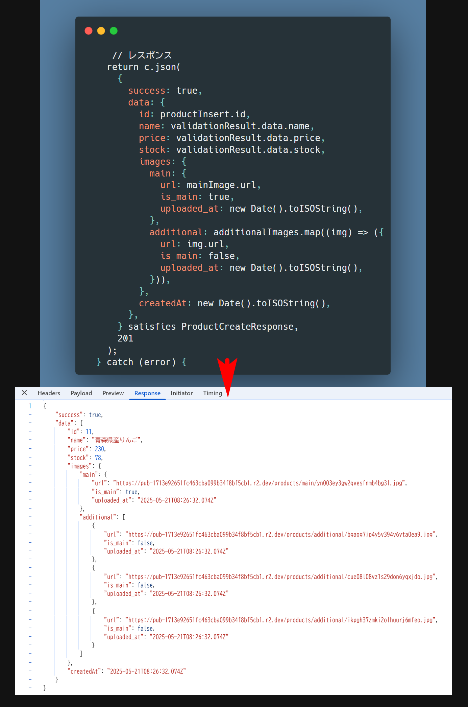

# 🛒 商品（Products）作成

`backend/src/endpoints/productCreate.ts`

```ts
// backend/src/endpoints/productCreate.ts
import { Context } from "hono";
import {
  Bindings,
  ErrorResponse,
  ProductCreateResponse,
  JwtPayload,
} from "../types/types";
import { productSchema } from "../schemas/product";
import { uploadToR2 } from "../lib/storage";

export const productPostHandler = async (
  c: Context<{ Bindings: Bindings; Variables: { jwtPayload?: JwtPayload } }>
): Promise<Response> => {
  const db = c.env.DB;

  try {
    console.log("Received form data:", await c.req.formData());

    // 認証チェック
    const payload = c.get("jwtPayload");
    if (!payload || payload.role !== "admin") {
      return c.json(
        {
          error: {
            code: !payload ? "UNAUTHORIZED" : "FORBIDDEN",
            message: !payload
              ? "認証が必要です"
              : "商品登録には管理者権限が必要です",
          },
        } satisfies ErrorResponse,
        !payload ? 401 : 403
      );
    }

    const formData = await c.req.formData();

    // フォームデータの前処理
    const rawFormData = {
      name: formData.get("name"),
      description: formData.get("description"),
      price: formData.get("price"),
      stock: formData.get("stock") || 0,
      category_id: formData.get("category_id"),
    };

    // バリデーション
    const validationResult = productSchema.safeParse(rawFormData);
    if (!validationResult.success) {
      return c.json(
        {
          error: {
            code: "VALIDATION_ERROR",
            message: "入力内容に誤りがあります",
            details: validationResult.error.flatten(),
          },
        } satisfies ErrorResponse,
        400
      );
    }

    // 画像処理
    const mainImageRaw = formData.get("mainImage") as string | File;
    const mainImageFile = mainImageRaw instanceof File ? mainImageRaw : null;
    const additionalImageFiles = (
      formData.getAll("additionalImages") as (string | File)[]
    ).filter((item): item is File => item instanceof File);

    if (!mainImageFile?.size) {
      return c.json(
        {
          error: {
            code: "MISSING_MAIN_IMAGE",
            message: "メイン画像が必須です",
          },
        } satisfies ErrorResponse,
        400
      );
    }

    // R2アップロード
    const [mainImage, additionalImages] = await Promise.all([
      uploadToR2(c.env.R2_BUCKET, mainImageFile, c.env.R2_PUBLIC_DOMAIN, {
        folder: "products/main",
      }),
      Promise.all(
        additionalImageFiles
          .filter((file) => file.size > 0)
          .map((file) =>
            uploadToR2(c.env.R2_BUCKET, file, c.env.R2_PUBLIC_DOMAIN, {
              folder: "products/additional",
            })
          )
      ),
    ]);

    // 商品情報挿入
    const productInsert = await db
      .prepare(
        `INSERT INTO products (
          name, description, price, stock, category_id,
          created_at
        ) VALUES (?, ?, ?, ?, ?, ?) RETURNING id;`
      )
      .bind(
        validationResult.data.name,
        validationResult.data.description,
        validationResult.data.price,
        validationResult.data.stock,
        validationResult.data.category_id,
        new Date().toISOString()
      )
      .first<{ id: number }>();

    // 商品IDの存在チェック
    if (!productInsert?.id) {
      throw new Error("商品IDの取得に失敗しました");
    }

    // メイン画像挿入
    const mainImageInsert = await db
      .prepare(
        `INSERT INTO images (
          product_id, image_url, is_main, created_at
        ) VALUES (?, ?, ?, ?)`
      )
      .bind(productInsert.id, mainImage.url, 1, new Date().toISOString())
      .run();

    // メイン画像挿入結果チェック
    if (!mainImageInsert.success) {
      throw new Error("メイン画像の登録に失敗しました");
    }

    // 追加画像挿入
    if (additionalImages.length > 0) {
      const additionalInserts = await db.batch(
        additionalImages.map((img) =>
          db
            .prepare(
              `INSERT INTO images (
                product_id, image_url, is_main, created_at
              ) VALUES (?, ?, ?, ?)`
            )
            .bind(productInsert.id, img.url, 0, new Date().toISOString())
        )
      );
      // 追加画像挿入結果チェック
      if (additionalInserts.some((result) => !result.success)) {
        throw new Error("追加画像の登録に失敗しました");
      }
    }

    // デバッグログ
    console.log("Main Image Upload Result:", {
      url: mainImage.url,
      size: mainImageFile?.size,
      type: mainImageFile?.type,
      folder: "products/main",
    });
    console.log(
      "Additional Images Upload Results:",
      additionalImages.map((img, index) => ({
        url: img.url,
        size: additionalImageFiles[index]?.size,
        type: additionalImageFiles[index]?.type,
        folder: "products/additional",
      }))
    );

    // レスポンス
    return c.json(
      {
        success: true,
        data: {
          id: productInsert.id,
          name: validationResult.data.name,
          price: validationResult.data.price,
          stock: validationResult.data.stock,
          images: {
            main: {
              url: mainImage.url,
              is_main: true,
              uploaded_at: new Date().toISOString(),
            },
            additional: additionalImages.map((img) => ({
              url: img.url,
              is_main: false,
              uploaded_at: new Date().toISOString(),
            })),
          },
          createdAt: new Date().toISOString(),
        },
      } satisfies ProductCreateResponse,
      201
    );
  } catch (error) {
    console.error("Error:", error);
    return c.json(
      {
        error: {
          code: "INTERNAL_ERROR",
          message:
            error instanceof Error ? error.message : "処理に失敗しました",
        },
      } satisfies ErrorResponse,
      500
    );
  }
};
```

## 商品作成成功後のデバックログ

```
─┴──────────────────────┴─────────┴──────────────────────────┘
PS D:\next-projects\kaikyou-shop\backend> npx wrangler tail --env production
▲ [WARNING] Processing wrangler.jsonc configuration:


    - "env.production" environment configuration
      - There is a kv_namespaces binding with name "TEST_NAMESPACE" at the top level, but not on
  "env.production".
        This is not what you probably want, since "kv_namespaces" configuration is not inherited by
  environments.
        Please add a binding for "TEST_NAMESPACE" to "env.production.kv_namespaces.bindings".


 ⛅️ wrangler 4.15.0 (update available 4.16.0)
-------------------------------------------------------

Successfully created tail, expires at 2025-05-21T14:25:14Z
Connected to backend-production, waiting for logs...
POST https://backend-production.kai-kyou.workers.dev/api/products - Ok @ 2025/5/21 17:26:29
  (log) {"timestamp":"2025-05-21T08:26:29.715Z","method":"POST","path":"/api/products","normalizedPath":"/api/products","ip":"2400:2411:8903:1500:3817:5f1c:5398:4895","phase":"request-start","environment":"production"}
  (log) [2025-05-21T08:26:29.715Z] [JWT] ミドルウェア開始 {
  "requestId": "igyb0e",
  "method": "POST",
  "path": "/api/products",
  "env": "production"
}
  (log) [2025-05-21T08:26:29.715Z] [JWT] 認証ヘッダー確認 {
  "header": "Bearer v1:..."
}
  (log) [2025-05-21T08:26:29.715Z] [JWT] トークン正規化完了 {
  "original": "v1:eyJhbGc...7BHIwHewjA",
  "normalized": "eyJhbGciOi...7BHIwHewjA"
}
  (log) [2025-05-21T08:26:29.715Z] [JWT] トークン検証開始 {
  "requestId": "igyb0e",
  "method": "POST",
  "path": "/api/products",
  "env": "production"
}
  (log) [2025-05-21T08:26:29.715Z] [JWT] 認証成功 {
  "user_id": 5,
  "type": "number"
}
  (log) Received form data: [object FormData]
  (log) Main Image Upload Result: {
  url: 'https://pub-1713e92651fc463cba099b34f8bf5cb1.r2.dev/products/main/yn003ey3gw2qvesfnmb4bg3l.jpg',
  size: 576216,
  type: 'image/jpeg',
  folder: 'products/main'
}
  (log) Additional Images Upload Results: [
  {
    url: 'https://pub-1713e92651fc463cba099b34f8bf5cb1.r2.dev/products/additional/bgaqg7jp4y5v394v6yta0ea9.jpg',
    size: 69276,
    type: 'image/jpeg',
    folder: 'products/additional'
  },
  {
    url: 'https://pub-1713e92651fc463cba099b34f8bf5cb1.r2.dev/products/additional/cue08l08vz1s29don6yqxjdo.jpg',
    size: 87553,
    type: 'image/jpeg',
    folder: 'products/additional'
  },
  {
    url: 'https://pub-1713e92651fc463cba099b34f8bf5cb1.r2.dev/products/additional/ikpgh37zmki2olhuurj6mfeo.jpg',
    size: 45087,
    type: 'image/jpeg',
    folder: 'products/additional'
  }
]
  (log) [2025-05-21T08:26:32.074Z] [JWT] ミドルウェア完了 {
  "requestId": "igyb0e",
  "method": "POST",
  "path": "/api/products",
  "env": "production"
}

```

## 商品作成成功後のレスポンス



## 作成後のデータベース確認

```
PS D:\next-projects\kaikyou-shop\backend> npx wrangler d1 execute shopping-db --remote --command="select * from products";

 ⛅️ wrangler 4.15.0 (update available 4.16.0)
-------------------------------------------------------

🌀 Executing on preview database shopping-db (d53ad56f-f646-44dc-8dbf-3d2d15d76973):
🌀 To execute on your local development database, remove the --remote flag from your wrangler command.
🚣 Executed 1 command in 0.3456ms
┌────┬──────────────────────┬────────────────────────────────────────────────────────────────────────────────────────────────────────────────────────┬─────────┬───────┬─────────────┬──────────────────────────┐
│ id │ name                 │ description                                                                                                            │ price   │ stock │ category_id │ created_at               │
├────┼──────────────────────┼────────────────────────────────────────────────────────────────────────────────────────────────────────────────────────┼─────────┼───────┼─────────────┼──────────────────────────┤
│ 1  │ Laptop               │ A powerful laptop with 16GB RAM and 512GB SSD                                                                          │ 1200    │ 200   │ 1           │ 2025-05-05 00:49:22      │
├────┼──────────────────────┼────────────────────────────────────────────────────────────────────────────────────────────────────────────────────────┼─────────┼───────┼─────────────┼──────────────────────────┤
│ 2  │ Smartphone           │ Latest model smartphone with 5G support                                                                                │ 800     │ 0     │ 2           │ 2025-05-05 00:49:22      │
├────┼──────────────────────┼────────────────────────────────────────────────────────────────────────────────────────────────────────────────────────┼─────────┼───────┼─────────────┼──────────────────────────┤
│ 3  │ Wireless Mouse       │ Ergonomic wireless mouse with Bluetooth                                                                                │ 30      │ 78    │ 3           │ 2025-05-05 00:49:22      │
├────┼──────────────────────┼────────────────────────────────────────────────────────────────────────────────────────────────────────────────────────┼─────────┼───────┼─────────────┼──────────────────────────┤
│ 4  │ メンズデニムジーンズ │ クラシックなデニムジーンズ。快適な履き心地。                                                                           │ 8900    │ 50    │ 21          │ 2025-05-19 09:13:10      │
├────┼──────────────────────┼────────────────────────────────────────────────────────────────────────────────────────────────────────────────────────┼─────────┼───────┼─────────────┼──────────────────────────┤
│ 5  │ バラの花束           │ 赤いバラ10本入りの豪華な花束。                                                                                         │ 5500    │ 20    │ 11          │ 2025-05-19 09:13:10      │
├────┼──────────────────────┼────────────────────────────────────────────────────────────────────────────────────────────────────────────────────────┼─────────┼───────┼─────────────┼──────────────────────────┤
│ 6  │ 有機野菜セット       │ 旬の有機野菜が5種類入ったセット。                                                                                      │ 3200    │ 30    │ 23          │ 2025-05-19 09:13:10      │
├────┼──────────────────────┼────────────────────────────────────────────────────────────────────────────────────────────────────────────────────────┼─────────┼───────┼─────────────┼──────────────────────────┤
│ 7  │ コンパクトSUV        │ 燃費の良いコンパクトSUV。最新安全装備搭載。                                                                            │ 2980000 │ 5     │ 18          │ 2025-05-19 09:13:10      │
├────┼──────────────────────┼────────────────────────────────────────────────────────────────────────────────────────────────────────────────────────┼─────────┼───────┼─────────────┼──────────────────────────┤
│ 11 │ 青森県産りんご       │ クール便 高糖度 光センサー選果 りんご 2kg 青森県産 規格外 有袋ふじ ふじ 2kg 5kg 10kg 寺田              │ 230     │ 78    │ null        │ 2025-05-21T08:26:31.084Z │
                                                                                                                       │         │       │             │                          │
                                                                 │         │       │             │                          │
                                                                         │         │       │             │                          │
│    │                      │ 密、糖度の保証は現在行っておりませんが、色、大きさ、内部の腐りを除外し、安心安全のりんごを               │         │       │             │                          │
                                                          │         │       │             │                          │
                                                                                                                       │         │       │             │                          │
│    │                      │ こちらのリンゴが一とても美味しいです。値段もお手頃で、傷や傷みもなく、大きさも揃っています。ぜひ購入してみてください！ │         │       │             │                          │
└────┴──────────────────────┴────────────────────────────────────────────────────────────────────────────────────────────────────────────────────────┴─────────┴───────┴─────────────┴──────────────────────────┘
PS D:\next-projects\kaikyou-shop\backend>
```

---

```
PS D:\next-projects\kaikyou-shop\backend> npx wrangler d1 execute shopping-db --remote --command="select * from images";

 ⛅️ wrangler 4.15.0 (update available 4.16.0)
-------------------------------------------------------

🌀 Executing on preview database shopping-db (d53ad56f-f646-44dc-8dbf-3d2d15d76973):
🌀 To execute on your local development database, remove the --remote flag from your wrangler command.
🚣 Executed 1 command in 0.326ms
┌────┬────────────┬──────────────────────────────────────────────────────────────────────────────────────────────────────┬──────────────────────┬─────────┬──────────────────────────┐
│ id │ product_id │ image_url                                                                                            │ alt_text             │ is_main │ created_at               │
├────┼────────────┼──────────────────────────────────────────────────────────────────────────────────────────────────────┼──────────────────────┼─────────┼──────────────────────────┤
│ 1  │ 1          │ https://example.com/images/laptop.jpg                                                                │ null                 │ 0       │ 2025-05-05 00:49:22      │
├────┼────────────┼──────────────────────────────────────────────────────────────────────────────────────────────────────┼──────────────────────┼─────────┼──────────────────────────┤
│ 2  │ 2          │ https://example.com/images/smartphone.jpg                                                            │ null                 │ 0       │ 2025-05-05 00:49:22      │
├────┼────────────┼──────────────────────────────────────────────────────────────────────────────────────────────────────┼──────────────────────┼─────────┼──────────────────────────┤
│ 3  │ 3          │ https://example.com/images/mouse.jpg                                                                 │ null                 │ 0       │ 2025-05-05 00:49:22      │
├────┼────────────┼──────────────────────────────────────────────────────────────────────────────────────────────────────┼──────────────────────┼─────────┼──────────────────────────┤
│ 4  │ 4          │ https://example.com/images/jeans1.jpg                                                                │ デニムジーンズの画像 │ 1       │ 2025-05-19 09:13:10      │
├────┼────────────┼──────────────────────────────────────────────────────────────────────────────────────────────────────┼──────────────────────┼─────────┼──────────────────────────┤
│ 5  │ 5          │ https://example.com/images/rose_bouquet.jpg                                                          │ バラの花束の画像     │ 1       │ 2025-05-19 09:13:10      │
├────┼────────────┼──────────────────────────────────────────────────────────────────────────────────────────────────────┼──────────────────────┼─────────┼──────────────────────────┤
│ 6  │ 6          │ https://example.com/images/vegetable_set.jpg                                                         │ 有機野菜セットの画像 │ 1       │ 2025-05-19 09:13:10      │
├────┼────────────┼──────────────────────────────────────────────────────────────────────────────────────────────────────┼──────────────────────┼─────────┼──────────────────────────┤
│ 7  │ 7          │ https://example.com/images/suv_car.jpg                                                               │ SUVの画像            │ 1       │ 2025-05-19 09:13:10      │
├────┼────────────┼──────────────────────────────────────────────────────────────────────────────────────────────────────┼──────────────────────┼─────────┼──────────────────────────┤
│ 14 │ 11         │ https://pub-1713e92651fc463cba099b34f8bf5cb1.r2.dev/products/main/yn003ey3gw2qvesfnmb4bg3l.jpg       │ null                 │ 1       │ 2025-05-21T08:26:31.785Z │
├────┼────────────┼──────────────────────────────────────────────────────────────────────────────────────────────────────┼──────────────────────┼─────────┼──────────────────────────┤
│ 15 │ 11         │ https://pub-1713e92651fc463cba099b34f8bf5cb1.r2.dev/products/additional/bgaqg7jp4y5v394v6yta0ea9.jpg │ null                 │ 0       │ 2025-05-21T08:26:31.927Z │
├────┼────────────┼──────────────────────────────────────────────────────────────────────────────────────────────────────┼──────────────────────┼─────────┼──────────────────────────┤
│ 16 │ 11         │ https://pub-1713e92651fc463cba099b34f8bf5cb1.r2.dev/products/additional/cue08l08vz1s29don6yqxjdo.jpg │ null                 │ 0       │ 2025-05-21T08:26:31.927Z │
├────┼────────────┼──────────────────────────────────────────────────────────────────────────────────────────────────────┼──────────────────────┼─────────┼──────────────────────────┤
│ 17 │ 11         │ https://pub-1713e92651fc463cba099b34f8bf5cb1.r2.dev/products/additional/ikpgh37zmki2olhuurj6mfeo.jpg │ null                 │ 0       │ 2025-05-21T08:26:31.927Z │
└────┴────────────┴──────────────────────────────────────────────────────────────────────────────────────────────────────┴──────────────────────┴─────────┴──────────────────────────┘
PS D:\next-projects\kaikyou-shop\backend>
```

## 商品画像を表示するのにいくつかの煩雑な設定が必要となります。

- ①R2CORS ポリシーの設定
  `https://dash.cloudflare.com/`にログインして CORS ポリシーを設定します。

```
[
  {
    "AllowedOrigins": [
      "https://kaikyou-online-shop.onrender.com",
      "https://kaikyou-online-shop.vercel.app",
      "http://localhost:3000"
    ],
    "AllowedMethods": [
      "GET",
      "POST",
      "PUT",
      "DELETE",
      "HEAD"
    ],
    "AllowedHeaders": [
      "Authorization",
      "Content-Type"
    ]
  }
]
```

- ②R2_PUBLIC_DOMAIN 環境変数を設定します。
  `frontend/.env.production`

  ```bash
  NEXT_PUBLIC_R2_PUBLIC_DOMAIN=pub-1713e92651fc463cba099b34f8bf5cb1.r2.dev
  ```

- ③next.config.mjs で R2_PUBLIC_DOMAIN を承認する

  `frontend/next.config.mjs`

```js
const isProduction = process.env.NODE_ENV === "production";

const nextConfig = {
  images: {
    domains: ["pub-1713e92651fc463cba099b34f8bf5cb1.r2.dev"],
    remotePatterns:
      isProduction && process.env.NEXT_PUBLIC_R2_PUBLIC_DOMAIN
        ? [
            {
              protocol: "https",
              hostname: process.env.NEXT_PUBLIC_R2_PUBLIC_DOMAIN.replace(
                /^https?:\/\//,
                ""
              ),
              pathname: "/products/**",
            },
          ]
        : [],
  },
};

export default nextConfig;
```
