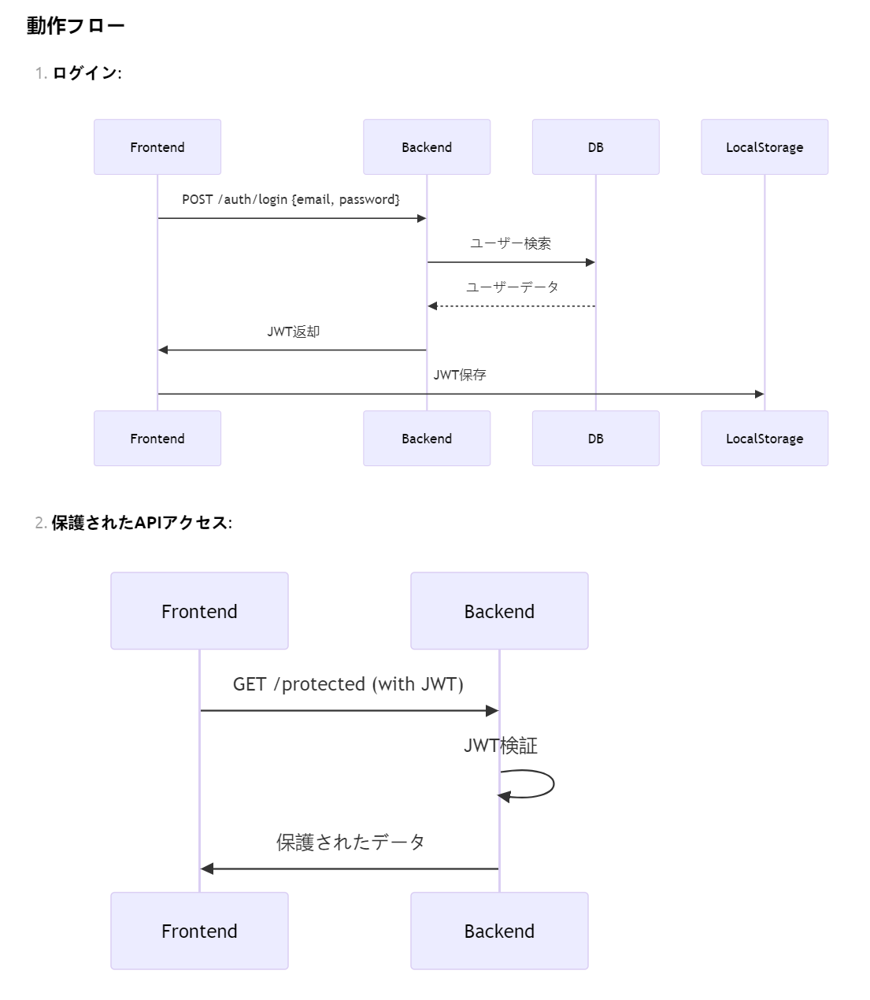
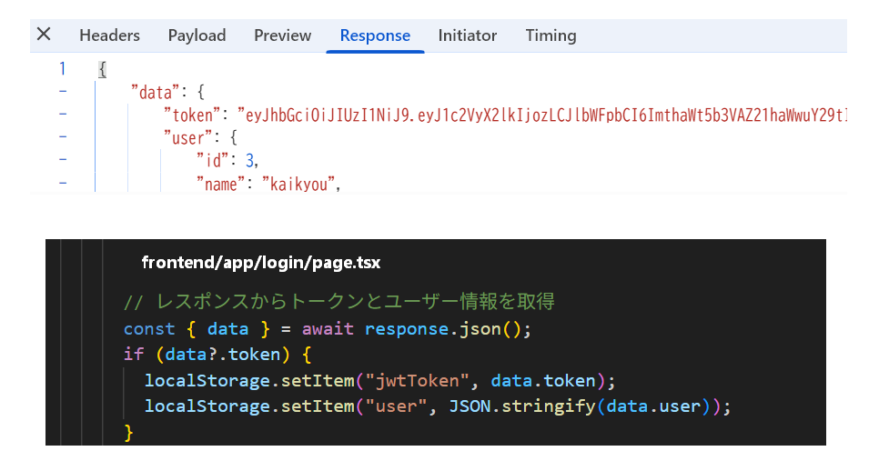

# JWT 認証開発

## 動作フロー



#### 1. `frontend/app/login/page.tsx`

```typescript
"use client";

import { useState, useEffect } from "react";
import { useRouter } from "next/navigation";

export default function LoginPage() {
  const router = useRouter();
  const [formData, setFormData] = useState({
    email: "",
    password: "",
  });
  const [errors, setErrors] = useState<{
    email?: string;
    password?: string;
    global?: string;
  }>({});
  const [isSubmitting, setIsSubmitting] = useState(false);
  const [isMounted, setIsMounted] = useState(false);

  useEffect(() => {
    setIsMounted(true);
    return () => setIsMounted(false);
  }, []);

  const handleChange = (e: React.ChangeEvent<HTMLInputElement>) => {
    const { name, value } = e.target;
    setFormData((prev) => ({
      ...prev,
      [name]: value,
    }));
  };

  const validateForm = () => {
    const newErrors: typeof errors = {};

    if (!formData.email) {
      newErrors.email = "メールアドレスが必要です";
    } else if (!/^[^\s@]+@[^\s@]+\.[^\s@]+$/.test(formData.email)) {
      newErrors.email = "有効なメールアドレスを入力してください";
    }

    if (!formData.password) {
      newErrors.password = "パスワードが必要です";
    } else if (formData.password.length < 8) {
      newErrors.password = "パスワードは8文字以上必要です";
    }

    setErrors(newErrors);
    return Object.keys(newErrors).length === 0;
  };

  const handleSubmit = async (e: React.FormEvent) => {
    e.preventDefault();
    if (!isMounted || !validateForm()) return;
    setIsSubmitting(true);
    setErrors({});
    try {
      const apiUrl = process.env.NEXT_PUBLIC_API_BASE_URL;
      if (!apiUrl) throw new Error("APIエンドポイントが設定されていません");

      const response = await fetch(`${apiUrl}/api/login`, {
        method: "POST",
        headers: {
          "Content-Type": "application/json",
        },
        body: JSON.stringify(formData),
        credentials: "include",
      });

      if (!response.ok) {
        const data = await response.json();
        throw new Error(
          data?.message || `ログインに失敗しました (HTTP ${response.status})`
        );
      }

      const { data } = await response.json();
      if (data?.token) {
        localStorage.setItem("jwtToken", data.token);
        localStorage.setItem("user", JSON.stringify(data.user));

        // AuthProviderに状態更新を通知
        window.dispatchEvent(new Event("storage"));

        // 状態更新が確実に行われるように少し待機
        await new Promise((resolve) => setTimeout(resolve, 100));

        const returnTo = sessionStorage.getItem("preAuthPath") || "/";
        router.replace(returnTo);
        sessionStorage.removeItem("preAuthPath");
      }
    } catch (error) {
      console.error("ログインエラー詳細:", error);
      setErrors({
        global:
          error instanceof Error
            ? error.message
            : "ログイン処理中にエラーが発生しました",
      });
    } finally {
      if (isMounted) {
        setIsSubmitting(false);
      }
    }
  };

  const [showPassword, setShowPassword] = useState(false);

  return (
    <div className="min-h-screen flex flex-col justify-center py-12 sm:px-6 lg:px-8 bg-gray-50">
      <div className="sm:mx-auto sm:w-full sm:max-w-md">
        <h2 className="mt-6 text-center text-3xl font-extrabold text-gray-900">
          アカウントにログイン
        </h2>
      </div>

      <div className="mt-8 sm:mx-auto sm:w-full sm:max-w-md">
        <div className="bg-white py-8 px-4 shadow sm:rounded-lg sm:px-10">
          {errors.global && (
            <div className="mb-4 bg-red-50 border-l-4 border-red-500 p-4">
              <div className="flex">
                <div className="flex-shrink-0">
                  <svg
                    className="h-5 w-5 text-red-500"
                    fill="currentColor"
                    viewBox="0 0 20 20"
                  >
                    <path
                      fillRule="evenodd"
                      d="M10 18a8 8 0 100-16 8 8 0 000 16zM8.707 7.293a1 1 0 00-1.414 1.414L8.586 10l-1.293 1.293a1 1 0 101.414 1.414L10 11.414l1.293 1.293a1 1 0 001.414-1.414L11.414 10l1.293-1.293a1 1 0 00-1.414-1.414L10 8.586 8.707 7.293z"
                      clipRule="evenodd"
                    />
                  </svg>
                </div>
                <div className="ml-3">
                  <p className="text-sm text-red-700">{errors.global}</p>
                </div>
              </div>
            </div>
          )}

          <form className="space-y-6" onSubmit={handleSubmit}>
            <div>
              <label
                htmlFor="email"
                className="block text-sm font-medium text-gray-700"
              >
                メールアドレス
              </label>
              <div className="mt-1">
                <input
                  id="email"
                  name="email"
                  type="email"
                  autoComplete="email"
                  value={formData.email}
                  onChange={handleChange}
                  className={`appearance-none block w-full px-3 py-2 border ${
                    errors.email ? "border-red-300" : "border-gray-300"
                  } rounded-md shadow-sm placeholder-gray-400 focus:outline-none focus:ring-blue-500 focus:border-blue-500 sm:text-sm`}
                />
                {errors.email && (
                  <p className="mt-2 text-sm text-red-600">{errors.email}</p>
                )}
              </div>
            </div>

            <div>
              <label
                htmlFor="password"
                className="block text-sm font-medium text-gray-700"
              >
                パスワード
              </label>
              <div className="mt-1 relative">
                <input
                  id="password"
                  name="password"
                  type={showPassword ? "text" : "password"}
                  autoComplete="current-password"
                  value={formData.password}
                  onChange={handleChange}
                  className={`appearance-none block w-full px-3 py-2 border ${
                    errors.password ? "border-red-300" : "border-gray-300"
                  } rounded-md shadow-sm placeholder-gray-400 focus:outline-none focus:ring-blue-500 focus:border-blue-500 sm:text-sm`}
                />
                <button
                  type="button"
                  className="absolute inset-y-0 right-0 pr-3 flex items-center text-sm leading-5"
                  onClick={() => setShowPassword(!showPassword)}
                >
                  {showPassword ? (
                    <svg
                      className="h-5 w-5 text-gray-500"
                      fill="none"
                      viewBox="0 0 24 24"
                      stroke="currentColor"
                    >
                      <path
                        strokeLinecap="round"
                        strokeLinejoin="round"
                        strokeWidth={2}
                        d="M13.875 18.825A10.05 10.05 0 0112 19c-4.478 0-8.268-2.943-9.543-7a9.97 9.97 0 011.563-3.029m5.858.908a3 3 0 114.243 4.243M9.878 9.878l4.242 4.242M9.88 9.88l-3.29-3.29m7.532 7.532l3.29 3.29M3 3l3.59 3.59m0 0A9.953 9.953 0 0112 5c4.478 0 8.268 2.943 9.543 7a10.025 10.025 0 01-4.132 5.411m0 0L21 21"
                      />
                    </svg>
                  ) : (
                    <svg
                      className="h-5 w-5 text-gray-500"
                      fill="none"
                      viewBox="0 0 24 24"
                      stroke="currentColor"
                    >
                      <path
                        strokeLinecap="round"
                        strokeLinejoin="round"
                        strokeWidth={2}
                        d="M15 12a3 3 0 11-6 0 3 3 0 016 0z"
                      />
                      <path
                        strokeLinecap="round"
                        strokeLinejoin="round"
                        strokeWidth={2}
                        d="M2.458 12C3.732 7.943 7.523 5 12 5c4.478 0 8.268 2.943 9.542 7-1.274 4.057-5.064 7-9.542 7-4.477 0-8.268-2.943-9.542-7z"
                      />
                    </svg>
                  )}
                </button>
                {errors.password && (
                  <p className="mt-2 text-sm text-red-600">{errors.password}</p>
                )}
              </div>
            </div>

            <div className="flex items-center justify-between">
              <div className="flex items-center">
                <input
                  id="remember-me"
                  name="remember-me"
                  type="checkbox"
                  className="h-4 w-4 text-blue-600 focus:ring-blue-500 border-gray-300 rounded"
                />
                <label
                  htmlFor="remember-me"
                  className="ml-2 block text-sm text-gray-900"
                >
                  ログイン状態を保持
                </label>
              </div>

              <div className="text-sm">
                <a
                  href="/password-reset"
                  className="font-medium text-blue-600 hover:text-blue-500"
                >
                  パスワードを忘れた場合
                </a>
              </div>
            </div>

            <div>
              <button
                type="submit"
                disabled={isSubmitting}
                className={`w-full flex justify-center py-2 px-4 border border-transparent rounded-md shadow-sm text-sm font-medium text-white bg-blue-600 hover:bg-blue-700 focus:outline-none focus:ring-2 focus:ring-offset-2 focus:ring-blue-500 ${
                  isSubmitting ? "opacity-75 cursor-not-allowed" : ""
                }`}
              >
                {isSubmitting ? (
                  <>
                    <svg
                      className="animate-spin -ml-1 mr-3 h-5 w-5 text-white"
                      xmlns="http://www.w3.org/2000/svg"
                      fill="none"
                      viewBox="0 0 24 24"
                    >
                      <circle
                        className="opacity-25"
                        cx="12"
                        cy="12"
                        r="10"
                        stroke="currentColor"
                        strokeWidth="4"
                      ></circle>
                      <path
                        className="opacity-75"
                        fill="currentColor"
                        d="M4 12a8 8 0 018-8V0C5.373 0 0 5.373 0 12h4zm2 5.291A7.962 7.962 0 014 12H0c0 3.042 1.135 5.824 3 7.938l3-2.647z"
                      ></path>
                    </svg>
                    処理中...
                  </>
                ) : (
                  "ログイン"
                )}
              </button>
            </div>
          </form>

          <div className="mt-6">
            <div className="relative">
              <div className="absolute inset-0 flex items-center">
                <div className="w-full border-t border-gray-300"></div>
              </div>
              <div className="relative flex justify-center text-sm">
                <span className="px-2 bg-white text-gray-500">
                  または他の方法でログイン
                </span>
              </div>
            </div>

            <div className="mt-6 grid grid-cols-2 gap-3">
              <div>
                <a
                  href="#"
                  className="w-full inline-flex justify-center py-2 px-4 border border-gray-300 rounded-md shadow-sm bg-white text-sm font-medium text-gray-500 hover:bg-gray-50"
                >
                  <span className="sr-only">Googleでログイン</span>
                  <svg
                    className="w-5 h-5"
                    aria-hidden="true"
                    fill="currentColor"
                    viewBox="0 0 24 24"
                  >
                    <path d="M12.48 10.92v3.28h7.84c-.24 1.84-.853 3.187-1.787 4.133-1.147 1.147-2.933 2.4-6.053 2.4-4.827 0-8.6-3.893-8.6-8.72s3.773-8.72 8.6-8.72c2.6 0 4.507 1.027 5.907 2.347l2.307-2.307C18.747 1.44 16.133 0 12.48 0 5.867 0 .307 5.387.307 12s5.56 12 12.173 12c3.573 0 6.267-1.173 8.373-3.36 2.16-2.16 2.84-5.213 2.84-7.667 0-.76-.053-1.467-.173-2.053H12.48z" />
                  </svg>
                </a>
              </div>

              <div>
                <a
                  href="#"
                  className="w-full inline-flex justify-center py-2 px-4 border border-gray-300 rounded-md shadow-sm bg-white text-sm font-medium text-gray-500 hover:bg-gray-50"
                >
                  <span className="sr-only">GitHubでログイン</span>
                  <svg
                    className="w-5 h-5"
                    aria-hidden="true"
                    fill="currentColor"
                    viewBox="0 0 20 20"
                  >
                    <path
                      fillRule="evenodd"
                      d="M10 0C4.477 0 0 4.484 0 10.017c0 4.425 2.865 8.18 6.839 9.504.5.092.682-.217.682-.483 0-.237-.008-.868-.013-1.703-2.782.605-3.369-1.343-3.369-1.343-.454-1.158-1.11-1.466-1.11-1.466-.908-.62.069-.608.069-.608 1.003.07 1.531 1.032 1.531 1.032.892 1.53 2.341 1.088 2.91.832.092-.647.35-1.088.636-1.338-2.22-.253-4.555-1.113-4.555-4.951 0-1.093.39-1.988 1.029-2.688-.103-.253-.446-1.272.098-2.65 0 0 .84-.27 2.75 1.026A9.564 9.564 0 0110 4.844c.85.004 1.705.115 2.504.337 1.909-1.296 2.747-1.027 2.747-1.027.546 1.379.203 2.398.1 2.651.64.7 1.028 1.595 1.028 2.688 0 3.848-2.339 4.695-4.566 4.942.359.31.678.921.678 1.856 0 1.338-.012 2.419-.012 2.747 0 .268.18.58.688.482A10.019 10.019 0 0020 10.017C20 4.484 15.522 0 10 0z"
                      clipRule="evenodd"
                    />
                  </svg>
                </a>
              </div>
            </div>
          </div>
        </div>
      </div>
    </div>
  );
}
```

### 主な変更点:

1. **`handleSubmit`関数の改善**:

   - ログイン成功後に`window.dispatchEvent(new Event("storage"))`を追加し、AuthProvider に状態更新を通知
   - 状態更新が確実に行われるように`await new Promise(resolve => setTimeout(resolve, 100))`を追加
   - `router.replace`を使用してリダイレクト

     **纏め：① ログイン成功後に storage イベントを発火させ、AuthProvider に状態更新を通知
     ② リダイレクト前に 100ms の遅延を追加し、状態更新が確実に行われるようにする
     ③ リダイレクト処理をより確実に行うため、router.replace を使用**

2. **エラーハンドリングの強化**:

   - エラーメッセージの表示をより詳細に
   - ログイン失敗時の状態リセットを確実に実行

3. **コードの整理**:
   - 不要なコメントを削除
   - コードの一貫性を保つためフォーマットを統一

この修正により、ログイン後に AuthProvider の状態が確実に更新され、管理センター

#### 2. `frontend/components/AuthProvider.tsx` の修正

ログを分析すると、確かに複数回のリクエストが発生しているようです。これは主に以下の原因が考えられます：

1. **React の Strict Mode**：開発環境ではコンポーネントが意図的に 2 回レンダリングされる
2. **useEffect の依存配列**：適切に設定されていない場合
3. **ルーターイベント**：ナビゲーション時の多重トリガー

### 完全修正版 `frontend/components/AuthProvider.tsx`

```typescript
// frontend/components/AuthProvider.tsx
"use client";

import {
  createContext,
  useContext,
  useState,
  useEffect,
  ReactNode,
  useCallback,
  useRef,
} from "react";
import { useRouter } from "next/navigation";

interface User {
  id: number;
  name: string;
  email: string;
  role: string;
}

interface AuthContextType {
  isLoggedIn: boolean;
  isLoading: boolean;
  currentUser: User | null;
  clearAuth: () => void;
  checkAuth: () => Promise<void>;
  logout: () => Promise<void>;
}

const AuthContext = createContext<AuthContextType | undefined>(undefined);

export const AuthProvider = ({ children }: { children: ReactNode }) => {
  const [isLoggedIn, setIsLoggedIn] = useState(false);
  const [isLoading, setIsLoading] = useState(true);
  const [currentUser, setCurrentUser] = useState<User | null>(null);
  const router = useRouter();
  const authCheckRef = useRef<Promise<void> | null>(null);

  const apiUrl = process.env.NEXT_PUBLIC_API_BASE_URL;
  if (!apiUrl) throw new Error("APIエンドポイントが設定されていません");

  const clearAuth = useCallback(() => {
    console.log("認証情報をクリア");
    localStorage.removeItem("jwtToken");
    localStorage.removeItem("user");
    setIsLoggedIn(false);
    setCurrentUser(null);
  }, []);

  const checkAuth = useCallback(
    async (initialCheck = false) => {
      if (authCheckRef.current) {
        return authCheckRef.current;
      }

      console.log("認証チェック開始", { initialCheck });
      setIsLoading(true);

      const authCheckPromise = (async () => {
        try {
          const token = localStorage.getItem("jwtToken");
          const storedUser = localStorage.getItem("user");

          if (!token || !storedUser) {
            throw new Error("認証情報がありません");
          }

          // トークンの有効期限チェック
          const payload = JSON.parse(atob(token.split(".")[1]));
          if (payload.exp * 1000 < Date.now()) {
            throw new Error("トークンの有効期限が切れています");
          }

          // 即時UI更新のためにローカルデータを使用
          const user = JSON.parse(storedUser);
          setCurrentUser(user);
          setIsLoggedIn(true);

          // サーバーサイド認証チェック
          const response = await fetch(`${apiUrl}/api/users/me`, {
            method: "GET",
            headers: {
              Authorization: `Bearer ${token}`,
              "Content-Type": "application/json",
            },
            credentials: "include",
            cache: "no-store",
          });

          if (!response.ok) {
            throw new Error("認証が必要です");
          }

          const userData = await response.json();
          localStorage.setItem("user", JSON.stringify(userData));
          setCurrentUser(userData);
          setIsLoggedIn(true); // 明示的に状態を更新

          // 初期チェック時のみリダイレクト処理
          if (initialCheck) {
            const currentPath = window.location.pathname;
            if (currentPath === "/login" || currentPath === "/register") {
              router.push("/");
            }
          }
        } catch (error) {
          console.error("認証チェックエラー:", error);
          clearAuth();
          if (initialCheck && window.location.pathname !== "/login") {
            router.push("/login");
          }
        } finally {
          setIsLoading(false);
          authCheckRef.current = null;
        }
      })();

      authCheckRef.current = authCheckPromise;
      return authCheckPromise;
    },
    [apiUrl, clearAuth, router]
  );

  const logout = useCallback(async () => {
    setIsLoading(true);
    try {
      const token = localStorage.getItem("jwtToken");

      if (!token) {
        console.warn(
          "ログアウト: トークンが存在しないためローカルクリアのみ実行"
        );
        clearAuth();
        router.push("/login");
        return;
      }

      // トークンの基本検証
      try {
        const payload = JSON.parse(atob(token.split(".")[1]));
        if (payload.exp * 1000 < Date.now()) {
          console.warn("ログアウト: トークン有効期限切れ");
          clearAuth();
          router.push("/login");
          return;
        }
      } catch (e) {
        console.error("トークン解析エラー:", e);
        clearAuth();
        router.push("/login");
        return;
      }

      const response = await fetch(`${apiUrl}/api/logout`, {
        method: "POST",
        headers: {
          Authorization: `Bearer ${token}`,
          "Content-Type": "application/json",
        },
        credentials: "include",
      });

      // 401エラーでもクリア処理は実行
      if (response.status === 401) {
        console.warn("サーバー側で認証無効と判定");
      } else if (!response.ok) {
        const errorData = await response.json().catch(() => ({}));
        console.error("ログアウト失敗詳細:", {
          status: response.status,
          error: errorData,
        });
        throw new Error(`ログアウトに失敗しました: ${response.status}`);
      }

      console.log("ログアウト成功");
      clearAuth();
      router.push("/login");
    } catch (error) {
      console.error("ログアウト処理中に例外発生:", error);
      clearAuth();
      router.push("/login");
    } finally {
      setIsLoading(false);
    }
  }, [apiUrl, clearAuth, router]);

  useEffect(() => {
    // 初回のみ実行
    let mounted = true;
    const initialCheck = async () => {
      await checkAuth(true);
    };

    if (mounted) {
      initialCheck();
    }

    return () => {
      mounted = false;
    };
  }, [checkAuth]);

  useEffect(() => {
    // localStorageの変更を監視
    const handleStorageChange = () => {
      checkAuth();
    };

    window.addEventListener("storage", handleStorageChange);
    return () => {
      window.removeEventListener("storage", handleStorageChange);
    };
  }, [checkAuth]);

  return (
    <AuthContext.Provider
      value={{
        isLoggedIn,
        isLoading,
        currentUser,
        clearAuth,
        checkAuth,
        logout,
      }}
    >
      {children}
    </AuthContext.Provider>
  );
};

export const useAuth = () => {
  const context = useContext(AuthContext);
  if (context === undefined) {
    throw new Error("useAuth must be used within an AuthProvider");
  }
  return context;
};
```

### 主な改善点

1. **リクエスト重複防止**:

   - `useRef` を使用して進行中の認証チェックを追跡
   - 既にチェック中の場合は同じ Promise を返す

2. **メモ化の強化**:

   - `useCallback` で関数を適切にメモ化
   - 不必要な再レンダリングを防止

3. **マウント状態管理**:

   - `mounted` フラグでアンマウント後の状態更新を防止

4. **初期チェック最適化**:

   - 初回マウント時のみ認証チェックを実行

5. **エラーハンドリング**:

   - より詳細なエラーロギング
   - 401 エラー時の即時クリア

6. **その他**:
   - 認証状態の更新をより確実に行うため、setIsLoggedIn(true)を明示的に呼び出す
   - ストレージイベントを監視して、ログイン状態の変化を即時反映

### 追加のテスト手順

1. **ログイン後のリダイレクトテスト**:

   ```bash
   # ログイン後、期待される動作
   - /login → ホームページにリダイレクト
   - 保護されたページ → 正常にアクセス可能
   ```

2. **リフレッシュ時の挙動確認**:

   ```bash
   # ページリフレッシュ後
   - 認証状態が保持されるか
   - /users/me リクエストが1回のみか
   ```

3. **ネットワークタブでの確認**:
   - `/api/users/me` リクエストが重複していないか
   - レスポンス時間が適切か

この修正により、認証チェックの重複リクエスト問題が解決され、より安定した認証フローが実現できるはずです。

### 動作確認手順

1. ログインページで認証情報を入力
2. 開発者ツールの「Network」タブで以下の確認:
   - `/api/login` リクエストのレスポンスに token が含まれているか
   - レスポンスヘッダーに Set-Cookie があるか
     
3. ログイン後の`/api/users/me`リクエストで以下の確認:
   - Authorization ヘッダーに Bearer トークンが含まれているか
4. localStorage に jwtToken が保存されているか確認

これらの修正により、JWT トークンが適切に保存・送信されるようになります。また、エラーハンドリングも強化されているため、認証状態の管理がより確実になります。
