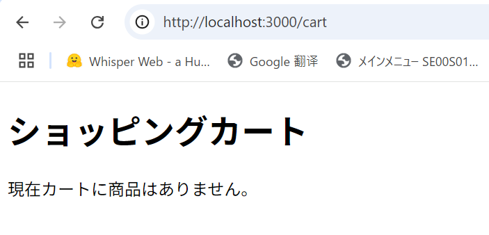

# 破棄予定 002 基本ページの作成

## トップページ

frontend\app\page.tsx

```tsx
import Link from "next/link";

export default function Home() {
  return (
    <div className="p-6">
      <h1 className="text-2xl font-bold mb-4">商品一覧</h1>
      <ul>
        {[1, 2, 3].map((id) => (
          <li key={id} className="mb-2">
            <Link href={`/product/${id}`} className="text-blue-600 underline">
              商品{id}の詳細を見る
            </Link>
          </li>
        ))}
      </ul>
    </div>
  );
}
```

## 商品詳細ページ

frontend\app\product\[id]\page.tsx

> これは app/product/[id]/page.tsx がサーバーコンポーネントであるため、params がそのまま渡ってくる仕様です。

```tsx
// frontend/app/product/[id]/page.tsx

type Props = {
  params: { id: string };
};

export default function ProductDetail({ params }: Props) {
  return (
    <div>
      <h1>商品詳細 - ID: {params.id}</h1>
      <p>ここに商品の説明や画像が入ります。</p>
    </div>
  );
}
```

## ショッピングカートページ

frontend\app\cart\page.tsx

```tsx
export default function CartPage() {
  return (
    <div className="p-6">
      <h1 className="text-2xl font-bold mb-4">ショッピングカート</h1>
      <p>現在カートに商品はありません。</p>
    </div>
  );
}
```

## チェックアウトページ

frontend\app\checkout\page.tsx

```tsx
export default function CheckoutPage() {
  return (
    <div className="p-6">
      <h1 className="text-2xl font-bold mb-4">チェックアウト</h1>
      <p>お届け先住所や支払い方法を入力してください。</p>
    </div>
  );
}
```

# 完成イメージ




