# データベースの設計

## ER 図

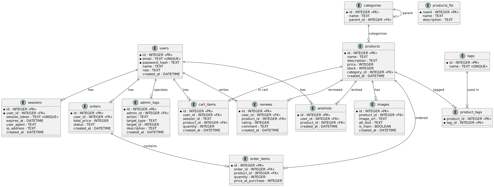

## ✅ cloud_schema.sql

```sql
-- ユーザー情報（ロール付き）
CREATE TABLE users (
  id INTEGER PRIMARY KEY AUTOINCREMENT,
  email TEXT NOT NULL UNIQUE,
  password_hash TEXT NOT NULL,
  name TEXT,
  role TEXT NOT NULL DEFAULT 'user', -- 'user' or 'admin'
  created_at DATETIME DEFAULT CURRENT_TIMESTAMP
);

-- セッション情報
CREATE TABLE sessions (
  id INTEGER PRIMARY KEY AUTOINCREMENT,
  user_id INTEGER NOT NULL,
  session_token TEXT NOT NULL UNIQUE,
  expires_at DATETIME NOT NULL,
  user_agent TEXT,
  ip_address TEXT,
  created_at DATETIME DEFAULT CURRENT_TIMESTAMP,
  FOREIGN KEY (user_id) REFERENCES users(id)
);

-- カテゴリ（階層構造対応）
CREATE TABLE categories (
  id INTEGER PRIMARY KEY AUTOINCREMENT,
  name TEXT NOT NULL,
  parent_id INTEGER, -- null なら大分類、そうでなければ中分類・小分類
  FOREIGN KEY (parent_id) REFERENCES categories(id)
);

-- 商品情報
CREATE TABLE products (
  id INTEGER PRIMARY KEY AUTOINCREMENT,
  name TEXT NOT NULL,
  description TEXT,
  price INTEGER NOT NULL,
  stock INTEGER DEFAULT 0,
  category_id INTEGER,
  created_at DATETIME DEFAULT CURRENT_TIMESTAMP,
  FOREIGN KEY (category_id) REFERENCES categories(id)
);

-- 商品の全文検索用 FTS 仮想テーブル（name + description）
CREATE VIRTUAL TABLE products_fts USING fts5(
  name,
  description,
  content='products',
  content_rowid='id'
);

-- 商品挿入・更新時に FTS テーブルも同期するトリガー
CREATE TRIGGER products_ai AFTER INSERT ON products BEGIN
  INSERT INTO products_fts(rowid, name, description)
  VALUES (new.id, new.name, new.description);
END;
CREATE TRIGGER products_ad AFTER DELETE ON products BEGIN
  DELETE FROM products_fts WHERE rowid = old.id;
END;
CREATE TRIGGER products_au AFTER UPDATE ON products BEGIN
  UPDATE products_fts
  SET name = new.name,
      description = new.description
  WHERE rowid = old.id;
END;

-- 商品画像情報（メイン画像対応）
CREATE TABLE images (
  id INTEGER PRIMARY KEY AUTOINCREMENT,
  product_id INTEGER NOT NULL,
  image_url TEXT NOT NULL,
  alt_text TEXT,
  is_main BOOLEAN NOT NULL DEFAULT 0, -- ✅ メイン画像フラグ
  created_at DATETIME DEFAULT CURRENT_TIMESTAMP,
  FOREIGN KEY (product_id) REFERENCES products(id)
);

-- タグ（多対多構造）
CREATE TABLE tags (
  id INTEGER PRIMARY KEY AUTOINCREMENT,
  name TEXT NOT NULL UNIQUE
);

CREATE TABLE product_tags (
  product_id INTEGER,
  tag_id INTEGER,
  PRIMARY KEY (product_id, tag_id),
  FOREIGN KEY (product_id) REFERENCES products(id),
  FOREIGN KEY (tag_id) REFERENCES tags(id)
);

-- カート情報（ゲスト or ユーザー,user_id か session_id のどちらかが使われる）
CREATE TABLE cart_items (
  id INTEGER PRIMARY KEY AUTOINCREMENT,
  user_id INTEGER,
  session_id TEXT,
  product_id INTEGER NOT NULL,
  quantity INTEGER NOT NULL DEFAULT 1,
  created_at DATETIME DEFAULT CURRENT_TIMESTAMP,
  UNIQUE(user_id, product_id),
  UNIQUE(session_id, product_id),
  FOREIGN KEY (user_id) REFERENCES users(id),
  FOREIGN KEY (product_id) REFERENCES products(id)
);

-- 購入履歴（注文）
CREATE TABLE orders (
  id INTEGER PRIMARY KEY AUTOINCREMENT,
  user_id INTEGER,
  total_price INTEGER NOT NULL,
  status TEXT DEFAULT 'pending', -- 'pending', 'shipped' など
  created_at DATETIME DEFAULT CURRENT_TIMESTAMP,
  FOREIGN KEY (user_id) REFERENCES users(id)
);

-- 注文アイテム
CREATE TABLE order_items (
  id INTEGER PRIMARY KEY AUTOINCREMENT,
  order_id INTEGER,
  product_id INTEGER,
  quantity INTEGER NOT NULL,
  price_at_purchase INTEGER NOT NULL,
  FOREIGN KEY (order_id) REFERENCES orders(id),
  FOREIGN KEY (product_id) REFERENCES products(id)
);

-- ✅ レビュー機能
CREATE TABLE reviews (
  id INTEGER PRIMARY KEY AUTOINCREMENT,
  user_id INTEGER NOT NULL,
  product_id INTEGER NOT NULL,
  rating INTEGER NOT NULL CHECK (rating BETWEEN 1 AND 5),
  comment TEXT,
  created_at DATETIME DEFAULT CURRENT_TIMESTAMP,
  FOREIGN KEY (user_id) REFERENCES users(id),
  FOREIGN KEY (product_id) REFERENCES products(id),
  UNIQUE(user_id, product_id) -- 同じユーザーが同じ商品に1回だけレビュー
);

-- ✅ お気に入り（ウィッシュリスト）
CREATE TABLE wishlists (
  id INTEGER PRIMARY KEY AUTOINCREMENT,
  user_id INTEGER NOT NULL,
  product_id INTEGER NOT NULL,
  created_at DATETIME DEFAULT CURRENT_TIMESTAMP,
  FOREIGN KEY (user_id) REFERENCES users(id),
  FOREIGN KEY (product_id) REFERENCES products(id),
  UNIQUE(user_id, product_id)
);

-- ✅ 管理ログ（操作履歴）
CREATE TABLE admin_logs (
  id INTEGER PRIMARY KEY AUTOINCREMENT,
  admin_id INTEGER NOT NULL,
  action TEXT NOT NULL, -- 例: 'create_product', 'update_category', etc.
  target_type TEXT NOT NULL, -- 例: 'product', 'category', 'user'
  target_id INTEGER,
  description TEXT,
  created_at DATETIME DEFAULT CURRENT_TIMESTAMP,
  FOREIGN KEY (admin_id) REFERENCES users(id)
);

-- インデックス（パフォーマンス向上用）
CREATE INDEX idx_users_email ON users(email);
CREATE INDEX idx_products_name ON products(name);
CREATE INDEX idx_products_description ON products(description);
CREATE INDEX idx_products_category_id ON products(category_id);
CREATE INDEX idx_images_product_id ON images(product_id);
CREATE INDEX idx_product_tags_tag_id ON product_tags(tag_id);
CREATE INDEX idx_product_tags_product_id ON product_tags(product_id);
CREATE INDEX idx_cart_items_user_id ON cart_items(user_id);
CREATE INDEX idx_cart_items_session ON cart_items(session_id);
CREATE INDEX idx_orders_user_id ON orders(user_id);
CREATE INDEX idx_orders_status ON orders(status);
CREATE INDEX idx_order_items_order_id ON order_items(order_id);
CREATE INDEX idx_sessions_user_id ON sessions(user_id);
CREATE INDEX idx_categories_parent_id ON categories(parent_id);
CREATE INDEX idx_reviews_user_id ON reviews(user_id);
CREATE INDEX idx_reviews_product_id ON reviews(product_id);
CREATE INDEX idx_wishlists_user_id ON wishlists(user_id);
CREATE INDEX idx_admin_logs_admin_id ON admin_logs(admin_id);

```

以下に、提供されたスキーマを各テーブルごとに説明します。フォーマットは指定通りに統一しています。

> 💬 ユーザー（users）

| Field         | Type     | Notes                                                  |
| ------------- | -------- | ------------------------------------------------------ |
| id            | INTEGER  | PK, auto increment                                     |
| email         | TEXT     | Unique, Not null                                       |
| password_hash | TEXT     | ハッシュ化されたパスワード                             |
| name          | TEXT     | Optional                                               |
| role          | TEXT     | ユーザーロール（'user' or 'admin'）、デフォルト 'user' |
| created_at    | DATETIME | 登録日時（デフォルトで現在時刻）                       |

> 💬 セッション（sessions）

| Field         | Type     | Notes                                  |
| ------------- | -------- | -------------------------------------- |
| id            | INTEGER  | PK, auto increment                     |
| user_id       | INTEGER  | FK → users(id)                         |
| session_token | TEXT     | Unique                                 |
| expires_at    | DATETIME | セッション有効期限                     |
| user_agent    | TEXT     | ユーザーエージェント情報（オプション） |
| ip_address    | TEXT     | アクセス元 IP（オプション）            |
| created_at    | DATETIME | Default now                            |

> 💬 カテゴリ（categories）

| Field     | Type    | Notes                                                                   |
| --------- | ------- | ----------------------------------------------------------------------- |
| id        | INTEGER | PK, auto increment                                                      |
| name      | TEXT    | Not null                                                                |
| parent_id | INTEGER | FK → categories(id)（自己参照） , null なら親カテゴリ（階層構造を実現） |

> 💬 商品（products）

| Field       | Type     | Notes                    |
| ----------- | -------- | ------------------------ |
| id          | INTEGER  | PK, auto increment       |
| name        | TEXT     | NOT NULL                 |
| description | TEXT     | 商品説明                 |
| price       | INTEGER  | NOT NULL（単位：円など） |
| stock       | INTEGER  | 在庫数（デフォルト 0）   |
| category_id | INTEGER  | FK → categories(id)      |
| created_at  | DATETIME | Default now              |

> 💬 商品全文検索（products_fts）

| Field       | Type    | Notes                              |
| ----------- | ------- | ---------------------------------- |
| name        | TEXT    | 全文検索用（products.name）        |
| description | TEXT    | 全文検索用（products.description） |
| rowid       | INTEGER | products.id と同期                 |

※仮想テーブル。products と連携し、トリガーによって同期されます（INSERT/DELETE/UPDATE 時）。

> 💬 商品画像（images）

| Field      | Type     | Notes                                            |
| ---------- | -------- | ------------------------------------------------ |
| id         | INTEGER  | PK, auto increment                               |
| product_id | INTEGER  | FK → products.id                                 |
| image_url  | TEXT     | 画像の URL、Not null                             |
| alt_text   | TEXT     | 画像の代替テキスト（アクセシビリティ対応）       |
| is_main    | BOOLEAN  | メイン画像かどうか（0: サブ画像, 1: メイン画像） |
| created_at | DATETIME | Default now                                      |

> 💬 タグ（tags）

| Field | Type    | Notes              |
| ----- | ------- | ------------------ |
| id    | INTEGER | PK, auto increment |
| name  | TEXT    | Not null, Unique   |

> 💬 商品タグ（product_tags）

| Field      | Type    | Notes                                         |
| ---------- | ------- | --------------------------------------------- |
| product_id | INTEGER | FK → products(id)                             |
| tag_id     | INTEGER | FK → tags(id)                                 |
|            |         | 多対多構成のための複合 PK(product_id, tag_id) |

> 💬 カートアイテム（cart_items）

| Field      | Type     | Notes                                                                                                |
| ---------- | -------- | ---------------------------------------------------------------------------------------------------- |
| id         | INTEGER  | PK, auto increment                                                                                   |
| user_id    | INTEGER  | FK → users(id)、ゲストの場合は null                                                                  |
| session_id | TEXT     | ゲストユーザー識別用セッション ID（null 可）                                                         |
| product_id | INTEGER  | FK → products(id)                                                                                    |
| quantity   | INTEGER  | 商品数量（デフォルト 1）                                                                             |
| created_at | DATETIME | Default now                                                                                          |
|            |          | UNIQUE(user_id, product_id)または UNIQUE(session_id, product_id)同じ商品を複数回追加できないよう制限 |

> 💬 注文（orders）

| Field       | Type     | Notes                                                              |
| ----------- | -------- | ------------------------------------------------------------------ |
| id          | INTEGER  | PK, auto increment                                                 |
| user_id     | INTEGER  | FK → users(id)                                                     |
| total_price | INTEGER  | 合計金額（購入時に計算・保存）Not null                             |
| status      | TEXT     | 注文ステータス（例: 'pending', 'shipped' など）デフォルト'pending' |
| created_at  | DATETIME | Default now                                                        |

> 💬 注文アイテム（order_items）

| Field             | Type    | Notes                            |
| ----------------- | ------- | -------------------------------- |
| id                | INTEGER | PK, auto increment               |
| order_id          | INTEGER | FK → orders(id)                  |
| product_id        | INTEGER | FK → products(id)                |
| quantity          | INTEGER | 購入数量 Not null                |
| price_at_purchase | INTEGER | 購入時の価格（履歴の整合性確保） |

> 💬 レビュー（reviews）

| Field      | Type     | Notes                                                                            |
| ---------- | -------- | -------------------------------------------------------------------------------- |
| id         | INTEGER  | PK, auto increment                                                               |
| user_id    | INTEGER  | FK → users(id)                                                                   |
| product_id | INTEGER  | FK → products(id)                                                                |
| rating     | INTEGER  | 評価（1〜5 の間でチェック制約付き）                                              |
| comment    | TEXT     | オプション                                                                       |
| created_at | DATETIME | Default now                                                                      |
|            |          | UNIQUE(user_id, product_id) 同じユーザーが同じ商品に複数レビューできないよう制限 |

> 💬 お気に入り（wishlists）

| Field      | Type     | Notes                                                          |
| ---------- | -------- | -------------------------------------------------------------- |
| id         | INTEGER  | PK, auto increment                                             |
| user_id    | INTEGER  | FK → users(id)                                                 |
| product_id | INTEGER  | FK → products(id)                                              |
| created_at | DATETIME | Default now                                                    |
|            |          | UNIQUE(user_id, product_id) 同じ商品のお気に入り登録は一回だけ |

> 💬 管理ログ（admin_logs）

| Field       | Type     | Notes                                                   |
| ----------- | -------- | ------------------------------------------------------- |
| id          | INTEGER  | PK, auto increment                                      |
| admin_id    | INTEGER  | FK → users(id) 、admin ロールを持つユーザーが対象       |
| action      | TEXT     | 実行した操作（例: 'create_product', 'update_category'） |
| target_type | TEXT     | 対象の種類（例: 'product', 'user', 'category'など）     |
| target_id   | INTEGER  | 操作対象の ID                                           |
| description | TEXT     | オプション                                              |
| created_at  | DATETIME | Default now                                             |

> 💬 インデックス

| Index 名                    | 対象テーブル・カラム     |
| --------------------------- | ------------------------ |
| idx_users_email             | users(email)             |
| idx_products_name           | products(name)           |
| idx_products_description    | products(description)    |
| idx_products_category_id    | products(category_id)    |
| idx_images_product_id       | images(product_id)       |
| idx_product_tags_tag_id     | product_tags(tag_id)     |
| idx_product_tags_product_id | product_tags(product_id) |
| idx_cart_items_user_id      | cart_items(user_id)      |
| idx_cart_items_session      | cart_items(session_id)   |
| idx_orders_user_id          | orders(user_id)          |
| idx_orders_status           | orders(status)           |
| idx_order_items_order_id    | order_items(order_id)    |
| idx_sessions_user_id        | sessions(user_id)        |
| idx_categories_parent_id    | categories(parent_id)    |
| idx_reviews_user_id         | reviews(user_id)         |
| idx_reviews_product_id      | reviews(product_id)      |
| idx_wishlists_user_id       | wishlists(user_id)       |
| idx_admin_logs_admin_id     | admin_logs(admin_id)     |

### 🔎 インデックス一覧

- `idx_users_email`: ユーザーのメール検索高速化
- `idx_products_name`: 商品名検索の高速化
- `idx_products_category_id`: カテゴリ別商品検索の高速化
- `idx_cart_items_user_id`: ユーザー別カート検索
- `idx_orders_status`: ステータス別注文管理
- （その他各テーブルの主要フィールドにインデックス設定）

✅ 1. Cloudflare D1（SQLite）の全文検索でマッチング
全文検索（FTS5）を使って、検索キーワードにヒットする商品を取得します。
さらに、FTS5 の highlight() 関数を使えば、マッチした部分に HTML タグを埋め込むことが可能です。

```sql
SELECT
  p.id,
  highlight(products_fts, 0, '<mark>', '</mark>') AS name,
  highlight(products_fts, 1, '<mark>', '</mark>') AS description,
  p.price,
  p.image_url
FROM products_fts
JOIN products p ON p.id = products_fts.rowid
WHERE products_fts MATCH ?;
```

このクエリは、products_fts テーブルに対して全文検索を行い、ヒットした箇所（商品名や説明文）に `<mark>...</mark>` を挿入します。

✅ 2. フロントエンドで HTML を安全にレンダリング
`<mark>帽子</mark>` のようなタグをそのまま表示するとただの文字列になってしまうので、React 側では以下のように描画します：

```tsx
import DOMPurify from "dompurify";

export default function SearchResultItem({
  name,
  description,
}: {
  name: string;
  description: string;
}) {
  return (
    <div className="p-4 border rounded mb-2">
      <h2
        className="text-lg font-semibold"
        dangerouslySetInnerHTML={{ __html: DOMPurify.sanitize(name) }}
      />
      <p
        className="text-sm text-gray-600"
        dangerouslySetInnerHTML={{ __html: DOMPurify.sanitize(description) }}
      />
    </div>
  );
}
```

dangerouslySetInnerHTML を使うと HTML としてレンダリング可能になります。

DOMPurify を使うことで、XSS（スクリプト注入）を防止します。

✅ 補足：API 例（Cloudflare Workers）
Cloudflare Workers の API エンドポイントはこんな感じ：

```tsx
// backend/src/routes/search.ts
export async function onRequestGet({ request, env }) {
  const { searchParams } = new URL(request.url);
  const query = searchParams.get("q");

  if (!query) {
    return new Response(JSON.stringify([]), {
      headers: { "Content-Type": "application/json" },
    });
  }

  const results = await env.DB.prepare(
    `SELECT 
      p.id,
      highlight(products_fts, 0, '<mark>', '</mark>') AS name,
      highlight(products_fts, 1, '<mark>', '</mark>') AS description,
      p.price,
      p.image_url
     FROM products_fts
     JOIN products p ON p.id = products_fts.rowid
     WHERE products_fts MATCH ?`
  )
    .bind(query)
    .all();

  return new Response(JSON.stringify(results.results), {
    headers: { "Content-Type": "application/json" },
  });
}
```

✅ まとめ

| 要素         | 実装内容                                            |
| ------------ | --------------------------------------------------- |
| 検索処理     | FTS5 + `highlight()` で HTML マーク付き文字列を取得 |
| React 描画   | `dangerouslySetInnerHTML` + DOMPurify               |
| セキュリティ | DOMPurify で XSS 対策                               |
| 拡張性       | AND 検索やサジェスト対応も将来的に可能              |

## ✅ 将来の拡張性が考慮されているポイント

### 1. **スキーマの正規化とリレーション設計**

- テーブルが正規化されており、各エンティティ（users、products、categories、tags など）が独立しています。
- 関連する情報（例：`product_tags`, `order_items`）は**中間テーブル**で管理し、**多対多の関係**を正しく扱えるようになっています。

👉 これにより将来的に：

- 商品に複数のタグやカテゴリを追加しやすい
- タグ機能の強化（例：タグごとのランキングや検索）も容易に実装可能

---

### 2. **FTS（全文検索）テーブルの導入**

```sql
CREATE VIRTUAL TABLE products_fts USING fts5(...)
```

- 商品検索の効率化・精度向上のため、全文検索用の仮想テーブルを導入
- トリガーで `INSERT/UPDATE/DELETE` に対応しており、FTS テーブルが自動で更新される

👉 これにより将来的に：

- 商品検索機能（名前 + 説明）が爆速で実装できる
- 検索キーワード補完やレコメンド系にも応用可能

---

### 3. **トリガーによる同期**

```sql
CREATE TRIGGER products_ai AFTER INSERT ON products ...
```

- FTS テーブルへの同期や整合性を保つために**トリガー**を導入
- DB の一貫性を保ちつつ、アプリロジックを簡潔に保てる

👉 これにより将来的に：

- 複雑なアプリケーションの状態同期を DB 側で担保できる
- アプリケーションコードの負担軽減と保守性向上

---

### 4. **セッション管理の導入**

```sql
CREATE TABLE sessions (...)
```

- `session_token`, `expires_at`, `user_agent` など詳細に管理されており、将来的なセキュリティ対応も想定されている

👉 これにより将来的に：

- ログイン保持、デバイス制限、トークンリフレッシュなどが容易に実装可能
- 管理画面からセッション一覧や強制ログアウトなども実装しやすい

---

### 5. **詳細なインデックス設計**

```sql
CREATE INDEX idx_products_name ON products(name);
```

- 検索頻度の高いカラムに対して明確なインデックスを設けている

👉 これにより将来的に：

- 商品検索・カテゴリ別フィルタ・履歴表示などの処理が高速化
- 大規模データにも対応しやすく、パフォーマンス劣化を防げる

---

### 6. **Next.js + Cloudflare Workers の構成**

- **フロントエンドとバックエンドが完全に分離**されており、マイクロサービス的な運用も可能
- `frontend` / `backend` を個別に拡張・保守できる構造

👉 これにより将来的に：

- バックエンドのみ Go や Rust で再実装も可能
- 管理画面・モバイルアプリなども同じ API で使い回せる

---

### 7. **画像やタグなどのオプション情報が別テーブルで管理されている**

- `images` や `tags` を `products` と分けているのは、「将来の複雑な構成に対応するため」です

👉 これにより：

- 商品ごとの画像を複数枚アップロードできる
- 「タグ」ベースのフィルター、AI レコメンド等も柔軟に追加可能

---

## 🏁 まとめ

将来の拡張性を高めるために、あなたの設計では以下が特に優れています：

| 項目           | 内容                                     |
| -------------- | ---------------------------------------- |
| データ構造     | 正規化されたスキーマ＋中間テーブル       |
| 検索性         | FTS + インデックス設計                   |
| 保守性         | トリガーで一貫性維持、自動同期           |
| セキュリティ   | セッション管理あり                       |
| アーキテクチャ | フロント・バックエンドの明確な分離       |
| 柔軟性         | 多画像・タグ対応による将来機能の追加余地 |

---

必要であれば、「将来こういう機能を追加したくなったとき、どう対応できるか」のシナリオ別説明もできますよ！

例えば：

- **商品レビュー機能を追加したい**
- **お気に入り機能を実装したい**
- **クーポンや割引機能を付けたい**

気になる機能があれば、想定して一緒に設計を考えていきましょうか？

## 省略版 ER 図の作成

以下は、省略版 schema.sql を元に dbdiagram.io で利用可能な形式に変換した SQL スキーマです。dbdiagram.io の専用 DSL（ドメイン固有言語）を使用しており、FTS（全文検索）関連の仮想テーブルとトリガーはサポート外のため除外しています。

```sql
Table users {
  id integer [pk, increment]
  email text [not null, unique]
  password_hash text [not null]
  name text
  created_at datetime [default: `CURRENT_TIMESTAMP`]
}

Table sessions {
  id integer [pk, increment]
  user_id integer [not null]
  session_token text [not null, unique]
  expires_at datetime [not null]
  user_agent text
  ip_address text
  created_at datetime [default: `CURRENT_TIMESTAMP`]
}

Table categories {
  id integer [pk, increment]
  name text [not null, unique]
}

Table products {
  id integer [pk, increment]
  name text [not null]
  description text
  price integer [not null]
  image_url text
  stock integer [default: 0]
  category_id integer
  created_at datetime [default: `CURRENT_TIMESTAMP`]
}

Table images {
  id integer [pk, increment]
  product_id integer [not null]
  image_url text [not null]
  alt_text text
  created_at datetime [default: `CURRENT_TIMESTAMP`]
}

Table tags {
  id integer [pk, increment]
  name text [not null, unique]
}

Table product_tags {
  product_id integer
  tag_id integer
  Note: '多対多関係の中間テーブル'
}

Table cart_items {
  id integer [pk, increment]
  user_id integer
  product_id integer
  quantity integer [not null, default: 1]
  created_at datetime [default: `CURRENT_TIMESTAMP`]
}

Table orders {
  id integer [pk, increment]
  user_id integer
  total_price integer [not null]
  created_at datetime [default: `CURRENT_TIMESTAMP`]
}

Table order_items {
  id integer [pk, increment]
  order_id integer
  product_id integer
  quantity integer [not null]
  price_at_purchase integer [not null]
}

Ref: sessions.user_id > users.id [delete: cascade]

Ref: products.category_id > categories.id [delete: restrict, update: cascade]

Ref: images.product_id > products.id [delete: cascade]

Ref: product_tags.product_id > products.id [delete: cascade]
Ref: product_tags.tag_id > tags.id [delete: cascade]

Ref: cart_items.user_id > users.id [delete: cascade]
Ref: cart_items.product_id > products.id [delete: restrict]

Ref: orders.user_id > users.id [delete: restrict]

Ref: order_items.order_id > orders.id [delete: cascade]
Ref: order_items.product_id > products.id [delete: restrict]

```

### 主な変換ポイント

1. **FTS 関連の除外**:

   - `products_fts`テーブルとトリガー 3 つはサポート外のため削除

2. **外部キー制約の表現**:

   - `Ref:`構文でリレーションシップを明示
   - 削除/更新時の動作を指定（例: `[delete: cascade]`）

3. **デフォルト値**:

   - `default: `CURRENT_TIMESTAMP`` 形式に統一

4. **インデックスの扱い**:

   - インデックス定義は含めず、外部キー関係からの自動生成に委任

5. **コメントの変換**:
   - 中間テーブルには`Note:`を追加

このコードを dbdiagram.io のエディタに貼り付けると、以下のような ER 図が生成されます:

- ユーザーとセッションの 1 対多関係
- カテゴリと商品の 1 対多関係
- 商品とタグの多対多関係（中間テーブル経由）
- 注文と注文明細の階層構造

必要に応じて GUI 上でリレーション線のスタイルやカラーを調整可能です。


参考 URL
https://www.ntt.com/business/services/rink/knowledge/archive_58.html

です。

> ## 各テーブル関係図
>
> ::: tip users テーブル
> :::
> `0..1	(0個または1個)`

`* 	(ゼロ以上	いくつでも(0個でもOK))`
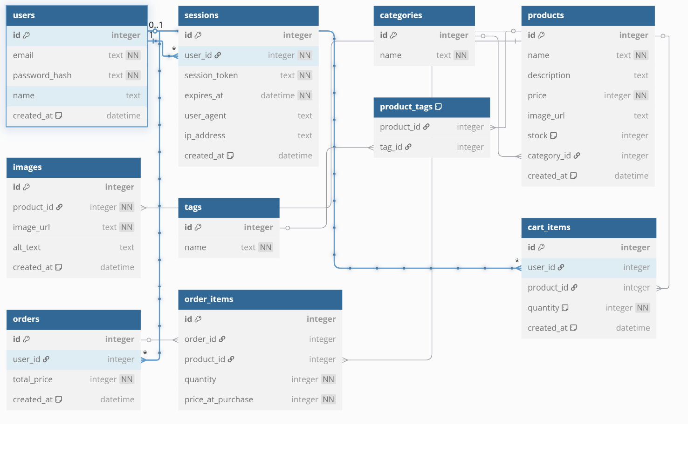

::: tip sessions テーブル
:::
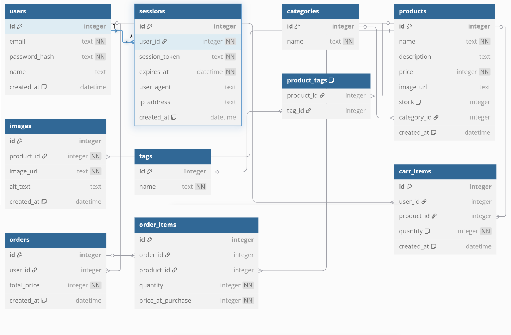

::: tip products テーブル
:::
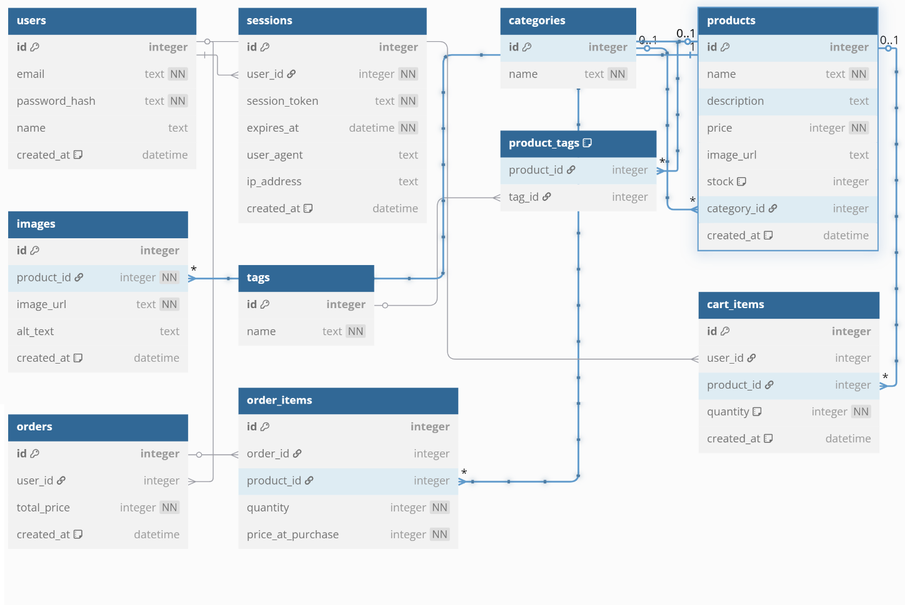

::: tip images テーブル
:::
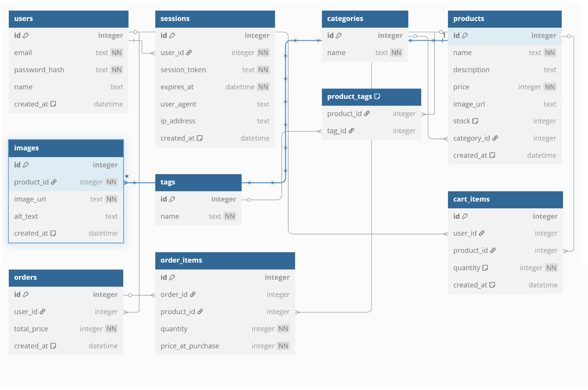

::: tip cart_items テーブル
:::
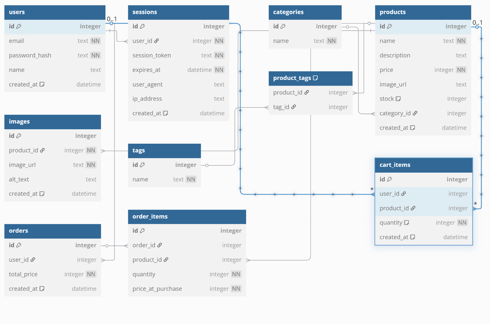

::: tip orders テーブル
:::
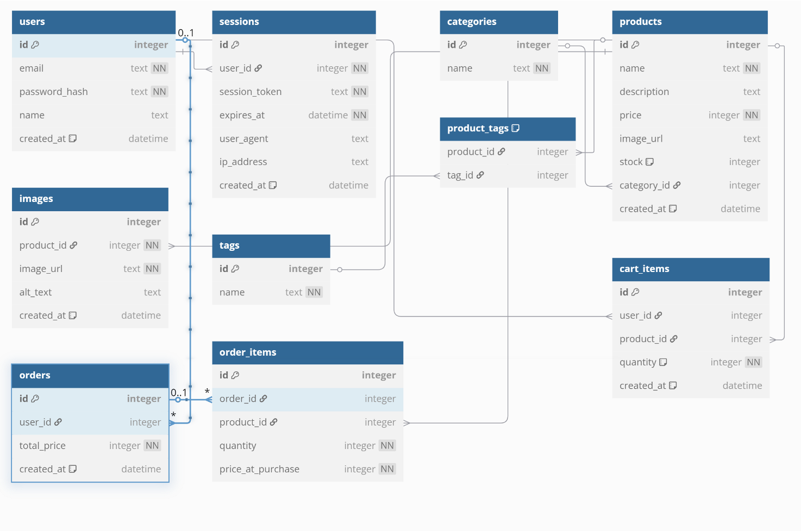

::: tip order_items テーブル
:::
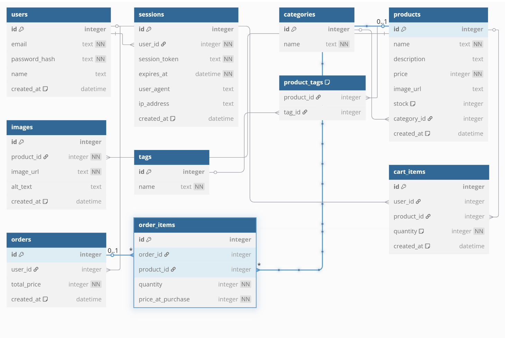

::: tip categories テーブル
:::
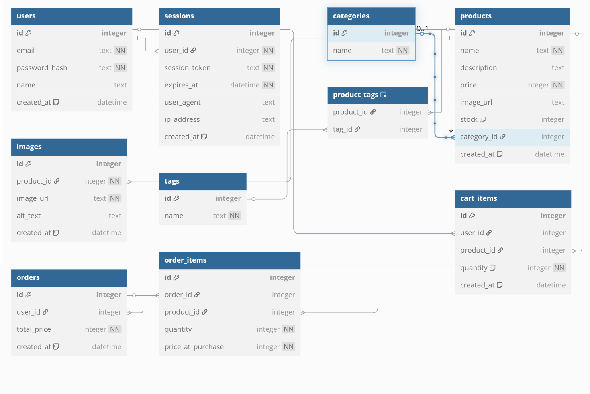

::: tip product_tags テーブル
:::
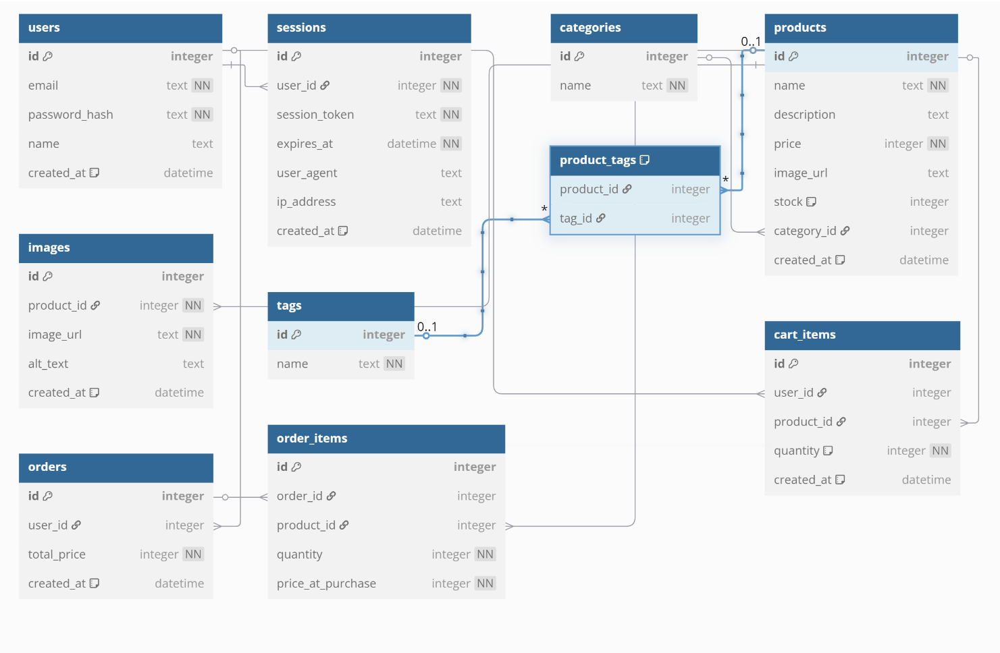

::: tip tags テーブル
:::
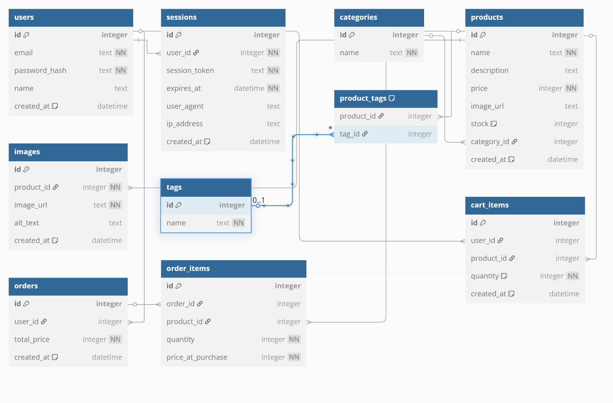

erDiagram

```
users ||--o{ sessions : "1:N"
users ||--o{ cart_items : "1:N"
users ||--o{ orders : "1:N"
categories ||--o{ products : "1:N"
products ||--o{ images : "1:N"
products ||--o{ product_tags : "1:N"
tags ||--o{ product_tags : "1:N"
orders ||--o{ order_items : "1:N"
products ||--o{ order_items : "1:N"
products ||--o{ cart_items : "1:N"
```
