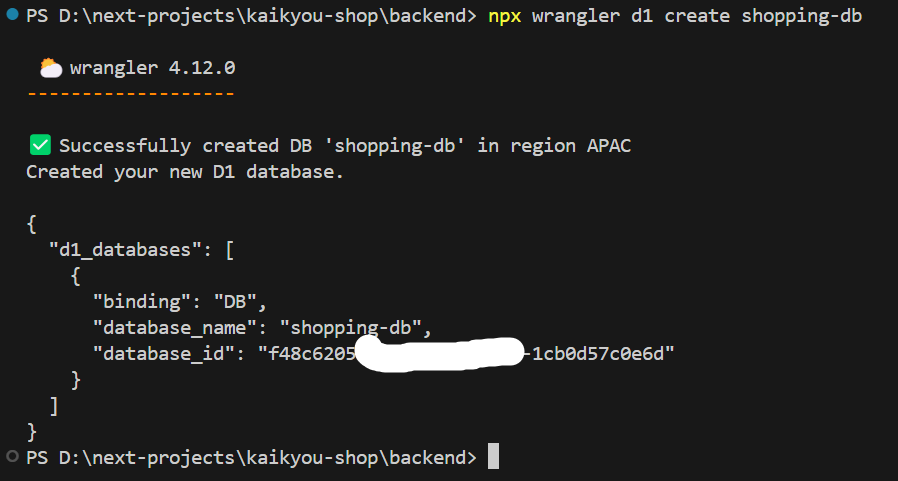
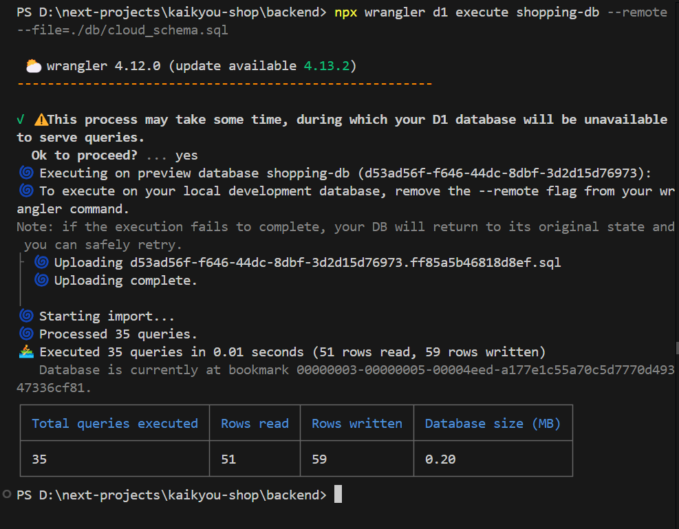
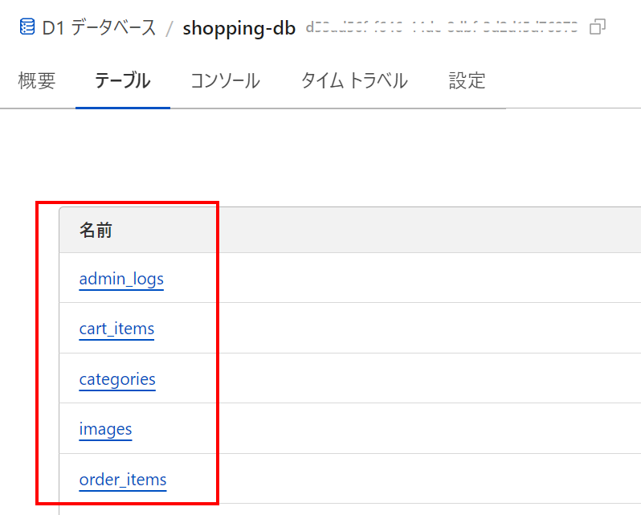
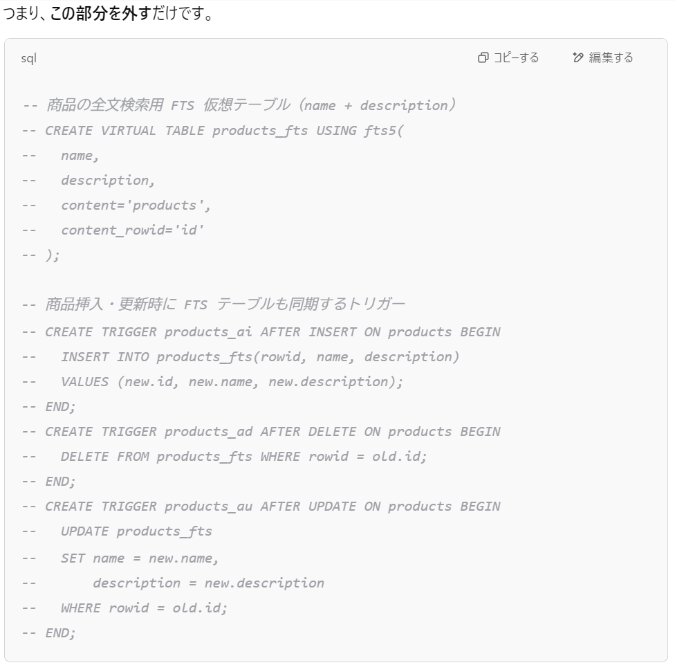
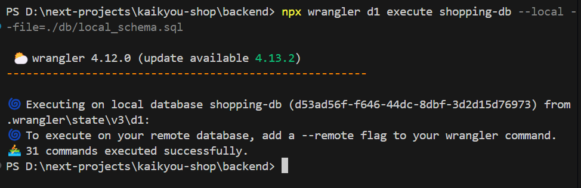
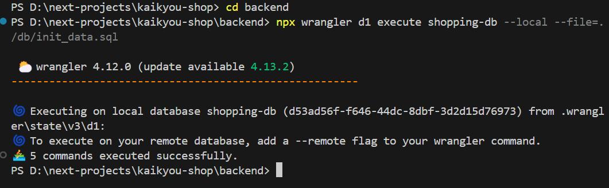
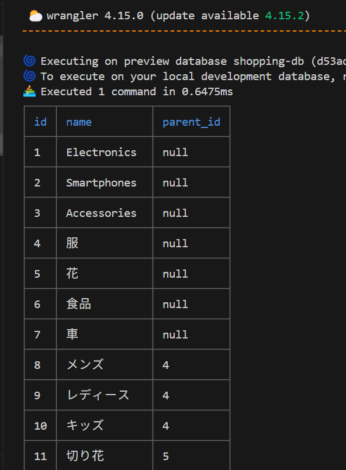
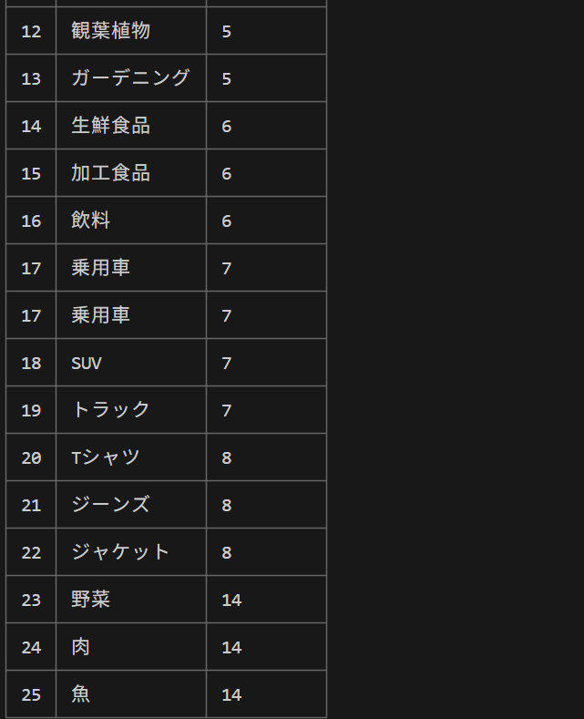

# Cloudflare D1 データベースのセットアップ

✅ Cloudflare D1 データベースを作成します。

```sh
npx wrangler d1 create shopping-db

```

※注意

Cloudflare D1 データベースを作成した後、Miniflare（ローカルエミュレータ）もローカル環境で Cloudflare D1 データベースの振る舞いを模倣する準備を整えます。そのため、新にローカルでデータベースを作成する必要がないです。

backend\wrangler.jsonc


-　**_✅ Cloudflare D1 データベースにテーブルを作成します。_**

[cloud_schema.sql をそのまま使います](/guide/keikaku3#✅-cloud-schema-sql)

```sh
npx wrangler d1 execute shopping-db --remote --file=./db/cloud_schema.sql
```

実行成功

Cloudflare ダッシュボードで確認


- ✅ **_ローカルでテーブルを作成します。_**

  [cloud_schema.sql をコーピして local_schema.sql にリネームします](/guide/keikaku3#✅-cloud-schema-sql)

  ※注意:

  ローカルでは仮想テーブル・トリガーをサーポートできないため、cloud_schema.sql からテーブル・トリガーを含むテーブルと記載を削除して local_schema.sql としてローカルで流す必要があります。
  

```sh
npx wrangler d1 execute shopping-db --local --file=./db/local_schema.sql
```

実行成功


初期データを作成するためには、ショッピングサイトに必要なテーブル（`products`, `categories`, `images`, `users` など）の内容を決定し、それに基づいてデータを挿入する必要があります。

### `products` テーブル

製品情報を格納するテーブルです。例えば以下のような初期データを作成できます。

```sql
INSERT INTO products (id, name, description, price, category_id, image_id, created_at, updated_at)
VALUES
  (1, 'Laptop', 'A powerful laptop with 16GB RAM and 512GB SSD', 1200.00, 1, 1, NOW(), NOW()),
  (2, 'Smartphone', 'Latest model smartphone with 5G support', 800.00, 2, 2, NOW(), NOW()),
  (3, 'Wireless Mouse', 'Ergonomic wireless mouse with Bluetooth', 30.00, 3, 3, NOW(), NOW());
```

### `categories` テーブル

製品カテゴリを定義するためのテーブルです。例えば以下のような初期データを作成できます。

```sql
INSERT INTO categories (id, name, created_at, updated_at)
VALUES
  (1, 'Electronics', NOW(), NOW()),
  (2, 'Smartphones', NOW(), NOW()),
  (3, 'Accessories', NOW(), NOW());
```

### `images` テーブル

製品に関連付けられた画像を格納するテーブルです。以下のようにデータを作成できます。

```sql
INSERT INTO images (id, url, created_at, updated_at)
VALUES
  (1, 'https://example.com/images/laptop.jpg', NOW(), NOW()),
  (2, 'https://example.com/images/smartphone.jpg', NOW(), NOW()),
  (3, 'https://example.com/images/mouse.jpg', NOW(), NOW());
```

### `users` テーブル

ユーザー情報を格納するテーブルです。例えば以下のような初期データを作成できます。

```sql
INSERT INTO users (id, name, email, password_hash, created_at, updated_at)
VALUES
  (1, 'John Doe', 'john.doe@example.com', 'hashedpassword123', NOW(), NOW()),
  (2, 'Jane Smith', 'jane.smith@example.com', 'hashedpassword456', NOW(), NOW());
```

### `orders` テーブル (オプション)

注文履歴を格納するテーブルです。以下のように作成できます。

```sql
INSERT INTO orders (id, user_id, total_amount, status, created_at, updated_at)
VALUES
  (1, 1, 1200.00, 'completed', NOW(), NOW()),
  (2, 2, 800.00, 'pending', NOW(), NOW());
```

### 初期データ挿入の手順

1. 上記の SQL 文を`local_schema.sql`に追記して実行します。
2. 例えば、`SELECT * FROM products;`を実行して、初期データが反映されているか確認します。

初期データは、ユーザーが実際に使用する前に、アプリケーションが正しく動作するか確認するために非常に重要です。

### 順番

1. **categories テーブル**

   - `products` テーブルのカテゴリを参照するため、まずはカテゴリ情報を定義する `categories` テーブルを作成します。

2. **products テーブル**

   - `categories` テーブルに依存しているため、次に `products` テーブルを作成します。

3. **images テーブル**

   - `products` テーブルに依存しており、画像が製品に関連するため、`products` の後に `images` を作成します。

4. **users テーブル**

   - `sessions` テーブルや `orders` テーブルが `users` を参照するため、`users` テーブルを先に作成します。

5. **orders テーブル**

   - `users` テーブルに依存しているので、`users` 作成後に `orders` テーブルを作成します。

6. **その他のテーブル（必要に応じて）**
   - `sessions` や `order_items`、`reviews` など、必要なテーブルを順番に作成します。

## 順番で初期データ実行の SQL 文

```sql
-- categories テーブル
INSERT INTO categories (id, name)
VALUES
  (1, 'Electronics'),
  (2, 'Smartphones'),
  (3, 'Accessories');

-- products テーブル
INSERT INTO products (id, name, description, price, category_id)
VALUES
  (1, 'Laptop', 'A powerful laptop with 16GB RAM and 512GB SSD', 1200, 1),
  (2, 'Smartphone', 'Latest model smartphone with 5G support', 800, 2),
  (3, 'Wireless Mouse', 'Ergonomic wireless mouse with Bluetooth', 30, 3);

-- images テーブル
INSERT INTO images (id, product_id, image_url)
VALUES
  (1, 1, 'https://example.com/images/laptop.jpg'),
  (2, 2, 'https://example.com/images/smartphone.jpg'),
  (3, 3, 'https://example.com/images/mouse.jpg');

-- users テーブル
INSERT INTO users (id, name, email, password_hash)
VALUES
  (1, 'John Doe', 'john.doe@example.com', 'hashedpassword123'),
  (2, 'Jane Smith', 'jane.smith@example.com', 'hashedpassword456');

-- orders テーブル
INSERT INTO orders (id, user_id, total_price, status)
VALUES
  (1, 1, 1200, 'completed'),
  (2, 2, 800, 'pending');

```

実行する

```sh
npx wrangler d1 execute shopping-db --local --file=./db/init_data.sql
```

実行成功


### まとめ

上記の順番に従って初期データとして挿入することで、アプリケーションが正しく動作する最低限のデータが揃えるようになります。

### 2025-05-19 よりカテゴリダミーデータ挿入

`insert_categories.sql`

```sql
-- 大分類の挿入（親カテゴリ）
INSERT INTO categories (name, parent_id) VALUES
('服', NULL),
('花', NULL),
('食品', NULL),
('車', NULL);

-- 中分類の挿入（子カテゴリ）
-- 服のサブカテゴリ
INSERT INTO categories (name, parent_id) VALUES
('メンズ', (SELECT id FROM categories WHERE name = '服')),
('レディース', (SELECT id FROM categories WHERE name = '服')),
('キッズ', (SELECT id FROM categories WHERE name = '服'));

-- 花のサブカテゴリ
INSERT INTO categories (name, parent_id) VALUES
('切り花', (SELECT id FROM categories WHERE name = '花')),
('観葉植物', (SELECT id FROM categories WHERE name = '花')),
('ガーデニング', (SELECT id FROM categories WHERE name = '花'));

-- 食品のサブカテゴリ
INSERT INTO categories (name, parent_id) VALUES
('生鮮食品', (SELECT id FROM categories WHERE name = '食品')),
('加工食品', (SELECT id FROM categories WHERE name = '食品')),
('飲料', (SELECT id FROM categories WHERE name = '食品'));

-- 車のサブカテゴリ
INSERT INTO categories (name, parent_id) VALUES
('乗用車', (SELECT id FROM categories WHERE name = '車')),
('SUV', (SELECT id FROM categories WHERE name = '車')),
('トラック', (SELECT id FROM categories WHERE name = '車'));

-- 小分類の挿入（さらに細かい分類）
-- メンズ服のサブカテゴリ
INSERT INTO categories (name, parent_id) VALUES
('Tシャツ', (SELECT id FROM categories WHERE name = 'メンズ' AND parent_id = (SELECT id FROM categories WHERE name = '服'))),
('ジーンズ', (SELECT id FROM categories WHERE name = 'メンズ' AND parent_id = (SELECT id FROM categories WHERE name = '服'))),
('ジャケット', (SELECT id FROM categories WHERE name = 'メンズ' AND parent_id = (SELECT id FROM categories WHERE name = '服')));

-- 生鮮食品のサブカテゴリ
INSERT INTO categories (name, parent_id) VALUES
('野菜', (SELECT id FROM categories WHERE name = '生鮮食品' AND parent_id = (SELECT id FROM categories WHERE name = '食品'))),
('肉', (SELECT id FROM categories WHERE name = '生鮮食品' AND parent_id = (SELECT id FROM categories WHERE name = '食品'))),
('魚', (SELECT id FROM categories WHERE name = '生鮮食品' AND parent_id = (SELECT id FROM categories WHERE name = '食品')));

-- サンプル商品の挿入（各カテゴリに1つずつ）
INSERT INTO products (name, description, price, stock, category_id) VALUES
('メンズデニムジーンズ', 'クラシックなデニムジーンズ。快適な履き心地。', 8900, 50, (SELECT id FROM categories WHERE name = 'ジーンズ')),
('バラの花束', '赤いバラ10本入りの豪華な花束。', 5500, 20, (SELECT id FROM categories WHERE name = '切り花')),
('有機野菜セット', '旬の有機野菜が5種類入ったセット。', 3200, 30, (SELECT id FROM categories WHERE name = '野菜')),
('コンパクトSUV', '燃費の良いコンパクトSUV。最新安全装備搭載。', 2980000, 5, (SELECT id FROM categories WHERE name = 'SUV'));

-- サンプル画像の挿入（各商品に1つずつメイン画像）
INSERT INTO images (product_id, image_url, alt_text, is_main) VALUES
((SELECT id FROM products WHERE name = 'メンズデニムジーンズ'), 'https://example.com/images/jeans1.jpg', 'デニムジーンズの画像', 1),
((SELECT id FROM products WHERE name = 'バラの花束'), 'https://example.com/images/rose_bouquet.jpg', 'バラの花束の画像', 1),
((SELECT id FROM products WHERE name = '有機野菜セット'), 'https://example.com/images/vegetable_set.jpg', '有機野菜セットの画像', 1),
((SELECT id FROM products WHERE name = 'コンパクトSUV'), 'https://example.com/images/suv_car.jpg', 'SUVの画像', 1);

```

実行する

```bash
npx wrangler d1 execute shopping-db --local --file=./db/insert_categories.sql
npx wrangler d1 execute shopping-db --remote --file=./db/insert_categories.sql
```

実行完了後の確認

```bash
npx wrangler d1 execute shopping-db --remote --command="SELECT * FROM categories;"
```




> ## 現時点での開発進捗

```text
kaikyou-shop/
├── frontend/                       # Next.js フロントエンド（App Router構成）
│   ├── app/                      # App Router対応ページ
│   │   ├── layout.tsx           # ルートレイアウト
│   │   ├── page.tsx             # 商品一覧ページ（旧 index.tsx）
│   │   ├── product/             # 動的ルーティング（商品詳細）
│   │   │   └── [id]/page.tsx    # 商品詳細ページ
│   │   ├── cart/                # カートページ
│   │   │   └── page.tsx
│   │   ├── checkout/            # チェックアウトページ
│   │   │   └── page.tsx
│   ├── components/              # 再利用可能な UI コンポーネント
│   ├── public/                  # 静的ファイル（画像など）
│   │   └── images/
│   ├── styles/                  # CSS, Tailwindなど
│   │   └── global.css
│   ├── utils/                   # フロント用ユーティリティ
│   │   └── api.ts
│   ├── .env.local               # 環境変数（APIエンドポイントなど）
│   ├── next.config.js          # Next.js 設定ファイル
│   └── tsconfig.json           # TypeScript 設定ファイル

├── backend/                       # Cloudflare Workers (APIサーバー)
│   ├── src/
│   │   ├── index.ts              # メインエントリーポイント
│   │   ├── routes/              # エンドポイントごとのAPI
│   │   │   ├── products.ts      # 商品取得API
│   │   │   ├── cart.ts          # カート操作API
│   ├── db/                      # D1スキーマやマイグレーション
│   │   ├── schema.sql
│   ├── wrangler.jsonc            # Cloudflare Workers の設定
│   ├── .env                     # DBのURLなど

├── README.md
└── package.json                  # ルート共通の依存管理（希望による）

```
