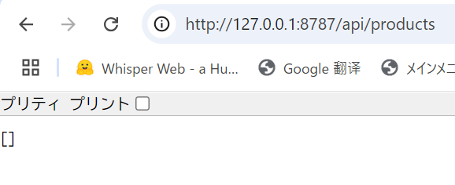

# フロントエンドとバックエンドの連携と API 開発準備

✅ まずは Next.js クライアントサイド＆Next.js サーバーサイド両方で使える環境変数を設定します。→
[環境変数設定ファイル](/code/kankyou)を参照

✅ Tailwind CSS をインストール・セットアップ →
[Tailwind CSS セットアップ](/code/css)を参照

✅ `backend/wrangler.jsonc`情報漏れ防止の設定 →[.gitignore 設定](/code/anzen)を参照

✅ `backend/wrangler.jsonc`の設定 →[入門設定ファイル](/code/setting)と[（Cloudflare Workers 本番）設定ファイル](/code/bk_kankyou)を参照

✅ Hono フレームワークのインストールして

backend に Hono を導入することで、シンプルで高速な REST API を構築できるようになります。

```sh
cd backend
npm install hono
```

✅ バックエンド API サーバーの更新。

backend\src\index.ts を開き、CORS ミドルウェアと基本ルート(GET API)の実装を追加する

```tsx
import { fromHono } from "chanfana";
import { Hono } from "hono";
import { TaskCreate } from "./endpoints/taskCreate";
import { TaskDelete } from "./endpoints/taskDelete";
import { TaskFetch } from "./endpoints/taskFetch";
import { TaskList } from "./endpoints/taskList";

type Bindings = {
  DB: D1Database;
};

const app = new Hono<{ Bindings: Bindings }>();

// CORS ミドルウェア（全ルート適用）
app.use("*", async (c, next) => {
  if (c.req.method === "OPTIONS") {
    return c.newResponse("", {
      status: 204,
      headers: {
        "Access-Control-Allow-Origin": "*",
        "Access-Control-Allow-Methods": "GET, POST, PUT, DELETE, OPTIONS",
        "Access-Control-Allow-Headers": "Content-Type, Authorization",
      },
    });
  }
  await next();
  c.header("Access-Control-Allow-Origin", "*");
});

// OpenAPIドキュメント生成設定
const openapi = fromHono(app, {
  docs_url: "/",
});

// OpenAPI経由で登録するルート
openapi.get("/api/tasks", TaskList);
openapi.post("/api/tasks", TaskCreate);
openapi.get("/api/tasks/:taskSlug", TaskFetch);
openapi.delete("/api/tasks/:taskSlug", TaskDelete);

// 基本ルート（D1 Database接続例）
app.get("/api/products", async (c) => {
  try {
    const { results } = await c.env.DB.prepare("SELECT * FROM products").all();
    return c.json(results);
  } catch (error) {
    console.error("Error fetching products:", error);
    return c.json({ error: "サーバーエラーが発生しました" }, 500);
  }
});

export default app;
```

✅ 起動コマンド（ローカルモード）

`--local` をつけることで、Cloudflare Workers を 自分の PC 上の D1 データベース（SQLite）に接続して起動できます。

```sh
npx wrangler dev --local

```

起動後にブラウザで確認できます。


基本ルート(GET API)も無事確認できました。


### 次は API 開発の準備を進めます。

### fromHono 関連の全部削除

- もうフロントとバックエンドの連携が確認できたので、fromHono をはずします。原因としては fromHono のバージョン問題でこれからの開発に妨害するからです。
  

✅ 初期データを投入しておきます。

→[順番で初期データ実行の SQL 文](/guide/keikaku4.html#順番で初期データ実行の-sql-文)を参照

ここまで出来ましたら API 開発の準備が完了となります。
