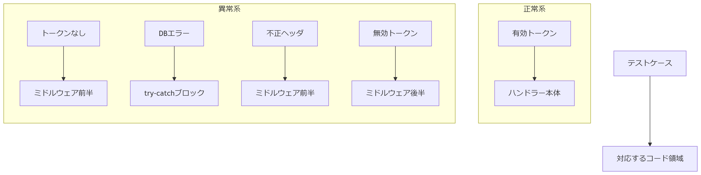
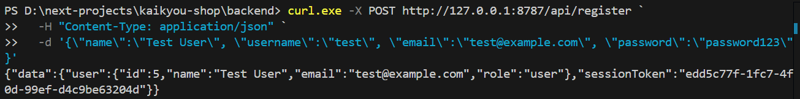

# REST API の POST メッソドの開発

🎉  
では、次のステップとして「POST API（商品登録・カート追加・ユーザー登録など）」を実装していきましょう。👏

---

## ✅ POST API 実装プラン（Cloudflare Workers）

### 商品新規登録

| API エンドポイント | 説明                   | 実装状況 |
| ------------------ | ---------------------- | -------- |
| POST /api/products | 新しい商品を登録する   | 完成     |
| POST /api/cart     | カートに商品を追加する | 未完成   |
| POST /api/users    | 新規ユーザー登録       | 未完成   |
| POST /api/orders   | 注文を確定する         | 未完成   |

- 相対パス (../../) の多用を防げるために、src/ ディレクトリをルートとして扱う
  backend\tsconfig.json
  
  

### 2.曖昧な書き方を直す

- `"rootDir": "."`と`"outDir": ""`は非推薦
  

### 3.fromHono 関連の全部削除

- `import { fromHono } from "chanfana";`のインポートはやめました。原因としてはまだよくないバージョンでいろいろ問題が発生したからです。
  

---

まずは一番簡単な「商品登録」の POST API からスタートしましょう。

## 「商品登録」 POST API

### frontend

画像アップロード機能も統合する商品登録ページ。

`frontend\app\product\create\page.tsx`

```tsx
"use client";

import { useState, useRef, useEffect, ChangeEvent } from "react";
import { useRouter } from "next/navigation";
import Link from "next/link";

type ProductFormData = {
  name: string;
  description: string;
  price: number;
  stock: number;
  category_id?: number;
};

type Category = {
  id: number;
  name: string;
};

const MAX_MAIN_IMAGE_SIZE = 5 * 1024 * 1024; // 5MB
const MAX_ADDITIONAL_IMAGE_SIZE = 2 * 1024 * 1024; // 2MB
const MAX_ADDITIONAL_IMAGES = 5;

export default function ProductCreatePage() {
  const router = useRouter();
  const [formData, setFormData] = useState<ProductFormData>({
    name: "",
    description: "",
    price: 0,
    stock: 0,
  });
  const [categories, setCategories] = useState<Category[]>([]);
  const [mainImage, setMainImage] = useState<File | null>(null);
  const [additionalImages, setAdditionalImages] = useState<File[]>([]);
  const [mainImagePreview, setMainImagePreview] = useState<string | null>(null);
  const [additionalPreviews, setAdditionalPreviews] = useState<string[]>([]);
  const [isLoading, setIsLoading] = useState(false);
  const [error, setError] = useState<string | null>(null);
  const additionalInputRef = useRef<HTMLInputElement>(null);

  // カテゴリデータの取得
  useEffect(() => {
    const fetchCategories = async () => {
      try {
        const apiUrl = process.env.NEXT_PUBLIC_API_BASE_URL;
        if (!apiUrl) {
          throw new Error("APIエンドポイントが設定されていません");
        }

        const response = await fetch(`${apiUrl}/api/categories`);
        if (!response.ok) {
          throw new Error("カテゴリの取得に失敗しました");
        }
        const data = await response.json();
        setCategories(data);
      } catch (err) {
        console.error("カテゴリ取得エラー:", err);
        setError(
          err instanceof Error
            ? err.message
            : "カテゴリ取得中にエラーが発生しました"
        );
      }
    };

    fetchCategories();
  }, []);

  // メモリリーク防止
  useEffect(() => {
    return () => {
      if (mainImagePreview) URL.revokeObjectURL(mainImagePreview);
      additionalPreviews.forEach((preview) => URL.revokeObjectURL(preview));
    };
  }, [mainImagePreview, additionalPreviews]);

  const handleChange = (
    e: React.ChangeEvent<
      HTMLInputElement | HTMLTextAreaElement | HTMLSelectElement
    >
  ) => {
    const { name, value } = e.target;
    setFormData((prev) => ({
      ...prev,
      [name]:
        name === "price" || name === "stock" || name === "category_id"
          ? value === ""
            ? undefined
            : Number(value)
          : value,
    }));
  };

  const handleMainImageChange = (e: ChangeEvent<HTMLInputElement>) => {
    if (!e.target.files?.[0]) return;

    const file = e.target.files[0];

    if (file.size > MAX_MAIN_IMAGE_SIZE) {
      setError(
        `メイン画像は${
          MAX_MAIN_IMAGE_SIZE / 1024 / 1024
        }MB以下のサイズにしてください`
      );
      return;
    }

    // 既存のプレビューを解放
    if (mainImagePreview) URL.revokeObjectURL(mainImagePreview);

    setMainImage(file);
    setMainImagePreview(URL.createObjectURL(file));
    setError(null);
  };

  const handleAdditionalImagesChange = (e: ChangeEvent<HTMLInputElement>) => {
    if (!e.target.files || e.target.files.length === 0) return;

    const newFiles = Array.from(e.target.files);
    const currentCount = additionalImages.length;
    const availableSlots = MAX_ADDITIONAL_IMAGES - currentCount;

    if (newFiles.length > availableSlots) {
      setError(
        `追加画像は最大${MAX_ADDITIONAL_IMAGES}枚までです。あと${availableSlots}枚追加できます。`
      );
      return;
    }

    // サイズチェック
    for (const file of newFiles) {
      if (file.size > MAX_ADDITIONAL_IMAGE_SIZE) {
        setError(
          `追加画像は${
            MAX_ADDITIONAL_IMAGE_SIZE / 1024 / 1024
          }MB以下のサイズにしてください`
        );
        return;
      }
    }

    const combinedFiles = [...additionalImages, ...newFiles];
    const combinedPreviews = [
      ...additionalPreviews,
      ...newFiles.map((file) => URL.createObjectURL(file)),
    ];

    setAdditionalImages(combinedFiles);
    setAdditionalPreviews(combinedPreviews);
    setError(null);

    // 入力値をリセット
    if (additionalInputRef.current) additionalInputRef.current.value = "";
  };

  const removeAdditionalImage = (index: number) => {
    const newFiles = [...additionalImages];
    newFiles.splice(index, 1);

    const newPreviews = [...additionalPreviews];
    URL.revokeObjectURL(newPreviews[index]);
    newPreviews.splice(index, 1);

    setAdditionalImages(newFiles);
    setAdditionalPreviews(newPreviews);
    setError(null);
  };

  const resetForm = () => {
    setFormData({ name: "", description: "", price: 0, stock: 0 });
    setMainImage(null);
    if (mainImagePreview) URL.revokeObjectURL(mainImagePreview);
    setMainImagePreview(null);
    additionalPreviews.forEach((preview) => URL.revokeObjectURL(preview));
    setAdditionalImages([]);
    setAdditionalPreviews([]);
  };

  const handleSubmit = async (e: React.FormEvent) => {
    e.preventDefault();
    setIsLoading(true);
    setError(null);

    try {
      // バリデーション
      if (!formData.name.trim()) throw new Error("商品名を入力してください");
      if (formData.price <= 0)
        throw new Error("価格は0より大きい値を入力してください");
      if (!mainImage) throw new Error("メイン画像を選択してください");

      const apiUrl = process.env.NEXT_PUBLIC_API_BASE_URL;
      if (!apiUrl) throw new Error("APIエンドポイントが設定されていません");

      const formDataToSend = new FormData();

      // 商品情報
      Object.entries(formData).forEach(([key, value]) => {
        if (value !== undefined) formDataToSend.append(key, value.toString());
      });

      // 画像データ
      formDataToSend.append("mainImage", mainImage);
      additionalImages.forEach((file) =>
        formDataToSend.append("additionalImages", file)
      );

      // APIリクエスト
      const response = await fetch(`${apiUrl}/api/products`, {
        method: "POST",
        body: formDataToSend,
      });

      if (!response.ok) {
        const errorData = await response.json();
        throw new Error(errorData.message || "商品登録に失敗しました");
      }

      const result = await response.json();
      resetForm();
      router.push(`/product/${result.id}`);
    } catch (err) {
      console.error("商品登録エラー:", err);
      setError(
        err instanceof Error ? err.message : "商品登録中にエラーが発生しました"
      );
    } finally {
      setIsLoading(false);
    }
  };

  return (
    <div className="p-6 max-w-2xl mx-auto">
      <h1 className="text-2xl font-bold mb-6">新規商品登録</h1>

      {error && (
        <div className="mb-4 p-4 bg-red-100 text-red-700 rounded-md">
          {error}
        </div>
      )}

      <form onSubmit={handleSubmit} className="space-y-4">
        {/* 商品基本情報 */}
        <div>
          <label className="block mb-1 font-medium text-gray-700">
            商品名<span className="text-red-500">*</span>
          </label>
          <input
            type="text"
            name="name"
            value={formData.name}
            onChange={handleChange}
            required
            className="w-full p-2 border border-gray-300 rounded-md focus:ring-2 focus:ring-blue-500 focus:border-blue-500"
          />
        </div>

        <div>
          <label className="block mb-1 font-medium text-gray-700">説明</label>
          <textarea
            name="description"
            value={formData.description}
            onChange={handleChange}
            className="w-full p-2 border border-gray-300 rounded-md focus:ring-2 focus:ring-blue-500 focus:border-blue-500"
            rows={4}
          />
        </div>

        <div className="grid grid-cols-2 gap-4">
          <div>
            <label className="block mb-1 font-medium text-gray-700">
              価格<span className="text-red-500">*</span>
            </label>
            <input
              type="number"
              name="price"
              value={formData.price || ""}
              onChange={handleChange}
              min="1"
              step="1"
              required
              className="w-full p-2 border border-gray-300 rounded-md focus:ring-2 focus:ring-blue-500 focus:border-blue-500"
            />
          </div>

          <div>
            <label className="block mb-1 font-medium text-gray-700">
              在庫数
            </label>
            <input
              type="number"
              name="stock"
              value={formData.stock || ""}
              onChange={handleChange}
              min="0"
              className="w-full p-2 border border-gray-300 rounded-md focus:ring-2 focus:ring-blue-500 focus:border-blue-500"
            />
          </div>
        </div>

        {/* カテゴリ選択 */}
        <div>
          <label className="block mb-1 font-medium text-gray-700">
            カテゴリ
          </label>
          <select
            name="category_id"
            value={formData.category_id ?? ""}
            onChange={handleChange}
            className="w-full p-2 border border-gray-300 rounded-md focus:ring-2 focus:ring-blue-500 focus:border-blue-500"
          >
            <option value="">--カテゴリを選択--</option>
            {categories.map((category) => (
              <option key={category.id} value={category.id}>
                {category.name}
              </option>
            ))}
          </select>
        </div>

        {/* 画像アップロード */}
        <div>
          <label className="block mb-1 font-medium text-gray-700">
            メイン画像<span className="text-red-500">*</span>
          </label>
          <input
            type="file"
            accept="image/*"
            onChange={handleMainImageChange}
            required
            className="w-full p-2 border border-gray-300 rounded-md focus:ring-2 focus:ring-blue-500 focus:border-blue-500"
          />
          <p className="text-sm text-gray-500 mt-1">
            {MAX_MAIN_IMAGE_SIZE / 1024 / 1024}MB以下の画像を選択してください
          </p>
          {mainImagePreview && (
            <div className="mt-2">
              <p className="text-sm text-gray-500 mb-1">プレビュー:</p>
              
            </div>
          )}
        </div>

        <div>
          <label className="block mb-1 font-medium text-gray-700">
            追加画像 (最大{MAX_ADDITIONAL_IMAGES}枚)
          </label>
          <input
            type="file"
            accept="image/*"
            multiple
            onChange={handleAdditionalImagesChange}
            ref={additionalInputRef}
            disabled={additionalImages.length >= MAX_ADDITIONAL_IMAGES}
            className="w-full p-2 border border-gray-300 rounded-md focus:ring-2 focus:ring-blue-500 focus:border-blue-500 disabled:opacity-50"
          />
          <p className="text-sm text-gray-500 mt-1">
            {MAX_ADDITIONAL_IMAGE_SIZE / 1024 / 1024}
            MB以下の画像を選択してください (残り
            {MAX_ADDITIONAL_IMAGES - additionalImages.length}枚追加可能)
          </p>
          {additionalPreviews.length > 0 && (
            <div className="mt-2">
              <p className="text-sm text-gray-500 mb-1">追加画像プレビュー:</p>
              <div className="flex flex-wrap gap-2">
                {additionalPreviews.map((preview, index) => (
                  <div key={index} className="relative group">
                    
                    <button
                      type="button"
                      onClick={() => removeAdditionalImage(index)}
                      className="absolute -top-2 -right-2 bg-red-500 text-white rounded-full w-6 h-6 flex items-center justify-center text-sm opacity-0 group-hover:opacity-100 transition-opacity shadow-md"
                      aria-label="画像を削除"
                    >
                      ×
                    </button>
                  </div>
                ))}
              </div>
            </div>
          )}
        </div>

        {/* 送信ボタン */}
        <div className="flex space-x-4 pt-6">
          <button
            type="submit"
            disabled={isLoading}
            className="flex-1 bg-blue-600 text-white py-3 px-4 rounded-md hover:bg-blue-700 disabled:bg-blue-300 transition-colors shadow-md flex justify-center items-center"
          >
            {isLoading ? (
              <>
                <svg
                  className="animate-spin -ml-1 mr-2 h-5 w-5 text-white"
                  xmlns="http://www.w3.org/2000/svg"
                  fill="none"
                  viewBox="0 0 24 24"
                >
                  <circle
                    className="opacity-25"
                    cx="12"
                    cy="12"
                    r="10"
                    stroke="currentColor"
                    strokeWidth="4"
                  ></circle>
                  <path
                    className="opacity-75"
                    fill="currentColor"
                    d="M4 12a8 8 0 018-8V0C5.373 0 0 5.373 0 12h4zm2 5.291A7.962 7.962 0 014 12H0c0 3.042 1.135 5.824 3 7.938l3-2.647z"
                  ></path>
                </svg>
                登録中...
              </>
            ) : (
              "商品を登録"
            )}
          </button>

          <Link
            href="/"
            className="flex-1 text-center bg-gray-200 text-gray-800 py-3 px-4 rounded-md hover:bg-gray-300 transition-colors shadow-md"
          >
            キャンセル
          </Link>
        </div>
      </form>
    </div>
  );
}
```

### 主要な良い点の体系化

1. **堅牢性の向上**

   - メモリリーク防止: `URL.revokeObjectURL`を適切に実行
   - 環境変数の必須チェック: `NEXT_PUBLIC_API_BASE_URL`の確認
   - リソース解放: フォームリセット時にプレビュー URL を解放

2. **ユーザー体験の最適化**

   - ローディング状態の可視化: 送信ボタンの状態管理
   - リアルタイムフィードバック: 残り追加可能枚数の表示
   - 直感的な操作: 画像削除ボタンのホバー表示

3. **コードの保守性強化**

   - 定数の一元管理: 画像サイズ制限などを定数化
   - 型安全性の向上: 厳密な TypeScript 型定義
   - 関心の分離: フォームリセット処理を関数化

4. **視覚的な改善**
   - シャドウ効果の追加: ボタンや画像に立体感
   - レスポンシブデザイン: グリッドレイアウトの最適化
   - アクセシビリティ: ARIA 属性の適切な使用

この実装は、実際のプロダクション環境でも十分通用する完成度です。さらに拡張する場合、以下のような機能追加を検討できます：

- ドラッグ＆ドロップでの画像アップロード
- 画像のトリミングや編集機能
- バリデーションライブラリ（Zod など）の導入
- マルチステップフォームへの分割
- 画像の非同期アップロード（進捗表示付き）

### backend

#### productPostHandler インポート構成の整備

- wrangler.jsonc プロジェクト設定ファイルの更新

`backend\wrangler.jsonc`

```jsonc
{
  "$schema": "node_modules/wrangler/config-schema.json",
  "name": "backend",
  "main": "src/worker.ts",
  "compatibility_date": "2025-04-18",

  "d1_databases": [
    {
      "binding": "DB",
      "database_name": "shopping-db",
      "database_id": "f48c6205-4a37-4438-811e-1cb0d57c0e6d"
    }
  ],

  "r2_buckets": [
    {
      "binding": "R2_BUCKET",
      "bucket_name": "dev-bucket",
      "preview_bucket_name": "preview-bucket"
    }
  ],

  "vars": {
    "JWT_SECRET": "local_dev_secret_do_not_use_in_prod",
    "JWT_ISSUER": "kaikyou-shop-dev",
    "JWT_AUDIENCE": "kaikyou-shop-users-dev",
    "ENVIRONMENT": "development",
    "R2_PUBLIC_DOMAIN": "localhost:8787/assets" // ローカル開発用URL
  },

  "env": {
    "production": {
      "vars": {
        "JWT_SECRET": "{{ JWT_SECRET_PRODUCTION }}",
        "JWT_ISSUER": "kaikyou-shop",
        "JWT_AUDIENCE": "kaikyou-shop-users",
        "ENVIRONMENT": "production",
        "R2_PUBLIC_DOMAIN": "assets.example.com" // 本番用URL
      },
      "r2_buckets": [
        {
          "binding": "R2_BUCKET",
          "bucket_name": "production-bucket"
        }
      ]
    }
  }
}
```

- クラウドストレージ・ユーティリティ関数の実装

多環境対応ストレージ実装（AWS S3 + Cloudflare R2）

| 機能           | Cloudflare R2      | AWS S3       |
| -------------- | ------------------ | ------------ |
| コスト         | 無料枠あり         | 従量課金     |
| パフォーマンス | エッジ最適化       | リージョン別 |
| 統合           | Workers と直接連携 | 汎用性高い   |

package.json の依存関係 `npm install @paralleldrive/cuid2`

`backend\src\lib\storage.ts`

```typescript
// backend/src/lib/storage.ts
import { createId } from "@paralleldrive/cuid2";
import type { R2Bucket } from "@cloudflare/workers-types";

export interface StorageResult {
  url: string;
  key: string;
}

export const uploadToR2 = async (
  bucket: R2Bucket,
  file: File,
  publicDomain: string,
  options: { folder?: string } = {}
): Promise<StorageResult> => {
  const { folder = "uploads" } = options;
  const fileExt = file.name.split(".").pop();
  const key = `${folder}/${createId()}.${fileExt}`;

  await bucket.put(key, file, {
    httpMetadata: {
      contentType: file.type,
    },
  });

  return {
    url: `https://${publicDomain}/${key}`,
    key,
  };
};

// 簡易版取得関数
export const getFromR2 = async (
  bucket: R2Bucket,
  key: string
): Promise<ReadableStream | null> => {
  const object = await bucket.get(key);
  return object?.body ?? null;
};
```

- 商品の登録・更新などに使う入力データのバリデーションスキーマを zod ライブラリで定義

`backend\src\schemas\product.ts`

```typescript
import { z } from "zod";

export const productSchema = z
  .object({
    name: z.preprocess(
      (val) => val?.toString().trim(),
      z
        .string()
        .min(1, "商品名は必須です")
        .max(100, "商品名は100文字以内で入力してください")
    ),
    description: z.preprocess(
      (val) => val?.toString().trim(),
      z
        .string()
        .max(1000, "説明文は1000文字以内で入力してください")
        .optional()
        .transform((val) => val || null)
    ),
    price: z.preprocess(
      (val) => Number(val),
      z
        .number()
        .int("価格は整数で入力してください")
        .positive("正の値を指定してください")
    ),
    stock: z.preprocess(
      (val) => Number(val || 0),
      z
        .number()
        .int("在庫数は整数で入力してください")
        .min(0, "在庫数は0以上の値を指定してください")
        .default(0)
    ),
    category_id: z.preprocess(
      (val) => (val === null || val === "" ? null : Number(val)),
      z
        .number()
        .int("カテゴリIDは整数で入力してください")
        .positive("カテゴリIDは正の値を指定してください")
        .nullable()
        .optional()
    ),
  })
  .strict();

export type ProductSchema = z.infer<typeof productSchema>;
```

- アプリ全体の型定義ファイルを更新

  `backend\src\types\types.ts`

```ts
import type { D1Database, R2Bucket } from "@cloudflare/workers-types";
import { z } from "zod";
import { productSchema } from "../schemas/product";
/**
 * Cloudflare Worker にバインドされる環境変数
 * （wrangler.toml の [vars] や D1データベースなど）
 */
export interface Env {
  DB: D1Database;
  JWT_SECRET: string;
  JWT_ISSUER: string;
  JWT_AUDIENCE: string;
  ENVIRONMENT: "development" | "production" | "staging";
  R2_BUCKET: R2Bucket;
  R2_PUBLIC_DOMAIN: string;
}

/**
 * 後方互換のために保持している型エイリアス
 * 現在は Env と同一内容
 */
export interface Bindings extends Env {}

/**
 * JWT トークンから復号されるペイロード情報
 */
export interface JwtPayload {
  user_id: number;
  email: string;
  exp: number;
  iat?: number;
  iss?: string;
  aud?: string | string[];
}

/**
 * Hono コンテキストで使用する一時変数（リクエストごとのスコープ）
 * jwtMiddleware などでセットされる
 */
export interface Variables {
  jwtPayload?: JwtPayload; // 検証済みJWTペイロード（未認証なら undefined）
}

/**
 * カート内の商品1件のデータ型
 * API レスポンス用に追加情報フィールドを含む
 */
export interface CartItem {
  id: number;
  product_id: number;
  user_id: number | null;
  session_id: string | null;
  quantity: number;
  created_at: string;

  // ===== 計算・表示用フィールド（レスポンス用） =====
  subtotal?: number; // = price × quantity
  name?: string; // 商品名
  price?: number; // 単価
  image_url?: string; // 商品画像URL
}

/**
 * エラーレスポンスの統一フォーマット
 */
export interface ErrorResponse {
  error: {
    code: string;
    message: string;
    details?: z.typeToFlattenedError<z.infer<typeof productSchema>>; // 具体的なスキーマ型を使用
    issues?: Array<{
      path: (string | number)[];
      message: string;
    }>;
    solution?: string;
  };
}

/**
 * 成功レスポンスの統一フォーマット（汎用ジェネリック）
 */
export interface SuccessResponse<T = unknown> {
  data: T;
  meta?: {
    page?: number;
    per_page?: number;
    total?: number;
  };
}

/**
 * Hono の Context に拡張変数を型として登録
 * ctx.get('jwtPayload') などの補完が効くようになる
 */
declare module "hono" {
  interface ContextVariableMap {
    jwtPayload?: JwtPayload; // 認証オプショナルに統一
  }
}

// ストレージ関連の型（必要に応じて拡張）
export interface StorageConfig {
  folder?: string;
  maxFileSize?: number;
}

export interface ProductCreateResponse {
  success: boolean;
  data: {
    id: number;
    name: string;
    price: number;
    stock: number;
    images: {
      main: string;
      additional: string[];
    };
    createdAt: string;
  };
}
```

商品登録 productPostHandler の実装

`backend\src\endpoints\productCreate.ts`

```typescript
import { Context } from "hono";
import { Bindings, ErrorResponse, ProductCreateResponse } from "types/types";
import { productSchema } from "schemas/product";
import { uploadToR2 } from "lib/storage";

export const productPostHandler = async (
  c: Context<{ Bindings: Bindings }>
): Promise<Response> => {
  try {
    const formData = await c.req.formData();

    // フォームデータの前処理
    const rawFormData = {
      name: formData.get("name"),
      description: formData.get("description"),
      price: formData.get("price"),
      stock: formData.get("stock") || 0,
      category_id: formData.get("category_id"),
    };

    // バリデーション
    const validationResult = productSchema.safeParse(rawFormData);
    if (!validationResult.success) {
      return c.json(
        {
          error: {
            code: "VALIDATION_ERROR",
            message: "入力内容に誤りがあります",
            details: validationResult.error.flatten(),
          },
        } satisfies ErrorResponse,
        400
      );
    }

    // 画像処理
    const mainImageFile = formData.get("mainImage") as File | null;
    const additionalImageFiles = formData.getAll("additionalImages") as File[];

    if (!mainImageFile?.size) {
      return c.json(
        {
          error: {
            code: "MISSING_MAIN_IMAGE",
            message: "メイン画像が必須です",
          },
        } satisfies ErrorResponse,
        400
      );
    }

    // R2アップロード
    const [mainImage, additionalImages] = await Promise.all([
      uploadToR2(c.env.R2_BUCKET, mainImageFile, c.env.R2_PUBLIC_DOMAIN, {
        folder: "products/main",
      }),
      Promise.all(
        additionalImageFiles
          .filter((file) => file.size > 0)
          .map((file) =>
            uploadToR2(c.env.R2_BUCKET, file, c.env.R2_PUBLIC_DOMAIN, {
              folder: "products/additional",
            })
          )
      ),
    ]);

    // DB操作
    const productInsert = await c.env.DB.prepare(
      `INSERT INTO products (
          name, description, price, stock, category_id, 
          main_image_url, created_at
        ) VALUES (?, ?, ?, ?, ?, ?, ?) RETURNING id;`
    )
      .bind(
        validationResult.data.name,
        validationResult.data.description,
        validationResult.data.price,
        validationResult.data.stock,
        validationResult.data.category_id,
        mainImage.url,
        new Date().toISOString()
      )
      .first<{ id: number }>();

    // 追加画像登録
    if (additionalImages.length > 0) {
      await c.env.DB.batch(
        additionalImages.map((img) =>
          c.env.DB.prepare(
            `INSERT INTO product_images (
                product_id, image_url, created_at
              ) VALUES (?, ?, ?)`
          ).bind(productInsert.id, img.url, new Date().toISOString())
        )
      );
    }

    // レスポンス
    return c.json(
      {
        success: true,
        data: {
          id: productInsert.id,
          name: validationResult.data.name,
          price: validationResult.data.price,
          stock: validationResult.data.stock, // 追加
          images: {
            main: mainImage.url,
            additional: additionalImages.map((img) => img.url),
          },
          createdAt: new Date().toISOString(), // 追加
        },
      } satisfies ProductCreateResponse,
      201
    );
  } catch (error) {
    console.error("Error:", error);
    return c.json(
      {
        error: {
          code: "INTERNAL_ERROR",
          message: "処理に失敗しました",
        },
      } satisfies ErrorResponse,
      500
    );
  }
};
```
