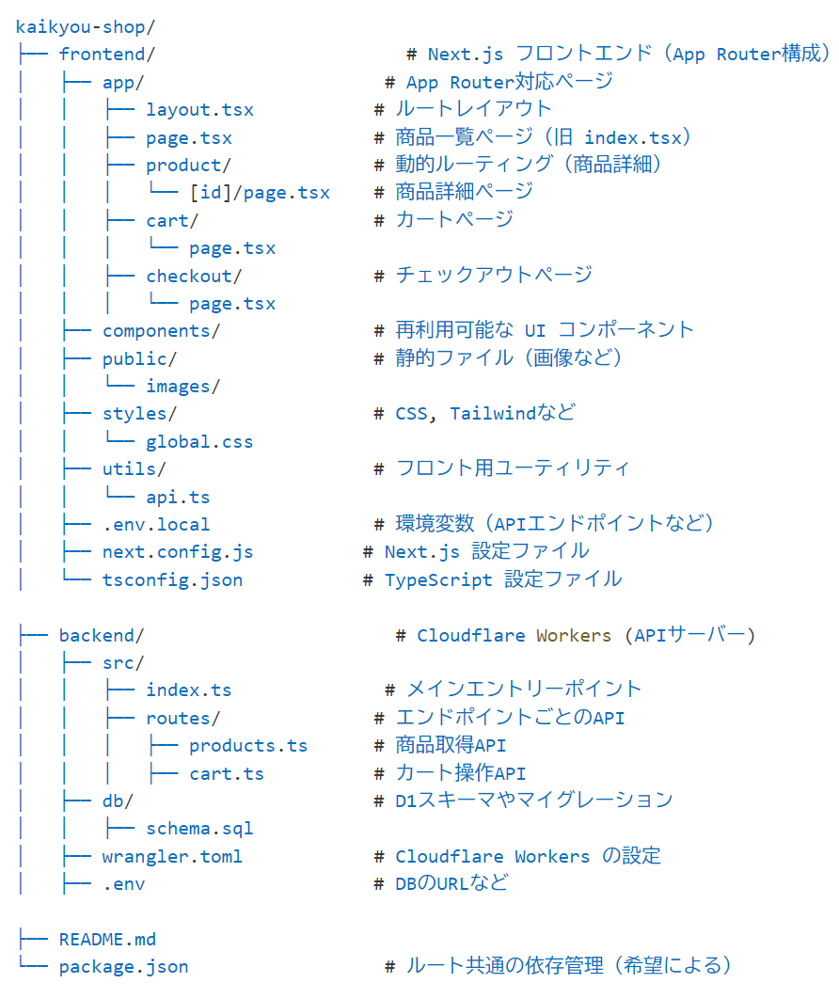
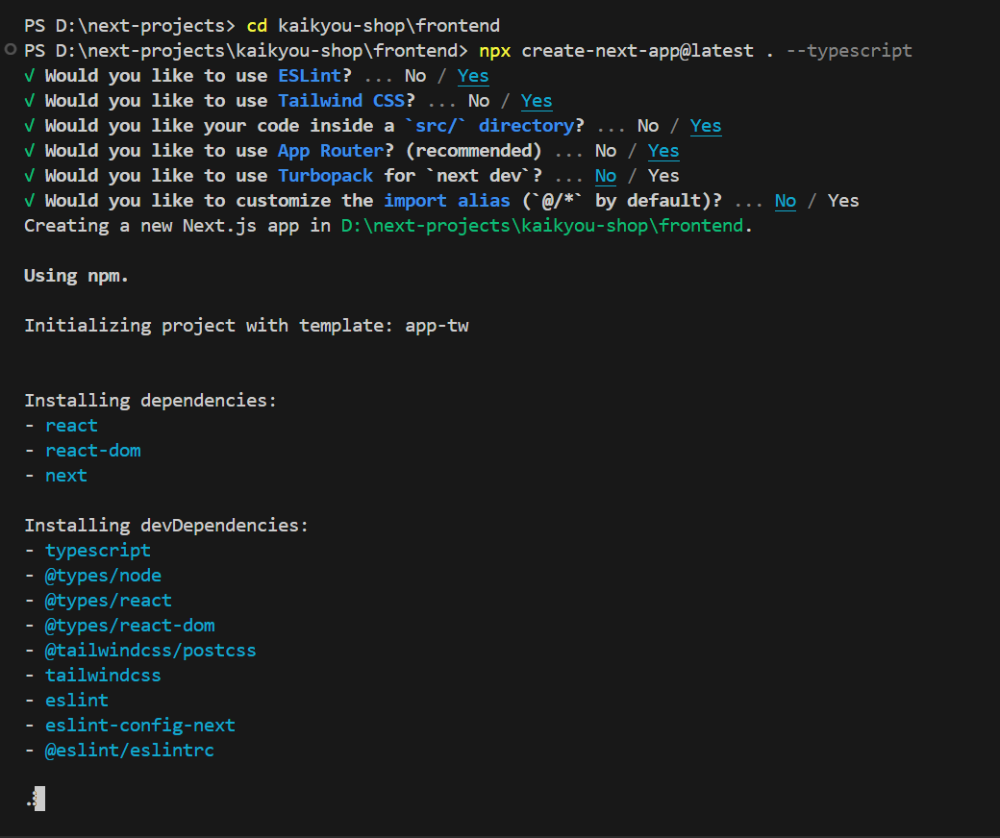
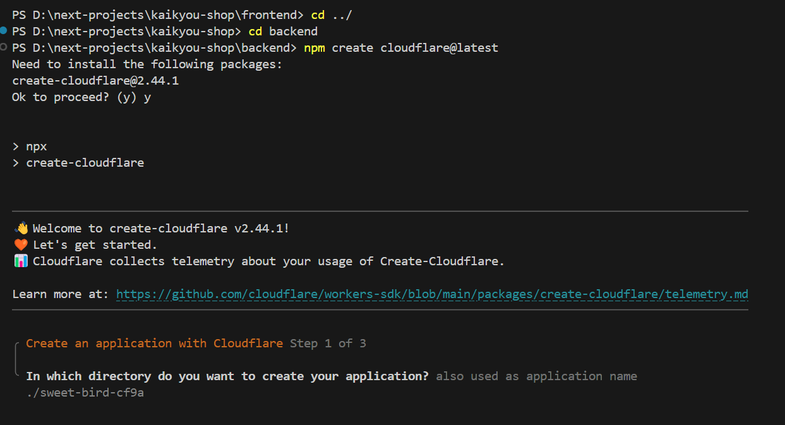
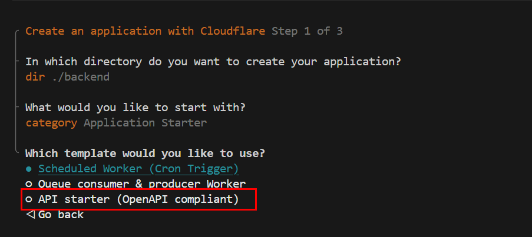
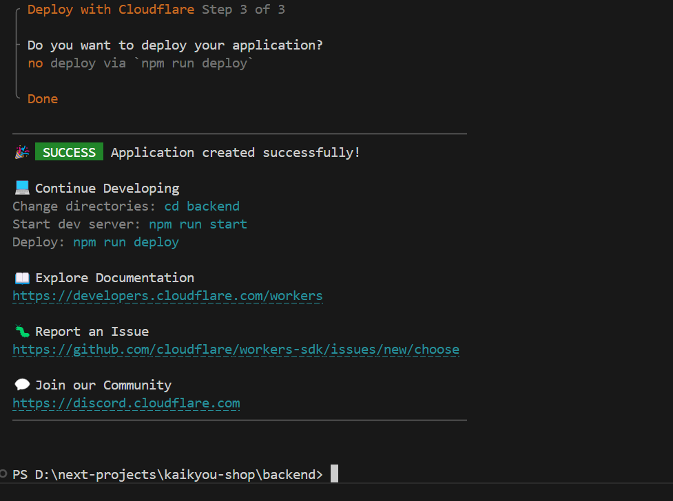
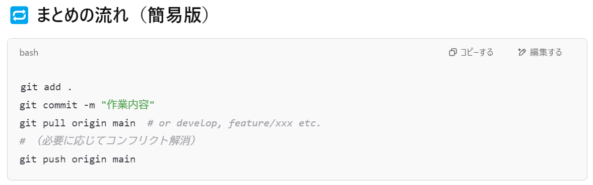

# 001オンラインショップのセットアップ

✅ プロジェクト構成（分離構造）
以下は、Next.js + Cloudflare D1 を使ったショッピングサイトに適した、調整済みの構造です：

```
kaikyou-shop/
├── frontend/                          # Next.js フロントエンド（App Router 構成）
│   ├── app/
│   │   ├── layout.tsx
│   │   ├── page.tsx                   # 商品一覧ページ（/）
│   │   ├── product/
│   │   │   └── [id]/page.tsx          # 商品詳細ページ（/product/:id）
│   │   ├── cart/
│   │   │   └── page.tsx               # カートページ（/cart）
│   │   ├── checkout/
│   │   │   └── page.tsx               # チェックアウトページ（/checkout）
│   ├── components/                    # ボタンやカードなど再利用 UI コンポーネント群
│   ├── public/
│   │   └── images/                    # 商品画像などの静的ファイル
│   ├── styles/
│   │   └── global.css
│   ├── utils/
│   │   └── api.ts                     # API 呼び出し用ユーティリティ
│   ├── .env.local                     # フロントエンド用環境変数（BASE_URL など）
│   ├── next.config.js
│   └── tsconfig.json

├── backend/                           # Cloudflare Workers バックエンド
│   ├── src/
│   │   ├── index.ts                   # Hono アプリのエントリーポイント（ルーティング）
│   │   ├── endpoints/                 # 各 API エンドポイント（分割管理）
│   │   │   ├── productCreate.ts       # POST /api/products（商品登録）
│   │   │   ├── productGet.ts          # GET /api/products（商品一覧）
│   │   │   ├── getCart.ts             # GET /api/cart（カート取得）
│   │   │   ├── productUpdate.ts       # PUT /api/products/:id（未実装・予定）
│   │   │   ├── productDelete.ts       # DELETE /api/products/:id（未実装・予定）
│   │   ├── middleware/
│   │   │   └── jwt.ts                 # JWT ミドルウェア（認証用）
│   │   └── types.ts                   # 共通の型定義（Bindings, CartItem, ErrorResponse 等）
│   ├── db/
│   │   └── schema.sql                 # Cloudflare D1 スキーマ定義（products, cart_items 他）
│   ├── wrangler.jsonc                 # Cloudflare Workers 設定（bindings, routes 等）
│   ├── .env                           # バックエンド用環境変数

├── README.md
└── package.json                       # Monorepo 管理（ルートパッケージマネージャ）
```
✅ 実行イメージ：
frontend/ → npm run dev で Next.js をローカルで開発・表示

backend/ → npx wrangler dev で API を開発（Cloudflare Workers）

両者は .env.local などで URL を連携させて通信

✅ kaikyou-shop ディレクトリを作って、その中に frontend / backend をそれぞれ作成。

frontend に create-next-app を実行する形に：
```bash
mkdir kaikuyou-shop
cd kaikyou-shop
mkdir frontend backend
cd frontend
npx create-next-app@latest . --typescript
```

✅ あとは backend に Cloudflare Worker のコードや設定を入れれば OK。
今すぐこの構成で作ってみましょう：
```bash
D:
cd kaikyou-shop
cd backend
npm create cloudflare@latest . 

```

✅ GitHub に作成する時の確認ポイント：

> 💡 **ポイント**  
> 「Initialize this repository with a README」は**絶対にチェックを外してください**。  
> これはローカルから `git push` する際の競合を避けるためです。

| 設定項目           | 内容                                             |
|--------------------|--------------------------------------------------|
| Repository name     | `kaikyou-online-shop`                           |
| Description         | 任意（例：React + Next.js ショップサイト）     |
| Visibility          | Public または Private                           |
| Initialize repo     | ❌ チェックしない（空のままに）                |


🔧 これからの流れ（おすすめ）

✅ Step 1: frontend/ に Next.js プロジェクト作成
```bash
cd D:\next-projects\frontend
npx create-next-app@latest . --typescript
```
✅ Step 2: backend/ に Cloudflare Workers セットアップ
```bash
cd D:\next-projects\backend
npm create cloudflare@latest . 
# 対話形式で「D1使用するか」など選びます（後でも設定可能）
```
✅ Step 3: プロジェクト全体を GitHub に push
```bash
cd D:\next-projects
git init
git add .
git commit -m "Initial project with Next.js frontend and Cloudflare backend"
git remote add origin https://github.com/kaikyou76/kaikyou-online-shop.git
git branch -M main
git push -u origin main

```
**フロントエンドのブロジェクトの作成**
```bash
PS D:\next-projects> cd kaikyou-shop\frontend
PS D:\next-projects\kaikyou-shop\frontend> npx create-next-app@latest . --typescript
? Would you like to use ESLint? » No / Yes
```

🔧 質問の答え方（おすすめ）
❓Would you like to use ESLint?
👉 Yes をおすすめします
→ ESLint はコード品質を保ってくれるので、あとで困りにくくなります。

```sh
PS D:\next-projects> cd kaikyou-shop\frontend
PS D:\next-projects\kaikyou-shop\frontend> npx create-next-app@latest . --typescript
√ Would you like to use ESLint? ... No / Yes
√ Would you like to use Tailwind CSS? ... No / Yes
√ Would you like your code inside a `src/` directory? ... No / Yes
√ Would you like to use App Router? (recommended) ... No / Yes
√ Would you like to use Turbopack for `next dev`? ... No / Yes
√ Would you like to customize the import alias (`@/*` by default)? ... No / Yes
Creating a new Next.js app in D:\next-projects\kaikyou-shop\frontend.

Using npm.

Initializing project with template: app-tw 


Installing dependencies:
- react
- react-dom
- next

Installing devDependencies:
- typescript
- @types/node
- @types/react
- @types/react-dom
- @tailwindcss/postcss
- tailwindcss
- eslint
- eslint-config-next
- @eslint/eslintrc


added 320 packages, and audited 321 packages in 1m

130 packages are looking for funding
  run `npm fund` for details

found 0 vulnerabilities
Success! Created frontend at D:\next-projects\kaikyou-shop\frontend

PS D:\next-projects\kaikyou-shop\frontend> 
```
**バックエンドのCloudflare Workers プロジェクトの作成**


❓選択肢の意味とおすすめ
✅ ● Hello World example
Cloudflare Workers の最小限のテンプレート。

学習や自分で構成を作っていきたい場合におすすめ。

シンプルなので、自分でルーティング・D1 DBなどを追加する余地がある。

○ Framework Starter
Hono（Cloudflare 向けの小型な Web フレームワーク）など、よく使われるフレームワークがセットになったスターター。

もし「Hono + D1」で開発をスムーズに始めたいならこちらも◎。

○ Application Starter
本格的な Cloudflare Worker アプリのテンプレート（ログ・認証なども含まれることがある）。

::: tip オススメ理由
以下の理由で **`Application Starter`** を選ぶのが最適です：
:::

| 理由            | 説明                                                                 |
|-----------------|----------------------------------------------------------------------|
| 🧰 多機能な初期構成 | ルーティング、API ハンドラ、環境変数、エラーハンドリングなど基本がセット済み。 |
| 🛠 フルアプリ向き   | 小規模な "Hello World" ではカバーできない、複雑なロジック（カートや注文処理）に柔軟対応。 |
| 🏗 構造が本番に近い | 後々 AWS への公開や Spring Boot 版の移植も視野に入れてるなら、最初からしっかりした構成が◎。 |




::: tip 今回の選択はこれ！
🛒 **オンラインショップ用のバックエンドには「API starter (OpenAPI compliant)」を選びましょう！**

以下のような理由があります：

| ✅ 理由 | ✨ 説明 |
|--------|--------|
| 🎯 目的に合致 | 商品一覧、カート、注文処理などの API を構築するのに最適な構成です。 |
| 📦 OpenAPI 対応 | API ドキュメントを自動生成したり、外部連携や将来的なスマホアプリにも対応しやすくなります。 |
| ⚙ 開発に便利 | `router.ts` や `handlers/` ディレクトリなど、すぐに使える構造が初期から用意されています。 |
:::

::: warning 注意
🛑 他のテンプレート（`Scheduled Worker`, `Queue Consumer` など）は今回のオンラインショップ構築には不要です。
:::


::: info Cloudflare Workers セットアップログ（吹き出し風まとめ）
🛠 **Cloudflare Workers アプリ作成～Wrangler 構成までの全手順**

## 🚀 Step 1: Create an application with Cloudflare

| ステップ | 内容 |
|--------|------|
| 📁 アプリ作成先 | `dir ./backend` に決定 |
| 📦 スターター選択 | `Application Starter` カテゴリを選択 |
| 📑 テンプレート選択 | `API starter (OpenAPI compliant)` を使用 |
| 🧳 テンプレートコピー | 必要なファイルがディレクトリにコピーされました |
| 📦 依存関係インストール | `npm install` により自動で依存解決 |
| ✅ アプリケーション作成完了 | 初期セットアップが完了しました |

---

## 🧰 Step 2: Configuring your application for Cloudflare

| ステップ | 内容 |
|--------|------|
| 🔧 Wrangler インストール | `npm install wrangler --save-dev` により CLI ツール追加 |
| 🧠 型定義の追加 | `@cloudflare/workers-types` がインストールされました |
| 📚 TypeScript 設定更新 | `tsconfig.json` に `@cloudflare/workers-types/2023-07-01` が追加されました |
| 📅 互換性日付の取得 | `compatibility_date: 2025-04-18` が自動設定 |
| 🗂 `.gitignore` 更新 | Wrangler 関連ファイルを無視対象に追加 |
| 🧾 Git リポジトリ確認 | 既存の Git リポジトリを検出。バージョン管理に使用するか確認されました |

:::

::: tip 補足
作成された構成ファイル（例：`wrangler.toml`, `src/index.ts`）や `openapi.yaml` に基づいて API をカスタマイズしていくことができます。  
今後は `wrangler dev` でローカルサーバを起動し、`fetch` や `OpenAPI` 仕様に沿った開発を進めましょう。
:::

::: info Cloudflare Workers セットアップログ（吹き出し風まとめ）
🛠 **Cloudflare Workers アプリ作成～Wrangler構成とデプロイ確認**

## 🚀 Step 1: Create an application with Cloudflare

| ステップ | 内容 |
|--------|------|
| 📁 アプリ作成先 | `dir ./backend` に決定 |
| 📦 スターター選択 | `Application Starter` カテゴリを選択 |
| 📑 テンプレート選択 | `API starter (OpenAPI compliant)` を使用 |
| 🧳 テンプレートコピー | 必要なファイルがディレクトリにコピーされました |
| 📦 依存関係インストール | `npm install` により自動で依存解決 |
| ✅ アプリケーション作成完了 | 初期セットアップが完了しました |

---

## 🧰 Step 2: Configuring your application for Cloudflare

| ステップ | 内容 |
|--------|------|
| 🔧 Wrangler インストール | `npm install wrangler --save-dev` により CLI ツール追加 |
| 🧠 型定義の追加 | `@cloudflare/workers-types` がインストールされました |
| 📚 TypeScript 設定更新 | `tsconfig.json` に `@cloudflare/workers-types/2023-07-01` が追加されました |
| 📅 互換性日付の取得 | `compatibility_date: 2025-04-18` が自動設定 |
| 🗂 `.gitignore` 更新 | Wrangler 関連ファイルを無視対象に追加 |
| 🧾 Git リポジトリ確認 | 既存の Git リポジトリを検出。バージョン管理に使用するか確認されました |

---

## ☁️ Step 3: デプロイの確認

| ステップ | 内容 |
|--------|------|
| 🚀 デプロイ確認 | `Do you want to deploy your application?` に対して `Yes / No` を選択 |

:::

::: tip 補足
- `Yes` を選ぶと、Cloudflare アカウント認証 → 自動デプロイが実行されます。
- `No` を選んでも、後で `npx wrangler deploy` で手動デプロイ可能です。
- デプロイ後のエンドポイントは `wrangler.toml` の `name` と Cloudflare アカウント設定に基づいて決定されます。

:::


**No を選んでます**


No を選んだことで、Cloudflare Workers のプロジェクトは ローカル開発用として初期化完了しました。
まだデプロイはしていませんが、後で好きなタイミングで以下のコマンドを使ってデプロイできます：
```sh
npx wrangler deploy
```
✅kaikyou-shop ディレクトリで git init を実行して Git リポジトリを初期化するのが最適です
その理由は以下のとおりです：

✅ この構成のメリット
1つのリポジトリで全体を一括管理できる

frontend と backend の両方をまとめて GitHub に push・管理

GitHub 上でもプロジェクト構成が明確に見える

README.md で全体の説明を書きやすい

将来 Monorepo 管理（TurboRepoやNxなど）に拡張しやすい

🧭 手順（GitHubリポジトリにpushまで）
```sh
cd D:/next-projects/kaikyou-shop

# Git初期化（もうしていなければ）
git init

# .gitignore の確認（frontend, backendそれぞれの内容まとめておくとよい）
# 例:
echo "node_modules/" >> .gitignore
echo ".next/" >> .gitignore
echo "dist/" >> .gitignore

# 最初のコミット
git add .
git commit -m "initial commit with frontend and backend"

# GitHubにリモート接続
git remote add origin https://github.com/kaikyou76/kaikyou-online-shop.git

# push（mainブランチに）
git branch -M main
git push -u origin main

```
実行結果
```sh
PS D:\next-projects\kaikyou-shop> git init
Initialized empty Git repository in D:/next-projects/kaikyou-shop/.git/
PS D:\next-projects\kaikyou-shop> echo "node_modules/" >> .gitignore
PS D:\next-projects\kaikyou-shop> echo ".next/" >> .gitignore
PS D:\next-projects\kaikyou-shop> echo "dist/" >> .gitignore
PS D:\next-projects\kaikyou-shop> git add .
warning: in the working copy of 'backend/backend/.gitignore', LF will be replaced by CRLF the next time Git touches it
warning: in the working copy of 'backend/backend/.vscode/settings.json', LF will be replaced by CRLF the next time Git touches it
warning: in the working copy of 'backend/backend/README.md', LF will be replaced by CRLF the next time Git touches it
warning: in the working copy of 'backend/backend/package-lock.json', LF will be replaced by CRLF the next time Git touches it
warning: in the working copy of 'backend/backend/package.json', LF will be replaced by CRLF the next time Git touches it
warning: in the working copy of 'backend/backend/src/endpoints/taskCreate.ts', LF will be replaced by CRLF the next time Git touches it
warning: in the working copy of 'backend/backend/src/endpoints/taskDelete.ts', LF will be replaced by CRLF the next time Git touches it
warning: in the working copy of 'backend/backend/src/endpoints/taskFetch.ts', LF will be replaced by CRLF the next time Git touches it
warning: in the working copy of 'backend/backend/src/endpoints/taskList.ts', LF will be replaced by CRLF the next time Git touches it
warning: in the working copy of 'backend/backend/src/index.ts', LF will be replaced by CRLF the next time Git touches it
warning: in the working copy of 'backend/backend/src/types.ts', LF will be replaced by CRLF the next time Git touches it
warning: in the working copy of 'backend/backend/tsconfig.json', LF will be replaced by CRLF the next time Git touches it
warning: in the working copy of 'backend/backend/worker-configuration.d.ts', LF will be replaced by CRLF the next time Git touches it
warning: in the working copy of 'backend/backend/wrangler.jsonc', LF will be replaced by CRLF the next time Git touches it
warning: in the working copy of 'frontend/.gitignore', LF will be replaced by CRLF the next time Git touches it   
warning: in the working copy of 'frontend/README.md', LF will be replaced by CRLF the next time Git touches it
warning: in the working copy of 'frontend/eslint.config.mjs', LF will be replaced by CRLF the next time Git touches it
warning: in the working copy of 'frontend/next.config.ts', LF will be replaced by CRLF the next time Git touches it
warning: in the working copy of 'frontend/package-lock.json', LF will be replaced by CRLF the next time Git touches it
warning: in the working copy of 'frontend/package.json', LF will be replaced by CRLF the next time Git touches it
warning: in the working copy of 'frontend/postcss.config.mjs', LF will be replaced by CRLF the next time Git touches it
warning: in the working copy of 'frontend/src/app/globals.css', LF will be replaced by CRLF the next time Git touches it
warning: in the working copy of 'frontend/src/app/layout.tsx', LF will be replaced by CRLF the next time Git touches it
warning: in the working copy of 'frontend/src/app/page.tsx', LF will be replaced by CRLF the next time Git touches it
warning: in the working copy of 'frontend/tsconfig.json', LF will be replaced by CRLF the next time Git touches it
PS D:\next-projects\kaikyou-shop> git commit -m "initial commit with frontend and backend"
[master (root-commit) 3770654] initial commit with frontend and backend
 32 files changed, 8415 insertions(+)
 create mode 100644 .gitignore
 create mode 100644 backend/backend/.gitignore
 create mode 100644 backend/backend/.vscode/settings.json
 create mode 100644 backend/backend/README.md
 create mode 100644 backend/backend/package-lock.json
 create mode 100644 backend/backend/package.json
 create mode 100644 backend/backend/src/endpoints/taskCreate.ts
 create mode 100644 backend/backend/src/endpoints/taskDelete.ts
 create mode 100644 backend/backend/src/endpoints/taskFetch.ts
 create mode 100644 backend/backend/src/endpoints/taskList.ts
 create mode 100644 backend/backend/src/index.ts
 create mode 100644 backend/backend/src/types.ts
 create mode 100644 backend/backend/tsconfig.json
 create mode 100644 backend/backend/worker-configuration.d.ts
 create mode 100644 backend/backend/wrangler.jsonc
 create mode 100644 frontend/.gitignore
 create mode 100644 frontend/README.md
 create mode 100644 frontend/eslint.config.mjs
 create mode 100644 frontend/next.config.ts
 create mode 100644 frontend/package-lock.json
 create mode 100644 frontend/package.json
 create mode 100644 frontend/postcss.config.mjs
 create mode 100644 frontend/public/file.svg
 create mode 100644 frontend/public/globe.svg
 create mode 100644 frontend/public/next.svg
 create mode 100644 frontend/public/vercel.svg
 create mode 100644 frontend/public/window.svg
 create mode 100644 frontend/src/app/favicon.ico
 create mode 100644 frontend/src/app/globals.css
 create mode 100644 frontend/src/app/layout.tsx
 create mode 100644 frontend/src/app/page.tsx
 create mode 100644 frontend/tsconfig.json
PS D:\next-projects\kaikyou-shop> git remote add origin https://github.com/kaikyou76/kaikyou-online-shop.git
PS D:\next-projects\kaikyou-shop> git branch -M main
PS D:\next-projects\kaikyou-shop> git push -u origin main
Enumerating objects: 43, done.
Counting objects: 100% (43/43), done.
Delta compression using up to 8 threads
Compressing objects: 100% (40/40), done.
Writing objects: 100% (43/43), 75.59 KiB | 6.87 MiB/s, done.
Total 43 (delta 3), reused 0 (delta 0), pack-reused 0
remote: Resolving deltas: 100% (3/3), done.
To https://github.com/kaikyou76/kaikyou-online-shop.git
 * [new branch]      main -> main
branch 'main' set up to track 'origin/main'.
PS D:\next-projects\kaikyou-shop> 
```
