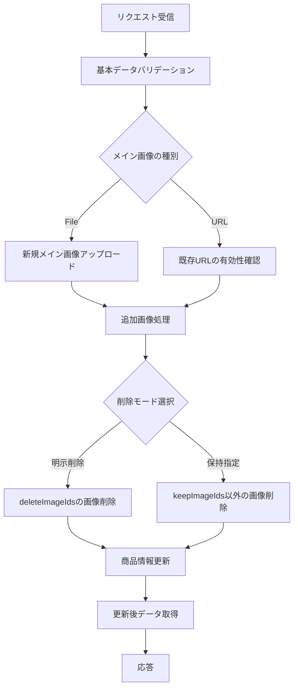
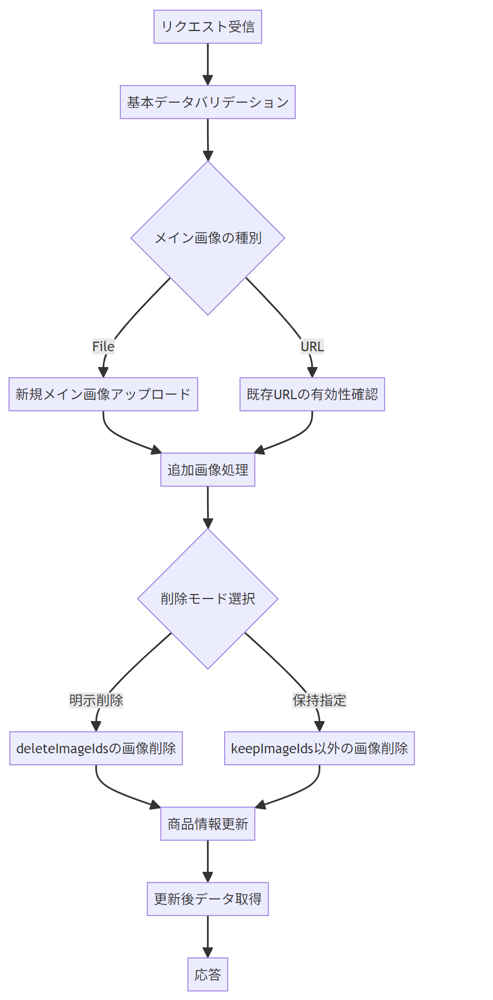

# 🛒 商品（Products）編集

`backend/src/endpoints/productEditById.ts`

```ts
// backend/src/endpoints/productEditById.ts
import { Context } from "hono";
import { Bindings, ErrorResponse, JwtPayload } from "../types/types";
import { productSchema } from "../schemas/product";
import { uploadToR2, deleteFromR2 } from "../lib/storage";

// ファイル検証用定数
const ALLOWED_MIME_TYPES = [
  "image/jpeg",
  "image/png",
  "image/webp",
  "image/gif",
];
const MAX_FILE_SIZE = 5 * 1024 * 1024; // 5MB
const VALID_EXTENSIONS = [".jpg", ".jpeg", ".png", ".webp", ".gif"];

// ファイル検証関数
const validateImageFile = (file: File, traceId: string) => {
  if (!ALLOWED_MIME_TYPES.includes(file.type)) {
    console.log(`[${traceId}] ❌ 無効なMIMEタイプ: ${file.type}`);
    throw new Error(`許可されていないファイル形式です: ${file.type}`);
  }

  if (file.size > MAX_FILE_SIZE) {
    console.log(`[${traceId}] ❌ ファイルサイズ超過: ${file.size} bytes`);
    throw new Error(
      `ファイルサイズが大きすぎます（最大${MAX_FILE_SIZE / 1024 / 1024}MB）`
    );
  }

  const extension = file.name.split(".").pop()?.toLowerCase();
  if (!extension || !VALID_EXTENSIONS.includes(`.${extension}`)) {
    console.log(`[${traceId}] ❌ 無効な拡張子: ${file.name}`);
    throw new Error("無効なファイル拡張子です");
  }
};

// FormDataEntryValueの型定義
type FormDataEntryValue = string | File;

type ProductResponse = {
  id: number;
  name: string;
  description: string;
  price: number;
  stock: number;
  category_id: number | null;
  created_at: string;
  images: {
    main: { id: number; url: string; is_main: true };
    additional: { id: number; url: string; is_main: false }[];
  };
};

export const productEditByIdHandler = async (
  c: Context<{ Bindings: Bindings; Variables: { jwtPayload?: JwtPayload } }>
): Promise<Response> => {
  const productId = c.req.param("id");
  const db = c.env.DB;

  const traceId = Math.random().toString(36).substr(2, 9);
  console.log(`[${traceId}] 🌟 商品更新プロセス開始`, new Date().toISOString());

  try {
    const payload = c.get("jwtPayload");
    if (!payload || payload.role !== "admin") {
      console.log(`[${traceId}] 🌟 認証失敗:`, {
        hasPayload: !!payload,
        role: payload?.role,
      });
      return c.json(
        {
          error: {
            code: !payload ? "UNAUTHORIZED" : "FORBIDDEN",
            message: !payload
              ? "認証が必要です"
              : "商品編集には管理者権限が必要です",
          },
        } satisfies ErrorResponse,
        !payload ? 401 : 403
      );
    }

    const formData = await c.req.formData();

    console.log(`[${traceId}] 🌟 受信FormData:`, {
      keepImageIds: formData.getAll("keepImageIds"),
      deleteImageIds: formData.getAll("deleteImageIds"),
      additionalImagesCount: formData.getAll("additionalImages").length,
      mainImageType: formData.get("mainImage")?.constructor.name,
      otherFields: {
        name: formData.get("name"),
        description: formData.get("description"),
        price: formData.get("price"),
        stock: formData.get("stock"),
        category_id: formData.get("category_id"),
      },
    });

    const rawFormData = {
      name: formData.get("name"),
      description: formData.get("description"),
      price: formData.get("price"),
      stock: formData.get("stock") || 0,
      category_id: formData.get("category_id"),
    };

    const validationResult = productSchema.safeParse(rawFormData);
    if (!validationResult.success) {
      console.log(
        `[${traceId}] 🌟 バリデーションエラー:`,
        validationResult.error.flatten()
      );
      return c.json(
        {
          error: {
            code: "VALIDATION_ERROR",
            message: "入力内容に誤りがあります",
            details: validationResult.error.flatten(),
          },
        } satisfies ErrorResponse,
        400
      );
    }

    const existingProduct = await db
      .prepare("SELECT id FROM products WHERE id = ?")
      .bind(productId)
      .first<{ id: number }>();

    if (!existingProduct) {
      console.log(`[${traceId}] 🌟 商品が見つかりません:`, productId);
      return c.json(
        {
          error: {
            code: "PRODUCT_NOT_FOUND",
            message: "編集対象の商品が見つかりません",
          },
        } satisfies ErrorResponse,
        404
      );
    }

    // 既存画像を取得
    const existingImages = await db
      .prepare("SELECT id, image_url, is_main FROM images WHERE product_id = ?")
      .bind(productId)
      .all<{ id: number; image_url: string; is_main: number }>();
    console.log(`[${traceId}] 🌟 既存画像情報:`, existingImages.results);

    // 削除処理ロジックの変数を前倒しで宣言
    const deleteImageIds = formData
      .getAll("deleteImageIds")
      .map((id) => {
        const num = Number(id);
        return isNaN(num) ? null : num;
      })
      .filter((id): id is number => id !== null);

    const keepImageIds = formData
      .getAll("keepImageIds")
      .map((id) => {
        const num = Number(id);
        return isNaN(num) ? null : num;
      })
      .filter((id): id is number => id !== null);

    // メイン画像処理
    const mainImageRaw = formData.get("mainImage") as File | string | null;
    let mainImageUrl: string | undefined;

    // メイン画像の必須チェック
    if (!mainImageRaw) {
      console.log(`[${traceId}] 🌟 メイン画像が未指定です`);
      return c.json(
        {
          error: {
            code: "MAIN_IMAGE_REQUIRED",
            message: "メイン画像は必須です",
          },
        } satisfies ErrorResponse,
        400
      );
    }

    // メイン画像削除連携チェック
    const deletingMainImage = deleteImageIds.some((id) =>
      existingImages.results?.some((img) => img.id === id && img.is_main === 1)
    );

    if (deletingMainImage) {
      console.log(`[${traceId}] 🔍 メイン画像削除検出`, {
        deleteIds: deleteImageIds,
      });

      if (!(mainImageRaw instanceof File)) {
        console.log(`[${traceId}] ❗ メイン画像置換不足エラー`);
        return c.json(
          {
            error: {
              code: "MAIN_IMAGE_REPLACEMENT_REQUIRED",
              message:
                "メイン画像を変更する場合は新しい画像をアップロードしてください",
            },
          } satisfies ErrorResponse,
          400
        );
      }
      console.log(`[${traceId}] ✅ メイン画像置換の整合性を確認`);
    }

    if (mainImageRaw instanceof File) {
      console.log(`[${traceId}] 🌟 新しいメイン画像を処理中...`);

      if (!mainImageRaw.size) {
        console.log(`[${traceId}] 🌟 空のメイン画像ファイル`);
        return c.json(
          {
            error: {
              code: "EMPTY_MAIN_IMAGE",
              message: "メイン画像ファイルが空です",
            },
          } satisfies ErrorResponse,
          400
        );
      }

      // メイン画像バリデーション
      try {
        validateImageFile(mainImageRaw, traceId);
      } catch (error) {
        return c.json(
          {
            error: {
              code: "INVALID_MAIN_IMAGE",
              message: error.message,
            },
          } satisfies ErrorResponse,
          400
        );
      }

      const oldMainImage = await db
        .prepare(
          "SELECT id, image_url FROM images WHERE product_id = ? AND is_main = 1"
        )
        .bind(productId)
        .first<{ id: number; image_url: string }>();

      const uploadResult = await uploadToR2(
        c.env.R2_BUCKET as R2Bucket,
        mainImageRaw,
        c.env.R2_PUBLIC_DOMAIN as string,
        { folder: "products/main" }
      );
      mainImageUrl = uploadResult.url;
      console.log(`[${traceId}] 🌟 メイン画像アップロード完了:`, mainImageUrl);

      if (oldMainImage?.image_url) {
        console.log(
          `[${traceId}] 🌟 古いメイン画像を削除:`,
          oldMainImage.image_url
        );
        await deleteFromR2(c.env.R2_BUCKET as R2Bucket, oldMainImage.image_url);
      }

      await db
        .prepare(
          "UPDATE images SET image_url = ? WHERE product_id = ? AND is_main = 1"
        )
        .bind(mainImageUrl, productId)
        .run();
    } else if (typeof mainImageRaw === "string") {
      console.log(`[${traceId}] 🌟 既存のメイン画像を保持:`, mainImageRaw);

      // URL有効性チェック
      if (
        !existingImages.results?.some((img) => img.image_url === mainImageRaw)
      ) {
        console.log(`[${traceId}] ❌ 無効なメイン画像URL`, {
          providedUrl: mainImageRaw,
        });
        return c.json(
          {
            error: {
              code: "INVALID_MAIN_IMAGE",
              message: "指定されたメイン画像が無効です",
            },
          } satisfies ErrorResponse,
          400
        );
      }

      mainImageUrl = mainImageRaw;
    }

    // 追加画像処理
    const additionalImages = (
      formData.getAll("additionalImages") as FormDataEntryValue[]
    ) // FormDataEntryValue[] にキャスト
      .filter((item): item is File => item instanceof File); // File 型のみを抽出
    const invalidFiles: { name: string; reason: string }[] = [];

    additionalImages.forEach((img) => {
      try {
        validateImageFile(img, traceId);
      } catch (error) {
        invalidFiles.push({
          name: img.name,
          reason: error.message,
        });
      }
    });

    if (invalidFiles.length > 0) {
      console.log(`[${traceId}] ❌ 無効な追加画像検出:`, invalidFiles);
      return c.json(
        {
          error: {
            code: "INVALID_ADDITIONAL_IMAGES",
            message: "追加画像に無効なファイルが含まれています",
            details: { invalidFiles },
          },
        } satisfies ErrorResponse,
        400
      );
    }

    let additionalImageUrls: string[] = [];
    if (additionalImages.length > 0) {
      additionalImageUrls = (
        await Promise.all(
          additionalImages.map((file) =>
            uploadToR2(
              c.env.R2_BUCKET as R2Bucket,
              file,
              c.env.R2_PUBLIC_DOMAIN as string,
              { folder: "products/additional" }
            )
          )
        )
      ).map((result) => result.url);

      console.log(
        `[${traceId}] 🌟 追加画像アップロード完了:`,
        additionalImageUrls
      );

      await db.batch(
        additionalImageUrls.map((url) =>
          db
            .prepare(
              "INSERT INTO images (product_id, image_url, is_main) VALUES (?, ?, 0)"
            )
            .bind(productId, url)
        )
      );
    }

    console.log(`[${traceId}] 🌟 削除処理パラメータ:`, {
      deleteImageIds,
      keepImageIds,
      existingImageIds: existingImages.results?.map((img) => img.id) ?? [],
    });

    if (deleteImageIds.length > 0) {
      console.log(`[${traceId}] 🌟 明示性削除モード開始`);

      const validDeleteIds =
        existingImages.results
          ?.filter((img) => deleteImageIds.includes(img.id))
          .map((img) => img.id) ?? [];

      if (validDeleteIds.length !== deleteImageIds.length) {
        const invalidIds = deleteImageIds.filter(
          (id) => !validDeleteIds.includes(id)
        );
        console.error(`[${traceId}] ❌ 無効な削除ID検出:`, invalidIds);
        return c.json(
          {
            error: {
              code: "INVALID_IMAGE_IDS",
              message: "指定された画像IDの一部が無効です",
              details: { invalidIds },
            },
          } satisfies ErrorResponse<{ invalidIds: number[] }>,
          400
        );
      }

      const toDelete = await db
        .prepare(
          `SELECT id, image_url FROM images 
           WHERE product_id = ? 
           AND is_main = 0 
           AND id IN (${deleteImageIds.map(() => "?").join(",")})`
        )
        .bind(productId, ...deleteImageIds)
        .all<{ id: number; image_url: string }>();

      console.log(`[${traceId}] 🌟 削除対象画像:`, {
        count: toDelete.results?.length ?? 0,
        ids: toDelete.results?.map((img) => img.id) ?? [],
      });

      if (toDelete.results && toDelete.results.length > 0) {
        await db
          .prepare(
            `DELETE FROM images WHERE id IN (${toDelete.results
              .map((img) => img.id)
              .join(",")})`
          )
          .run();

        await Promise.all(
          toDelete.results.map((img) =>
            deleteFromR2(c.env.R2_BUCKET as R2Bucket, img.image_url)
          )
        );
        console.log(`[${traceId}] ✅ 画像削除完了`);
      }
    } else if (keepImageIds.length > 0) {
      console.log(`[${traceId}] 🌟 保持IDベース削除モード開始`);

      const validKeepIds = keepImageIds.filter((id) =>
        existingImages.results?.some((img) => img.id === id)
      );

      console.log(`[${traceId}] 🌟 有効な保持ID:`, validKeepIds);

      const deleteQuery = db
        .prepare(
          `SELECT id, image_url FROM images 
           WHERE product_id = ? 
           AND is_main = 0 
           ${
             validKeepIds.length > 0
               ? `AND id NOT IN (${validKeepIds.map(() => "?").join(",")})`
               : ""
           }
           AND image_url NOT IN (${additionalImageUrls
             .map(() => "?")
             .join(",")})`
        )
        .bind(
          productId,
          ...(validKeepIds.length > 0 ? validKeepIds : []),
          ...additionalImageUrls
        );

      const toDelete = await deleteQuery.all<{
        id: number;
        image_url: string;
      }>();

      console.log(`[${traceId}] 🌟 削除対象特定結果:`, {
        targetCount: toDelete.results?.length ?? 0,
        sampleIds: toDelete.results?.slice(0, 3).map((t) => t.id) ?? [],
      });

      if (toDelete.results && toDelete.results.length > 0) {
        await Promise.all([
          ...toDelete.results.map((img) =>
            deleteFromR2(c.env.R2_BUCKET as R2Bucket, img.image_url)
          ),
          db
            .prepare(
              `DELETE FROM images WHERE id IN (${toDelete.results
                .map((img) => img.id)
                .join(",")})`
            )
            .run(),
        ]);
      }
    }

    // 商品基本情報更新
    console.log(`[${traceId}] 🌟 商品基本情報更新開始`);
    await db
      .prepare(
        `UPDATE products SET
          name = ?,
          description = ?,
          price = ?,
          stock = ?,
          category_id = ?
        WHERE id = ?`
      )
      .bind(
        validationResult.data.name,
        validationResult.data.description,
        validationResult.data.price,
        validationResult.data.stock,
        validationResult.data.category_id,
        productId
      )
      .run();

    // 更新後の商品情報取得
    const updatedProduct = await db
      .prepare(
        `SELECT 
          p.id, p.name, p.description, p.price, p.stock,
          p.category_id, c.name as category_name,
          p.created_at
        FROM products p
        LEFT JOIN categories c ON p.category_id = c.id
        WHERE p.id = ?`
      )
      .bind(productId)
      .first<ProductResponse>();

    const images = await db
      .prepare(
        `SELECT id, image_url as url, is_main
         FROM images
         WHERE product_id = ?
         ORDER BY is_main DESC, created_at ASC`
      )
      .bind(productId)
      .all<{
        id: number;
        url: string;
        is_main: number;
      }>();

    console.log(`[${traceId}] 🌟 更新後画像状態:`, images.results);

    const mainImage = images.results?.find((img) => img.is_main === 1);
    if (!mainImage) {
      console.error(`[${traceId}] 🌟 メイン画像が存在しません`);
      throw new Error("メイン画像が存在しません");
    }

    const response: ProductResponse = {
      ...updatedProduct!,
      images: {
        main: {
          id: mainImage.id,
          url: mainImage.url,
          is_main: true,
        },
        additional:
          images.results
            ?.filter((img) => img.is_main === 0)
            .map((img) => ({
              id: img.id,
              url: img.url,
              is_main: false,
            })) ?? [],
      },
    };

    console.log(`[${traceId}] 🌟 商品更新成功:`, {
      productId,
      mainImageUpdated: mainImageRaw instanceof File,
      additionalImagesUploaded: additionalImageUrls.length,
      imagesDeleted:
        deleteImageIds.length > 0 || keepImageIds.length > 0
          ? "一部削除"
          : "なし",
    });

    // 管理ログの記録
    try {
      await db
        .prepare(
          `INSERT INTO admin_logs 
           (admin_id, action, target_type, target_id, description) 
           VALUES (?, ?, ?, ?, ?)`
        )
        .bind(
          payload.user_id,
          "update_product",
          "product",
          productId,
          JSON.stringify({
            status: "completed",
            keepImageIds: keepImageIds,
            uploadedFiles: {
              main: mainImageRaw instanceof File ? mainImageRaw.name : null,
              additional: additionalImages.map((f) => f.name),
            },
            traceId,
            timestamp: new Date().toISOString(),
          })
        )
        .run();
      console.log(`[${traceId}] 📝 管理ログ記録完了`);
    } catch (logError) {
      console.error(`[${traceId}] ❌ 管理ログ記録失敗:`, logError);
    }

    return c.json(response);
  } catch (error) {
    console.error(`[${traceId}] 🌟 エラー発生:`, error);
    return c.json(
      {
        error: {
          code: "INTERNAL_ERROR",
          message:
            error instanceof Error ? error.message : "商品の更新に失敗しました",
        },
      } satisfies ErrorResponse,
      500
    );
  }
};
```

<think>
フロントエンドから送るべきフィールドを整理します。商品更新のエンドポイントはマルチパートフォームデータ（FormData）を使用しているため、フィールドは文字列またはファイルとして送信します。

以下のフィールドを送信する必要があります：

1.  基本情報（文字列）:

    - `name`: 商品名 (必須)
    - `description`: 商品説明 (必須)
    - `price`: 価格 (必須、数値。文字列として送信)
    - `stock`: 在庫数 (必須、数値。文字列として送信)
    - `category_id`: カテゴリ ID (任意、数値。文字列として送信、存在しない場合は null)

2.  画像処理関連:

    - `mainImage`: メイン画像。以下のいずれかで送信:

      - 新しい画像ファイル（File オブジェクト）を送る場合
      - 既存のメイン画像を保持する場合は、その画像の URL（文字列）を送る
      - メイン画像は必須。削除して置き換えが必要な場合は、新しいファイルを送信する必要がある。

    - `additionalImages[]`: 追加画像（複数可）。新しい追加画像ファイルの配列。ファイルオブジェクトとして送信。既存の追加画像を保持する場合は、別の方法で管理（後述）。

3.  既存画像の管理:
    - `keepImageIds[]`: 保持する追加画像の ID（既存の画像のうち、残すものの ID を数値の配列で送信）。文字列の配列として送る（例: ["1", "2"]）。
    - `deleteImageIds[]`: 削除する画像の ID（既存の画像のうち、削除したいものの ID を数値の配列で送信）。文字列の配列として送る（例: ["3", "4"]）。

注意点:

- `keepImageIds` と `deleteImageIds` は排他的ではなく、両方送ることも可能です。
- ただし、削除対象にメイン画像が含まれる場合、その削除と同時に新しいメイン画像のファイルがアップロードされていないとエラーになります。
- 既存の追加画像を残す場合は、`keepImageIds` にその ID を指定します。指定されなかった既存の追加画像は削除されます（`deleteImageIds` が指定されている場合は明示的に削除対象としたものだけが削除され、それ以外は保持されます。詳細は後述のロジックを参照）。

ロジックの補足:

- 既存画像のうち、メイン画像は URL を送信することで保持を指定します（メイン画像は`mainImage`フィールドで指定）。
- 追加画像の既存のものを保持したい場合は、`keepImageIds`にその ID を追加します。
- 追加画像の既存のものを削除したい場合は、`deleteImageIds`にその ID を追加します。
- `keepImageIds` と `deleteImageIds` の両方が指定された場合は、`deleteImageIds` で明示的に削除指定されたものを優先して削除し、`keepImageIds` で指定されたものは保持、どちらでもないものは削除されません（ただし、このエンドポイントのコードでは、`deleteImageIds`が存在する場合は明示削除モード、存在しないが`keepImageIds`が存在する場合は保持 ID ベース削除モードで動作します）。
  - 明示削除モード: `deleteImageIds` に指定された ID のみを削除対象とし、それ以外は保持。
  - 保持 ID ベース削除モード: `keepImageIds` が指定されている場合、指定された ID 以外の追加画像を削除（ただし、今回新しく追加した画像は除外）。

フロントエンドでの送信例（擬似コード）:

const formData = new FormData();

// 基本情報
formData.append('name', '新しい商品名');
formData.append('description', '新しい商品説明');
formData.append('price', '1000');
formData.append('stock', '50');
formData.append('category_id', '1'); // カテゴリ ID がある場合、ない場合は省略または null を送らない（空文字も避ける）

// メイン画像: 新しい画像を送る場合
formData.append('mainImage', fileInput.files[0]);

// メイン画像: 既存の画像を保持する場合（URL を送る）
// ただし、フロントエンドでは既存のメイン画像の URL を保持している必要がある
formData.append('mainImage', existingMainImageUrl);

// 追加画像: 新しい画像ファイルを複数追加
for (let i = 0; i < newAdditionalFiles.length; i++) {
formData.append('additionalImages', newAdditionalFiles[i]);
}

// 既存の追加画像のうち、保持したい画像の ID を配列で送信
existingAdditionalImageIds.forEach(id => {
formData.append('keepImageIds[]', id.toString());
});

// 既存の画像のうち、削除したい画像の ID を配列で送信（削除したい場合）
// 削除したい画像がある場合は、deleteImageIds に追加
imageIdsToDelete.forEach(id => {
formData.append('deleteImageIds[]', id.toString());
});

注意:

- `additionalImages` はファイルの配列として送信します。同じフィールド名で複数のファイルを追加します。
- `keepImageIds[]` と `deleteImageIds[]` は配列として送るため、同じフィールド名で複数の値を追加します（各値は文字列）。

エンドポイントの応答:

- 成功時: 更新された商品情報（ProductResponse 型）が返ります。
- エラー時: 対応するエラーレスポンス（ステータスコードとエラーメッセージ）が返ります。

この情報をもとにフロントエンドでフォームを構築してください。
</think>
商品編集エンドポイントに対してフロントエンドから送信すべきフィールドは以下の通りです。すべて **FormData** 形式で送信する必要があります。

### 必須フィールド

| フィールド名  | 型                 | 説明                                                              |
| ------------- | ------------------ | ----------------------------------------------------------------- |
| `name`        | 文字列             | 商品名                                                            |
| `description` | 文字列             | 商品説明                                                          |
| `price`       | 数値文字列         | 価格（例: `"1500"`）                                              |
| `stock`       | 数値文字列         | 在庫数（例: `"10"`）                                              |
| `mainImage`   | File または 文字列 | **必須**<br>- 新しい画像ファイル<br>- 既存画像保持時は URL 文字列 |

### オプションフィールド

| フィールド名       | 型           | 説明                                                |
| ------------------ | ------------ | --------------------------------------------------- |
| `category_id`      | 文字列       | カテゴリ ID（未設定時は空文字）                     |
| `keepImageIds[]`   | 配列         | **保持する追加画像 ID**<br>（例: `["101", "102"]`） |
| `deleteImageIds[]` | 配列         | **削除する画像 ID**<br>（例: `["103", "104"]`）     |
| `additionalImages` | ファイル配列 | **新しい追加画像**（複数選択可）                    |

---

### 詳細ルール

#### 1. **メイン画像処理** (`mainImage`)

- **新規アップロード時**: 画像ファイルを直接送信
- **既存画像保持時**: 画像 URL を文字列で送信  
  （例: `"https://cdn.example.com/images/main.jpg"`）
- **制約**:
  - 必須フィールド（空は不可）
  - ファイル形式: `jpeg`/`png`/`webp`/`gif`
  - 最大サイズ: 5MB

#### 2. **既存画像管理**

- `keepImageIds[]`: 残したい追加画像 ID を配列で送信  
  （メイン画像はこのフィールドでは管理不可）
- `deleteImageIds[]`: 削除したい画像 ID を配列で送信
- **注意**:
  - メイン画像を削除対象に含める場合は、必ず新しい`mainImage`ファイルを送信
  - ID は数値変換可能な文字列で送信

#### 3. **追加画像処理** (`additionalImages`)

- 新しい追加画像を複数選択可能
- ファイル形式/サイズ制限はメイン画像と同様
- 既存画像と新規画像は併存可能

---

### フロントエンドの送信例 (JavaScript)

```javascript
const formData = new FormData();

// 基本情報
formData.append("name", "新商品");
formData.append("description", "詳細説明");
formData.append("price", "2500");
formData.append("stock", "15");
formData.append("category_id", "3"); // 空白可能

// メイン画像（既存画像を保持）
formData.append("mainImage", "https://.../main.jpg");

// 削除する画像ID
formData.append("deleteImageIds[]", "101");
formData.append("deleteImageIds[]", "102");

// 保持する追加画像ID
formData.append("keepImageIds[]", "103");
formData.append("keepImageIds[]", "104");

// 新しい追加画像
const files = inputElement.files;
for (let i = 0; i < files.length; i++) {
  formData.append("additionalImages", files[i]);
}
```

### ペイロードの制約

1. バリデーションルール:

   - `price`/`stock`: 数値形式必須
   - 画像ファイル: MIME タイプ/サイズ制限
   - メイン画像未送信時はエラー（400 Bad Request）

2. 画像操作の整合性:

   - `deleteImageIds`にメイン画像 ID を含む場合 → 新しい`mainImage`必須
   - 存在しない画像 ID 指定時 → エラー応答

3. カテゴリ:
   - `category_id`が未設定の場合は`null`扱い
   - 不正なカテゴリ ID はバリデーションエラー

---

### エンドポイントの動作フロー





この設計により、複雑な画像操作を 1 回のリクエストで効率的に処理できます。
