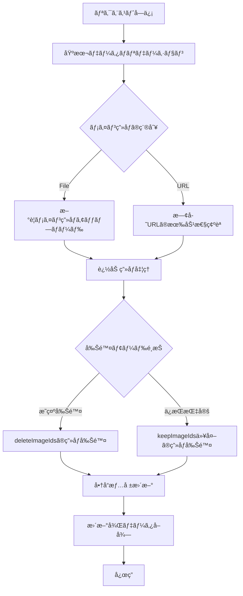

# 🛒 商å“（Products）編集

`backend/src/endpoints/productEditById.ts`

```ts
// backend/src/endpoints/productEditById.ts
import { Context } from "hono";
import { Bindings, ErrorResponse, JwtPayload } from "../types/types";
import { productSchema } from "../schemas/product";
import { uploadToR2, deleteFromR2 } from "../lib/storage";

// ファイル検証用定数
const ALLOWED_MIME_TYPES = [
  "image/jpeg",
  "image/png",
  "image/webp",
  "image/gif",
];
const MAX_FILE_SIZE = 5 * 1024 * 1024; // 5MB
const VALID_EXTENSIONS = [".jpg", ".jpeg", ".png", ".webp", ".gif"];

// ファイル検証関数
const validateImageFile = (file: File, traceId: string) => {
  if (!ALLOWED_MIME_TYPES.includes(file.type)) {
    console.log(`[${traceId}] ⌠無効ãªMIMEタイプ: ${file.type}`);
    throw new Error(`許å¯ã•ã‚Œã¦ã„ãªã„ファイル形å¼ã§ã™: ${file.type}`);
  }

  if (file.size > MAX_FILE_SIZE) {
    console.log(`[${traceId}] ⌠ファイルサイズ超é: ${file.size} bytes`);
    throw new Error(
      `ファイルサイズãŒå¤§ãã™ãã¾ã™ï¼ˆæœ€å¤§${MAX_FILE_SIZE / 1024 / 1024}MB）`
    );
  }

  const extension = file.name.split(".").pop()?.toLowerCase();
  if (!extension || !VALID_EXTENSIONS.includes(`.${extension}`)) {
    console.log(`[${traceId}] ⌠無効ãªæ‹¡å¼µå­: ${file.name}`);
    throw new Error("無効ãªãƒ•ã‚¡ã‚¤ãƒ«æ‹¡å¼µå­ã§ã™");
  }
};

// FormDataEntryValueã®å‹å®šç¾©
type FormDataEntryValue = string | File;

type ProductResponse = {
  id: number;
  name: string;
  description: string;
  price: number;
  stock: number;
  category_id: number | null;
  created_at: string;
  images: {
    main: { id: number; url: string; is_main: true };
    additional: { id: number; url: string; is_main: false }[];
  };
};

export const productEditByIdHandler = async (
  c: Context<{ Bindings: Bindings; Variables: { jwtPayload?: JwtPayload } }>
): Promise<Response> => {
  const productId = c.req.param("id");
  const db = c.env.DB;

  const traceId = Math.random().toString(36).substr(2, 9);
  console.log(`[${traceId}] 🌟 商å“更新プロセス開始`, new Date().toISOString());

  try {
    const payload = c.get("jwtPayload");
    if (!payload || payload.role !== "admin") {
      console.log(`[${traceId}] 🌟 èªè¨¼å¤±æ•—:`, {
        hasPayload: !!payload,
        role: payload?.role,
      });
      return c.json(
        {
          error: {
            code: !payload ? "UNAUTHORIZED" : "FORBIDDEN",
            message: !payload
              ? "èªè¨¼ãŒå¿…è¦ã§ã™"
              : "商å“編集ã«ã¯ç®¡ç†è€…権é™ãŒå¿…è¦ã§ã™",
          },
        } satisfies ErrorResponse,
        !payload ? 401 : 403
      );
    }

    const formData = await c.req.formData();

    console.log(`[${traceId}] 🌟 å—ä¿¡FormData:`, {
      keepImageIds: formData.getAll("keepImageIds"),
      deleteImageIds: formData.getAll("deleteImageIds"),
      additionalImagesCount: formData.getAll("additionalImages").length,
      mainImageType: formData.get("mainImage")?.constructor.name,
      otherFields: {
        name: formData.get("name"),
        description: formData.get("description"),
        price: formData.get("price"),
        stock: formData.get("stock"),
        category_id: formData.get("category_id"),
      },
    });

    const rawFormData = {
      name: formData.get("name"),
      description: formData.get("description"),
      price: formData.get("price"),
      stock: formData.get("stock") || 0,
      category_id: formData.get("category_id"),
    };

    const validationResult = productSchema.safeParse(rawFormData);
    if (!validationResult.success) {
      console.log(
        `[${traceId}] 🌟 ãƒãƒªãƒ‡ãƒ¼ã‚·ãƒ§ãƒ³ã‚¨ãƒ©ãƒ¼:`,
        validationResult.error.flatten()
      );
      return c.json(
        {
          error: {
            code: "VALIDATION_ERROR",
            message: "入力内容ã«èª¤ã‚ŠãŒã‚ã‚Šã¾ã™",
            details: validationResult.error.flatten(),
          },
        } satisfies ErrorResponse,
        400
      );
    }

    const existingProduct = await db
      .prepare("SELECT id FROM products WHERE id = ?")
      .bind(productId)
      .first<{ id: number }>();

    if (!existingProduct) {
      console.log(`[${traceId}] 🌟 商å“ãŒè¦‹ã¤ã‹ã‚Šã¾ã›ã‚“:`, productId);
      return c.json(
        {
          error: {
            code: "PRODUCT_NOT_FOUND",
            message: "編集対象ã®å•†å“ãŒè¦‹ã¤ã‹ã‚Šã¾ã›ã‚“",
          },
        } satisfies ErrorResponse,
        404
      );
    }

    // 既存画åƒã‚’å–å¾—
    const existingImages = await db
      .prepare("SELECT id, image_url, is_main FROM images WHERE product_id = ?")
      .bind(productId)
      .all<{ id: number; image_url: string; is_main: number }>();
    console.log(`[${traceId}] 🌟 既存画åƒæƒ…å ±:`, existingImages.results);

    // 削除処ç†ãƒ­ã‚¸ãƒƒã‚¯ã®å¤‰æ•°ã‚’å‰å€’ã—ã§å®£è¨€
    const deleteImageIds = formData
      .getAll("deleteImageIds")
      .map((id) => {
        const num = Number(id);
        return isNaN(num) ? null : num;
      })
      .filter((id): id is number => id !== null);

    const keepImageIds = formData
      .getAll("keepImageIds")
      .map((id) => {
        const num = Number(id);
        return isNaN(num) ? null : num;
      })
      .filter((id): id is number => id !== null);

    // メイン画åƒå‡¦ç†
    const mainImageRaw = formData.get("mainImage") as File | string | null;
    let mainImageUrl: string | undefined;

    // メイン画åƒã®å¿…é ˆãƒã‚§ãƒƒã‚¯
    if (!mainImageRaw) {
      console.log(`[${traceId}] 🌟 メイン画åƒãŒæœªæŒ‡å®šã§ã™`);
      return c.json(
        {
          error: {
            code: "MAIN_IMAGE_REQUIRED",
            message: "メイン画åƒã¯å¿…é ˆã§ã™",
          },
        } satisfies ErrorResponse,
        400
      );
    }

    // メイン画åƒå‰Šé™¤é€£æºãƒã‚§ãƒƒã‚¯
    const deletingMainImage = deleteImageIds.some((id) =>
      existingImages.results?.some((img) => img.id === id && img.is_main === 1)
    );

    if (deletingMainImage) {
      console.log(`[${traceId}] 🔠メイン画åƒå‰Šé™¤æ¤œå‡º`, {
        deleteIds: deleteImageIds,
      });

      if (!(mainImageRaw instanceof File)) {
        console.log(`[${traceId}] ◠メイン画åƒç½®æ›ä¸è¶³ã‚¨ãƒ©ãƒ¼`);
        return c.json(
          {
            error: {
              code: "MAIN_IMAGE_REPLACEMENT_REQUIRED",
              message:
                "メイン画åƒã‚’変更ã™ã‚‹å ´åˆã¯æ–°ã—ã„ç”»åƒã‚’アップロードã—ã¦ãã ã•ã„",
            },
          } satisfies ErrorResponse,
          400
        );
      }
      console.log(`[${traceId}] ✅ メイン画åƒç½®æ›ã®æ•´åˆæ€§ã‚’確èª`);
    }

    if (mainImageRaw instanceof File) {
      console.log(`[${traceId}] 🌟 æ–°ã—ã„メイン画åƒã‚’処ç†ä¸­...`);

      if (!mainImageRaw.size) {
        console.log(`[${traceId}] 🌟 空ã®ãƒ¡ã‚¤ãƒ³ç”»åƒãƒ•ã‚¡ã‚¤ãƒ«`);
        return c.json(
          {
            error: {
              code: "EMPTY_MAIN_IMAGE",
              message: "メイン画åƒãƒ•ã‚¡ã‚¤ãƒ«ãŒç©ºã§ã™",
            },
          } satisfies ErrorResponse,
          400
        );
      }

      // メイン画åƒãƒãƒªãƒ‡ãƒ¼ã‚·ãƒ§ãƒ³
      try {
        validateImageFile(mainImageRaw, traceId);
      } catch (error) {
        return c.json(
          {
            error: {
              code: "INVALID_MAIN_IMAGE",
              message: error.message,
            },
          } satisfies ErrorResponse,
          400
        );
      }

      const oldMainImage = await db
        .prepare(
          "SELECT id, image_url FROM images WHERE product_id = ? AND is_main = 1"
        )
        .bind(productId)
        .first<{ id: number; image_url: string }>();

      const uploadResult = await uploadToR2(
        c.env.R2_BUCKET as R2Bucket,
        mainImageRaw,
        c.env.R2_PUBLIC_DOMAIN as string,
        { folder: "products/main" }
      );
      mainImageUrl = uploadResult.url;
      console.log(`[${traceId}] 🌟 メイン画åƒã‚¢ãƒƒãƒ—ロード完了:`, mainImageUrl);

      if (oldMainImage?.image_url) {
        console.log(
          `[${traceId}] 🌟 å¤ã„メイン画åƒã‚’削除:`,
          oldMainImage.image_url
        );
        await deleteFromR2(c.env.R2_BUCKET as R2Bucket, oldMainImage.image_url);
      }

      await db
        .prepare(
          "UPDATE images SET image_url = ? WHERE product_id = ? AND is_main = 1"
        )
        .bind(mainImageUrl, productId)
        .run();
    } else if (typeof mainImageRaw === "string") {
      console.log(`[${traceId}] 🌟 既存ã®ãƒ¡ã‚¤ãƒ³ç”»åƒã‚’ä¿æŒ:`, mainImageRaw);

      // URL有効性ãƒã‚§ãƒƒã‚¯
      if (
        !existingImages.results?.some((img) => img.image_url === mainImageRaw)
      ) {
        console.log(`[${traceId}] ⌠無効ãªãƒ¡ã‚¤ãƒ³ç”»åƒURL`, {
          providedUrl: mainImageRaw,
        });
        return c.json(
          {
            error: {
              code: "INVALID_MAIN_IMAGE",
              message: "指定ã•ã‚ŒãŸãƒ¡ã‚¤ãƒ³ç”»åƒãŒç„¡åŠ¹ã§ã™",
            },
          } satisfies ErrorResponse,
          400
        );
      }

      mainImageUrl = mainImageRaw;
    }

    // 追加画åƒå‡¦ç†
    const additionalImages = (
      formData.getAll("additionalImages") as FormDataEntryValue[]
    ) // FormDataEntryValue[] ã«ã‚­ãƒ£ã‚¹ãƒˆ
      .filter((item): item is File => item instanceof File); // File å‹ã®ã¿ã‚’抽出
    const invalidFiles: { name: string; reason: string }[] = [];

    additionalImages.forEach((img) => {
      try {
        validateImageFile(img, traceId);
      } catch (error) {
        invalidFiles.push({
          name: img.name,
          reason: error.message,
        });
      }
    });

    if (invalidFiles.length > 0) {
      console.log(`[${traceId}] ⌠無効ãªè¿½åŠ ç”»åƒæ¤œå‡º:`, invalidFiles);
      return c.json(
        {
          error: {
            code: "INVALID_ADDITIONAL_IMAGES",
            message: "追加画åƒã«ç„¡åŠ¹ãªãƒ•ã‚¡ã‚¤ãƒ«ãŒå«ã¾ã‚Œã¦ã„ã¾ã™",
            details: { invalidFiles },
          },
        } satisfies ErrorResponse,
        400
      );
    }

    let additionalImageUrls: string[] = [];
    if (additionalImages.length > 0) {
      additionalImageUrls = (
        await Promise.all(
          additionalImages.map((file) =>
            uploadToR2(
              c.env.R2_BUCKET as R2Bucket,
              file,
              c.env.R2_PUBLIC_DOMAIN as string,
              { folder: "products/additional" }
            )
          )
        )
      ).map((result) => result.url);

      console.log(
        `[${traceId}] 🌟 追加画åƒã‚¢ãƒƒãƒ—ロード完了:`,
        additionalImageUrls
      );

      await db.batch(
        additionalImageUrls.map((url) =>
          db
            .prepare(
              "INSERT INTO images (product_id, image_url, is_main) VALUES (?, ?, 0)"
            )
            .bind(productId, url)
        )
      );
    }

    console.log(`[${traceId}] 🌟 削除処ç†ãƒ‘ラメータ:`, {
      deleteImageIds,
      keepImageIds,
      existingImageIds: existingImages.results?.map((img) => img.id) ?? [],
    });

    if (deleteImageIds.length > 0) {
      console.log(`[${traceId}] 🌟 æ˜ç¤ºæ€§å‰Šé™¤ãƒ¢ãƒ¼ãƒ‰é–‹å§‹`);

      const validDeleteIds =
        existingImages.results
          ?.filter((img) => deleteImageIds.includes(img.id))
          .map((img) => img.id) ?? [];

      if (validDeleteIds.length !== deleteImageIds.length) {
        const invalidIds = deleteImageIds.filter(
          (id) => !validDeleteIds.includes(id)
        );
        console.error(`[${traceId}] ⌠無効ãªå‰Šé™¤ID検出:`, invalidIds);
        return c.json(
          {
            error: {
              code: "INVALID_IMAGE_IDS",
              message: "指定ã•ã‚ŒãŸç”»åƒIDã®ä¸€éƒ¨ãŒç„¡åŠ¹ã§ã™",
              details: { invalidIds },
            },
          } satisfies ErrorResponse<{ invalidIds: number[] }>,
          400
        );
      }

      const toDelete = await db
        .prepare(
          `SELECT id, image_url FROM images 
           WHERE product_id = ? 
           AND is_main = 0 
           AND id IN (${deleteImageIds.map(() => "?").join(",")})`
        )
        .bind(productId, ...deleteImageIds)
        .all<{ id: number; image_url: string }>();

      console.log(`[${traceId}] 🌟 削除対象画åƒ:`, {
        count: toDelete.results?.length ?? 0,
        ids: toDelete.results?.map((img) => img.id) ?? [],
      });

      if (toDelete.results && toDelete.results.length > 0) {
        await db
          .prepare(
            `DELETE FROM images WHERE id IN (${toDelete.results
              .map((img) => img.id)
              .join(",")})`
          )
          .run();

        await Promise.all(
          toDelete.results.map((img) =>
            deleteFromR2(c.env.R2_BUCKET as R2Bucket, img.image_url)
          )
        );
        console.log(`[${traceId}] ✅ ç”»åƒå‰Šé™¤å®Œäº†`);
      }
    } else if (keepImageIds.length > 0) {
      console.log(`[${traceId}] 🌟 ä¿æŒIDベース削除モード開始`);

      const validKeepIds = keepImageIds.filter((id) =>
        existingImages.results?.some((img) => img.id === id)
      );

      console.log(`[${traceId}] 🌟 有効ãªä¿æŒID:`, validKeepIds);

      const deleteQuery = db
        .prepare(
          `SELECT id, image_url FROM images 
           WHERE product_id = ? 
           AND is_main = 0 
           ${
             validKeepIds.length > 0
               ? `AND id NOT IN (${validKeepIds.map(() => "?").join(",")})`
               : ""
           }
           AND image_url NOT IN (${additionalImageUrls
             .map(() => "?")
             .join(",")})`
        )
        .bind(
          productId,
          ...(validKeepIds.length > 0 ? validKeepIds : []),
          ...additionalImageUrls
        );

      const toDelete = await deleteQuery.all<{
        id: number;
        image_url: string;
      }>();

      console.log(`[${traceId}] 🌟 削除対象特定çµæœ:`, {
        targetCount: toDelete.results?.length ?? 0,
        sampleIds: toDelete.results?.slice(0, 3).map((t) => t.id) ?? [],
      });

      if (toDelete.results && toDelete.results.length > 0) {
        await Promise.all([
          ...toDelete.results.map((img) =>
            deleteFromR2(c.env.R2_BUCKET as R2Bucket, img.image_url)
          ),
          db
            .prepare(
              `DELETE FROM images WHERE id IN (${toDelete.results
                .map((img) => img.id)
                .join(",")})`
            )
            .run(),
        ]);
      }
    }

    // 商å“基本情報更新
    console.log(`[${traceId}] 🌟 商å“基本情報更新開始`);
    await db
      .prepare(
        `UPDATE products SET
          name = ?,
          description = ?,
          price = ?,
          stock = ?,
          category_id = ?
        WHERE id = ?`
      )
      .bind(
        validationResult.data.name,
        validationResult.data.description,
        validationResult.data.price,
        validationResult.data.stock,
        validationResult.data.category_id,
        productId
      )
      .run();

    // 更新後ã®å•†å“情報å–å¾—
    const updatedProduct = await db
      .prepare(
        `SELECT 
          p.id, p.name, p.description, p.price, p.stock,
          p.category_id, c.name as category_name,
          p.created_at
        FROM products p
        LEFT JOIN categories c ON p.category_id = c.id
        WHERE p.id = ?`
      )
      .bind(productId)
      .first<ProductResponse>();

    const images = await db
      .prepare(
        `SELECT id, image_url as url, is_main
         FROM images
         WHERE product_id = ?
         ORDER BY is_main DESC, created_at ASC`
      )
      .bind(productId)
      .all<{
        id: number;
        url: string;
        is_main: number;
      }>();

    console.log(`[${traceId}] 🌟 更新後画åƒçŠ¶æ…‹:`, images.results);

    const mainImage = images.results?.find((img) => img.is_main === 1);
    if (!mainImage) {
      console.error(`[${traceId}] 🌟 メイン画åƒãŒå­˜åœ¨ã—ã¾ã›ã‚“`);
      throw new Error("メイン画åƒãŒå­˜åœ¨ã—ã¾ã›ã‚“");
    }

    const response: ProductResponse = {
      ...updatedProduct!,
      images: {
        main: {
          id: mainImage.id,
          url: mainImage.url,
          is_main: true,
        },
        additional:
          images.results
            ?.filter((img) => img.is_main === 0)
            .map((img) => ({
              id: img.id,
              url: img.url,
              is_main: false,
            })) ?? [],
      },
    };

    console.log(`[${traceId}] 🌟 商å“æ›´æ–°æˆåŠŸ:`, {
      productId,
      mainImageUpdated: mainImageRaw instanceof File,
      additionalImagesUploaded: additionalImageUrls.length,
      imagesDeleted:
        deleteImageIds.length > 0 || keepImageIds.length > 0
          ? "一部削除"
          : "ãªã—",
    });

    // 管ç†ãƒ­ã‚°ã®è¨˜éŒ²
    try {
      await db
        .prepare(
          `INSERT INTO admin_logs 
           (admin_id, action, target_type, target_id, description) 
           VALUES (?, ?, ?, ?, ?)`
        )
        .bind(
          payload.user_id,
          "update_product",
          "product",
          productId,
          JSON.stringify({
            status: "completed",
            keepImageIds: keepImageIds,
            uploadedFiles: {
              main: mainImageRaw instanceof File ? mainImageRaw.name : null,
              additional: additionalImages.map((f) => f.name),
            },
            traceId,
            timestamp: new Date().toISOString(),
          })
        )
        .run();
      console.log(`[${traceId}] 📠管ç†ãƒ­ã‚°è¨˜éŒ²å®Œäº†`);
    } catch (logError) {
      console.error(`[${traceId}] ⌠管ç†ãƒ­ã‚°è¨˜éŒ²å¤±æ•—:`, logError);
    }

    return c.json(response);
  } catch (error) {
    console.error(`[${traceId}] 🌟 エラー発生:`, error);
    return c.json(
      {
        error: {
          code: "INTERNAL_ERROR",
          message:
            error instanceof Error ? error.message : "商å“ã®æ›´æ–°ã«å¤±æ•—ã—ã¾ã—ãŸ",
        },
      } satisfies ErrorResponse,
      500
    );
  }
};
```

<think>
フロントエンドã‹ã‚‰é€ã‚‹ã¹ãフィールドを整ç†ã—ã¾ã™ã€‚商å“æ›´æ–°ã®ã‚¨ãƒ³ãƒ‰ãƒã‚¤ãƒ³ãƒˆã¯ãƒãƒ«ãƒãƒ‘ートフォームデータ（FormData）を使用ã—ã¦ã„ã‚‹ãŸã‚ã€ãƒ•ã‚£ãƒ¼ãƒ«ãƒ‰ã¯æ–‡å­—列ã¾ãŸã¯ãƒ•ã‚¡ã‚¤ãƒ«ã¨ã—ã¦é€ä¿¡ã—ã¾ã™ã€‚

以下ã®ãƒ•ã‚£ãƒ¼ãƒ«ãƒ‰ã‚’é€ä¿¡ã™ã‚‹å¿…è¦ãŒã‚ã‚Šã¾ã™ï¼š

1.  基本情報（文字列）:

    - `name`: 商å“å (å¿…é ˆ)
    - `description`: 商å“èª¬æ˜ (å¿…é ˆ)
    - `price`: 価格 (å¿…é ˆã€æ•°å€¤ã€‚文字列ã¨ã—ã¦é€ä¿¡)
    - `stock`: 在庫数 (å¿…é ˆã€æ•°å€¤ã€‚文字列ã¨ã—ã¦é€ä¿¡)
    - `category_id`: カテゴリ ID (ä»»æ„ã€æ•°å€¤ã€‚文字列ã¨ã—ã¦é€ä¿¡ã€å­˜åœ¨ã—ãªã„å ´åˆã¯ null)

2.  ç”»åƒå‡¦ç†é–¢é€£:

    - `mainImage`: メイン画åƒã€‚以下ã®ã„ãšã‚Œã‹ã§é€ä¿¡:

      - æ–°ã—ã„ç”»åƒãƒ•ã‚¡ã‚¤ãƒ«ï¼ˆFile オブジェクト）をé€ã‚‹å ´åˆ
      - 既存ã®ãƒ¡ã‚¤ãƒ³ç”»åƒã‚’ä¿æŒã™ã‚‹å ´åˆã¯ã€ãã®ç”»åƒã® URL（文字列）をé€ã‚‹
      - メイン画åƒã¯å¿…須。削除ã—ã¦ç½®ãæ›ãˆãŒå¿…è¦ãªå ´åˆã¯ã€æ–°ã—ã„ファイルをé€ä¿¡ã™ã‚‹å¿…è¦ãŒã‚る。

    - `additionalImages[]`: 追加画åƒï¼ˆè¤‡æ•°å¯ï¼‰ã€‚æ–°ã—ã„追加画åƒãƒ•ã‚¡ã‚¤ãƒ«ã®é…列。ファイルオブジェクトã¨ã—ã¦é€ä¿¡ã€‚既存ã®è¿½åŠ ç”»åƒã‚’ä¿æŒã™ã‚‹å ´åˆã¯ã€åˆ¥ã®æ–¹æ³•ã§ç®¡ç†ï¼ˆå¾Œè¿°ï¼‰ã€‚

3.  既存画åƒã®ç®¡ç†:
    - `keepImageIds[]`: ä¿æŒã™ã‚‹è¿½åŠ ç”»åƒã® ID（既存ã®ç”»åƒã®ã†ã¡ã€æ®‹ã™ã‚‚ã®ã® ID を数値ã®é…列ã§é€ä¿¡ï¼‰ã€‚文字列ã®é…列ã¨ã—ã¦é€ã‚‹ï¼ˆä¾‹: ["1", "2"]）。
    - `deleteImageIds[]`: 削除ã™ã‚‹ç”»åƒã® ID（既存ã®ç”»åƒã®ã†ã¡ã€å‰Šé™¤ã—ãŸã„ã‚‚ã®ã® ID を数値ã®é…列ã§é€ä¿¡ï¼‰ã€‚文字列ã®é…列ã¨ã—ã¦é€ã‚‹ï¼ˆä¾‹: ["3", "4"]）。

注æ„点:

- `keepImageIds` 㨠`deleteImageIds` ã¯æ’ä»–çš„ã§ã¯ãªãã€ä¸¡æ–¹é€ã‚‹ã“ã¨ã‚‚å¯èƒ½ã§ã™ã€‚
- ãŸã ã—ã€å‰Šé™¤å¯¾è±¡ã«ãƒ¡ã‚¤ãƒ³ç”»åƒãŒå«ã¾ã‚Œã‚‹å ´åˆã€ãã®å‰Šé™¤ã¨åŒæ™‚ã«æ–°ã—ã„メイン画åƒã®ãƒ•ã‚¡ã‚¤ãƒ«ãŒã‚¢ãƒƒãƒ—ロードã•ã‚Œã¦ã„ãªã„ã¨ã‚¨ãƒ©ãƒ¼ã«ãªã‚Šã¾ã™ã€‚
- 既存ã®è¿½åŠ ç”»åƒã‚’残ã™å ´åˆã¯ã€`keepImageIds` ã«ãã® ID を指定ã—ã¾ã™ã€‚指定ã•ã‚Œãªã‹ã£ãŸæ—¢å­˜ã®è¿½åŠ ç”»åƒã¯å‰Šé™¤ã•ã‚Œã¾ã™ï¼ˆ`deleteImageIds` ãŒæŒ‡å®šã•ã‚Œã¦ã„ã‚‹å ´åˆã¯æ˜ç¤ºçš„ã«å‰Šé™¤å¯¾è±¡ã¨ã—ãŸã‚‚ã®ã ã‘ãŒå‰Šé™¤ã•ã‚Œã€ãれ以外ã¯ä¿æŒã•ã‚Œã¾ã™ã€‚詳細ã¯å¾Œè¿°ã®ãƒ­ã‚¸ãƒƒã‚¯ã‚’å‚照）。

ロジックã®è£œè¶³:

- 既存画åƒã®ã†ã¡ã€ãƒ¡ã‚¤ãƒ³ç”»åƒã¯ URL ã‚’é€ä¿¡ã™ã‚‹ã“ã¨ã§ä¿æŒã‚’指定ã—ã¾ã™ï¼ˆãƒ¡ã‚¤ãƒ³ç”»åƒã¯`mainImage`フィールドã§æŒ‡å®šï¼‰ã€‚
- 追加画åƒã®æ—¢å­˜ã®ã‚‚ã®ã‚’ä¿æŒã—ãŸã„å ´åˆã¯ã€`keepImageIds`ã«ãã® ID を追加ã—ã¾ã™ã€‚
- 追加画åƒã®æ—¢å­˜ã®ã‚‚ã®ã‚’削除ã—ãŸã„å ´åˆã¯ã€`deleteImageIds`ã«ãã® ID を追加ã—ã¾ã™ã€‚
- `keepImageIds` 㨠`deleteImageIds` ã®ä¸¡æ–¹ãŒæŒ‡å®šã•ã‚ŒãŸå ´åˆã¯ã€`deleteImageIds` ã§æ˜ç¤ºçš„ã«å‰Šé™¤æŒ‡å®šã•ã‚ŒãŸã‚‚ã®ã‚’優先ã—ã¦å‰Šé™¤ã—ã€`keepImageIds` ã§æŒ‡å®šã•ã‚ŒãŸã‚‚ã®ã¯ä¿æŒã€ã©ã¡ã‚‰ã§ã‚‚ãªã„ã‚‚ã®ã¯å‰Šé™¤ã•ã‚Œã¾ã›ã‚“（ãŸã ã—ã€ã“ã®ã‚¨ãƒ³ãƒ‰ãƒã‚¤ãƒ³ãƒˆã®ã‚³ãƒ¼ãƒ‰ã§ã¯ã€`deleteImageIds`ãŒå­˜åœ¨ã™ã‚‹å ´åˆã¯æ˜ç¤ºå‰Šé™¤ãƒ¢ãƒ¼ãƒ‰ã€å­˜åœ¨ã—ãªã„ãŒ`keepImageIds`ãŒå­˜åœ¨ã™ã‚‹å ´åˆã¯ä¿æŒ ID ベース削除モードã§å‹•ä½œã—ã¾ã™ï¼‰ã€‚
  - æ˜ç¤ºå‰Šé™¤ãƒ¢ãƒ¼ãƒ‰: `deleteImageIds` ã«æŒ‡å®šã•ã‚ŒãŸ ID ã®ã¿ã‚’削除対象ã¨ã—ã€ãれ以外ã¯ä¿æŒã€‚
  - ä¿æŒ ID ベース削除モード: `keepImageIds` ãŒæŒ‡å®šã•ã‚Œã¦ã„ã‚‹å ´åˆã€æŒ‡å®šã•ã‚ŒãŸ ID 以外ã®è¿½åŠ ç”»åƒã‚’削除（ãŸã ã—ã€ä»Šå›æ–°ã—ã追加ã—ãŸç”»åƒã¯é™¤å¤–）。

フロントエンドã§ã®é€ä¿¡ä¾‹ï¼ˆæ“¬ä¼¼ã‚³ãƒ¼ãƒ‰ï¼‰:

const formData = new FormData();

// 基本情報
formData.append('name', 'æ–°ã—ã„商å“å');
formData.append('description', 'æ–°ã—ã„商å“説æ˜');
formData.append('price', '1000');
formData.append('stock', '50');
formData.append('category_id', '1'); // カテゴリ ID ãŒã‚ã‚‹å ´åˆã€ãªã„å ´åˆã¯çœç•¥ã¾ãŸã¯ null ã‚’é€ã‚‰ãªã„（空文字もé¿ã‘る）

// メイン画åƒ: æ–°ã—ã„ç”»åƒã‚’é€ã‚‹å ´åˆ
formData.append('mainImage', fileInput.files[0]);

// メイン画åƒ: 既存ã®ç”»åƒã‚’ä¿æŒã™ã‚‹å ´åˆï¼ˆURL ã‚’é€ã‚‹ï¼‰
// ãŸã ã—ã€ãƒ•ãƒ­ãƒ³ãƒˆã‚¨ãƒ³ãƒ‰ã§ã¯æ—¢å­˜ã®ãƒ¡ã‚¤ãƒ³ç”»åƒã® URL ã‚’ä¿æŒã—ã¦ã„ã‚‹å¿…è¦ãŒã‚ã‚‹
formData.append('mainImage', existingMainImageUrl);

// 追加画åƒ: æ–°ã—ã„ç”»åƒãƒ•ã‚¡ã‚¤ãƒ«ã‚’複数追加
for (let i = 0; i < newAdditionalFiles.length; i++) {
formData.append('additionalImages', newAdditionalFiles[i]);
}

// 既存ã®è¿½åŠ ç”»åƒã®ã†ã¡ã€ä¿æŒã—ãŸã„ç”»åƒã® ID ã‚’é…列ã§é€ä¿¡
existingAdditionalImageIds.forEach(id => {
formData.append('keepImageIds[]', id.toString());
});

// 既存ã®ç”»åƒã®ã†ã¡ã€å‰Šé™¤ã—ãŸã„ç”»åƒã® ID ã‚’é…列ã§é€ä¿¡ï¼ˆå‰Šé™¤ã—ãŸã„å ´åˆï¼‰
// 削除ã—ãŸã„ç”»åƒãŒã‚ã‚‹å ´åˆã¯ã€deleteImageIds ã«è¿½åŠ 
imageIdsToDelete.forEach(id => {
formData.append('deleteImageIds[]', id.toString());
});

注æ„:

- `additionalImages` ã¯ãƒ•ã‚¡ã‚¤ãƒ«ã®é…列ã¨ã—ã¦é€ä¿¡ã—ã¾ã™ã€‚åŒã˜ãƒ•ã‚£ãƒ¼ãƒ«ãƒ‰åã§è¤‡æ•°ã®ãƒ•ã‚¡ã‚¤ãƒ«ã‚’追加ã—ã¾ã™ã€‚
- `keepImageIds[]` 㨠`deleteImageIds[]` ã¯é…列ã¨ã—ã¦é€ã‚‹ãŸã‚ã€åŒã˜ãƒ•ã‚£ãƒ¼ãƒ«ãƒ‰åã§è¤‡æ•°ã®å€¤ã‚’追加ã—ã¾ã™ï¼ˆå„値ã¯æ–‡å­—列）。

エンドãƒã‚¤ãƒ³ãƒˆã®å¿œç­”:

- æˆåŠŸæ™‚: æ›´æ–°ã•ã‚ŒãŸå•†å“情報（ProductResponse å‹ï¼‰ãŒè¿”ã‚Šã¾ã™ã€‚
- エラー時: 対応ã™ã‚‹ã‚¨ãƒ©ãƒ¼ãƒ¬ã‚¹ãƒãƒ³ã‚¹ï¼ˆã‚¹ãƒ†ãƒ¼ã‚¿ã‚¹ã‚³ãƒ¼ãƒ‰ã¨ã‚¨ãƒ©ãƒ¼ãƒ¡ãƒƒã‚»ãƒ¼ã‚¸ï¼‰ãŒè¿”ã‚Šã¾ã™ã€‚

ã“ã®æƒ…報をもã¨ã«ãƒ•ãƒ­ãƒ³ãƒˆã‚¨ãƒ³ãƒ‰ã§ãƒ•ã‚©ãƒ¼ãƒ ã‚’構築ã—ã¦ãã ã•ã„。
</think>
商å“編集エンドãƒã‚¤ãƒ³ãƒˆã«å¯¾ã—ã¦ãƒ•ãƒ­ãƒ³ãƒˆã‚¨ãƒ³ãƒ‰ã‹ã‚‰é€ä¿¡ã™ã¹ãフィールドã¯ä»¥ä¸‹ã®é€šã‚Šã§ã™ã€‚ã™ã¹ã¦ **FormData** å½¢å¼ã§é€ä¿¡ã™ã‚‹å¿…è¦ãŒã‚ã‚Šã¾ã™ã€‚

### 必須フィールド

| ãƒ•ã‚£ãƒ¼ãƒ«ãƒ‰å  | å‹                 | èª¬æ˜                                                              |
| ------------- | ------------------ | ----------------------------------------------------------------- |
| `name`        | 文字列             | 商å“å                                                            |
| `description` | 文字列             | 商å“èª¬æ˜                                                          |
| `price`       | 数値文字列         | 価格（例: `"1500"`）                                              |
| `stock`       | 数値文字列         | 在庫数（例: `"10"`）                                              |
| `mainImage`   | File ã¾ãŸã¯ 文字列 | **å¿…é ˆ**<br>- æ–°ã—ã„ç”»åƒãƒ•ã‚¡ã‚¤ãƒ«<br>- 既存画åƒä¿æŒæ™‚㯠URL 文字列 |

### オプションフィールド

| ãƒ•ã‚£ãƒ¼ãƒ«ãƒ‰å       | å‹           | èª¬æ˜                                                |
| ------------------ | ------------ | --------------------------------------------------- |
| `category_id`      | 文字列       | カテゴリ ID（未設定時ã¯ç©ºæ–‡å­—）                     |
| `keepImageIds[]`   | é…列         | **ä¿æŒã™ã‚‹è¿½åŠ ç”»åƒ ID**<br>（例: `["101", "102"]`） |
| `deleteImageIds[]` | é…列         | **削除ã™ã‚‹ç”»åƒ ID**<br>（例: `["103", "104"]`）     |
| `additionalImages` | ファイルé…列 | **æ–°ã—ã„追加画åƒ**（複数é¸æŠå¯ï¼‰                    |

---

### 詳細ルール

#### 1. **メイン画åƒå‡¦ç†** (`mainImage`)

- **æ–°è¦ã‚¢ãƒƒãƒ—ロード時**: ç”»åƒãƒ•ã‚¡ã‚¤ãƒ«ã‚’ç›´æ¥é€ä¿¡
- **既存画åƒä¿æŒæ™‚**: ç”»åƒ URL を文字列ã§é€ä¿¡  
  （例: `"https://cdn.example.com/images/main.jpg"`）
- **制約**:
  - 必須フィールド（空ã¯ä¸å¯ï¼‰
  - ファイル形å¼: `jpeg`/`png`/`webp`/`gif`
  - 最大サイズ: 5MB

#### 2. **既存画åƒç®¡ç†**

- `keepImageIds[]`: 残ã—ãŸã„è¿½åŠ ç”»åƒ ID ã‚’é…列ã§é€ä¿¡  
  （メイン画åƒã¯ã“ã®ãƒ•ã‚£ãƒ¼ãƒ«ãƒ‰ã§ã¯ç®¡ç†ä¸å¯ï¼‰
- `deleteImageIds[]`: 削除ã—ãŸã„ç”»åƒ ID ã‚’é…列ã§é€ä¿¡
- **注æ„**:
  - メイン画åƒã‚’削除対象ã«å«ã‚ã‚‹å ´åˆã¯ã€å¿…ãšæ–°ã—ã„`mainImage`ファイルをé€ä¿¡
  - ID ã¯æ•°å€¤å¤‰æ›å¯èƒ½ãªæ–‡å­—列ã§é€ä¿¡

#### 3. **追加画åƒå‡¦ç†** (`additionalImages`)

- æ–°ã—ã„追加画åƒã‚’複数é¸æŠå¯èƒ½
- ファイル形å¼/サイズ制é™ã¯ãƒ¡ã‚¤ãƒ³ç”»åƒã¨åŒæ§˜
- 既存画åƒã¨æ–°è¦ç”»åƒã¯ä½µå­˜å¯èƒ½

---

### フロントエンドã®é€ä¿¡ä¾‹ (JavaScript)

```javascript
const formData = new FormData();

// 基本情報
formData.append("name", "新商å“");
formData.append("description", "詳細説æ˜");
formData.append("price", "2500");
formData.append("stock", "15");
formData.append("category_id", "3"); // 空白å¯èƒ½

// メイン画åƒï¼ˆæ—¢å­˜ç”»åƒã‚’ä¿æŒï¼‰
formData.append("mainImage", "https://.../main.jpg");

// 削除ã™ã‚‹ç”»åƒID
formData.append("deleteImageIds[]", "101");
formData.append("deleteImageIds[]", "102");

// ä¿æŒã™ã‚‹è¿½åŠ ç”»åƒID
formData.append("keepImageIds[]", "103");
formData.append("keepImageIds[]", "104");

// æ–°ã—ã„追加画åƒ
const files = inputElement.files;
for (let i = 0; i < files.length; i++) {
  formData.append("additionalImages", files[i]);
}
```

### ペイロードã®åˆ¶ç´„

1. ãƒãƒªãƒ‡ãƒ¼ã‚·ãƒ§ãƒ³ãƒ«ãƒ¼ãƒ«:

   - `price`/`stock`: 数値形å¼å¿…é ˆ
   - ç”»åƒãƒ•ã‚¡ã‚¤ãƒ«: MIME タイプ/サイズ制é™
   - メイン画åƒæœªé€ä¿¡æ™‚ã¯ã‚¨ãƒ©ãƒ¼ï¼ˆ400 Bad Request）

2. ç”»åƒæ“作ã®æ•´åˆæ€§:

   - `deleteImageIds`ã«ãƒ¡ã‚¤ãƒ³ç”»åƒ ID ã‚’å«ã‚€å ´åˆ → æ–°ã—ã„`mainImage`å¿…é ˆ
   - 存在ã—ãªã„ç”»åƒ ID 指定時 → エラー応答

3. カテゴリ:
   - `category_id`ãŒæœªè¨­å®šã®å ´åˆã¯`null`扱ã„
   - ä¸æ­£ãªã‚«ãƒ†ã‚´ãƒª ID ã¯ãƒãƒªãƒ‡ãƒ¼ã‚·ãƒ§ãƒ³ã‚¨ãƒ©ãƒ¼

---

### エンドãƒã‚¤ãƒ³ãƒˆã®å‹•ä½œãƒ•ãƒ­ãƒ¼




ã“ã®è¨­è¨ˆã«ã‚ˆã‚Šã€è¤‡é›‘ãªç”»åƒæ“作を 1 å›ã®ãƒªã‚¯ã‚¨ã‚¹ãƒˆã§åŠ¹ç‡çš„ã«å‡¦ç†ã§ãã¾ã™ã€‚
