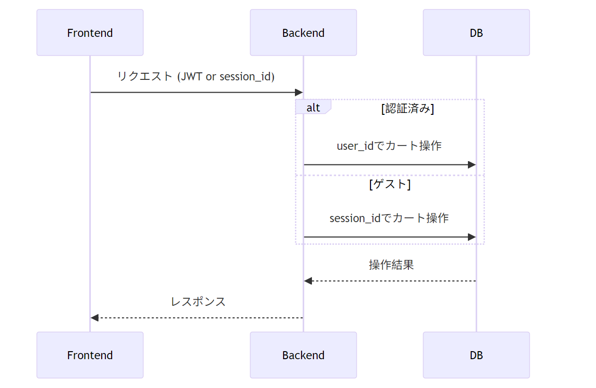

現在のプロジェクト状況を把握しました。フロントエンド（Next.js）とバックエンド（Cloudflare Workers）の基本的な構成が整っており、商品の作成（POST）と取得（GET）のAPIが実装済みです。今後の実装計画を以下のように提案します：

---

## **【優先度別】今後の実装ロードマップ**
# 手順1

### **🟢 高優先度（必須機能）**
#### 1. 商品管理APIの完成（本週中）
| エンドポイント | ファイル | ステータス |
|--------------|---------|-----------|
| `PUT /api/products/:id` | `productUpdate.ts` | 未実装 |
| `DELETE /api/products/:id` | `productDelete.ts` | 未実装 |
| `GET /api/products/:id` | `productGet.ts`に追加 | 未実装 |

#### 2. カート機能API（3日間）
```ts
// endpoints/cart.ts に実装
app.post('/api/cart/items', addToCartHandler);    // 商品追加
app.get('/api/cart', getCartHandler);            // カート内容取得
app.delete('/api/cart/items/:id', removeCartItemHandler); // 商品削除
app.patch('/api/cart/items/:id', updateCartItemHandler); // 数量変更
```

#### 3. 環境変数設定（1日）
- `.env` ファイルの整備
- `wrangler.jsonc` でのD1 DB接続設定
```json
{
  "vars": {
    "DB_NAME": "shop-db"
  },
  "d1_databases": [
    {
      "binding": "DB",
      "database_name": "shop-db",
      "database_id": "xxxxxx"
    }
  ]
}
```

---

### **🟡 中優先度（UX向上）**
#### 1. フロントエンド接続（Next.js側）
```ts
// frontend/utils/api.ts に追加
export const fetchProducts = async () => {
  const res = await fetch('/api/products');
  return await res.json();
};

export const createProduct = async (data) => {
  const res = await fetch('/api/products', {
    method: 'POST',
    body: JSON.stringify(data)
  });
  return await res.json();
};
```

#### 2. エラーハンドリング強化
```ts
// 共通エラーハンドリングミドルウェア
app.onError((err, c) => {
  console.error('Error:', err);
  return c.json({ 
    error: 'Internal Server Error',
    details: process.env.NODE_ENV === 'development' ? err.stack : null
  }, 500);
});
```

---

### **🔴 低優先度（リファクタリング）**
#### 1. 型定義の統合
```ts
// src/types.ts に集約
interface Product {
  id: number;
  name: string;
  price: number;
  stock: number;
}

type ApiResponse<T> = {
  data?: T;
  error?: {
    message: string;
    code: number;
  };
};
```

#### 2. テスト環境構築
```bash
# テスト用スクリプト追加
npm install -D vitest @vitest/worker
```

---

## **【具体的な実装手順】商品更新API（PUT）例**
```ts
// endpoints/productUpdate.ts
import { z } from "zod";

export const productUpdateHandler = async (c: Context<{ Bindings: Bindings }>) => {
  const paramsSchema = z.object({
    id: z.coerce.number()
  });

  const bodySchema = z.object({
    name: z.string().min(1).optional(),
    price: z.number().positive().optional(),
    stock: z.number().int().nonnegative().optional()
  }).strict();

  try {
    const { id } = paramsSchema.parse(c.req.param());
    const data = bodySchema.parse(await c.req.json());

    const result = await c.env.DB.prepare(`
      UPDATE products
      SET ${Object.keys(data).map(k => `${k} = ?`).join(', ')}
      WHERE id = ?
      RETURNING *;
    `).bind(...Object.values(data), id).first();

    return result 
      ? c.json(result)
      : c.json({ error: "Product not found" }, 404);
  } catch (error) {
    console.error("Update error:", error);
    return c.json({ error: "Invalid request" }, 400);
  }
};
```

---

## **【作業スケジュール提案】**
| 期間 | タスク |
|------|--------|
| 1日目 | 商品更新・削除API実装 |
| 2日目 | カート機能基本実装 |
| 3日目 | フロントエンド接続（商品一覧/詳細画面） |
| 4日目 | 認証機能のベース実装 |
| 5日目 | テストコード記述 |

特にカート機能は在庫管理と連動させる必要があるため、早めに実装を開始することを推奨します。Cloudflare D1のトランザクション機能を活用すると良いでしょう。

---
---
---
# 手順2

データベーススキーマを詳細に共有いただきありがとうございます。この構造を完全に考慮した上で、**ユーザー認証統合型のカートシステム**を設計します。以下が最適化された実装プランです。
## **🛠 カート機能の再設計ポイント**
### 1. **セッションベースのカート管理**
```sql
-- カートテーブル修正（sessions連携）
ALTER TABLE cart_items 
ADD COLUMN session_id TEXT;

-- 非認証ユーザー用のインデックス追加
CREATE INDEX idx_cart_items_session ON cart_items(session_id);
```

### 2. **統合型カートエンドポイント**
```typescript
// src/endpoints/cart.ts
import { z } from "zod";

const cartSchema = z.object({
  productId: z.number().int().positive(),
  quantity: z.number().int().min(1).max(100),
  sessionId: z.string().optional().default('') // 認証時は空
});

export const updateCart = async (c: Context<{ Bindings: Bindings }>) => {
  const { user_id } = c.get('jwtPayload') || {};
  const sessionId = c.req.header('x-session-id');
  
  if (!user_id && !sessionId) {
    return c.json({ error: "認証が必要です" }, 401);
  }

  const { success, data } = cartSchema.safeParse(await c.req.json());
  if (!success) return c.json({ error: "無効な入力" }, 400);

  // 在庫チェック
  const stock = await c.env.DB.prepare(`
    SELECT stock FROM products WHERE id = ?
  `).bind(data.productId).first();

  if (!stock || stock.stock < data.quantity) {
    return c.json({ error: "在庫が不足しています" }, 400);
  }

  // カート更新（認証ユーザー優先）
  await c.env.DB.prepare(`
    INSERT INTO cart_items (user_id, session_id, product_id, quantity)
    VALUES (?, ?, ?, ?)
    ON CONFLICT(
      COALESCE(user_id, -1), 
      COALESCE(session_id, ''), 
      product_id
    ) 
    DO UPDATE SET quantity = ?
  `).bind(
    user_id || null,
    user_id ? null : sessionId,
    data.productId,
    data.quantity,
    data.quantity
  );

  return c.json({ success: true });
};
```

---

## **🔐 認証統合フロー**


## **📦 カート取得API（マージ機能付き）**
```typescript
export const getCart = async (c: Context<{ Bindings: Bindings }>) => {
  const { user_id } = c.get('jwtPayload') || {};
  const sessionId = c.req.header('x-session-id');

  // カート内容取得（認証時はセッションカートと統合）
  const query = `
    SELECT 
      p.id, p.name, p.price, p.image_url,
      ci.quantity,
      (p.price * ci.quantity) as subtotal
    FROM cart_items ci
    JOIN products p ON ci.product_id = p.id
    WHERE ${user_id ? 'ci.user_id = ?' : 'ci.session_id = ?'}
    ${user_id && sessionId ? 'OR ci.session_id = ?' : ''}
  `;

  const binds = [user_id || sessionId];
  if (user_id && sessionId) binds.push(sessionId);

  const { results } = await c.env.DB.prepare(query)
    .bind(...binds)
    .all();

  // 認証時にセッションカートをユーザーカートに統合
  if (user_id && sessionId) {
    await c.env.DB.batch([
      c.env.DB.prepare(`
        UPDATE cart_items 
        SET user_id = ?, session_id = NULL 
        WHERE session_id = ?
      `).bind(user_id, sessionId),
      
      c.env.DB.prepare(`
        DELETE FROM cart_items 
        WHERE rowid NOT IN (
          SELECT MIN(rowid) 
          FROM cart_items 
          GROUP BY user_id, product_id
        )
      `)
    ]);
  }

  return c.json(results);
};
```

---

## **⚙️ 環境変数設定例（wrangler.jsonc）**
```json
{
  "d1_databases": [
    {
      "binding": "DB",
      "database_name": "shop-db",
      "database_id": "xxxxxx"
    }
  ],
  "vars": {
    "JWT_SECRET": "your_secure_key_here"
  }
}
```

---

## **🚦 エンドポイント一覧**
| エンドポイント | メソッド | 説明 |
|---------------|----------|------|
| `/api/cart` | GET | カート内容取得（自動マージ） |
| `/api/cart` | POST | 商品追加/更新 |
| `/api/cart/:productId` | DELETE | 商品削除 |
| `/api/cart/merge` | POST | セッション→ユーザーカート移行 |

---

## **🧠 考慮すべきビジネスロジック**
1. **在庫競合処理**  
```sql
UPDATE products SET stock = stock - ? 
WHERE id = ? AND stock >= ?
RETURNING stock;  -- 更新後の在庫を確認
```

2. **価格変更時の対応**  
```typescript
// カート内商品の価格チェック
const priceCheck = await c.env.DB.prepare(`
  SELECT price FROM products WHERE id = ?
`).bind(productId).first();

if (priceCheck.price !== storedPrice) {
  // 価格変更を通知
}
```

3. **カートの有効期限**  
```sql
-- セッション切れのカートを自動削除
DELETE FROM cart_items 
WHERE user_id IS NULL 
AND created_at < datetime('now', '-30 days');
```

この設計により、以下の特徴を実現できます：
- ゲストと認証ユーザーのシームレスな移行
- 競合しにくい在庫管理
- マージ可能なカートシステム
- フロントエンドに優しいAPI設計

必要に応じてさらに詳細な部分の実装をご説明できます。

---
---
---
# 手順3
プロジェクトの現在の進捗と構造を考慮し、**実装優先順位**と**具体的なアクションプラン**を以下のように提案します。バックエンドとフロントエンドの連携をスムーズにするため、段階的に進めるのが効果的です。
## 🚀 **実装の優先順位（バックエンド中心）**
### 1. **認証系の完成（最優先）**
- ✅ `jwt.ts`ミドルウェアの修正
  ```typescript
  // 現在の値（修正前）
  issuer: 'your-issuer',
  audience: 'your-audience',
  
  // ↓ wrangler.jsoncの環境変数を使用するよう修正
  issuer: c.env.JWT_ISSUER, // 'kaikyou-shop'
  audience: c.env.JWT_AUDIENCE, // 'kaikyou-shop-users'
  ```

### 2. **カートAPIの完成**
- `getCart.ts` の実装済み → 次は以下を実装：
  ```typescript
  // endpoints/cartPost.ts（新規作成）
  export const cartPostHandler = async (c: Context) => {
    // 商品追加ロジック (user_id or session_id で識別)
  };

  // endpoints/cartDelete.ts（新規作成）
  export const cartDeleteHandler = async (c: Context) => {
    // 商品削除ロジック
  };
  ```

### 3. **商品管理APIの拡張**
- `productUpdate.ts` と `productDelete.ts` の実装
  ```typescript
  // endpoints/productUpdate.ts（例）
  export const productUpdateHandler = async (c: Context) => {
    const { id } = c.req.param();
    // 商品更新ロジック
  };
  ```

### 4. **フロントエンド連携用の調整**
- バックエンドAPIのレスポンス形式をNext.js側と合わせる
  ```typescript
  // 例: 商品一覧のレスポンスにページネーション情報を追加
  return c.json({
    data: results,
    meta: { total: await getTotalCount() }
  });
  ```

---

## 🔧 **具体的なNext.js連携タスク**
### 1. `frontend/utils/api.ts` の拡張
```typescript
// 認証付きリクエストの例
export const fetchCart = async (sessionId?: string) => {
  const headers: Record<string, string> = {};
  if (sessionId) headers['X-Session-ID'] = sessionId;

  const res = await fetch(`${BASE_URL}/api/cart`, { headers });
  if (!res.ok) throw new Error(await res.text());
  return await res.json() as CartItem[];
};
```

### 2. セッション管理の実装
```typescript
// frontend/app/cart/page.tsx
export default function CartPage() {
  const [sessionId] = useCookies(['session_id']);
  const { data: cart } = useQuery({
    queryKey: ['cart', sessionId],
    queryFn: () => fetchCart(sessionId)
  });
  // ...
}
```

---

## 📌 **すぐに着手すべきタスク（1-2日目）**
1. **バックエンド**
   - [ ] `jwt.ts` の環境変数反映（`JWT_ISSUER`, `JWT_AUDIENCE`）
   - [ ] `cartPost.ts` の実装（商品追加）
   - [ ] カート統合ロジックのテスト作成

2. **フロントエンド**
   - [ ] `api.ts` のベース実装（エラーハンドリング含む）
   - [ ] 商品一覧ページ（`app/page.tsx`）とAPI接続

---

## 🛠 **後のタスク（3-5日目）**
1. **バックエンド**
   - [ ] 商品更新/削除API
   - [ ] 注文処理用エンドポイント

2. **フロントエンド**
   - [ ] カートページの実装
   - [ ] 認証コンポーネント（ログイン/会員登録）

---

## 💡 **技術選考の提案**
1. **状態管理**  
   - カート状態 → `React Query` + サーバー状態を信頼源に
   ```typescript
   // カート更新例
   const { mutate } = useMutation({
     mutationFn: (productId: number) => 
       fetch('/api/cart', { method: 'POST', body: JSON.stringify({ productId }) })
   });
   ```

2. **セッション管理**  
   - 未認証ユーザー → `cookies-next` でセッションID保持
   ```bash
   npm install cookies-next
   ```

---

## 📂 **ファイル構成の改善提案**
```
backend/src/
├── endpoints/
│   ├── cart/              # カート関連をサブディレクトリに集約
│   │   ├── get.ts
│   │   ├── post.ts
│   │   └── delete.ts
│   └── products/
│       ├── create.ts
│       ├── update.ts
│       └── delete.ts
```

プロジェクトを円滑に進めるため、まずは**認証の完成 → カートAPIの実装**から着手するのがおすすめです。必要に応じてフロントエンドと並行作業できるよう、API仕様を早めに共有すると良いでしょう。